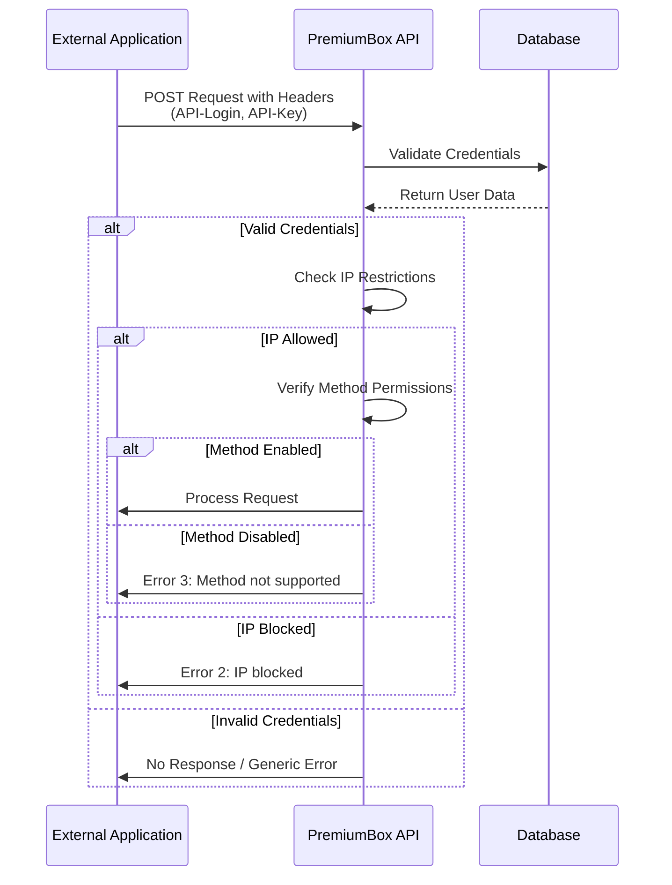
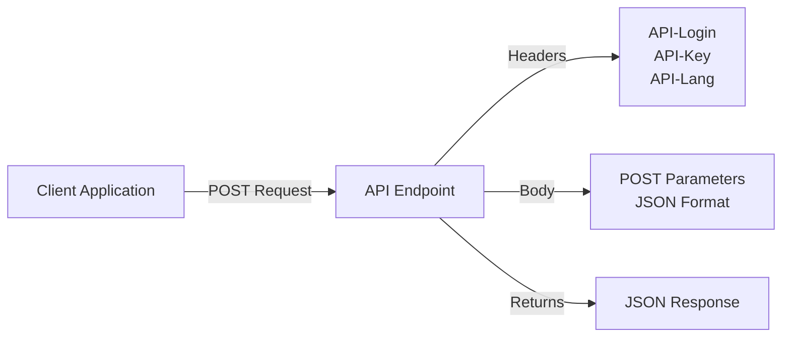
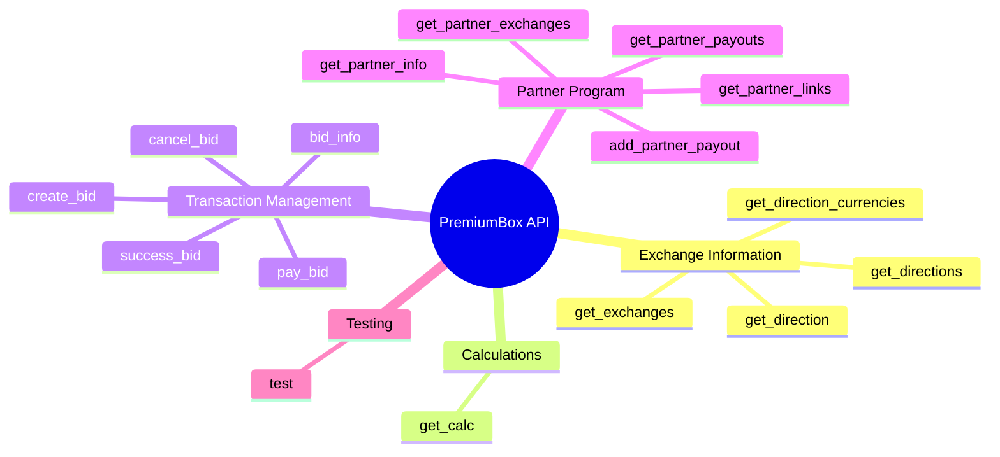
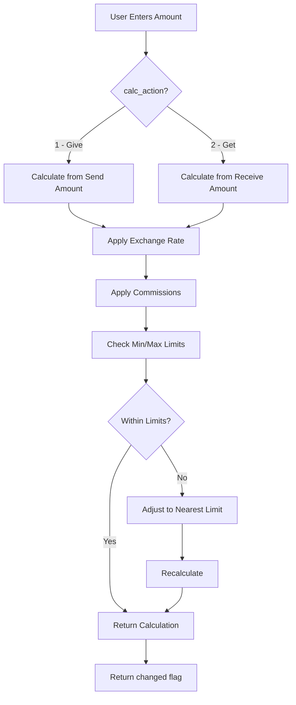
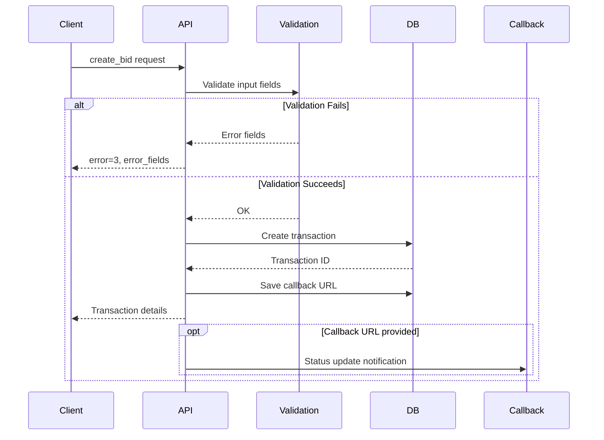
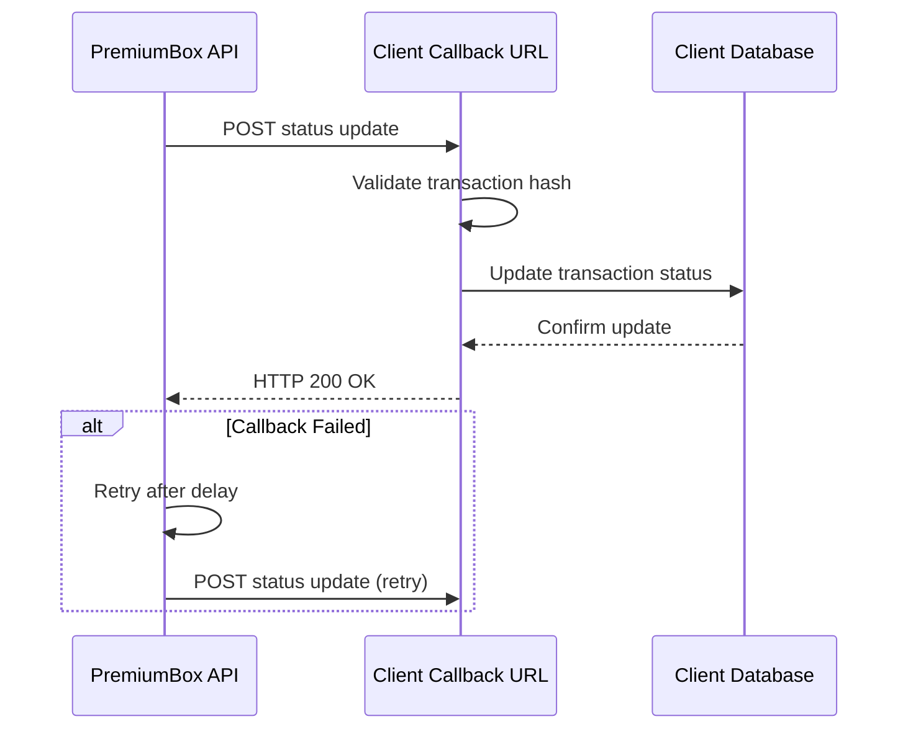
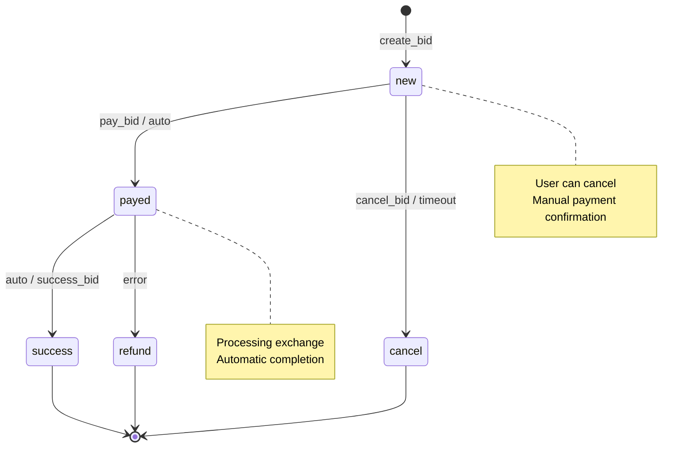

# PremiumBox API Integration Guide

## Introduction

This document provides comprehensive guidance for integrating with the PremiumBox cryptocurrency exchange platform API. The API enables external applications to interact with the exchange system programmatically, allowing automated currency exchange operations, transaction management, and real-time data retrieval.

The PremiumBox API follows RESTful principles and uses JSON for data exchange. All endpoints require authentication via API credentials and support optional IP-based access restrictions for enhanced security.

### Target Audience

This guide is intended for developers, system integrators, and technical personnel responsible for integrating third-party applications with the PremiumBox platform.

### API Overview

The API provides access to core exchange functionality including:

- Currency and exchange direction retrieval
- Real-time exchange rate calculations
- Transaction creation and management
- Transaction status monitoring
- Partner program operations

## Authentication

### Authentication Mechanism

The PremiumBox API uses header-based authentication with two required credentials:

| Header Name | Description | Format |
|-------------|-------------|--------|
| `API-Login` | Unique login identifier for API access | Alphanumeric string (32 characters) |
| `API-Key` | Secret key for authentication | Alphanumeric string (variable length) |
| `API-Lang` | Optional language code for localized responses | ISO 639-1 code (e.g., `en`, `ru`) |

### Obtaining API Credentials

Users must generate API credentials through their account dashboard:

1. Navigate to the User API management page in your account
2. Create a new API key by selecting allowed methods
3. Configure IP address restrictions (optional but recommended)
4. System generates unique `API-Login` and `API-Key` pair
5. Store credentials securely for use in API requests

### IP Address Restrictions

For enhanced security, API access can be restricted to specific IP addresses:

- Multiple IP addresses supported (one per line)
- Requests from non-whitelisted IPs receive error code 2 with message "IP blocked"
- Leave empty to allow access from any IP address

### Authentication Flow



### Authentication Error Responses

| Error Code | Error Message | Description |
|------------|---------------|-------------|
| 2 | IP blocked | Request originated from non-whitelisted IP address |
| 3 | Method not supported | Requested endpoint is not enabled for this API key |

## Base URL and Request Format

### API Base URL

All API requests should be directed to:

```
https://your-domain.com/api/v1/{endpoint}
```

Replace `your-domain.com` with your actual PremiumBox installation domain and `{endpoint}` with the specific method name.

### Request Requirements

All API requests must satisfy the following requirements:

| Requirement | Value |
|-------------|-------|
| HTTP Method | POST |
| Content-Type | application/x-www-form-urlencoded or application/json |
| Character Encoding | UTF-8 |
| Authentication Headers | API-Login and API-Key must be present |

### Request Example Structure



## Response Format

### Standard Response Structure

All API responses follow a consistent JSON structure:

| Field | Type | Description |
|-------|------|-------------|
| `error` | String/Integer | Error code - "0" indicates success, non-zero indicates error |
| `error_text` | String | Human-readable error message (empty on success) |
| `data` | Object/Array | Response data payload (varies by endpoint) |
| `error_fields` | Array | Field-specific validation errors (for transaction creation) |

### Success Response Example

```
{
  "error": "0",
  "error_text": "",
  "data": {
    // Endpoint-specific data
  }
}
```

### Error Response Example

```
{
  "error": "1",
  "error_text": "Direction not found",
  "data": {}
}
```

### Common Error Codes

| Error Code | Meaning | Typical Scenarios |
|------------|---------|-------------------|
| 0 | Success | Request completed successfully |
| 1 | Resource Not Found | Direction, transaction, or currency not found |
| 2 | Access Denied | Maintenance mode, IP blocked, or authentication failure |
| 3 | Validation Error | Invalid parameters or field validation failures |

## Available API Endpoints

### Endpoint Categories

The API provides endpoints organized into the following functional categories:



### Endpoint Access Control

Each API key can be configured with granular permissions for specific endpoints. Users select allowed methods during API key creation or modification.

## Exchange Information Endpoints

### Get Direction Currencies

Retrieves lists of available source and destination currencies based on active exchange directions.

**Endpoint:** `get_direction_currencies`

**Request Parameters:**

| Parameter | Type | Required | Description |
|-----------|------|----------|-------------|
| `currency_id_give` | Integer | No | Filter by specific source currency ID |
| `currency_id_get` | Integer | No | Filter by specific destination currency ID |

**Response Data Structure:**

| Field | Type | Description |
|-------|------|-------------|
| `give` | Array | List of available source currencies |
| `give[].id` | Integer | Currency unique identifier |
| `give[].title` | String | Currency display name |
| `give[].logo` | String | Full URL to currency logo image |
| `get` | Array | List of available destination currencies |
| `get[].id` | Integer | Currency unique identifier |
| `get[].title` | String | Currency display name |
| `get[].logo` | String | Full URL to currency logo image |

**Use Cases:**

- Build dynamic currency selection interfaces
- Display available exchange pairs
- Filter currencies based on user selection

**Response Example:**

```
{
  "error": "0",
  "error_text": "",
  "data": {
    "give": [
      {
        "id": 1,
        "title": "Bitcoin (BTC)",
        "logo": "https://your-domain.com/uploads/btc.png"
      }
    ],
    "get": [
      {
        "id": 5,
        "title": "Ethereum (ETH)",
        "logo": "https://your-domain.com/uploads/eth.png"
      }
    ]
  }
}
```

### Get Directions

Retrieves all available exchange directions with basic information.

**Endpoint:** `get_directions`

**Request Parameters:**

| Parameter | Type | Required | Description |
|-----------|------|----------|-------------|
| `currency_id_give` | Integer | No | Filter by source currency ID |
| `currency_id_get` | Integer | No | Filter by destination currency ID |

**Response Data Structure:**

| Field | Type | Description |
|-------|------|-------------|
| `data` | Array | List of exchange directions |
| `data[].direction_id` | Integer | Unique direction identifier |
| `data[].currency_give_id` | Integer | Source currency ID |
| `data[].currency_give_title` | String | Source currency name |
| `data[].currency_give_logo` | String | Source currency logo URL |
| `data[].currency_get_id` | Integer | Destination currency ID |
| `data[].currency_get_title` | String | Destination currency name |
| `data[].currency_get_logo` | String | Destination currency logo URL |

**Use Cases:**

- Display list of all available exchange pairs
- Filter directions by currency
- Populate exchange selection menus

### Get Direction Details

Retrieves comprehensive information about a specific exchange direction including rates, limits, and field requirements.

**Endpoint:** `get_direction`

**Request Parameters:**

| Parameter | Type | Required | Description |
|-----------|------|----------|-------------|
| `direction_id` | Integer | Conditional | Specific direction ID |
| `currency_id_give` | Integer | Conditional | Source currency ID |
| `currency_id_get` | Integer | Conditional | Destination currency ID |

Note: Either `direction_id` OR both `currency_id_give` and `currency_id_get` must be provided.

**Response Data Structure:**

| Field | Type | Description |
|-------|------|-------------|
| `id` | Integer | Direction unique identifier |
| `url` | String | Web URL for this exchange direction |
| `currency_code_give` | String | Source currency code |
| `currency_code_get` | String | Destination currency code |
| `reserve` | Decimal | Available reserve amount |
| `course_give` | Decimal | Exchange rate (give side) |
| `course_get` | Decimal | Exchange rate (get side) |
| `sum_give` | Decimal | Calculated send amount |
| `sum_give_com` | Decimal | Send amount including commission |
| `sum_get` | Decimal | Calculated receive amount |
| `sum_get_com` | Decimal | Receive amount including commission |
| `com_give` | String | Commission description (give side) |
| `com_get` | String | Commission description (get side) |
| `min_give` | Decimal | Minimum send amount |
| `max_give` | Decimal | Maximum send amount |
| `min_get` | Decimal | Minimum receive amount |
| `max_get` | Decimal | Maximum receive amount |
| `give_fields` | Array | Required input fields for source payment system |
| `get_fields` | Array | Required input fields for destination payment system |
| `dir_fields` | Array | Additional direction-specific fields |
| `info.timeline_text` | String | Processing timeline information |
| `info.frozen_text` | String | Information if direction is frozen |
| `info.before_button_text` | String | Instruction text before transaction creation |

**Field Structure for give_fields, get_fields, dir_fields:**

| Field Property | Type | Description |
|----------------|------|-------------|
| `name` | String | Field identifier |
| `label` | String | Display label |
| `type` | String | Input type (text, email, select, etc.) |
| `required` | Boolean | Whether field is mandatory |
| `validation` | Object | Validation rules |

**Use Cases:**

- Display detailed exchange information before transaction
- Validate user input against limits
- Show required fields dynamically
- Calculate exchange amounts

## Calculation Endpoint

### Get Calculation

Performs real-time exchange calculation based on user input amount.

**Endpoint:** `get_calc`

**Request Parameters:**

| Parameter | Type | Required | Description |
|-----------|------|----------|-------------|
| `direction_id` | Integer | Yes | Direction identifier |
| `calc_amount` | Decimal | Yes | Amount to calculate |
| `calc_action` | Integer | Yes | Calculation direction (1 = give, 2 = get) |
| `cd` | String | No | URL-encoded additional calculation data |

**calc_action Values:**

| Value | Meaning |
|-------|---------|
| 1 | Calculate based on send amount (user enters amount to send) |
| 2 | Calculate based on receive amount (user enters amount to receive) |

**Response Data Structure:**

| Field | Type | Description |
|-------|------|-------------|
| `currency_code_give` | String | Source currency code |
| `currency_code_get` | String | Destination currency code |
| `reserve` | Decimal | Current reserve amount |
| `course_give` | Decimal | Applied exchange rate (give) |
| `course_get` | Decimal | Applied exchange rate (get) |
| `sum_give` | Decimal | Calculated send amount |
| `sum_give_com` | Decimal | Send amount with commission |
| `sum_get` | Decimal | Calculated receive amount |
| `sum_get_com` | Decimal | Receive amount with commission |
| `com_give` | String | Commission text (give side) |
| `com_get` | String | Commission text (get side) |
| `min_give` | Decimal | Minimum allowed send amount |
| `max_give` | Decimal | Maximum allowed send amount |
| `min_get` | Decimal | Minimum allowed receive amount |
| `max_get` | Decimal | Maximum allowed receive amount |
| `changed` | Integer | Indicates if amount was adjusted for limits |

**Use Cases:**

- Real-time exchange calculator
- Validate amounts before transaction creation
- Display updated rates and commissions
- Handle min/max limit adjustments

**Calculation Flow:**



## Transaction Management Endpoints

### Create Transaction

Creates a new exchange transaction (bid).

**Endpoint:** `create_bid`

**Request Parameters:**

| Parameter | Type | Required | Description |
|-----------|------|----------|-------------|
| `calc_amount` | Decimal | Yes | Transaction amount |
| `calc_action` | Integer | Yes | Amount type (1=give, 2=get) |
| `callback_url` | String | No | URL for transaction status callbacks |
| Additional fields | Various | Conditional | Direction-specific required fields |

Note: Additional parameters depend on the specific exchange direction requirements (account numbers, email addresses, personal information, etc.). These correspond to the fields returned in `get_direction` response.

**Response Data Structure:**

| Field | Type | Description |
|-------|------|-------------|
| `url` | String | Transaction details page URL |
| `id` | Integer | Unique transaction identifier |
| `hash` | String | Unique transaction hash |
| `status` | String | Current transaction status |
| `status_title` | String | Human-readable status description |
| `psys_give` | String | Source payment system name |
| `psys_get` | String | Destination payment system name |
| `currency_code_give` | String | Source currency code |
| `currency_code_get` | String | Destination currency code |
| `amount_give` | Decimal | Send amount |
| `amount_get` | Decimal | Receive amount |
| `course_give` | Decimal | Applied rate (give) |
| `course_get` | Decimal | Applied rate (get) |
| `api_actions.type` | String | Action type ("default" or "finished") |
| `api_actions.cancel` | String | Cancel action availability |
| `api_actions.pay` | String | Payment confirmation availability |
| `api_actions.pay_amount` | Decimal | Amount to be paid |
| `api_actions.instruction` | String | Payment instruction text |

**Transaction Statuses:**

| Status | Description |
|--------|-------------|
| `new` | Transaction created, awaiting payment |
| `techpay` | Technical payment processing |
| `coldpay` | Payment in cold storage processing |
| `payed` | Payment received, processing exchange |
| `success` | Transaction completed successfully |
| `cancel` | Transaction cancelled |
| `refund` | Payment refunded |

**Error Fields Structure:**

When validation fails (error code 3), the `error_fields` array contains field-specific errors:

```
{
  "error": "3",
  "error_text": "Validation failed",
  "error_fields": {
    "field_name": "Error message for this field"
  }
}
```

**Use Cases:**

- Create exchange transactions programmatically
- Automate currency exchange operations
- Integrate with external trading systems

**Transaction Creation Flow:**



### Get Transaction Information

Retrieves current status and details of an existing transaction.

**Endpoint:** `bid_info`

**Request Parameters:**

| Parameter | Type | Required | Description |
|-----------|------|----------|-------------|
| `id` | Integer | Conditional | Transaction ID |
| `hash` | String | Conditional | Transaction hash |

Note: Either `id` OR `hash` must be provided.

**Response Data Structure:**

Same structure as `create_bid` response, reflecting current transaction state.

**Use Cases:**

- Monitor transaction status
- Retrieve transaction details
- Check processing progress
- Display current exchange information

### Cancel Transaction

Cancels a transaction that is in cancellable status.

**Endpoint:** `cancel_bid`

**Request Parameters:**

| Parameter | Type | Required | Description |
|-----------|------|----------|-------------|
| `id` | Integer | Conditional | Transaction ID |
| `hash` | String | Conditional | Transaction hash |

**Response Data:**

Returns the new status of the transaction (typically "cancel") on success.

**Cancellable Statuses:**

Transactions can only be cancelled when in specific statuses. The system determines allowed statuses based on configuration.

**Use Cases:**

- Allow users to cancel pending transactions
- Handle transaction timeouts
- Implement transaction expiration logic

### Confirm Payment

Marks a transaction as paid by the user.

**Endpoint:** `pay_bid`

**Request Parameters:**

| Parameter | Type | Required | Description |
|-----------|------|----------|-------------|
| `id` | Integer | Conditional | Transaction ID |
| `hash` | String | Conditional | Transaction hash |

**Response Data:**

Returns the updated transaction status (typically "payed") on success.

**Use Cases:**

- Confirm manual payment completion
- Trigger exchange processing
- Update transaction workflow state

### Confirm Success

Marks a transaction as successfully completed.

**Endpoint:** `success_bid`

**Request Parameters:**

| Parameter | Type | Required | Description |
|-----------|------|----------|-------------|
| `id` | Integer | Conditional | Transaction ID |
| `hash` | String | Conditional | Transaction hash |

**Response Data:**

Returns the updated transaction status ("success") on success.

**Use Cases:**

- Manually confirm transaction completion
- Override automatic status detection
- Handle special processing scenarios

## Partner Program Endpoints

### Get Partner Information

Retrieves partner account information including earnings and statistics.

**Endpoint:** `get_partner_info`

**Request Parameters:** None

**Response Data Structure:**

Contains partner account details, earnings summary, and referral statistics.

**Use Cases:**

- Display partner dashboard
- Show earnings and statistics
- Monitor referral program performance

### Get Partner Links

Retrieves partner referral links and tracking codes.

**Endpoint:** `get_partner_links`

**Request Parameters:** May include pagination parameters.

**Response Data Structure:**

List of generated referral links with tracking information.

**Use Cases:**

- Generate referral links
- Track link performance
- Distribute referral codes

### Get Partner Exchanges

Retrieves list of exchanges generated through partner referrals.

**Endpoint:** `get_partner_exchanges`

**Request Parameters:** May include filtering and pagination parameters.

**Response Data Structure:**

List of transactions attributed to partner referrals with commission information.

**Use Cases:**

- View referred transactions
- Calculate commissions
- Generate reports

### Get Partner Payouts

Retrieves history of partner commission payouts.

**Endpoint:** `get_partner_payouts`

**Request Parameters:** May include filtering and pagination parameters.

**Response Data Structure:**

List of payout transactions with amounts and statuses.

**Use Cases:**

- View payout history
- Track payment processing
- Verify commission payments

### Request Partner Payout

Creates a new payout request for accumulated partner commissions.

**Endpoint:** `add_partner_payout`

**Request Parameters:** Payout details including amount and payment method.

**Response Data:**

Confirmation of payout request creation.

**Use Cases:**

- Request commission withdrawals
- Automate payout requests
- Integrate with accounting systems

## Testing Endpoint

### API Connection Test

Verifies API connectivity and authentication.

**Endpoint:** `test`

**Request Parameters:** None required (optional `partner_id` for testing)

**Response Data Structure:**

| Field | Type | Description |
|-------|------|-------------|
| `ip` | String | Client IP address as seen by server |
| `user_id` | Integer | Authenticated user ID |
| `locale` | String | Current locale/language setting |
| `partner_id` | Integer | Partner ID if provided in request |

**Use Cases:**

- Verify API credentials
- Test network connectivity
- Validate authentication setup
- Debug integration issues

**Response Example:**

```
{
  "error": "0",
  "error_text": "",
  "data": {
    "ip": "192.168.1.100",
    "user_id": 42,
    "locale": "en_US",
    "partner_id": 0
  }
}
```

## Integration Best Practices

### Security Recommendations

**Credential Management:**

- Store API credentials in secure environment variables or encrypted configuration
- Never expose API keys in client-side code or public repositories
- Rotate API keys periodically
- Use separate API keys for different applications or environments

**Network Security:**

- Always use HTTPS for API requests
- Implement IP whitelisting when possible
- Monitor API access logs for suspicious activity
- Implement rate limiting in client applications

**Error Handling:**

- Implement proper error handling for all API responses
- Log errors for debugging but sanitize sensitive information
- Provide user-friendly error messages in applications
- Handle network timeouts and connection failures gracefully

### Performance Optimization

**Request Efficiency:**

- Cache currency and direction data when appropriate
- Minimize redundant API calls by storing frequently accessed data locally
- Implement request queuing for bulk operations
- Use pagination for large datasets

**Response Handling:**

- Parse JSON responses efficiently
- Validate response structure before processing
- Implement timeout handling for long-running requests
- Consider asynchronous processing for non-blocking operations

### Callback Implementation

**Transaction Status Callbacks:**

When creating transactions, provide a `callback_url` to receive automated status updates:

**Callback Request Format:**

The system sends POST requests to the provided callback URL with transaction update information.

**Callback Handling:**

- Implement endpoint to receive callback POST requests
- Validate callback authenticity (verify transaction hash)
- Update local transaction status based on callback data
- Return success response to acknowledge callback receipt
- Implement retry logic for failed callback processing

**Callback Flow:**



### Development Workflow

**Initial Setup:**

1. Create user account on PremiumBox platform
2. Generate API credentials with required method permissions
3. Configure IP whitelist for development environment
4. Test authentication using `test` endpoint
5. Retrieve available currencies and directions
6. Implement calculation logic
7. Test transaction creation in sandbox/test mode
8. Implement callback handling
9. Deploy to production with new API credentials

**Testing Strategy:**

- Test all endpoints with valid and invalid parameters
- Verify error handling for all error codes
- Test with minimum and maximum amount limits
- Validate field requirements for different directions
- Test callback URL functionality
- Verify transaction status transitions
- Load test for expected request volume

### Code Integration Examples

**Basic Request Pattern:**

The standard pattern for making API requests involves:

1. Prepare request headers with authentication credentials
2. Prepare request body with endpoint-specific parameters
3. Send POST request to endpoint URL
4. Parse JSON response
5. Check error code and handle accordingly
6. Process response data

**Response Validation:**

Always validate API responses:

- Check that response is valid JSON
- Verify `error` field exists
- Process based on error code value
- Validate expected data structure
- Handle missing or unexpected fields gracefully

**Transaction Lifecycle Management:**



## Maintenance and System Status

### Maintenance Mode

When the system is in maintenance mode:

- Most endpoints return `error: "2"` with `error_text: "maintenance"`
- Custom maintenance messages may be configured
- Critical operations may be restricted
- Check maintenance status before bulk operations

**Detecting Maintenance Mode:**

Monitor for error code 2 with maintenance-related error text in responses.

**Handling Maintenance:**

- Implement retry logic with exponential backoff
- Display maintenance notifications to users
- Queue non-urgent operations for later processing
- Check system status page if available

### API Versioning

The current API version is v1, indicated in the URL path:

```
/api/v1/{endpoint}
```

Future versions may introduce:

- New endpoints
- Additional response fields
- Modified validation rules
- Enhanced features

**Version Migration:**

When new API versions are released:

- Existing v1 endpoints will continue to function
- Review changelog for new version features
- Test integration with new version before migration
- Update API URLs to new version when ready

## Rate Limiting and Quotas

### Request Limits

While specific rate limits are not explicitly defined in the current implementation, best practices include:

- Avoid rapid successive requests to the same endpoint
- Implement client-side throttling
- Use batch operations when available
- Cache responses where appropriate

**Recommended Request Patterns:**

| Operation Type | Suggested Frequency |
|----------------|---------------------|
| Currency/Direction Data | Cache for 5-10 minutes |
| Exchange Calculations | On-demand per user action |
| Transaction Creation | User-initiated only |
| Transaction Status Check | Every 30-60 seconds for active transactions |
| Partner Statistics | Cache for 1 hour |

### API Usage Monitoring

Monitor your API usage:

- Track request volume by endpoint
- Monitor error rates
- Log response times
- Set up alerts for authentication failures
- Review access logs periodically

## Troubleshooting

### Common Issues and Solutions

**Authentication Failures:**

| Problem | Cause | Solution |
|---------|-------|----------|
| No response / generic error | Invalid credentials | Verify API-Login and API-Key are correct |
| Error 2: IP blocked | IP not whitelisted | Add client IP to allowed IPs in API settings |
| Error 3: Method not supported | Endpoint not enabled | Enable required methods in API key configuration |

**Transaction Creation Errors:**

| Problem | Cause | Solution |
|---------|-------|----------|
| Error 1: Direction not found | Invalid direction_id | Verify direction exists and is active |
| Error 3 with error_fields | Validation failure | Check error_fields for specific field errors |
| Error 2: Maintenance | System maintenance | Wait and retry, check system status |

**Calculation Issues:**

| Problem | Cause | Solution |
|---------|-------|----------|
| Unexpected amounts | Min/max limit adjustment | Check `changed` flag in response |
| Error 1: Direction not found | Direction inactive or deleted | Refresh direction list |
| Incorrect calculations | Invalid calc_action | Use 1 for give, 2 for get |

### Debug Checklist

When experiencing API issues:

1. Verify authentication headers are present and correct
2. Confirm request method is POST
3. Check request parameters match endpoint requirements
4. Validate JSON response parsing
5. Review error code and error_text
6. Check API access logs if available
7. Verify network connectivity and DNS resolution
8. Test with `test` endpoint to isolate authentication issues
9. Confirm direction/currency IDs are valid and active
10. Review callback URL configuration if using callbacks

### Support and Resources

For additional assistance:

- Review API access logs in your account dashboard
- Check system status and announcements
- Contact platform support with specific error details
- Provide request/response samples when reporting issues
- Include API-Login (not API-Key) in support requests

## Appendix

### HTTP Status Codes

The API uses standard HTTP status codes:

| HTTP Code | Meaning | Usage |
|-----------|---------|-------|
| 200 | OK | Successful request (check JSON error field) |
| 400 | Bad Request | Malformed request |
| 401 | Unauthorized | Missing or invalid authentication |
| 403 | Forbidden | Access denied (IP restriction) |
| 404 | Not Found | Invalid endpoint |
| 500 | Internal Server Error | Server-side error |

Note: Successful HTTP 200 responses may still contain application-level errors indicated by the `error` field in the JSON response.

### Data Type Specifications

**Decimal Values:**

- Represented as strings or numbers in JSON
- Precision varies by currency type
- Always validate and format according to currency requirements

**Date/Time Values:**

- Typically in MySQL datetime format (YYYY-MM-DD HH:MM:SS)
- Timezone is server timezone unless otherwise specified
- Convert to appropriate timezone for display

**String Encoding:**

- All strings use UTF-8 encoding
- Special characters are properly escaped in JSON
- Multilingual content supported based on API-Lang header

### Glossary

| Term | Definition |
|------|------------|
| Direction | An exchange pair defining source and destination currencies with associated rates and limits |
| Bid | A transaction or exchange order |
| Give | Source currency/amount (what user sends) |
| Get | Destination currency/amount (what user receives) |
| Course | Exchange rate |
| Reserve | Available balance for a currency |
| Commission | Fee charged for exchange operation |
| Hash | Unique transaction identifier string |
| Merchant | Payment system or gateway |
| API-Login | Unique identifier for API access |
| API-Key | Secret authentication credential |
