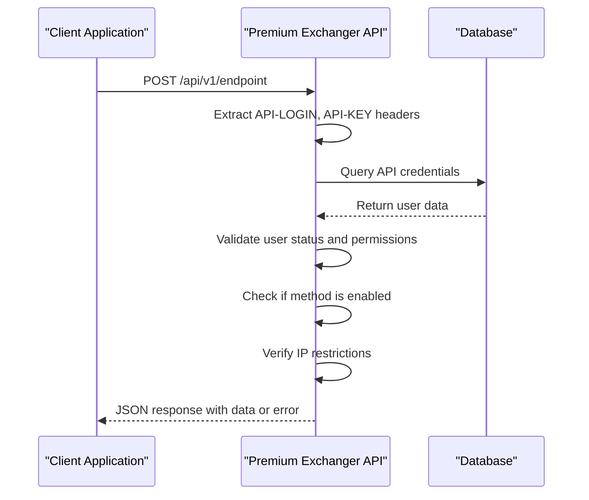
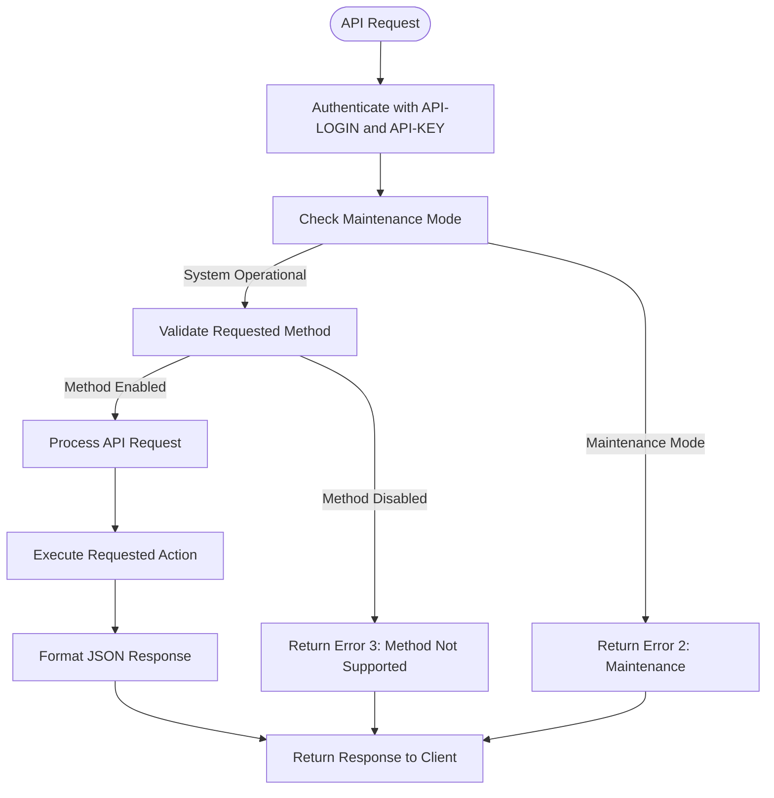
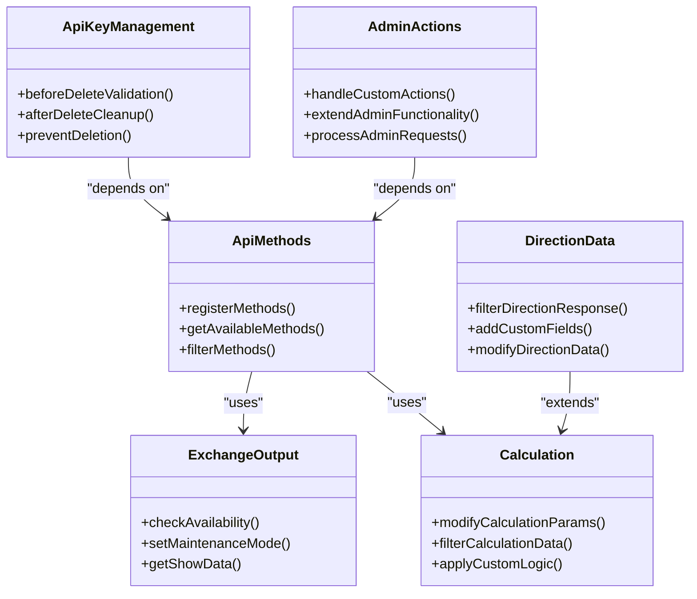
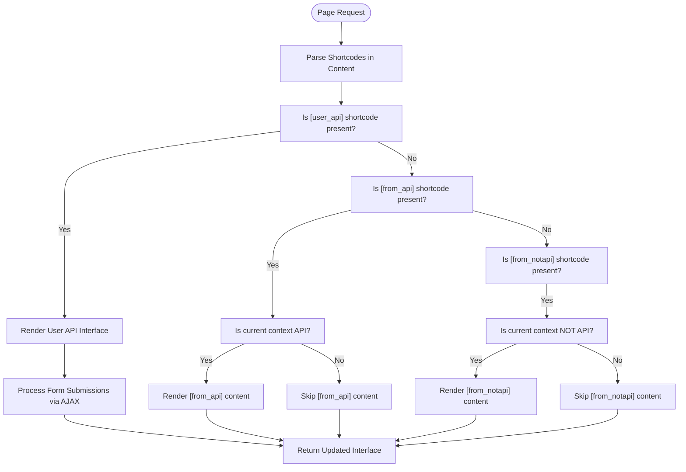
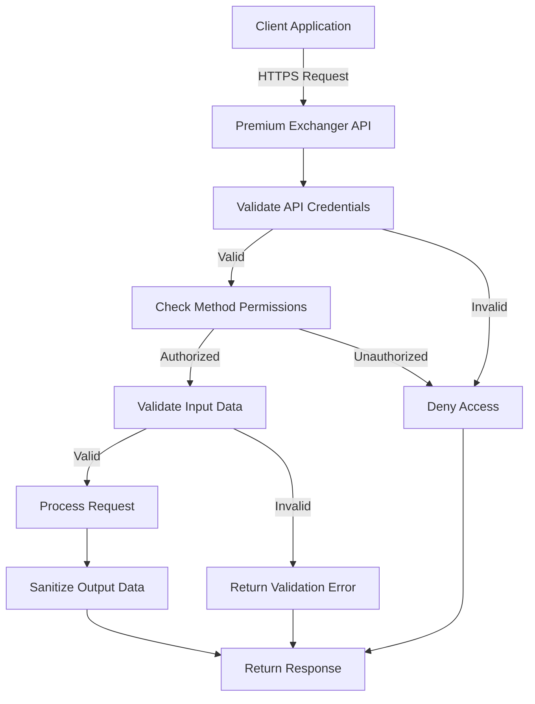

# API Reference

<cite>
**Referenced Files in This Document**   
- [api.php](file://wp-content/plugins/premiumbox/moduls/api/api.php)
- [methods.php](file://wp-content/plugins/premiumbox/moduls/api/methods.php)
- [user_api.php](file://wp-content/plugins/premiumbox/moduls/api/user_api.php)
- [settings.php](file://wp-content/plugins/premiumbox/moduls/api/settings.php)
- [shortcodes.php](file://wp-content/plugins/premiumbox/moduls/api/shortcodes.php)
- [functions.php](file://wp-content/plugins/premiumbox/includes/functions.php)
</cite>

## Table of Contents
1. [Introduction](#introduction)
2. [Authentication](#authentication)
3. [RESTful API Endpoints](#restful-api-endpoints)
4. [WordPress Hook-Based APIs](#wordpress-hook-based-apis)
5. [Shortcode APIs](#shortcode-apis)
6. [Rate Limiting and Versioning](#rate-limiting-and-versioning)
7. [Security Considerations](#security-considerations)
8. [Client Implementation Guidelines](#client-implementation-guidelines)
9. [Performance Optimization](#performance-optimization)
10. [Migration Guide](#migration-guide)

## Introduction

The Premium Exchanger platform provides a comprehensive API for programmatically interacting with its exchange functionality. This API allows developers to retrieve exchange rates, create transactions, manage user data, and extend platform functionality through various integration points. The API is designed to be RESTful, using standard HTTP methods and JSON data format for requests and responses.

The API is primarily accessed through custom endpoints that follow WordPress's action system, with authentication handled through API keys and login credentials. The platform supports both user-level and administrator-level access, with granular permissions for different API methods. The API is versioned with a simple v1 designation and follows backward compatibility principles to ensure stable integrations.

**Section sources**
- [api.php](file://wp-content/plugins/premiumbox/moduls/api/api.php#L4-L95)
- [methods.php](file://wp-content/plugins/premiumbox/moduls/api/methods.php#L4-L25)

## Authentication

The Premium Exchanger API uses a custom authentication mechanism based on API keys and login credentials. Authentication is performed through HTTP headers, with requests requiring three specific headers:

- `API-LOGIN`: The API login identifier
- `API-KEY`: The secret API key
- `API-LANG`: Optional language specification for localized responses

The authentication process validates these credentials against the database and checks user permissions before allowing access to API methods. IP-based restrictions can also be configured for additional security. The API supports two access modes: all users (mode 1) and featured users only (mode 2), which can be configured in the plugin settings.

For each API request, the system verifies the user's status, work permissions, and whether the requested method is enabled for their account. API usage can be logged for auditing purposes, with logs capturing the API action, IP address, and request data.



**Diagram sources **
- [api.php](file://wp-content/plugins/premiumbox/moduls/api/api.php#L18-L20)
- [user_api.php](file://wp-content/plugins/premiumbox/moduls/api/user_api.php#L17-L31)

**Section sources**
- [api.php](file://wp-content/plugins/premiumbox/moduls/api/api.php#L18-L60)
- [settings.php](file://wp-content/plugins/premiumbox/moduls/api/settings.php#L25-L31)

## RESTful API Endpoints

The Premium Exchanger platform exposes a comprehensive set of RESTful API endpoints for accessing exchange functionality programmatically. These endpoints follow a consistent pattern with JSON request and response formats, using POST methods for all operations.

### Available Endpoints

The API provides the following endpoints for various exchange operations:

#### Test Endpoint
- **Method**: POST
- **Endpoint**: `userapi/v1/test`
- **Description**: Tests API connectivity and authentication
- **Parameters**: None
- **Response**: Returns user IP, ID, locale, and partner ID

#### Exchange Direction Endpoints
- **Get Direction Currencies**: Retrieves available currencies for exchange directions
- **Get Directions**: Lists all available exchange directions
- **Get Direction**: Retrieves detailed information about a specific exchange direction
- **Get Calc**: Calculates exchange rates and fees for a given amount

#### Transaction Management Endpoints
- **Create Bid**: Creates a new exchange transaction
- **Cancel Bid**: Cancels an existing transaction
- **Pay Bid**: Marks a transaction as paid
- **Success Bid**: Confirms successful completion of a transaction
- **Bid Info**: Retrieves information about a specific transaction

#### Partner Management Endpoints
- **Get Partner Info**: Retrieves partner account information
- **Get Partner Links**: Lists partner referral links
- **Get Partner Exchanges**: Retrieves partner's exchange history
- **Get Partner Payouts**: Lists partner's payout history
- **Add Partner Payout**: Requests a new payout

### Request Format

All API requests must be sent as POST requests with JSON data in the request body. The Content-Type header should be set to application/json.

### Response Format

All API responses are returned in JSON format with the following structure:

```json
{
  "error": 0,
  "error_text": "",
  "data": {}
}
```

Where:
- `error`: Integer indicating error status (0 = success)
- `error_text`: String containing error description if applicable
- `data`: Object containing the requested data

### Error Codes

The API returns standardized error codes:
- **0**: Success
- **1**: General error
- **2**: Maintenance mode
- **3**: Method not supported
- **4**: IP blocked



**Diagram sources **
- [methods.php](file://wp-content/plugins/premiumbox/moduls/api/methods.php#L4-L25)
- [api.php](file://wp-content/plugins/premiumbox/moduls/api/api.php#L62-L88)

**Section sources**
- [methods.php](file://wp-content/plugins/premiumbox/moduls/api/methods.php#L4-L800)
- [api.php](file://wp-content/plugins/premiumbox/moduls/api/api.php#L62-L88)

## WordPress Hook-Based APIs

The Premium Exchanger platform provides extensive WordPress hook-based APIs that allow developers to extend and customize plugin functionality. These hooks follow WordPress's standard action and filter system, enabling integration at various points in the exchange process.

### Filter Hooks

#### api_all_methods
- **Purpose**: Registers available API methods
- **Parameters**: $lists (array of existing methods)
- **Return**: Modified array of API methods
- **Usage**: Add custom API endpoints to the available methods list

#### pn_exchanges_output
- **Purpose**: Controls exchange functionality availability
- **Parameters**: $show_data (array with show/work/text keys), $place (context)
- **Return**: Modified show_data array
- **Usage**: Enable or disable exchange functionality based on custom conditions

#### get_calc_data_params
- **Purpose**: Modifies calculation parameters
- **Parameters**: $calc_data (calculation data array), $place (context)
- **Return**: Modified calculation data
- **Usage**: Customize exchange calculations based on user or context

#### api_get_directions
- **Purpose**: Filters direction data before API response
- **Parameters**: $now (current direction data), $item (database record), $vd1, $vd2 (currency data)
- **Return**: Modified direction data
- **Usage**: Add custom fields to direction responses

### Action Hooks

#### userapi_v1_[method_name]
- **Purpose**: Executes API method functionality
- **Parameters**: $ui (user data), $api_login (API login)
- **Usage**: Implement custom logic for API methods

#### item_api_delete_before
- **Purpose**: Executes before API key deletion
- **Parameters**: $ind (indicator), $id (API key ID), $item (API key data)
- **Return**: Array with ind and error keys
- **Usage**: Prevent deletion based on custom conditions

#### item_api_delete
- **Purpose**: Executes after API key deletion
- **Parameters**: $id (API key ID), $item (API key data), $result (deletion result)
- **Usage**: Perform cleanup tasks after API key removal

#### premium_action_[action_name]
- **Purpose**: Handles various admin actions
- **Parameters**: Varies by action
- **Usage**: Extend admin functionality

These hooks enable developers to create custom modules, modify API behavior, and integrate with external systems while maintaining compatibility with the core platform.



**Diagram sources **
- [methods.php](file://wp-content/plugins/premiumbox/moduls/api/methods.php#L4-L25)
- [functions.php](file://wp-content/plugins/premiumbox/includes/functions.php#L289-L307)

**Section sources**
- [methods.php](file://wp-content/plugins/premiumbox/moduls/api/methods.php#L4-L25)
- [functions.php](file://wp-content/plugins/premiumbox/includes/functions.php#L289-L307)

## Shortcode APIs

The Premium Exchanger platform provides shortcode APIs that enable embedding exchange functionality directly into WordPress posts and pages. These shortcodes are processed on the server side and replaced with dynamic content when pages are rendered.

### Available Shortcodes

#### [user_api]
- **Purpose**: Displays the user API management interface
- **Parameters**: None
- **Usage**: Place on a page to allow users to manage their API keys
- **Context**: User account pages
- **Output**: Form for creating, editing, and deleting API keys with method permissions

#### [from_api]
- **Purpose**: Conditional content for API-only contexts
- **Parameters**: Content between shortcode tags
- **Usage**: Wrap content that should only appear in API responses
- **Example**: `[from_api]This content appears only in API responses[/from_api]`

#### [from_notapi]
- **Purpose**: Conditional content for non-API contexts
- **Parameters**: Content between shortcode tags
- **Usage**: Wrap content that should only appear in regular page views
- **Example**: `[from_notapi]This content appears only on regular pages[/from_notapi]`

### Shortcode Implementation

The shortcode system uses WordPress's built-in shortcode API with custom processing functions. The `[user_api]` shortcode renders a complete interface for API key management, including forms for creating new keys, listing existing keys, and handling form submissions via AJAX.

The conditional shortcodes `[from_api]` and `[from_notapi]` check the current context using the `_is('is_api')` function and only render their content when the condition is met. This allows developers to create content that adapts to whether it's being viewed through the API or a regular web interface.



**Diagram sources **
- [user_api.php](file://wp-content/plugins/premiumbox/moduls/api/user_api.php#L208-L209)
- [shortcodes.php](file://wp-content/plugins/premiumbox/moduls/api/shortcodes.php#L21-L37)

**Section sources**
- [user_api.php](file://wp-content/plugins/premiumbox/moduls/api/user_api.php#L208-L209)
- [shortcodes.php](file://wp-content/plugins/premiumbox/moduls/api/shortcodes.php#L4-L37)

## Rate Limiting and Versioning

The Premium Exchanger API implements a flexible approach to rate limiting and versioning to ensure system stability and backward compatibility.

### Versioning Strategy

The API follows a simple versioning strategy with the current version designated as v1. The version is specified in the endpoint URL as part of the action hook pattern (userapi/v1/[method]). This approach allows for future versioning while maintaining backward compatibility with existing integrations.

The platform does not currently implement automatic version deprecation but follows a policy of maintaining backward compatibility for deprecated endpoints. When new versions are introduced, the previous version will continue to function with a deprecation notice in the response headers.

### Backwards Compatibility

The API maintains backwards compatibility through several mechanisms:

1. **Endpoint Stability**: Once an endpoint is released, its core functionality and response structure remain consistent
2. **Field Addition**: New fields may be added to responses, but existing fields will not be removed or modified
3. **Parameter Deprecation**: Parameters may be deprecated but will continue to be accepted (with warnings) for a minimum of 12 months
4. **Error Code Consistency**: Standard error codes remain consistent across versions

### Rate Limiting

The current implementation does not include explicit rate limiting at the API level. However, the system provides several mechanisms to prevent abuse:

1. **IP-based restrictions**: Administrators can restrict API access to specific IP addresses
2. **Usage logging**: All API requests can be logged for monitoring and analysis
3. **Method-level permissions**: Granular control over which methods users can access

For high-volume applications, it is recommended to implement client-side rate limiting to avoid overwhelming the server. The recommended approach is to limit requests to no more than 10 per minute per API key.

Future versions of the API may introduce more sophisticated rate limiting based on user tier, with higher limits for premium accounts.

**Section sources**
- [api.php](file://wp-content/plugins/premiumbox/moduls/api/api.php#L8-L95)
- [settings.php](file://wp-content/plugins/premiumbox/moduls/api/settings.php#L32-L38)

## Security Considerations

The Premium Exchanger API implements multiple security measures to protect against common web vulnerabilities and ensure the integrity of exchange transactions.

### Authentication Security

The API uses a robust authentication system with API keys and login credentials transmitted via HTTP headers. The system includes several security features:

- **Secret Key Storage**: API keys are stored securely in the database
- **IP Restrictions**: Optional IP-based access control for additional security
- **Permission System**: Granular control over which API methods users can access
- **Activity Logging**: Optional logging of all API requests for auditing

### Data Validation

All API inputs are rigorously validated to prevent injection attacks and ensure data integrity:

- **Type Checking**: All parameters are validated for correct data types
- **Range Validation**: Numeric values are checked against minimum and maximum limits
- **Format Validation**: Strings are checked for proper format and length
- **SQL Injection Prevention**: All database queries use prepared statements

### Protection Against Common Vulnerabilities

The API includes protections against several common web vulnerabilities:

#### Cross-Site Request Forgery (CSRF)
- Protected through API key authentication
- All state-changing operations require valid API credentials
- No reliance on session cookies for API operations

#### Cross-Site Scripting (XSS)
- All output is properly escaped
- User input is sanitized before storage and display
- JSON responses are properly encoded

#### SQL Injection
- All database queries use WordPress's $wpdb methods with proper escaping
- Direct SQL string concatenation is avoided
- Input validation prevents malicious payloads

#### Rate Limiting and Abuse Prevention
- IP-based restrictions prevent unauthorized access
- Usage logging enables monitoring for suspicious activity
- Administrative controls allow disabling of compromised API keys

### Secure Communication

The API should always be accessed over HTTPS to protect sensitive data in transit. The system does not enforce SSL at the code level but strongly recommends its use in production environments.



**Diagram sources **
- [api.php](file://wp-content/plugins/premiumbox/moduls/api/api.php#L18-L60)
- [methods.php](file://wp-content/plugins/premiumbox/moduls/api/methods.php#L46-L481)

**Section sources**
- [api.php](file://wp-content/plugins/premiumbox/moduls/api/api.php#L18-L60)
- [methods.php](file://wp-content/plugins/premiumbox/moduls/api/methods.php#L46-L481)

## Client Implementation Guidelines

This section provides guidelines for implementing clients that interact with the Premium Exchanger API across different programming languages and environments.

### General Implementation Principles

1. **Error Handling**: Always implement robust error handling for API responses
2. **Retry Logic**: Implement exponential backoff for failed requests
3. **Connection Management**: Use connection pooling where available
4. **Data Validation**: Validate API responses before processing
5. **Security**: Store API credentials securely and use HTTPS

### Language-Specific Examples

#### JavaScript/Node.js
```javascript
// Example implementation would use fetch or axios
// with proper header configuration for API authentication
```

#### Python
```python
# Example implementation would use requests library
# with headers for API-LOGIN, API-KEY, and content type
```

#### PHP
```php
// Example implementation would use WordPress HTTP API
// or cURL with proper header configuration
```

#### Java
```java
// Example implementation would use HttpURLConnection
// or Apache HttpClient with header configuration
```

### Best Practices

1. **Authentication**: Store API credentials in environment variables or secure configuration files
2. **Error Handling**: Implement comprehensive error handling for all possible API error codes
3. **Rate Limiting**: Implement client-side rate limiting to avoid overwhelming the server
4. **Caching**: Cache responses when appropriate to reduce API calls
5. **Logging**: Implement logging for debugging and monitoring
6. **Timeouts**: Set appropriate timeouts for API requests
7. **Retries**: Implement retry logic with exponential backoff for transient failures

### Sample Implementation Pattern

1. Initialize API client with credentials
2. Set default headers for all requests
3. Implement request wrapper function with error handling
4. Create specific methods for each API endpoint
5. Implement response parsing and validation
6. Add logging and monitoring
7. Implement retry logic for failed requests

**Section sources**
- [api.php](file://wp-content/plugins/premiumbox/moduls/api/api.php#L130-L175)
- [methods.php](file://wp-content/plugins/premiumbox/moduls/api/methods.php#L46-L481)

## Performance Optimization

This section provides recommendations for optimizing API usage to ensure efficient performance and minimize server load.

### Request Optimization

1. **Batch Requests**: Where possible, combine multiple operations into single requests
2. **Caching**: Implement client-side caching for frequently accessed data
3. **Pagination**: Use pagination for large result sets to reduce response size
4. **Selective Fields**: Request only the fields needed for your application
5. **Connection Reuse**: Reuse HTTP connections for multiple requests

### Caching Strategies

The API does not implement server-side caching, so clients should implement appropriate caching mechanisms:

#### Local Caching
- Cache exchange rates for short periods (5-15 minutes)
- Cache currency lists for longer periods (1-2 hours)
- Use in-memory caching for frequently accessed data

#### Cache Invalidation
- Implement cache invalidation based on time-to-live (TTL)
- Clear caches when receiving specific error codes
- Refresh caches after performing write operations

### Efficient Data Retrieval

1. **Filter Results**: Use available parameters to filter results on the server side
2. **Limit Response Size**: Request only the data needed for current operations
3. **Avoid Redundant Requests**: Cache results of expensive operations
4. **Use Appropriate Endpoints**: Choose the most specific endpoint for your needs

### Connection Management

1. **Keep-Alive**: Use HTTP keep-alive to reduce connection overhead
2. **Connection Pooling**: Implement connection pooling for high-volume applications
3. **Timeout Configuration**: Set appropriate timeouts to avoid hanging requests
4. **Error Recovery**: Implement robust error recovery for network issues

### Monitoring and Analysis

1. **Request Timing**: Monitor API response times
2. **Error Rates**: Track error rates for different endpoints
3. **Usage Patterns**: Analyze usage patterns to optimize caching
4. **Performance Testing**: Regularly test performance under load

By following these optimization guidelines, clients can reduce API response times, minimize server load, and provide a better user experience.

**Section sources**
- [methods.php](file://wp-content/plugins/premiumbox/moduls/api/methods.php#L46-L481)
- [functions.php](file://wp-content/plugins/premiumbox/includes/functions.php#L289-L307)

## Migration Guide

This section provides guidance for migrating to newer versions of the Premium Exchanger API and handling deprecated endpoints.

### Backwards Compatibility Notes

The Premium Exchanger API follows a strict backwards compatibility policy:

1. **Endpoint Stability**: Existing endpoints will continue to function as documented
2. **Response Structure**: Core response structures will not change
3. **Error Codes**: Standard error codes will remain consistent
4. **Authentication**: Authentication methods will not change

When changes are necessary, they will be introduced in new API versions (e.g., v2) while maintaining the existing version for a minimum of 12 months.

### Handling Deprecated Endpoints

When endpoints are deprecated, they will continue to function with the following characteristics:

1. **Deprecation Notice**: A deprecation header will be included in responses
2. **Functionality**: The endpoint will continue to work as before
3. **Support**: Full support will be provided during the deprecation period
4. **Removal**: The endpoint will be removed after the deprecation period

### Migration Steps

When migrating from a deprecated endpoint to a new one:

1. **Review Documentation**: Carefully review the documentation for the new endpoint
2. **Test in Staging**: Implement and test the new endpoint in a staging environment
3. **Update Error Handling**: Update error handling for any new error codes
4. **Verify Data Mapping**: Ensure response data is correctly mapped to your application
5. **Monitor Performance**: Monitor performance after the migration
6. **Update Dependencies**: Update any dependent systems or services

### Version Transition

When transitioning between API versions:

1. **Parallel Testing**: Test both versions in parallel if possible
2. **Gradual Rollout**: Implement a gradual rollout to minimize risk
3. **Fallback Mechanism**: Implement a fallback to the old version if issues arise
4. **Monitoring**: Closely monitor the new version for issues
5. **Documentation**: Update internal documentation to reflect the new version

By following these migration guidelines, developers can ensure a smooth transition between API versions with minimal disruption to their applications.

**Section sources**
- [api.php](file://wp-content/plugins/premiumbox/moduls/api/api.php#L8-L95)
- [methods.php](file://wp-content/plugins/premiumbox/moduls/api/methods.php#L4-L25)