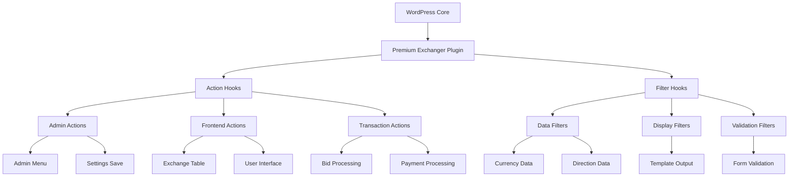
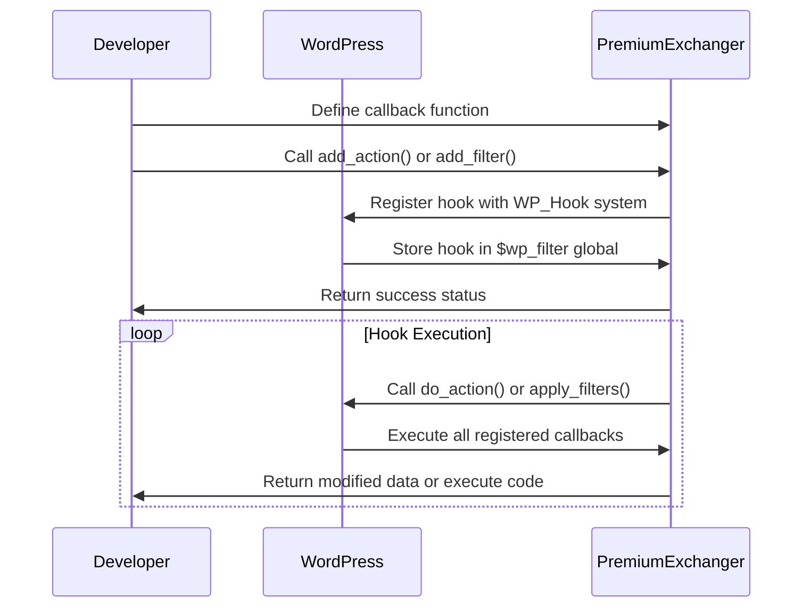
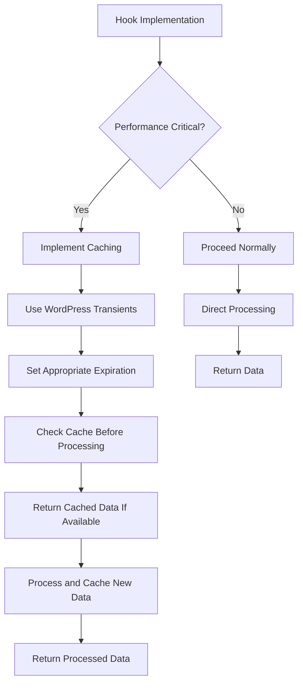
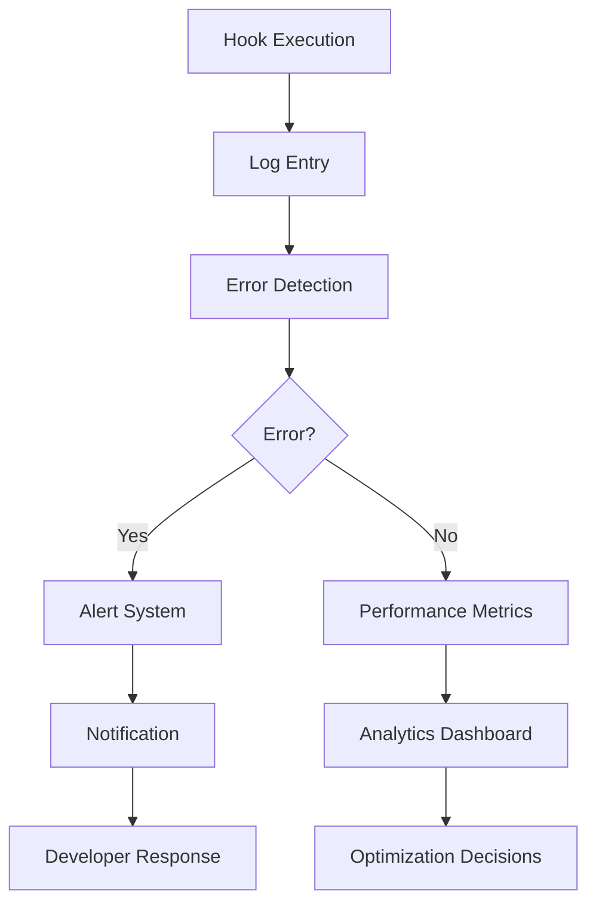

# Hook System

<cite>
**Referenced Files in This Document**   
- [class-wp-hook.php](file://wp-includes/class-wp-hook.php)
- [plugin.php](file://wp-includes/plugin.php)
- [premiumbox.php](file://wp-content/plugins/premiumbox/premiumbox.php)
- [class-plugin.php](file://wp-content/plugins/premiumbox/includes/class-plugin.php)
- [functions.php](file://wp-content/plugins/premiumbox/includes/functions.php)
- [exchange_filters.php](file://wp-content/plugins/premiumbox/plugin/exchange_filters.php)
- [list_currency_codes.php](file://wp-content/plugins/premiumbox/plugin/currency/list_currency_codes.php)
- [table2.php](file://wp-content/plugins/premiumbox/plugin/directions/table2.php)
- [birg_filters.php](file://wp-content/plugins/premiumbox/moduls/parser_settings/birg_filters.php)
</cite>

## Table of Contents
1. [Introduction](#introduction)
2. [Core Hook System Architecture](#core-hook-system-architecture)
3. [Action Hooks](#action-hooks)
4. [Filter Hooks](#filter-hooks)
5. [Hook Registration Process](#hook-registration-process)
6. [Practical Examples](#practical-examples)
7. [Performance Considerations](#performance-considerations)
8. [Conflict Management](#conflict-management)
9. [Debugging and Monitoring](#debugging-and-monitoring)
10. [Best Practices](#best-practices)

## Introduction

The Premium Exchanger platform implements a comprehensive WordPress hook-based API system that allows developers to extend and customize plugin functionality. This documentation provides a detailed overview of the available action and filter hooks, their parameters, expected return values, and execution contexts. The system follows WordPress standard practices while extending them with platform-specific functionality for currency exchange operations, transaction processing, and user management.

The hook system enables developers to modify exchange rates, add custom validation to transactions, extend user profiles, and integrate with third-party services without modifying the core plugin code. This extensibility ensures that customizations are preserved during plugin updates and can be managed independently.

**Section sources**
- [premiumbox.php](file://wp-content/plugins/premiumbox/premiumbox.php#L1-L51)
- [class-plugin.php](file://wp-content/plugins/premiumbox/includes/class-plugin.php#L1-L181)

## Core Hook System Architecture

The Premium Exchanger platform's hook system is built on WordPress's native action and filter API, extending it with specialized hooks for exchange operations. The architecture follows the observer pattern, where specific events (actions) trigger registered callback functions, and data points (filters) can be modified by registered functions.



**Diagram sources**
- [class-wp-hook.php](file://wp-includes/class-wp-hook.php#L1-L67)
- [plugin.php](file://wp-includes/plugin.php#L84-L477)

The system uses the `WP_Hook` class as its foundation, which manages callback functions, priorities, and execution order. Each hook is identified by a unique name, and functions can be attached with specific priorities to control execution order. The system supports multiple arguments being passed to hook callbacks, allowing for flexible data exchange between the core system and extensions.

## Action Hooks

Action hooks in the Premium Exchanger platform are used to execute code at specific points during execution, such as when certain events occur or at specific stages of processing. These hooks allow developers to add custom functionality without modifying the core code.

### Available Action Hooks

#### `item_currency_code_save`
- **Parameters**: `$item_id`, `$item`, `$result`, `$arr`
- **Execution Context**: Triggered when a currency code item is saved in the admin interface
- **Purpose**: Allows developers to perform additional actions when currency rates are updated
- **Example Use Case**: Syncing updated exchange rates with external services

#### `pntable_currency_codes_save`
- **Parameters**: None
- **Execution Context**: Triggered after saving currency codes in bulk
- **Purpose**: Provides a hook point after multiple currency code updates
- **Example Use Case**: Clearing cache or notifying administrators of bulk updates

#### `item_currency_code_basket`
- **Parameters**: `$id`, `$item`, `$result`
- **Execution Context**: Triggered when a currency code is moved to the basket (deactivated)
- **Purpose**: Allows tracking or processing when currencies are temporarily disabled
- **Example Use Case**: Logging deactivation events for audit purposes

#### `item_currency_code_unbasket`
- **Parameters**: `$id`, `$item`, `$result`
- **Execution Context**: Triggered when a currency code is restored from the basket
- **Purpose**: Provides notification when previously deactivated currencies are reactivated
- **Example Use Case**: Sending notifications to users about newly available exchange options

#### `item_currency_code_delete`
- **Parameters**: `$id`, `$item`, `$result`
- **Purpose**: Triggered when a currency code is permanently deleted
- **Execution Context**: Fires after the database deletion operation
- **Example Use Case**: Cleaning up related data or records in external systems

#### `pntable_currency_codes_action`
- **Parameters**: `$action`, `$ids`
- **Execution Context**: Triggered for bulk actions on currency codes
- **Purpose**: Provides a generic hook for various bulk operations
- **Example Use Case**: Implementing custom bulk processing logic

#### `premium_action_pn_exchange_filters`
- **Parameters**: None
- **Execution Context**: Triggered when exchange filter settings are saved
- **Purpose**: Allows extension of the exchange filter configuration process
- **Example Use Case**: Adding custom validation or processing for filter settings

#### `pn_exchange_filters_option_post`
- **Parameters**: None
- **Execution Context**: Triggered after exchange filter options are processed
- **Purpose**: Provides a hook point for post-processing after filter updates
- **Example Use Case**: Clearing specific caches related to exchange filters

**Section sources**
- [list_currency_codes.php](file://wp-content/plugins/premiumbox/plugin/currency/list_currency_codes.php#L21-L120)
- [exchange_filters.php](file://wp-content/plugins/premiumbox/plugin/exchange_filters.php#L87-L121)

## Filter Hooks

Filter hooks in the Premium Exchanger platform are used to modify data before it is used or displayed. These hooks receive data as input, allow modifications, and return the modified data. They are essential for customizing the behavior and output of the plugin.

### Available Filter Hooks

#### `set_exchange_cat_filters`
- **Parameters**: `$cats` (array of category filters)
- **Return Value**: Modified array of category filters
- **Execution Context**: Admin interface for exchange filters
- **Purpose**: Allows adding custom categories for exchange direction filtering
- **Example Use Case**: Adding a new category like "mobile-only" exchange options

#### `set_exchange_filters`
- **Parameters**: `$lists` (array of filter options)
- **Return Value**: Modified array of filter options
- **Execution Context**: Admin interface for exchange filters
- **Purpose**: Enables adding custom filter criteria for exchange directions
- **Example Use Case**: Adding a "high-volume" filter for large transactions

#### `placed_form`
- **Parameters**: `$placed` (array of form placement options)
- **Return Value**: Modified array of placement options
- **Execution Context**: Form rendering system
- **Purpose**: Allows adding new placement options for exchange forms
- **Example Use Case**: Adding a "sidebar" placement option for exchange widgets

#### `premium_js_login`
- **Parameters**: `$ind` (integer indicator)
- **Return Value**: Modified indicator value
- **Execution Context**: JavaScript login system
- **Purpose**: Controls whether JavaScript login functionality is enabled
- **Example Use Case**: Disabling JS login for specific user roles or conditions

#### `new_parser_links`
- **Parameters**: `$links` (array of parser links)
- **Return Value**: Modified array of parser links
- **Execution Context**: Currency rate parser system
- **Purpose**: Allows adding or modifying external API endpoints for rate parsing
- **Example Use Case**: Integrating with a custom exchange rate API service

#### `set_parser_pairs`
- **Parameters**: `$parser_pairs`, `$output`, `$birg_key`, `$up_time`
- **Return Value**: Modified parser pairs array
- **Execution Context**: Currency pair processing for rate parsing
- **Purpose**: Enables customization of how currency pairs are processed from external APIs
- **Example Use Case**: Adding support for new currency pairs from external services

#### `exchange_table_type2`
- **Parameters**: `$temp`, `$def_cur_from`, `$def_cur_to`
- **Return Value**: Modified HTML template for exchange table
- **Execution Context**: Frontend exchange table rendering
- **Purpose**: Allows complete customization of the exchange table output
- **Example Use Case**: Adding custom styling or additional information to the exchange table

#### `exchange_table2_head`
- **Parameters**: `$exchange_table_head`, `$all_vtypes`, `$all_vtypes`
- **Return Value**: Modified HTML for exchange table header
- **Execution Context**: Exchange table header rendering
- **Purpose**: Enables modification of the table header section
- **Example Use Case**: Adding custom navigation elements to the table header

#### `exchange_table2_part`
- **Parameters**: `$temp`, `$title`, `$p`, `$place`, `$current`, `$c_id`
- **Return Value**: Modified HTML for exchange table part
- **Execution Context**: Individual section rendering within the exchange table
- **Purpose**: Allows customization of specific parts of the exchange table
- **Example Use Case**: Adding custom icons or indicators to specific exchange options

#### `param_ajax_exchange_table2`
- **Parameters**: Empty string
- **Return Value**: Additional AJAX parameters as string
- **Execution Context**: AJAX request for exchange table updates
- **Purpose**: Enables adding custom parameters to AJAX requests for table updates
- **Example Use Case**: Adding authentication tokens or tracking parameters

#### `get_direction_output`
- **Parameters**: `$output`, `$item`, `$place`
- **Return Value**: Boolean indicating whether direction should be shown
- **Execution Context**: Direction visibility determination
- **Purpose**: Controls whether specific exchange directions are displayed
- **Example Use Case**: Implementing geo-based restrictions for exchange directions

#### `pn_exchanges_output`
- **Parameters**: `$show_data`, `$place`
- **Return Value**: Modified array controlling exchange visibility
- **Execution Context**: Overall exchange functionality visibility
- **Purpose**: Allows controlling whether exchange functions are available
- **Example Use Case**: Implementing maintenance mode or scheduled downtime

#### `bid_status_list`
- **Parameters**: `$status` (array of bid status definitions)
- **Return Value**: Modified array of bid status definitions
- **Execution Context**: Bid status management system
- **Purpose**: Enables adding custom bid statuses to the system
- **Example Use Case**: Adding a "pending verification" status for enhanced workflow

#### `list_directions_temp`
- **Parameters**: `$list_directions_temp` (array of template texts)
- **Return Value**: Modified array of template texts
- **Execution Context**: Direction template text management
- **Purpose**: Allows customization of text displayed in exchange direction templates
- **Example Use Case**: Adding custom status messages for specific exchange types

**Section sources**
- [functions.php](file://wp-content/plugins/premiumbox/includes/functions.php#L80-L357)
- [birg_filters.php](file://wp-content/plugins/premiumbox/moduls/parser_settings/birg_filters.php#L326-L378)
- [table2.php](file://wp-content/plugins/premiumbox/plugin/directions/table2.php#L249-L366)

## Hook Registration Process

The hook registration process in the Premium Exchanger platform follows WordPress standards while incorporating platform-specific patterns. Developers can register hooks using the standard `add_action()` and `add_filter()` functions, with specific conventions for naming and organization.

### Registration Pattern

The platform uses a consistent naming convention for hooks, typically prefixed with `pn_` to identify them as Premium Exchanger hooks. The registration process involves:

1. **Hook Name**: Using descriptive names that indicate the purpose and context
2. **Callback Function**: Defining a function that will be executed when the hook fires
3. **Priority**: Setting the execution order (default is 10)
4. **Accepted Arguments**: Specifying the number of arguments the callback accepts



**Diagram sources**
- [plugin.php](file://wp-includes/plugin.php#L115-L131)
- [plugin.php](file://wp-includes/plugin.php#L414-L443)

### Best Practices for Registration

- Use unique, descriptive hook names to avoid conflicts
- Prefix custom hooks with a unique identifier (e.g., plugin-specific prefix)
- Document the purpose, parameters, and expected return values
- Consider the execution context (admin, frontend, AJAX) when registering hooks
- Use appropriate priority values to ensure correct execution order
- Always verify that callback functions exist before registration

## Practical Examples

This section provides practical examples demonstrating common use cases for the Premium Exchanger hook system.

### Modifying Exchange Rates

To modify exchange rates based on external factors, developers can use the `set_parser_pairs` filter:

```php
add_filter('set_parser_pairs', 'custom_exchange_rate_modification', 10, 4);
function custom_exchange_rate_modification($parser_pairs, $output, $birg_key, $up_time) {
    // Custom logic to modify exchange rates
    if ('quickex' == $birg_key) {
        $rates = pn_json_decode($output);
        if (!empty($rates)) {
            foreach ($rates as $pair => $rate_data) {
                // Apply a 1% premium to all rates
                $rate_data['rate'] = $rate_data['rate'] * 1.01;
                $rates[$pair] = $rate_data;
            }
            $output = pn_json_encode($rates);
        }
    }
    return $parser_pairs;
}
```

**Section sources**
- [birg_filters.php](file://wp-content/plugins/premiumbox/moduls/parser_settings/birg_filters.php#L326-L378)

### Adding Custom Validation to Transactions

To add custom validation rules for transactions, use the `get_direction_output` filter:

```php
add_filter('get_direction_output', 'custom_transaction_validation', 10, 3);
function custom_transaction_validation($output, $item, $place) {
    // Only apply to frontend exchanges
    if ('home' !== $place) {
        return $output;
    }
    
    // Get current user
    $user = wp_get_current_user();
    $user_id = intval($user->ID);
    
    // Skip validation for administrators
    if ($user_id > 0 && current_user_can('administrator')) {
        return $output;
    }
    
    // Implement custom validation logic
    // For example, limit certain directions for new users
    if ($user_id > 0) {
        $user_registered = get_user_meta($user_id, 'user_registered', true);
        $days_since_registration = (time() - strtotime($user_registered)) / (60 * 60 * 24);
        
        // Restrict high-value exchanges for users registered less than 7 days
        if ($days_since_registration < 7) {
            $max_amount = 100; // $100 limit
            if ($item->min_get > $max_amount || $item->max_get > $max_amount) {
                return false;
            }
        }
    }
    
    return $output;
}
```

**Section sources**
- [table2.php](file://wp-content/plugins/premiumbox/plugin/directions/table2.php#L204-L205)

### Extending User Profiles

To extend user profiles with custom fields and functionality:

```php
add_filter('account_list_pages', 'add_custom_account_pages', 10, 1);
function add_custom_account_pages($account_list_pages) {
    $account_list_pages['custom_reports'] = array(
        'title' => __('Custom Reports', 'pn'),
        'url' => '',
        'type' => 'page',
        'class' => 'custom-reports',
        'id' => 'custom-reports-page',
    );
    
    $account_list_pages['api_settings'] = array(
        'title' => __('API Settings', 'pn'),
        'url' => '',
        'type' => 'page',
        'class' => 'api-settings',
        'id' => 'api-settings-page',
    );
    
    return $account_list_pages;
}
```

**Section sources**
- [functions.php](file://wp-content/plugins/premiumbox/includes/functions.php#L4-L77)

### Integrating with Third-Party Services

To integrate with third-party analytics or notification services:

```php
add_action('item_currency_code_save', 'sync_with_external_service', 10, 4);
function sync_with_external_service($item_id, $item, $result, $arr) {
    // Only proceed if the update was successful
    if (!$result) {
        return;
    }
    
    // Prepare data for external service
    $data = array(
        'currency_code' => $item->currency_code_title,
        'new_rate' => $arr['internal_rate'],
        'timestamp' => current_time('mysql'),
        'updated_by' => get_current_user_id()
    );
    
    // Send data to external analytics service
    $response = wp_remote_post('https://analytics-service.com/api/rates', array(
        'headers' => array(
            'Authorization' => 'Bearer ' . get_option('analytics_api_key'),
            'Content-Type' => 'application/json'
        ),
        'body' => json_encode($data),
        'timeout' => 15
    ));
    
    // Log any errors
    if (is_wp_error($response)) {
        error_log('Failed to sync rate update with external service: ' . $response->get_error_message());
    }
}
```

**Section sources**
- [list_currency_codes.php](file://wp-content/plugins/premiumbox/plugin/currency/list_currency_codes.php#L56-L57)

## Performance Considerations

When using hooks in the Premium Exchanger platform, several performance considerations should be taken into account to ensure optimal system performance.

### Execution Impact

- **Database Queries**: Hooks that perform database operations can significantly impact performance, especially if executed on high-traffic pages
- **External API Calls**: Hooks that make external HTTP requests can introduce latency and potential timeout issues
- **Complex Processing**: Hooks that perform intensive calculations or data processing can slow down page loading

### Optimization Strategies



**Diagram sources**
- [functions.php](file://wp-content/plugins/premiumbox/includes/functions.php#L289-L307)

### Best Practices for Performance

1. **Minimize Database Queries**: Combine multiple queries into single operations when possible
2. **Implement Caching**: Use WordPress transients or object caching for expensive operations
3. **Limit External Requests**: Cache external API responses and use asynchronous processing when appropriate
4. **Conditional Execution**: Only execute hook code when necessary conditions are met
5. **Efficient Data Processing**: Optimize algorithms and avoid unnecessary loops or operations
6. **Proper Hook Selection**: Use the most specific hook possible to avoid unnecessary executions

## Conflict Management

When multiple plugins or custom code use the same hooks, conflicts can occur. The Premium Exchanger platform provides mechanisms to manage these conflicts effectively.

### Common Conflict Scenarios

- **Priority Conflicts**: Multiple callbacks on the same hook with different priorities
- **Data Modification Conflicts**: Multiple filters modifying the same data in incompatible ways
- **Resource Conflicts**: Multiple hooks competing for the same system resources

### Conflict Resolution Strategies

1. **Use Unique Hook Names**: When creating custom hooks, use unique prefixes to avoid naming collisions
2. **Check for Existing Hooks**: Use `has_action()` and `has_filter()` to check if hooks are already in use
3. **Proper Priority Management**: Use appropriate priority values to ensure correct execution order
4. **Data Validation**: Validate data before and after filter operations to ensure integrity
5. **Error Handling**: Implement robust error handling to gracefully manage conflicts

```php
// Example of conflict-aware hook registration
if (!has_action('pn_exchange_filters_option_post', 'my_custom_function')) {
    add_action('pn_exchange_filters_option_post', 'my_custom_function', 10);
}

function my_custom_function() {
    // Check if required conditions are met
    if (!function_exists('required_function')) {
        return;
    }
    
    // Implement conflict-resistant logic
    // ...
}
```

**Section sources**
- [plugin.php](file://wp-includes/plugin.php#L553-L590)

## Debugging and Monitoring

Effective debugging and monitoring are essential for maintaining a stable hook-based system. The Premium Exchanger platform provides several tools and techniques for this purpose.

### Debugging Techniques

1. **Hook Tracing**: Use WordPress debugging tools to trace hook execution
2. **Logging**: Implement comprehensive logging for hook execution and data flow
3. **Error Monitoring**: Set up error monitoring to catch issues in production

### Monitoring Tools



**Diagram sources**
- [plugin.php](file://wp-includes/plugin.php#L476-L520)

### Debugging Best Practices

1. **Enable WordPress Debug Mode**: Set `WP_DEBUG` to true in development environments
2. **Use Hook Inspection**: Implement functions to inspect currently registered hooks
3. **Monitor Execution Time**: Track the execution time of hook callbacks
4. **Log Parameters and Return Values**: Record input and output data for debugging
5. **Implement Health Checks**: Create health check functions to verify hook functionality

## Best Practices

Adhering to best practices ensures that hook implementations are maintainable, performant, and compatible with the Premium Exchanger platform.

### Code Organization

- **Modular Design**: Organize hook-related code in dedicated files or classes
- **Consistent Naming**: Use consistent naming conventions for hooks and callback functions
- **Documentation**: Document all custom hooks with clear descriptions, parameters, and usage examples

### Security Considerations

- **Input Validation**: Always validate and sanitize data passed to and from hooks
- **Capability Checks**: Verify user capabilities before executing sensitive operations
- **Nonce Verification**: Use nonces for actions that modify data
- **Data Escaping**: Escape data appropriately when outputting to HTML

### Maintenance and Compatibility

- **Version Compatibility**: Test hook implementations with different versions of WordPress and the Premium Exchanger plugin
- **Deprecation Handling**: Implement graceful handling of deprecated hooks
- **Backward Compatibility**: Maintain backward compatibility when modifying existing hooks
- **Testing**: Implement comprehensive testing for hook functionality

By following these best practices, developers can create robust, secure, and maintainable extensions for the Premium Exchanger platform that leverage the full power of its hook-based API system.

**Section sources**
- [class-plugin.php](file://wp-content/plugins/premiumbox/includes/class-plugin.php#L50-L52)
- [premiumbox.php](file://wp-content/plugins/premiumbox/premiumbox.php#L18-L51)