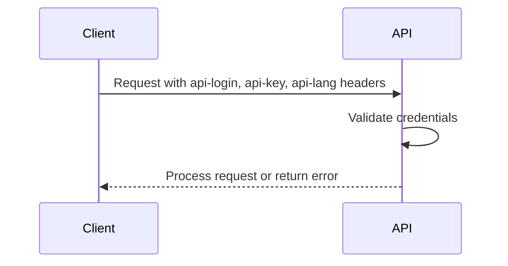
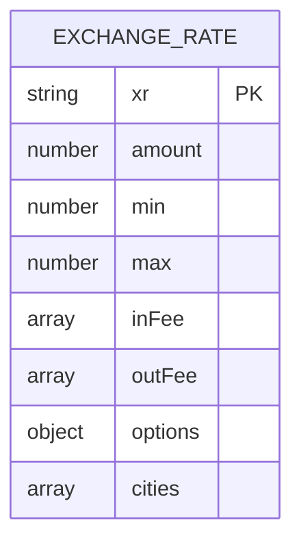
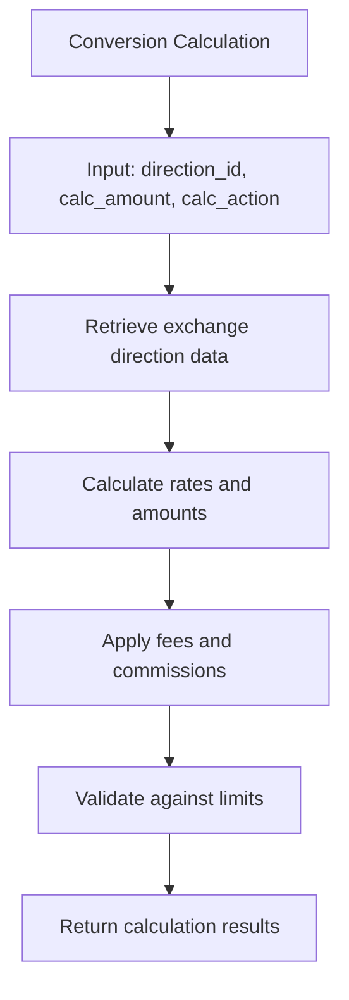
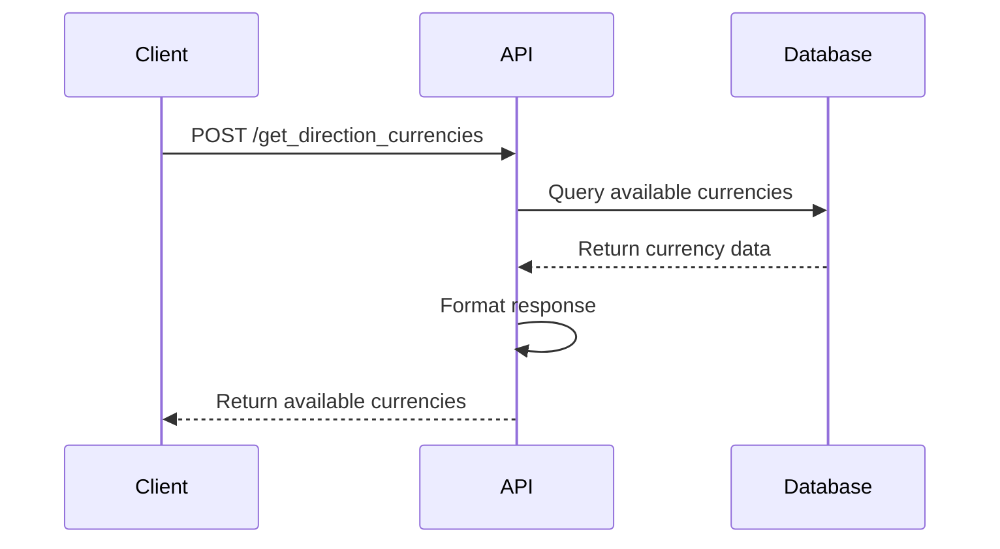

# Exchange API

<cite>
**Referenced Files in This Document**   
- [output.php](file://wp-content/plugins/premiumbox/moduls/direction_xml/output.php)
- [birg_filters.php](file://wp-content/plugins/premiumbox/moduls/parser_settings/birg_filters.php)
- [functions.php](file://wp-content/plugins/premiumbox/moduls/tbots/functions.php)
- [bot.php](file://wp-content/plugins/premiumbox/moduls/tbots/bot.php)
- [methods.php](file://wp-content/plugins/premiumbox/moduls/api/methods.php)
- [api.php](file://wp-content/plugins/premiumbox/moduls/api/api.php)
</cite>

## Table of Contents
1. [Introduction](#introduction)
2. [API Endpoints](#api-endpoints)
3. [Authentication](#authentication)
4. [Exchange Rate Retrieval](#exchange-rate-retrieval)
5. [Currency Conversion Calculation](#currency-conversion-calculation)
6. [Exchange Availability Checks](#exchange-availability-checks)
7. [Request/Response Schemas](#requestresponse-schemas)
8. [Rate Limiting and Caching](#rate-limiting-and-caching)
9. [Integration Examples](#integration-examples)
10. [Security Considerations](#security-considerations)

## Introduction
The Exchange API provides comprehensive functionality for currency exchange operations, including exchange rate retrieval, currency conversion calculations, and exchange availability checks. The API is designed to support real-time exchange operations with multiple currency pairs and various exchange providers. It offers both JSON and XML output formats for exchange rate data and supports integration with external applications through a well-defined RESTful interface.

The API is implemented as part of the PremiumBox plugin for WordPress and provides endpoints for retrieving exchange rates from various sources including cryptocurrency exchanges, traditional financial institutions, and specialized exchange services. The system supports over 50 exchange providers including Binance, Kucoin, Exmo, Payeer, and many others.

**Section sources**
- [birg_filters.php](file://wp-content/plugins/premiumbox/moduls/parser_settings/birg_filters.php#L43-L82)
- [birg_filters.php](file://wp-content/plugins/premiumbox/moduls/parser_settings/birg_filters.php#L205-L247)

## API Endpoints
The Exchange API provides several endpoints for different exchange-related operations. All endpoints follow a consistent pattern and are accessible via HTTPS.

```mermaid
flowchart TD
A["API Endpoints"] --> B["GET /api/userapi/v1/test"]
A --> C["POST /api/userapi/v1/get_direction_currencies"]
A --> D["POST /api/userapi/v1/get_directions"]
A --> E["POST /api/userapi/v1/get_direction"]
A --> F["POST /api/userapi/v1/get_calc"]
A --> G["POST /api/userapi/v1/create_bid"]
A --> H["POST /api/userapi/v1/bid_info"]
A --> I["POST /api/userapi/v1/cancel_bid"]
A --> J["POST /api/userapi/v1/pay_bid"]
A --> K["POST /api/userapi/v1/success_bid"]
A --> L["POST /api/userapi/v1/get_partner_info"]
A --> M["POST /api/userapi/v1/get_partner_links"]
```



**Diagram sources**
- [methods.php](file://wp-content/plugins/premiumbox/moduls/api/methods.php#L4-L25)
- [api.php](file://wp-content/plugins/premiumbox/moduls/api/api.php#L7)

**Section sources**
- [methods.php](file://wp-content/plugins/premiumbox/moduls/api/methods.php#L4-L25)
- [api.php](file://wp-content/plugins/premiumbox/moduls/api/api.php#L7)

## Authentication
The Exchange API uses API key-based authentication. Each request must include the following headers:

- `api-login`: The API login identifier
- `api-key`: The API key for authentication
- `api-lang`: The preferred language for responses

The API also supports partner integration through a partner ID parameter that can be included in requests.



**Diagram sources**
- [functions.php](file://wp-content/plugins/premiumbox/moduls/tbots/functions.php#L31-L35)

**Section sources**
- [functions.php](file://wp-content/plugins/premiumbox/moduls/tbots/functions.php#L31-L35)

## Exchange Rate Retrieval
The API provides multiple methods for retrieving exchange rates from various sources. Exchange rates are collected from over 50 different providers including cryptocurrency exchanges and traditional financial institutions.

### Supported Exchange Providers
The system supports integration with numerous exchange providers through their public APIs:

- Cryptocurrency Exchanges: Binance, Kucoin, Exmo, Poloniex, Bitfinex, Whitebit, Bybit
- Traditional Financial Institutions: CBR (Russia), ECB (Europe), NBU (Ukraine), PrivatBank
- Specialized Exchange Services: Cryptomus, Heleket, Paylink, Merchant001, SuperMoney
- Regional Exchanges: Nationalbank.KZ, Rapira.net, Goldex, MEXC, Bithumb

### Rate Data Structure
Exchange rate responses include the following data:

- Exchange rate value (xr)
- Minimum and maximum transaction amounts (min, max)
- Input and output fees (inFee, outFee)
- Processing options (manual, auth, ident)
- Geographic availability (cities)



**Diagram sources**
- [output.php](file://wp-content/plugins/premiumbox/moduls/direction_xml/output.php#L147-L194)
- [birg_filters.php](file://wp-content/plugins/premiumbox/moduls/parser_settings/birg_filters.php#L43-L82)

**Section sources**
- [output.php](file://wp-content/plugins/premiumbox/moduls/direction_xml/output.php#L147-L194)
- [birg_filters.php](file://wp-content/plugins/premiumbox/moduls/parser_settings/birg_filters.php#L43-L82)

## Currency Conversion Calculation
The API provides endpoints for calculating currency conversion rates and amounts. These calculations take into account exchange rates, fees, and transaction limits.

### Calculation Parameters
The currency conversion calculation endpoint accepts the following parameters:

- `direction_id`: The ID of the exchange direction
- `calc_amount`: The amount to be converted
- `calc_action`: The calculation action (1 for source currency, 2 for target currency)
- `cd`: Additional custom data in URL-encoded format

### Calculation Response
The response includes detailed information about the conversion:

- Currency codes for source and target currencies
- Exchange rates in both directions
- Calculated amounts for source and target
- Fee information for both sides
- Transaction limits (minimum and maximum amounts)
- Required fields for the exchange process



**Diagram sources**
- [methods.php](file://wp-content/plugins/premiumbox/moduls/api/methods.php#L310-L402)
- [bot.php](file://wp-content/plugins/premiumbox/moduls/tbots/bot.php#L845-L877)

**Section sources**
- [methods.php](file://wp-content/plugins/premiumbox/moduls/api/methods.php#L310-L402)
- [bot.php](file://wp-content/plugins/premiumbox/moduls/tbots/bot.php#L845-L877)

## Exchange Availability Checks
The API provides endpoints to check the availability of exchange directions between currencies.

### Available Endpoints
- `get_direction_currencies`: Retrieves available currencies for exchange
- `get_directions`: Lists available exchange directions
- `get_direction`: Retrieves details of a specific exchange direction

### Response Structure
The availability check responses include:

- Currency IDs and titles
- Currency logos
- Exchange direction details
- Status information
- Reserve amounts
- Processing timelines



**Diagram sources**
- [methods.php](file://wp-content/plugins/premiumbox/moduls/api/methods.php#L46-L117)
- [methods.php](file://wp-content/plugins/premiumbox/moduls/api/methods.php#L119-L177)

**Section sources**
- [methods.php](file://wp-content/plugins/premiumbox/moduls/api/methods.php#L46-L117)
- [methods.php](file://wp-content/plugins/premiumbox/moduls/api/methods.php#L119-L177)

## Request/Response Schemas
This section details the request and response schemas for the various API endpoints.

### Common Response Structure
All API responses follow a consistent structure:

```json
{
  "error": 0,
  "error_text": "",
  "data": {}
}
```

Where:
- `error`: 0 for success, non-zero for error
- `error_text`: Error description if applicable
- `data`: Response data object

### Endpoint-Specific Schemas

#### Test Endpoint
**Request**
```
GET /api/userapi/v1/test/
Headers: api-login, api-key, api-lang
```

**Response**
```json
{
  "error": 0,
  "error_text": "",
  "data": {
    "ip": "client_ip",
    "user_id": 123,
    "locale": "en_US",
    "partner_id": 456
  }
}
```

#### Get Calculation Endpoint
**Request**
```json
{
  "direction_id": 123,
  "calc_amount": 100.50,
  "calc_action": 1,
  "cd": "custom_data"
}
```

**Response**
```json
{
  "error": 0,
  "error_text": "",
  "data": {
    "currency_code_give": "USD",
    "currency_code_get": "BTC",
    "reserve": 5.2,
    "course_give": 0.0002,
    "course_get": 5000,
    "sum_give": 100.50,
    "sum_give_com": 102.50,
    "sum_get": 0.0201,
    "sum_get_com": 0.0198,
    "com_give": 2.00,
    "com_get": 0.0003,
    "min_give": 10,
    "max_give": 1000,
    "min_get": 0.001,
    "max_get": 0.5,
    "changed": 1
  }
}
```

#### Create Bid Endpoint
**Request**
```json
{
  "direction_id": 123,
  "calc_amount": 100.50,
  "calc_action": 1,
  "cd": "custom_data",
  "callback_url": "https://your-site.com/callback"
}
```

**Response**
```json
{
  "error": 0,
  "error_text": "",
  "data": {
    "url": "https://exchange-site.com/bid/abc123",
    "id": 789,
    "hash": "abc123",
    "status": "new",
    "status_title": "New Order",
    "psys_give": "Bank Transfer",
    "psys_get": "Bitcoin",
    "currency_code_give": "USD",
    "currency_code_get": "BTC",
    "amount_give": 100.50,
    "amount_get": 0.0201,
    "course_give": 0.0002,
    "course_get": 5000,
    "api_actions": {
      "type": "default",
      "cancel": "api",
      "pay": "api",
      "pay_amount": 102.50,
      "instruction": "Send 102.50 USD to the specified account"
    }
  }
}
```

**Section sources**
- [methods.php](file://wp-content/plugins/premiumbox/moduls/api/methods.php#L28-L44)
- [methods.php](file://wp-content/plugins/premiumbox/moduls/api/methods.php#L310-L402)
- [methods.php](file://wp-content/plugins/premiumbox/moduls/api/methods.php#L404-L487)

## Rate Limiting and Caching
The Exchange API implements caching mechanisms to improve performance and reduce load on external exchange providers.

### Caching Strategy
Exchange rate data is cached to minimize API calls to external providers. The caching system:

- Updates rates periodically based on provider specifications
- Stores rates in WordPress options
- Uses versioning to track cache freshness
- Supports manual cache invalidation

### Performance Recommendations
For optimal performance when integrating with the Exchange API:

1. Cache responses locally in your application
2. Implement client-side caching with appropriate TTL
3. Use batch requests when possible
4. Handle rate limiting gracefully
5. Implement retry logic for failed requests

The API does not implement strict rate limiting but encourages responsible usage to maintain system stability.

**Section sources**
- [output.php](file://wp-content/plugins/premiumbox/moduls/direction_xml/output.php#L141-L143)
- [birg_filters.php](file://wp-content/plugins/premiumbox/moduls/parser_settings/birg_filters.php#L357-L365)

## Integration Examples
This section provides practical examples of integrating with the Exchange API.

### Example 1: Retrieve Available Currencies
```javascript
// JavaScript example using fetch
async function getAvailableCurrencies() {
  const response = await fetch('https://exchange-site.com/api/userapi/v1/get_direction_currencies/', {
    method: 'POST',
    headers: {
      'api-login': 'your_api_login',
      'api-key': 'your_api_key',
      'api-lang': 'en',
      'Content-Type': 'application/x-www-form-urlencoded'
    },
    body: new URLSearchParams({
      'currency_id_give': 1
    })
  });
  
  const data = await response.json();
  return data;
}
```

### Example 2: Calculate Conversion
```javascript
// JavaScript example for currency conversion
async function calculateConversion(directionId, amount, action) {
  const response = await fetch('https://exchange-site.com/api/userapi/v1/get_calc/', {
    method: 'POST',
    headers: {
      'api-login': 'your_api_login',
      'api-key': 'your_api_key',
      'api-lang': 'en',
      'Content-Type': 'application/x-www-form-urlencoded'
    },
    body: new URLSearchParams({
      'direction_id': directionId,
      'calc_amount': amount,
      'calc_action': action
    })
  });
  
  const data = await response.json();
  return data;
}
```

### Example 3: Create Exchange Order
```javascript
// JavaScript example for creating an exchange order
async function createExchangeOrder(directionId, amount, action) {
  const response = await fetch('https://exchange-site.com/api/userapi/v1/create_bid/', {
    method: 'POST',
    headers: {
      'api-login': 'your_api_login',
      'api-key': 'your_api_key',
      'api-lang': 'en',
      'Content-Type': 'application/x-www-form-urlencoded'
    },
    body: new URLSearchParams({
      'direction_id': directionId,
      'calc_amount': amount,
      'calc_action': action,
      'callback_url': 'https://your-site.com/exchange-callback'
    })
  });
  
  const data = await response.json();
  return data;
}
```

**Section sources**
- [functions.php](file://wp-content/plugins/premiumbox/moduls/tbots/functions.php#L66-L74)
- [bot.php](file://wp-content/plugins/premiumbox/moduls/tbots/bot.php#L845-L877)

## Security Considerations
When integrating with the Exchange API, consider the following security aspects:

### Input Validation
- Validate currency codes against the available currencies list
- Validate amount values for proper format and range
- Sanitize all input data to prevent injection attacks
- Verify direction IDs before use

### Authentication Security
- Store API keys securely (never in client-side code)
- Use HTTPS for all API communications
- Implement proper key rotation policies
- Monitor API usage for suspicious activity

### Data Protection
- Never expose sensitive information in client-side code
- Implement proper error handling that doesn't leak system information
- Use secure storage for any cached exchange data
- Implement CSRF protection for web integrations

### Best Practices
- Use the principle of least privilege for API keys
- Implement logging and monitoring for API usage
- Regularly review and update integration code
- Stay informed about API changes and updates

**Section sources**
- [functions.php](file://wp-content/plugins/premiumbox/moduls/tbots/functions.php#L123-L144)
- [methods.php](file://wp-content/plugins/premiumbox/moduls/api/methods.php#L323-L327)