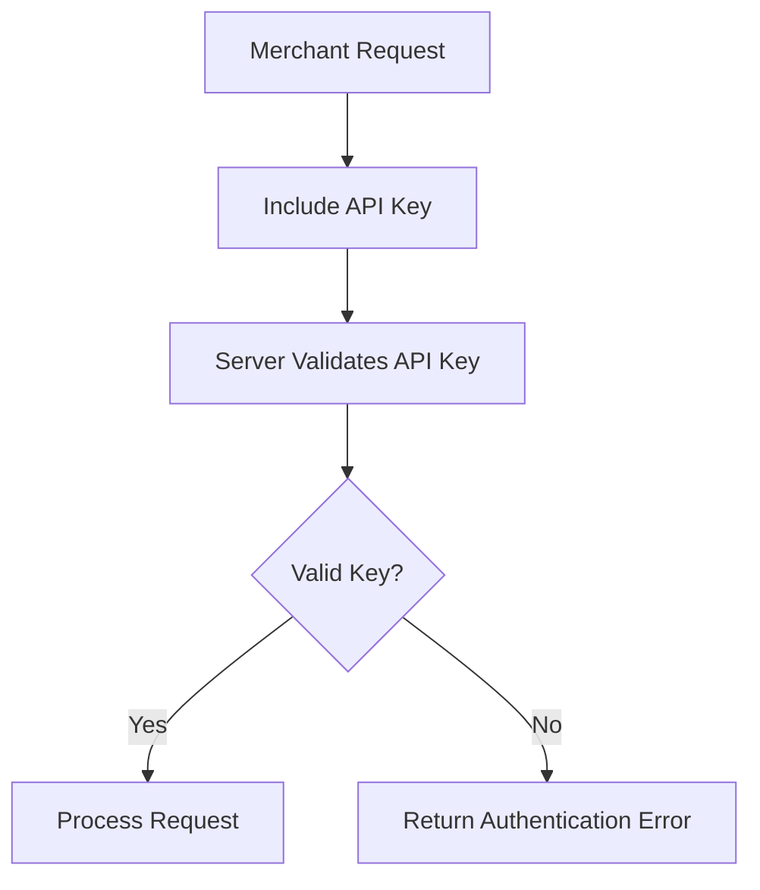
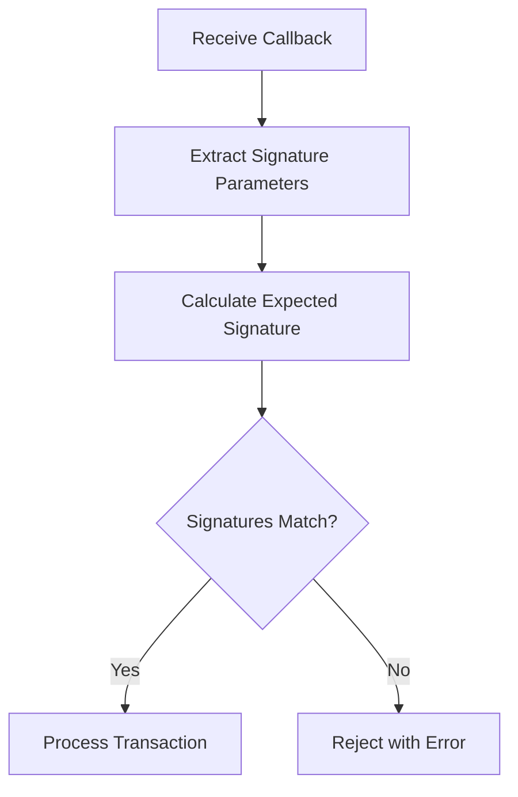
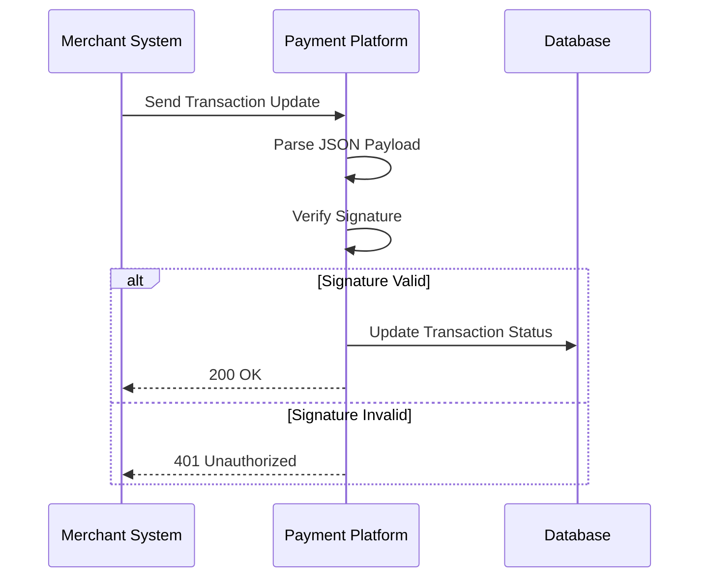
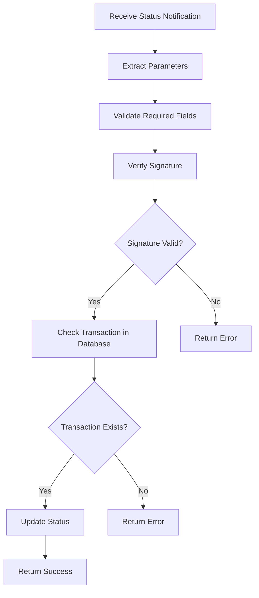
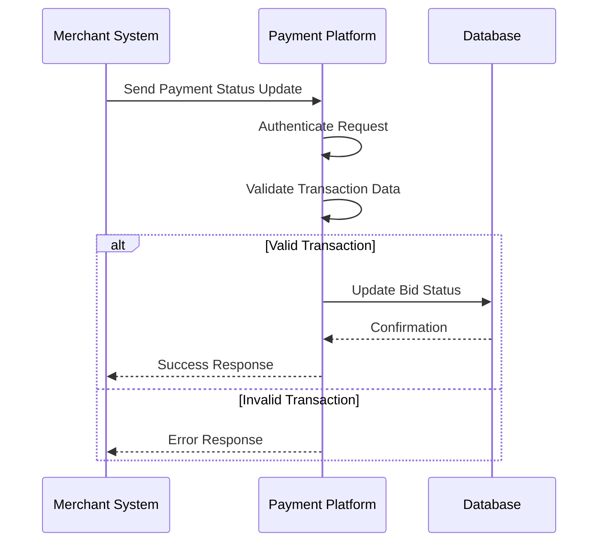
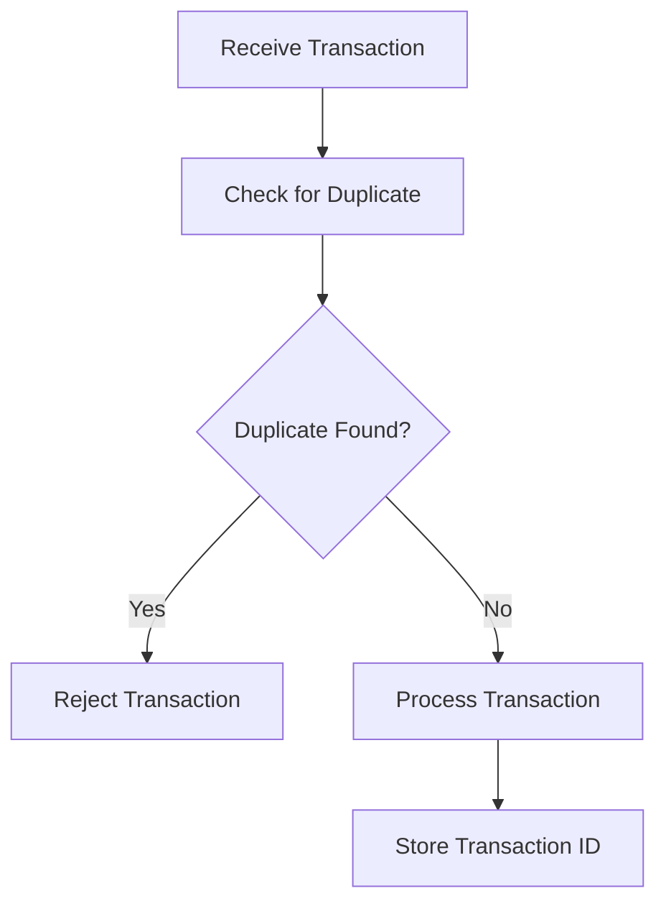
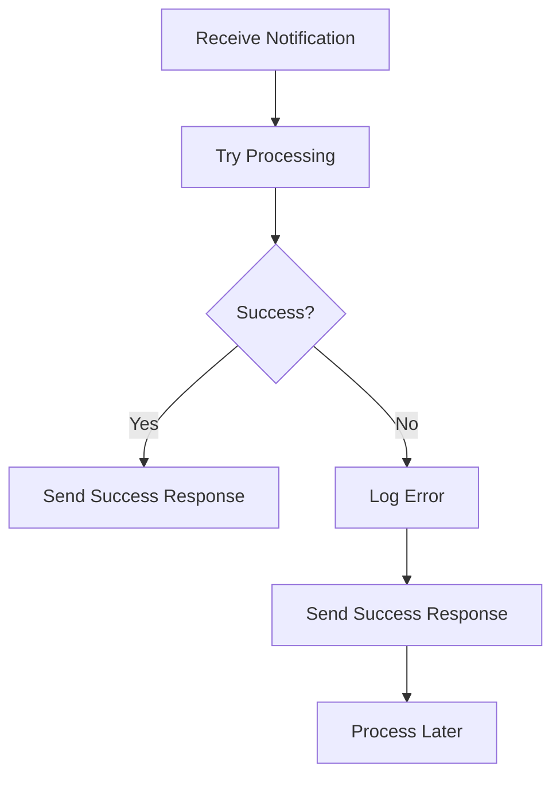

# Merchant API

<cite>
**Referenced Files in This Document**   
- [perfectmoney/index.php](file://wp-content/plugins/premiumbox/merchants/perfectmoney/index.php)
- [pspware/class.php](file://wp-content/plugins/premiumbox/merchants/pspware/class.php)
- [supermoney/class.php](file://wp-content/plugins/premiumbox/merchants/supermoney/class.php)
- [optimoney/class.php](file://wp-content/plugins/premiumbox/merchants/optimoney/class.php)
- [aipay/index.php](file://wp-content/plugins/premiumbox/paymerchants/aipay/index.php)
- [paycrown/index.php](file://wp-content/plugins/premiumbox/merchants/paycrown/index.php)
- [trustixpay/index.php](file://wp-content/plugins/premiumbox/merchants/trustixpay/index.php)
- [bankoro/index.php](file://wp-content/plugins/premiumbox/merchants/bankoro/index.php)
- [coinbase/index.php](file://wp-content/plugins/premiumbox/merchants/coinbase/index.php)
</cite>

## Table of Contents
1. [Introduction](#introduction)
2. [Authentication Mechanisms](#authentication-mechanisms)
3. [Callback Notification Endpoints](#callback-notification-endpoints)
4. [Transaction Status Verification](#transaction-status-verification)
5. [Payment Status Updates](#payment-status-updates)
6. [Security Considerations](#security-considerations)
7. [Implementation Guidelines](#implementation-guidelines)
8. [Error Handling](#error-handling)
9. [Examples](#examples)

## Introduction
The Merchant Integration API provides a comprehensive interface for merchants to securely communicate with the payment platform. This documentation details the available endpoints for transaction verification, payment status updates, and callback notifications. The API supports multiple authentication mechanisms including API keys, HMAC signatures, and custom signature verification methods to ensure secure merchant communication.

The system supports both merchant-initiated payments (outgoing) and merchant payment reception (incoming) through various payment systems. Each merchant integration follows a consistent pattern of webhook callbacks, status verification, and secure authentication.

**Section sources**
- [perfectmoney/index.php](file://wp-content/plugins/premiumbox/merchants/perfectmoney/index.php#L1-L362)
- [pspware/class.php](file://wp-content/plugins/premiumbox/merchants/pspware/class.php#L1-L166)

## Authentication Mechanisms

### API Key Authentication
Several merchant integrations use API key-based authentication for secure communication. The API key is typically included in the request headers or as a parameter in the request.



**Diagram sources**
- [pspware/class.php](file://wp-content/plugins/premiumbox/merchants/pspware/class.php#L34-L35)
- [optimoney/class.php](file://wp-content/plugins/premiumbox/merchants/optimoney/class.php#L48-L52)

### HMAC Signature Verification
Many merchant integrations implement HMAC signature verification to ensure the authenticity and integrity of callback notifications. The signature is typically generated using a shared secret and specific request parameters.

For Perfect Money integration:
- Signature algorithm: MD5 hash of concatenated parameters
- Parameters included: PAYMENT_ID, PAYEE_ACCOUNT, PAYMENT_AMOUNT, PAYMENT_UNITS, PAYMENT_BATCH_NUM, PAYER_ACCOUNT, PM_ALTERNATE_PHRASE, TIMESTAMPGMT
- Signature verification: Compare received V2_HASH with calculated hash



**Diagram sources**
- [perfectmoney/index.php](file://wp-content/plugins/premiumbox/merchants/perfectmoney/index.php#L229-L231)
- [coinbase/index.php](file://wp-content/plugins/premiumbox/merchants/coinbase/index.php#L127-L145)

### Custom Signature Methods
Some merchants implement custom signature methods using SHA-256 or other cryptographic algorithms. These typically involve:
- Concatenating specific parameters in a defined order
- Applying a hashing algorithm with a merchant-specific secret
- Comparing the calculated signature with the received signature

**Section sources**
- [perfectmoney/index.php](file://wp-content/plugins/premiumbox/merchants/perfectmoney/index.php#L229-L231)
- [coinbase/index.php](file://wp-content/plugins/premiumbox/merchants/coinbase/index.php#L127-L145)
- [pspware/class.php](file://wp-content/plugins/premiumbox/merchants/pspware/class.php#L41-L42)

## Callback Notification Endpoints

### Webhook URL Structure
Merchant callback endpoints follow a consistent URL pattern:
```
https://yourdomain.com/premium_merchant_{merchant_id}_webhook{hash}
```

The webhook endpoint processes JSON payloads containing transaction information and verifies the authenticity of the notification before processing.



**Diagram sources**
- [aipay/index.php](file://wp-content/plugins/premiumbox/paymerchants/aipay/index.php#L253-L277)
- [paycrown/index.php](file://wp-content/plugins/premiumbox/merchants/paycrown/index.php#L290-L315)

### Payload Structure
The callback payload structure varies by merchant but typically includes:
- **Transaction ID**: Unique identifier for the transaction
- **Transaction Status**: Current status of the transaction
- **Payment Amount**: Amount of the transaction
- **Currency Information**: Currency code for the transaction
- **Additional Metadata**: Merchant-specific information

Common payload fields across different merchants:
- `id` or `doc_id`: Transaction identifier
- `status`: Transaction status (SUCCESS, FAILED, PENDING)
- `amount` or `transactionAmount`: Payment amount
- `currency`: Currency code
- `external_id`: External transaction reference

**Section sources**
- [aipay/index.php](file://wp-content/plugins/premiumbox/paymerchants/aipay/index.php#L267-L269)
- [paycrown/index.php](file://wp-content/plugins/premiumbox/merchants/paycrown/index.php#L298-L300)
- [bankoro/index.php](file://wp-content/plugins/premiumbox/merchants/bankoro/index.php#L257-L259)

## Transaction Status Verification

### Status Endpoint
Merchants can verify transaction status through dedicated status endpoints that follow the pattern:
```
https://yourdomain.com/premium_merchant_{merchant_id}_status{hash}
```

The endpoint processes POST requests with transaction details and validates them against the system records.

### Verification Process
1. Extract transaction parameters from the request
2. Validate required fields are present
3. Verify signature using merchant-specific algorithm
4. Check transaction against system records
5. Update transaction status if valid



**Diagram sources**
- [perfectmoney/index.php](file://wp-content/plugins/premiumbox/merchants/perfectmoney/index.php#L207-L358)
- [advcash/index.php](file://wp-content/plugins/premiumbox/merchants/advcash/index.php#L125-L172)

### Required Parameters
The status verification endpoint typically requires the following parameters:
- **PAYMENT_ID**: Transaction identifier
- **PAYMENT_AMOUNT**: Amount of the transaction
- **PAYMENT_UNITS**: Currency code
- **PAYEE_ACCOUNT**: Merchant's receiving account
- **PAYER_ACCOUNT**: Payer's account
- **TIMESTAMPGMT**: Transaction timestamp
- **V2_HASH**: Signature for verification

**Section sources**
- [perfectmoney/index.php](file://wp-content/plugins/premiumbox/merchants/perfectmoney/index.php#L215-L222)

## Payment Status Updates

### Status Update Flow
The payment status update process follows a standardized flow across different merchant integrations:



**Diagram sources**
- [aipay/index.php](file://wp-content/plugins/premiumbox/paymerchants/aipay/index.php#L224-L244)
- [paycrown/index.php](file://wp-content/plugins/premiumbox/merchants/paycrown/index.php#L290-L315)

### Status Update Parameters
When updating payment status, the following parameters are typically processed:
- **out_sum**: Actual amount received
- **trans_out**: Transaction identifier
- **txid_out**: Transaction hash or reference ID
- **m_place**: Merchant placement identifier
- **system**: System identifier (user or system)
- **m_id**: Merchant ID
- **m_defin**: Merchant configuration data
- **m_data**: Merchant operational data

These parameters are used to update the transaction status in the database and trigger any necessary follow-up actions.

**Section sources**
- [aipay/index.php](file://wp-content/plugins/premiumbox/paymerchants/aipay/index.php#L234-L242)
- [quixfer/index.php](file://wp-content/plugins/premiumbox/paymerchants/quixfer/index.php#L412-L441)

## Security Considerations

### Signature Verification
All merchant integrations implement signature verification to prevent unauthorized access and ensure data integrity. The verification process includes:
- Validating the presence of all required fields
- Calculating the expected signature using the merchant's secret key
- Comparing the calculated signature with the received signature
- Rejecting requests with invalid signatures

### Replay Attack Protection
The system includes mechanisms to prevent replay attacks:
- Unique transaction identifiers for each transaction
- Timestamp validation in signature calculation
- Prevention of duplicate transaction processing through database checks



**Diagram sources**
- [perfectmoney/index.php](file://wp-content/plugins/premiumbox/merchants/perfectmoney/index.php#L274-L276)
- [advcash/index.php](file://wp-content/plugins/premiumbox/merchants/advcash/index.php#L155-L158)

### Secure Storage of Credentials
Merchant API credentials should be stored securely using the following practices:
- Never store credentials in plaintext
- Use environment variables or secure configuration files
- Implement access controls to limit who can view or modify credentials
- Regularly rotate API keys and secrets

**Section sources**
- [pspware/class.php](file://wp-content/plugins/premiumbox/merchants/pspware/class.php#L34-L35)
- [optimoney/class.php](file://wp-content/plugins/premiumbox/merchants/optimoney/class.php#L48-L52)

## Implementation Guidelines

### Handling Asynchronous Notifications
Merchants should implement the following best practices for handling asynchronous notifications:

1. **Implement Idempotency**: Ensure that processing the same notification multiple times doesn't create duplicate transactions
2. **Use Acknowledgment**: Immediately acknowledge receipt of notifications to prevent retries
3. **Implement Retry Logic**: Handle cases where the initial notification fails
4. **Log All Transactions**: Maintain detailed logs of all received notifications

### Error Recovery
For robust error recovery, merchants should:
- Implement proper exception handling around notification processing
- Use database transactions to ensure data consistency
- Implement monitoring to detect failed notifications
- Set up alerts for critical errors



**Diagram sources**
- [aipay/index.php](file://wp-content/plugins/premiumbox/paymerchants/aipay/index.php#L274-L277)
- [paycrown/index.php](file://wp-content/plugins/premiumbox/merchants/paycrown/index.php#L310-L315)

## Error Handling

### Standard Error Responses
The API returns standardized error responses for invalid requests:
- **Invalid currency of payment**: When the payment currency is not supported
- **Invalid control signature**: When the signature verification fails
- **Wrong pay**: When the transaction details don't match records
- **Error check trans in!**: When transaction validation fails
- **The application does not exist or the wrong ID**: When the transaction ID is invalid

### Error Response Format
Error responses are typically returned as plain text messages:
```
Invalid currency of payment
```
```
Invalid control signature
```
```
Wrong pay
```

The merchant system should log these errors and potentially alert administrators for investigation.

**Section sources**
- [perfectmoney/index.php](file://wp-content/plugins/premiumbox/merchants/perfectmoney/index.php#L225-L226)
- [advcash/index.php](file://wp-content/plugins/premiumbox/merchants/advcash/index.php#L150-L151)

## Examples

### Example: Perfect Money Callback
**Request:**
```http
POST /premium_merchant_pm123_statusabc123 HTTP/1.1
Content-Type: application/x-www-form-urlencoded

PAYEE_ACCOUNT=U12345678
&PAYMENT_ID=12345
&PAYMENT_AMOUNT=100.00
&PAYMENT_UNITS=USD
&PAYMENT_BATCH_NUM=987654321
&PAYER_ACCOUNT=U87654321
&TIMESTAMPGMT=20231201000000
&V2_HASH=A1B2C3D4E5F6G7H8
```

**Response:**
```
Completed
```

### Example: AI-pay Webhook
**Request:**
```http
POST /premium_merchant_ap123_webhookxyz789 HTTP/1.1
Content-Type: application/json

{
  "doc_id": "txn_12345",
  "status": "ORDER_SUCCESS",
  "transactionAmount": 100.00
}
```

**Response:**
```json
{"success":true}
```

### Example: Transaction Status Update
**Request:**
```http
POST /premium_merchant_pc123_statusdef456 HTTP/1.1
Content-Type: application/json

{
  "id": "txn_67890",
  "status": "success",
  "amount": 250.00,
  "currency": "EUR"
}
```

**Response:**
```
Completed
```

**Section sources**
- [perfectmoney/index.php](file://wp-content/plugins/premiumbox/merchants/perfectmoney/index.php#L215-L232)
- [aipay/index.php](file://wp-content/plugins/premiumbox/paymerchants/aipay/index.php#L267-L277)
- [paycrown/index.php](file://wp-content/plugins/premiumbox/merchants/paycrown/index.php#L298-L315)