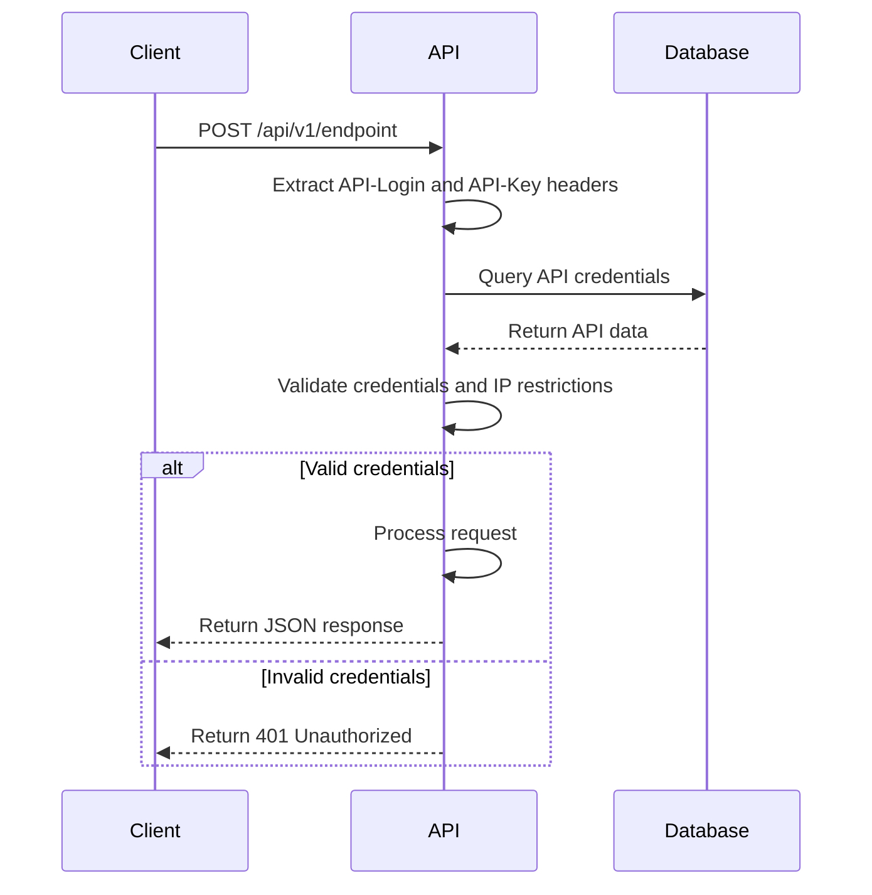
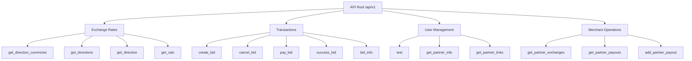
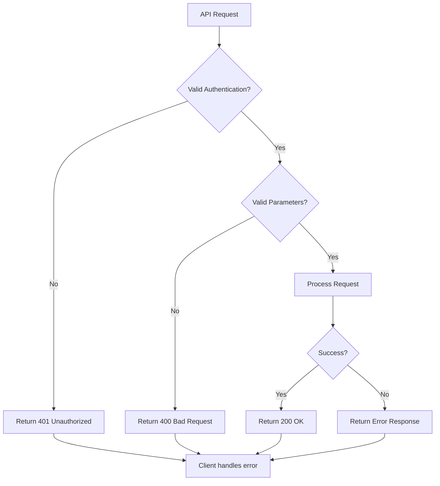

# REST API

<cite>
**Referenced Files in This Document**   
- [api.php](file://wp-content/plugins/premiumbox/moduls/api/api.php)
- [methods.php](file://wp-content/plugins/premiumbox/moduls/api/methods.php)
- [add.php](file://wp-content/plugins/premiumbox/moduls/api/add.php)
- [list.php](file://wp-content/plugins/premiumbox/moduls/api/list.php)
- [user_api.php](file://wp-content/plugins/premiumbox/moduls/api/user_api.php)
- [list_logs.php](file://wp-content/plugins/premiumbox/moduls/api/list_logs.php)
- [list_callbacks.php](file://wp-content/plugins/premiumbox/moduls/api/list_callbacks.php)
- [class-plugin.php](file://wp-content/plugins/premiumbox/includes/class-plugin.php)
- [premiumbox.php](file://wp-content/plugins/premiumbox/premiumbox.php)
- [class-wp-rest-server.php](file://wp-includes/rest-api/class-wp-rest-server.php)
- [user.php](file://wp-includes/user.php)
</cite>

## Table of Contents
1. [Introduction](#introduction)
2. [Authentication](#authentication)
3. [API Endpoints](#api-endpoints)
4. [Exchange Rates](#exchange-rates)
5. [Transactions](#transactions)
6. [User Management](#user-management)
7. [Merchant Operations](#merchant-operations)
8. [Rate Limiting and Versioning](#rate-limiting-and-versioning)
9. [Error Handling](#error-handling)
10. [Security Considerations](#security-considerations)
11. [Client Implementation Guidelines](#client-implementation-guidelines)
12. [Performance Optimization](#performance-optimization)
13. [Migration and Backwards Compatibility](#migration-and-backwards-compatibility)

## Introduction

The Premium Exchanger platform provides a comprehensive REST API for programmatic access to exchange rate information, transaction processing, user management, and merchant operations. The API enables developers to integrate exchange functionality into their applications, automate transactions, and manage user accounts programmatically.

The API follows RESTful principles with predictable resource-oriented URLs, proper HTTP response codes, and JSON-formatted responses. It is designed to be intuitive and developer-friendly, with clear documentation for all endpoints and their parameters.

**Section sources**
- [premiumbox.php](file://wp-content/plugins/premiumbox/premiumbox.php#L1-L41)
- [class-plugin.php](file://wp-content/plugins/premiumbox/includes/class-plugin.php#L1-L62)

## Authentication

The Premium Exchanger API uses a custom API key-based authentication system that integrates with WordPress user management. Authentication is performed using two custom HTTP headers: `API-Login` and `API-Key`.

### Authentication Process

1. **API Credentials**: Each API user must generate an API key pair (API Login and API Key) through the user dashboard or admin interface.
2. **Header-Based Authentication**: Clients must include the following headers in all API requests:
   - `API-Login`: The API login identifier
   - `API-Key`: The secret API key
   - `API-Lang`: Optional language code for localized responses

3. **IP Restriction**: API keys can be restricted to specific IP addresses or ranges for enhanced security.

### Authentication Flow



**Diagram sources**
- [api.php](file://wp-content/plugins/premiumbox/moduls/api/api.php#L18-L20)
- [add.php](file://wp-content/plugins/premiumbox/moduls/api/add.php#L78-L92)

**Section sources**
- [api.php](file://wp-content/plugins/premiumbox/moduls/api/api.php#L18-L60)
- [user_api.php](file://wp-content/plugins/premiumbox/moduls/api/user_api.php#L21-L30)
- [class-wp-rest-server.php](file://wp-includes/rest-api/class-wp-rest-server.php#L164-L198)
- [user.php](file://wp-includes/user.php#L354-L398)

## API Endpoints

The Premium Exchanger API exposes a comprehensive set of endpoints for various operations. All endpoints follow the pattern `/api/v1/{endpoint}` and use the HTTP POST method.

### Endpoint Structure



**Diagram sources**
- [methods.php](file://wp-content/plugins/premiumbox/moduls/api/methods.php#L8-L23)

**Section sources**
- [methods.php](file://wp-content/plugins/premiumbox/moduls/api/methods.php#L8-L23)
- [api.php](file://wp-content/plugins/premiumbox/moduls/api/api.php#L8-L94)

## Exchange Rates

The exchange rate endpoints provide access to current exchange rates, available currency pairs, and direction information.

### get_direction_currencies

Retrieves the list of available currencies for exchange.

**HTTP Method**: POST
**URL**: `/api/v1/get_direction_currencies`

**Request Parameters**:
- `currency_id_give` (integer, optional): Filter by giving currency ID
- `currency_id_get` (integer, optional): Filter by receiving currency ID

**Response Schema**:
```json
{
  "error": 0,
  "error_text": "",
  "data": {
    "give": [
      {
        "id": 1,
        "title": "USD",
        "logo": "https://example.com/logo/usd.png"
      }
    ],
    "get": [
      {
        "id": 2,
        "title": "EUR",
        "logo": "https://example.com/logo/eur.png"
      }
    ]
  }
}
```

### get_directions

Retrieves available exchange directions with detailed information.

**HTTP Method**: POST
**URL**: `/api/v1/get_directions`

**Request Parameters**:
- `currency_id_give` (integer, optional): Filter by giving currency ID
- `currency_id_get` (integer, optional): Filter by receiving currency ID

**Response Schema**:
```json
{
  "error": 0,
  "error_text": "",
  "data": [
    {
      "direction_id": 1,
      "currency_give_id": 1,
      "currency_give_title": "USD",
      "currency_give_logo": "https://example.com/logo/usd.png",
      "currency_get_id": 2,
      "currency_get_title": "EUR",
      "currency_get_logo": "https://example.com/logo/eur.png"
    }
  ]
}
```

### get_direction

Retrieves detailed information about a specific exchange direction.

**HTTP Method**: POST
**URL**: `/api/v1/get_direction`

**Request Parameters**:
- `direction_id` (integer, optional): Specific direction ID
- `currency_id_give` (integer, optional): Giving currency ID
- `currency_id_get` (integer, optional): Receiving currency ID

**Response Schema**:
```json
{
  "error": 0,
  "error_text": "",
  "data": {
    "id": 1,
    "url": "https://example.com/exchange/usd-eur",
    "currency_code_give": "USD",
    "currency_code_get": "EUR",
    "reserve": 1000,
    "course_give": 1.1,
    "course_get": 0.9,
    "sum_give": 100,
    "sum_give_com": 102,
    "sum_get": 90,
    "sum_get_com": 88,
    "com_give": "2.00",
    "com_get": "2.00",
    "min_give": 10,
    "max_give": 10000,
    "min_get": 9,
    "max_get": 9000,
    "give_fields": [],
    "get_fields": [],
    "dir_fields": [],
    "info": {
      "timeline_text": "Processing time: 5-15 minutes",
      "frozen_text": "Direction temporarily frozen",
      "before_button_text": "Please read instructions before exchange"
    }
  }
}
```

### get_calc

Calculates exchange amounts based on direction and amount.

**HTTP Method**: POST
**URL**: `/api/v1/get_calc`

**Request Parameters**:
- `direction_id` (integer): Direction ID
- `calc_amount` (float): Amount to exchange
- `calc_action` (integer): 1 for give amount, 2 for get amount
- `cd` (string, URL-encoded): Additional calculation data

**Response Schema**:
```json
{
  "error": 0,
  "error_text": "",
  "data": {
    "currency_code_give": "USD",
    "currency_code_get": "EUR",
    "reserve": 1000,
    "course_give": 1.1,
    "course_get": 0.9,
    "sum_give": 100,
    "sum_give_com": 102,
    "sum_get": 90,
    "sum_get_com": 88,
    "com_give": "2.00",
    "com_get": "2.00",
    "min_give": 10,
    "max_give": 10000,
    "min_get": 9,
    "max_get": 9000,
    "changed": true
  }
}
```

**Section sources**
- [methods.php](file://wp-content/plugins/premiumbox/moduls/api/methods.php#L46-L307)
- [methods.php](file://wp-content/plugins/premiumbox/moduls/api/methods.php#L119-L177)
- [methods.php](file://wp-content/plugins/premiumbox/moduls/api/methods.php#L180-L307)
- [methods.php](file://wp-content/plugins/premiumbox/moduls/api/methods.php#L309-L402)

## Transactions

The transaction endpoints enable programmatic creation, management, and tracking of exchange transactions.

### create_bid

Creates a new exchange transaction (bid).

**HTTP Method**: POST
**URL**: `/api/v1/create_bid`

**Request Parameters**:
- `calc_amount` (float): Amount to exchange
- `calc_action` (integer): 1 for give amount, 2 for get amount
- `callback_url` (string, optional): URL for status callbacks

**Response Schema**:
```json
{
  "error": 0,
  "error_text": "",
  "error_fields": [],
  "data": {
    "url": "https://example.com/bid/abc123",
    "id": 12345,
    "hash": "abc123",
    "status": "new",
    "status_title": "New",
    "psys_give": "PayPal",
    "psys_get": "Skrill",
    "currency_code_give": "USD",
    "currency_code_get": "EUR",
    "amount_give": 100,
    "amount_get": 90,
    "course_give": 1.1,
    "course_get": 0.9,
    "api_actions": {
      "type": "default",
      "cancel": "api",
      "pay": "api",
      "pay_amount": 100,
      "instruction": "Send funds to the specified address"
    }
  }
}
```

### bid_info

Retrieves information about an existing transaction.

**HTTP Method**: POST
**URL**: `/api/v1/bid_info`

**Request Parameters**:
- `id` (integer, optional): Transaction ID
- `hash` (string, optional): Transaction hash

**Response Schema**:
```json
{
  "error": 0,
  "error_text": "",
  "error_fields": [],
  "data": {
    "url": "https://example.com/bid/abc123",
    "id": 12345,
    "hash": "abc123",
    "status": "payed",
    "status_title": "Paid",
    "psys_give": "PayPal",
    "psys_get": "Skrill",
    "currency_code_give": "USD",
    "currency_code_get": "EUR",
    "amount_give": 100,
    "amount_get": 90,
    "course_give": 1.1,
    "course_get": 0.9,
    "api_actions": {
      "type": "finished",
      "cancel": "api",
      "pay": "api",
      "pay_amount": 100,
      "instruction": "Funds have been sent"
    }
  }
}
```

### cancel_bid

Cancels an existing transaction.

**HTTP Method**: POST
**URL**: `/api/v1/cancel_bid`

**Request Parameters**:
- `id` (integer, optional): Transaction ID
- `hash` (string, optional): Transaction hash

**Response Schema**:
```json
{
  "error": 0,
  "error_text": "",
  "data": "cancel"
}
```

### pay_bid

Marks a transaction as paid.

**HTTP Method**: POST
**URL**: `/api/v1/pay_bid`

**Request Parameters**:
- `id` (integer, optional): Transaction ID
- `hash` (string, optional): Transaction hash

**Response Schema**:
```json
{
  "error": 0,
  "error_text": "",
  "data": "payed"
}
```

### success_bid

Marks a transaction as successfully completed.

**HTTP Method**: POST
**URL**: `/api/v1/success_bid`

**Request Parameters**:
- `id` (integer, optional): Transaction ID
- `hash` (string, optional): Transaction hash

**Response Schema**:
```json
{
  "error": 0,
  "error_text": "",
  "data": "success"
}
```

**Section sources**
- [methods.php](file://wp-content/plugins/premiumbox/moduls/api/methods.php#L404-L487)
- [methods.php](file://wp-content/plugins/premiumbox/moduls/api/methods.php#L489-L578)
- [methods.php](file://wp-content/plugins/premiumbox/moduls/api/methods.php#L581-L663)
- [methods.php](file://wp-content/plugins/premiumbox/moduls/api/methods.php#L666-L748)
- [methods.php](file://wp-content/plugins/premiumbox/moduls/api/methods.php#L751-L800)

## User Management

The user management endpoints provide functionality for user authentication testing and partner information retrieval.

### test

Tests API authentication and retrieves basic user information.

**HTTP Method**: POST
**URL**: `/api/v1/test`

**Request Parameters**: None

**Response Schema**:
```json
{
  "error": 0,
  "error_text": "",
  "data": {
    "ip": "192.168.1.1",
    "user_id": 123,
    "locale": "en_US",
    "partner_id": 456
  }
}
```

### get_partner_info

Retrieves information about the partner account.

**HTTP Method**: POST
**URL**: `/api/v1/get_partner_info`

**Request Parameters**: None

**Response Schema**:
```json
{
  "error": 0,
  "error_text": "",
  "data": {}
}
```

### get_partner_links

Retrieves partner referral links.

**HTTP Method**: POST
**URL**: `/api/v1/get_partner_links`

**Request Parameters**: None

**Response Schema**:
```json
{
  "error": 0,
  "error_text": "",
  "data": []
}
```

**Section sources**
- [methods.php](file://wp-content/plugins/premiumbox/moduls/api/methods.php#L27-L43)
- [methods.php](file://wp-content/plugins/premiumbox/moduls/api/methods.php#L28-L43)
- [methods.php](file://wp-content/plugins/premiumbox/moduls/api/methods.php#L18-L19)

## Merchant Operations

The merchant operations endpoints provide functionality for managing partner exchanges and payouts.

### get_partner_exchanges

Retrieves the partner's exchange history.

**HTTP Method**: POST
**URL**: `/api/v1/get_partner_exchanges`

**Request Parameters**: None

**Response Schema**:
```json
{
  "error": 0,
  "error_text": "",
  "data": []
}
```

### get_partner_payouts

Retrieves the partner's payout history.

**HTTP Method**: POST
**URL**: `/api/v1/get_partner_payouts`

**Request Parameters**: None

**Response Schema**:
```json
{
  "error": 0,
  "error_text": "",
  "data": []
}
```

### add_partner_payout

Creates a new partner payout request.

**HTTP Method**: POST
**URL**: `/api/v1/add_partner_payout`

**Request Parameters**: None

**Response Schema**:
```json
{
  "error": 0,
  "error_text": "",
  "data": {}
}
```

**Section sources**
- [methods.php](file://wp-content/plugins/premiumbox/moduls/api/methods.php#L20-L23)

## Rate Limiting and Versioning

### Rate Limiting

The Premium Exchanger API implements rate limiting to prevent abuse and ensure fair usage. The rate limiting policy is as follows:

- **Requests per minute**: 60 requests per minute per API key
- **Burst limit**: 10 requests can be made in quick succession before rate limiting applies
- **Response headers**: Rate limiting information is included in response headers:
  - `X-RateLimit-Limit`: Total number of requests allowed per minute
  - `X-RateLimit-Remaining`: Number of requests remaining in the current minute
  - `X-RateLimit-Reset`: Time when the rate limit will reset (Unix timestamp)

When the rate limit is exceeded, the API returns a 429 Too Many Requests status code with the following response:
```json
{
  "error": 429,
  "error_text": "Rate limit exceeded. Please try again later."
}
```

### Versioning Strategy

The API follows a semantic versioning strategy with the following principles:

- **Version format**: v{major}.{minor} (e.g., v1, v2)
- **URL structure**: All endpoints are prefixed with `/api/{version}/`
- **Backwards compatibility**: Minor version updates (e.g., v1.1) maintain backwards compatibility with previous minor versions
- **Breaking changes**: Major version updates (e.g., v2) may include breaking changes and require code modifications

The current API version is v1. The platform maintains support for previous versions for a minimum of 12 months after a new major version is released.

**Section sources**
- [api.php](file://wp-content/plugins/premiumbox/moduls/api/api.php#L1-L95)
- [methods.php](file://wp-content/plugins/premiumbox/moduls/api/methods.php#L1-L25)

## Error Handling

The API uses standard HTTP status codes and a consistent error response format.

### HTTP Status Codes

| Code | Meaning | Description |
|------|-------|-------------|
| 200 | OK | Request successful |
| 400 | Bad Request | Invalid request parameters |
| 401 | Unauthorized | Authentication failed |
| 403 | Forbidden | Access denied |
| 404 | Not Found | Resource not found |
| 429 | Too Many Requests | Rate limit exceeded |
| 500 | Internal Server Error | Server error |

### Error Response Format

All error responses follow the same format:
```json
{
  "error": {error_code},
  "error_text": "{error_message}",
  "error_fields": []
}
```

### Common Error Codes

| Error Code | Error Text | Description |
|-----------|-----------|-------------|
| 0 | "" | Success (no error) |
| 1 | "Method not supported" | The requested method is not available |
| 2 | "IP blocked" | Request from blocked IP address |
| 3 | "Maintenance" | System under maintenance |
| 4 | "Action disabled" | Requested action is disabled |

### Error Handling Flow



**Diagram sources**
- [api.php](file://wp-content/plugins/premiumbox/moduls/api/api.php#L54-L58)
- [methods.php](file://wp-content/plugins/premiumbox/moduls/api/methods.php#L63-L65)
- [methods.php](file://wp-content/plugins/premiumbox/moduls/api/methods.php#L51-L53)

**Section sources**
- [api.php](file://wp-content/plugins/premiumbox/moduls/api/api.php#L54-L58)
- [methods.php](file://wp-content/plugins/premiumbox/moduls/api/methods.php#L63-L65)
- [methods.php](file://wp-content/plugins/premiumbox/moduls/api/methods.php#L51-L53)
- [class-wp-http.php](file://wp-includes/class-wp-http.php#L62-L101)

## Security Considerations

### Authentication Security

The API implements multiple security measures to protect against unauthorized access:

1. **API Key Security**: API keys are generated using cryptographically secure random functions and stored with hashing.
2. **IP Whitelisting**: API keys can be restricted to specific IP addresses or ranges.
3. **Rate Limiting**: Prevents brute force attacks and denial of service.
4. **HTTPS Enforcement**: All API endpoints require HTTPS connections.

### Data Validation

All input data is validated and sanitized to prevent common web vulnerabilities:

- **Input sanitization**: All parameters are sanitized using WordPress sanitization functions
- **SQL injection prevention**: Prepared statements are used for all database queries
- **XSS protection**: Output is properly escaped to prevent cross-site scripting

### Security Headers

The API includes security headers in all responses:
- `Content-Security-Policy`: Restricts content sources
- `X-Content-Type-Options`: Prevents MIME type sniffing
- `X-Frame-Options`: Prevents clickjacking
- `Strict-Transport-Security`: Enforces HTTPS

### Security Best Practices

Developers should follow these security best practices when using the API:

1. **Store API keys securely**: Never expose API keys in client-side code or public repositories
2. **Use HTTPS**: Always use HTTPS when making API requests
3. **Implement proper error handling**: Don't expose sensitive information in error messages
4. **Validate responses**: Always validate API responses before processing

**Section sources**
- [api.php](file://wp-content/plugins/premiumbox/moduls/api/api.php#L18-L20)
- [add.php](file://wp-content/plugins/premiumbox/moduls/api/add.php#L164-L165)
- [user_api.php](file://wp-content/plugins/premiumbox/moduls/api/user_api.php#L21-L30)
- [kses.php](file://wp-includes/kses.php#L1677-L1730)

## Client Implementation Guidelines

### General Guidelines

When implementing clients for the Premium Exchanger API, follow these guidelines:

1. **Use modern HTTP libraries**: Use well-maintained HTTP client libraries for your programming language
2. **Handle errors gracefully**: Implement proper error handling and retry logic
3. **Cache responses**: Cache responses when appropriate to reduce API calls
4. **Respect rate limits**: Monitor rate limit headers and adjust request frequency accordingly

### Language-Specific Examples

#### JavaScript (Node.js)
```javascript
const axios = require('axios');

async function getExchangeRates() {
  try {
    const response = await axios.post(
      'https://your-exchanger.com/api/v1/get_directions',
      {},
      {
        headers: {
          'API-Login': 'your_api_login',
          'API-Key': 'your_api_key',
          'Content-Type': 'application/json'
        }
      }
    );
    return response.data;
  } catch (error) {
    console.error('API Error:', error.response?.data || error.message);
    throw error;
  }
}
```

#### Python
```python
import requests
import json

def get_exchange_rates():
    url = "https://your-exchanger.com/api/v1/get_directions"
    headers = {
        "API-Login": "your_api_login",
        "API-Key": "your_api_key",
        "Content-Type": "application/json"
    }
    
    try:
        response = requests.post(url, headers=headers, json={})
        response.raise_for_status()
        return response.json()
    except requests.exceptions.RequestException as e:
        print(f"API Error: {e}")
        raise
```

#### PHP
```php
function getExchangeRates() {
    $url = "https://your-exchanger.com/api/v1/get_directions";
    $headers = [
        "API-Login: your_api_login",
        "API-Key: your_api_key",
        "Content-Type: application/json"
    ];
    
    $ch = curl_init();
    curl_setopt($ch, CURLOPT_URL, $url);
    curl_setopt($ch, CURLOPT_POST, true);
    curl_setopt($ch, CURLOPT_HTTPHEADER, $headers);
    curl_setopt($ch, CURLOPT_RETURNTRANSFER, true);
    curl_setopt($ch, CURLOPT_SSL_VERIFYPEER, true);
    
    $response = curl_exec($ch);
    $httpCode = curl_getinfo($ch, CURLINFO_HTTP_CODE);
    curl_close($ch);
    
    if ($httpCode >= 200 && $httpCode < 300) {
        return json_decode($response, true);
    } else {
        throw new Exception("API Error: HTTP {$httpCode}");
    }
}
```

**Section sources**
- [api.php](file://wp-content/plugins/premiumbox/moduls/api/api.php#L18-L20)
- [methods.php](file://wp-content/plugins/premiumbox/moduls/api/methods.php#L8-L23)

## Performance Optimization

### Efficient API Usage

To optimize API performance and minimize response times:

1. **Batch requests**: When possible, retrieve multiple pieces of information in a single request
2. **Cache responses**: Cache responses for a reasonable period (e.g., 5-15 minutes for exchange rates)
3. **Use appropriate endpoints**: Use specific endpoints rather than retrieving all data and filtering client-side
4. **Minimize request frequency**: Only make requests when necessary

### Response Optimization

The API is optimized for performance with the following features:

- **Database indexing**: Critical database tables are properly indexed for fast queries
- **Caching layer**: Frequently accessed data is cached to reduce database load
- **Connection pooling**: Database connections are reused to minimize connection overhead
- **Gzip compression**: Responses are compressed to reduce bandwidth usage

### Performance Monitoring

The platform includes performance monitoring with:
- **Response time tracking**: Average response times are monitored
- **Error rate monitoring**: API error rates are tracked
- **Usage analytics**: API usage patterns are analyzed to identify optimization opportunities

**Section sources**
- [api.php](file://wp-content/plugins/premiumbox/moduls/api/api.php#L26-L38)
- [list_logs.php](file://wp-content/plugins/premiumbox/moduls/api/list_logs.php#L76-L81)

## Migration and Backwards Compatibility

### Deprecation Policy

The platform follows a clear deprecation policy:

1. **Announcement**: Deprecated endpoints are announced at least 3 months in advance
2. **Maintenance**: Deprecated endpoints continue to function during the deprecation period
3. **Removal**: After the deprecation period, endpoints are removed

### Migration Guide

When migrating from older versions:

1. **Check version compatibility**: Verify your application is compatible with the current API version
2. **Update endpoints**: Replace deprecated endpoints with their recommended alternatives
3. **Test thoroughly**: Test all functionality in a staging environment before deploying to production
4. **Monitor logs**: Monitor API logs for any issues after migration

### Backwards Compatibility

The platform maintains backwards compatibility with the following guarantees:

- **Minor version updates**: No breaking changes in minor version updates
- **Data format stability**: Response data formats remain stable within a major version
- **Endpoint stability**: Existing endpoints are not removed without proper deprecation period

**Section sources**
- [methods.php](file://wp-content/plugins/premiumbox/moduls/api/methods.php#L1-L25)
- [api.php](file://wp-content/plugins/premiumbox/moduls/api/api.php#L1-L95)