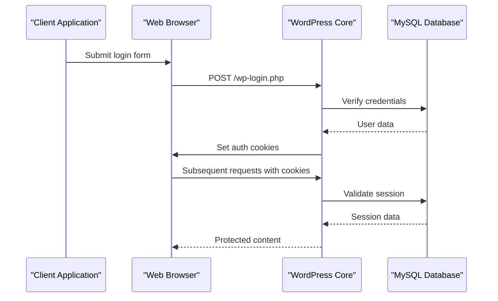
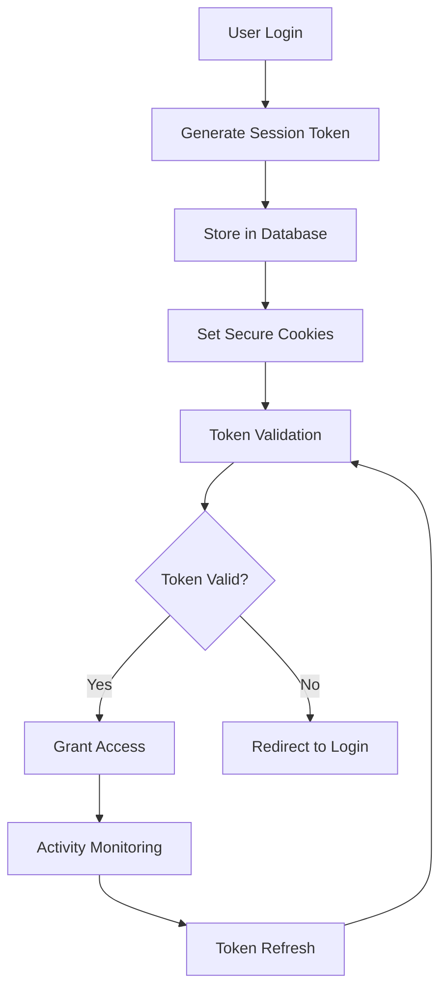
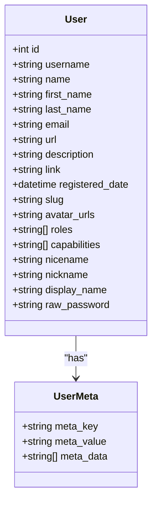
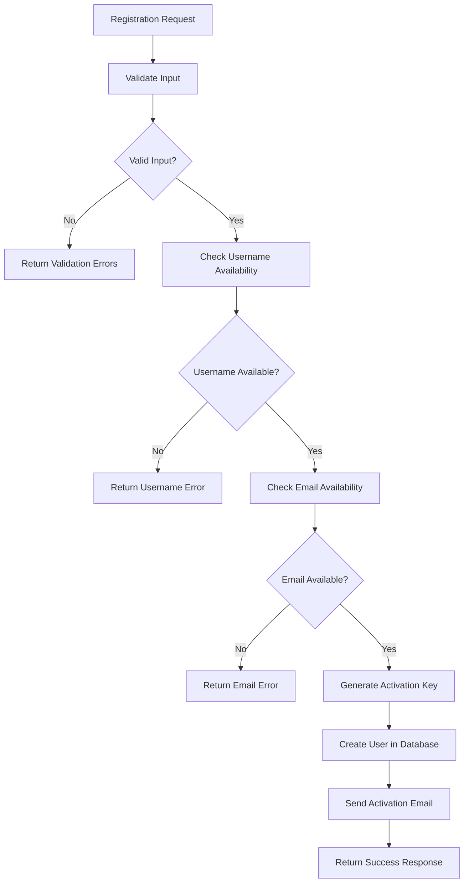
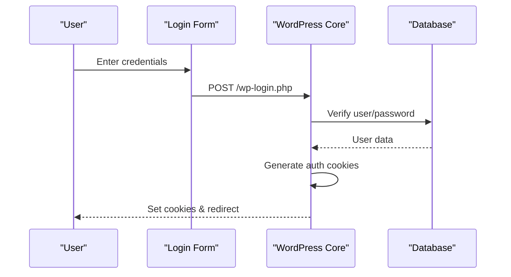
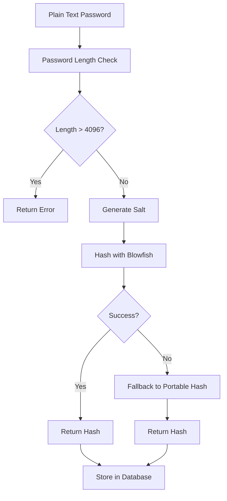
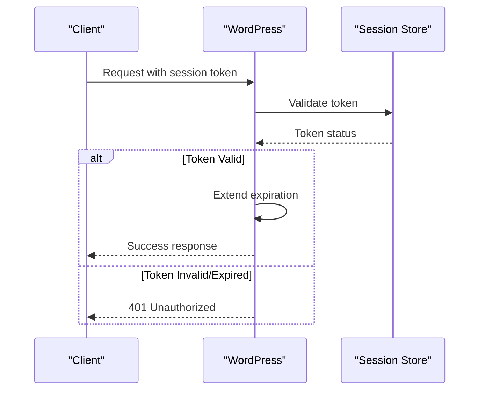
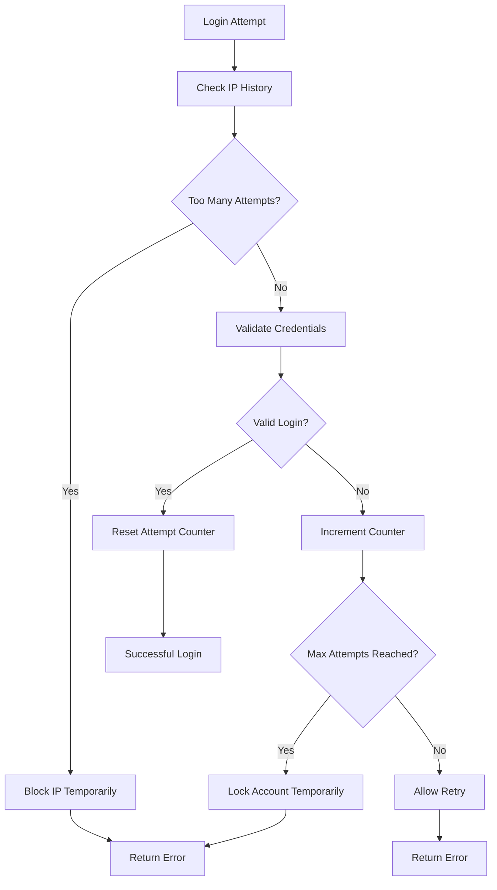

# User API

<cite>
**Referenced Files in This Document**
- [wp-includes/user.php](file://wp-includes/user.php)
- [wp-includes/rest-api/endpoints/class-wp-rest-users-controller.php](file://wp-includes/rest-api/endpoints/class-wp-rest-users-controller.php)
- [wp-includes/pluggable.php](file://wp-includes/pluggable.php)
- [wp-includes/rest-api.php](file://wp-includes/rest-api.php)
- [wp-login.php](file://wp-login.php)
- [wp-signup.php](file://wp-signup.php)
- [wp-includes/ms-functions.php](file://wp-includes/ms-functions.php)
- [wp-includes/capabilities.php](file://wp-includes/capabilities.php)
- [wp-content/plugins/premiumbox/moduls/api/user_settings.php](file://wp-content/plugins/premiumbox/moduls/api/user_settings.php)
- [wp-content/plugins/premiumbox/default/users/uf_settings.php](file://wp-content/plugins/premiumbox/default/users/uf_settings.php)
</cite>

## Table of Contents
1. [Introduction](#introduction)
2. [Authentication Mechanisms](#authentication-mechanisms)
3. [REST API Endpoints](#rest-api-endpoints)
4. [User Registration](#user-registration)
5. [User Authentication](#user-authentication)
6. [User Profile Management](#user-profile-management)
7. [Security Considerations](#security-considerations)
8. [Error Handling](#error-handling)
9. [Best Practices](#best-practices)
10. [Implementation Guidelines](#implementation-guidelines)

## Introduction

The WordPress User API provides comprehensive endpoints for managing user accounts, authentication, and profile data. This documentation covers all available operations including user registration, authentication, profile retrieval, and account status checks. The API supports multiple authentication mechanisms including traditional cookie-based authentication and modern REST API approaches.

The User API is built around WordPress's core user management system and provides both traditional PHP functions and REST API endpoints for seamless integration with modern web applications.

## Authentication Mechanisms

WordPress supports multiple authentication mechanisms to accommodate different use cases and security requirements.

### Traditional Cookie-Based Authentication

The primary authentication mechanism uses WordPress cookies for session management:



**Diagram sources**
- [wp-login.php](file://wp-login.php#L1-L200)
- [wp-includes/pluggable.php](file://wp-includes/pluggable.php#L952-L1069)

### REST API Authentication

The REST API supports multiple authentication methods:

| Method | Description | Use Case |
|--------|-------------|----------|
| **Cookie Authentication** | Uses WordPress session cookies | Web applications with existing WordPress integration |
| **Application Passwords** | OAuth-like passwords for API access | Mobile apps, external integrations |
| **Basic Authentication** | HTTP Basic Auth with username/password | Legacy systems, automated scripts |
| **JWT Tokens** | JSON Web Tokens for stateless authentication | Modern APIs, microservices |

### Session Management

WordPress implements sophisticated session management with token-based authentication:



**Diagram sources**
- [wp-includes/user.php](file://wp-includes/user.php#L3591-L3649)
- [wp-includes/class-wp-session-tokens.php](file://wp-includes/class-wp-session-tokens.php#L62-L100)

**Section sources**
- [wp-includes/user.php](file://wp-includes/user.php#L307-L358)
- [wp-includes/pluggable.php](file://wp-includes/pluggable.php#L850-L997)

## REST API Endpoints

The WordPress REST API provides comprehensive user management endpoints under the `/wp/v2/users` namespace.

### Endpoint Overview

| HTTP Method | Endpoint | Description | Authentication |
|-------------|----------|-------------|----------------|
| `GET` | `/wp/v2/users` | Retrieve all users | Administrator |
| `POST` | `/wp/v2/users` | Create new user | Administrator |
| `GET` | `/wp/v2/users/me` | Get current user | Authenticated |
| `GET` | `/wp/v2/users/{id}` | Get specific user | View permission |
| `PUT/PATCH` | `/wp/v2/users/{id}` | Update user | Edit permission |
| `DELETE` | `/wp/v2/users/{id}` | Delete user | Delete permission |

### User Schema

The user resource follows this JSON schema:



**Diagram sources**
- [wp-includes/rest-api/endpoints/class-wp-rest-users-controller.php](file://wp-includes/rest-api/endpoints/class-wp-rest-users-controller.php#L1392-L1432)

### Collection Parameters

The user collection supports various query parameters:

| Parameter | Type | Description |
|-----------|------|-------------|
| `context` | string | Context for the response (`view`, `embed`, `edit`) |
| `page` | integer | Page number (default: 1) |
| `per_page` | integer | Items per page (default: 10, max: 100) |
| `search` | string | Search term |
| `exclude` | array | Exclude specific user IDs |
| `include` | array | Include specific user IDs |
| `offset` | integer | Offset for pagination |
| `order` | string | Sort order (`asc`, `desc`) |
| `orderby` | string | Sort field (`id`, `name`, `registered_date`, `email`) |
| `slug` | string | User slug |
| `roles` | array | Filter by roles |
| `who` | string | Special filter (`authors`) |

**Section sources**
- [wp-includes/rest-api/endpoints/class-wp-rest-users-controller.php](file://wp-includes/rest-api/endpoints/class-wp-rest-users-controller.php#L47-L162)
- [wp-includes/rest-api/endpoints/class-wp-rest-users-controller.php](file://wp-includes/rest-api/endpoints/class-wp-rest-users-controller.php#L253-L297)

## User Registration

### Registration Process

User registration involves multiple steps and validation phases:



**Diagram sources**
- [wp-signup.php](file://wp-signup.php#L640-L676)
- [wp-includes/ms-functions.php](file://wp-includes/ms-functions.php#L1307-L1354)

### Registration Endpoints

#### POST /wp/v2/users (Create User)

**Request Schema:**
```json
{
  "username": "string",
  "email": "string",
  "password": "string",
  "name": "string",
  "first_name": "string",
  "last_name": "string",
  "nickname": "string",
  "slug": "string",
  "description": "string",
  "url": "string",
  "roles": ["string"],
  "locale": "string",
  "rich_editing": "string",
  "syntax_highlighting": "string",
  "comment_shortcuts": "string",
  "admin_color": "string",
  "use_ssl": "boolean",
  "show_admin_bar_front": "boolean"
}
```

**Response Schema:**
```json
{
  "id": 123,
  "username": "john_doe",
  "name": "John Doe",
  "first_name": "John",
  "last_name": "Doe",
  "email": "john@example.com",
  "url": "",
  "description": "",
  "link": "https://example.com/author/john_doe/",
  "slug": "john_doe",
  "roles": ["subscriber"],
  "locale": "",
  "nickname": "john_doe",
  "registered_date": "2024-01-15T10:30:00",
  "capabilities": {},
  "extra_capabilities": {},
  "avatar_urls": {},
  "meta": {},
  "_links": {
    "self": [{"href": "https://example.com/wp/v2/users/123"}],
    "collection": [{"href": "https://example.com/wp/v2/users"}]
  }
}
```

### Registration Validation Rules

| Field | Required | Validation Rules |
|-------|----------|------------------|
| `username` | Yes | Unique, alphanumeric, 60 characters max |
| `email` | Yes | Valid email format, unique |
| `password` | Yes | Minimum 8 characters, strong password policy |
| `name` | No | Display name for the user |
| `first_name` | No | User's first name |
| `last_name` | No | User's last name |

**Section sources**
- [wp-signup.php](file://wp-signup.php#L1-L200)
- [wp-includes/ms-functions.php](file://wp-includes/ms-functions.php#L1307-L1354)

## User Authentication

### Authentication Methods

WordPress supports multiple authentication methods with different security characteristics:

#### 1. Traditional Login Form



**Diagram sources**
- [wp-login.php](file://wp-login.php#L1-L200)
- [wp-includes/user.php](file://wp-includes/user.php#L41-L141)

#### 2. REST API Authentication

For REST API access, authentication can be achieved through:

**Cookie Authentication:**
```bash
curl -X POST \
  -H "Cookie: wordpress_logged_in=..." \
  -H "Content-Type: application/json" \
  https://example.com/wp-json/wp/v2/users/me
```

**Application Passwords:**
```bash
curl -X GET \
  -u "username:app-password" \
  https://example.com/wp-json/wp/v2/users/me
```

### Authentication Functions

WordPress provides several authentication functions:

| Function | Purpose | Security Level |
|----------|---------|----------------|
| `wp_signon()` | Complete login process | High |
| `wp_authenticate_username_password()` | Username/password validation | Medium |
| `wp_authenticate_email_password()` | Email/password validation | Medium |
| `wp_authenticate_cookie()` | Cookie-based authentication | Medium |
| `wp_validate_auth_cookie()` | Validate existing cookie | Low |

**Section sources**
- [wp-includes/user.php](file://wp-includes/user.php#L41-L312)
- [wp-includes/pluggable.php](file://wp-includes/pluggable.php#L850-L1069)

## User Profile Management

### Profile Data Structure

User profiles contain extensive metadata and personal information:

```mermaid
erDiagram
USER {
int ID PK
string user_login
string user_pass
string user_nicename
string user_email
string user_url
datetime user_registered
string user_activation_key
int user_status
string display_name
}
USER_META {
bigint umeta_id PK
bigint user_id FK
string meta_key
longtext meta_value
}
USER_CAPABILITIES {
bigint user_id FK
text meta_value
}
USER_ROLES {
bigint user_id FK
text meta_value
}
USER -> USER_META : "has"
USER -> USER_CAPABILITIES : "has"
USER -> USER_ROLES : "has"
```

**Diagram sources**
- [wp-includes/capabilities.php](file://wp-includes/capabilities.php#L45-L200)

### Profile Update Operations

#### Update Current User (`/wp/v2/users/me`)

**Endpoint:** `PUT/PATCH /wp/v2/users/me`

**Request Body:**
```json
{
  "description": "Updated bio",
  "first_name": "Updated First",
  "last_name": "Updated Last",
  "nickname": "Updated Nick",
  "display_name": "Updated Display",
  "email": "updated@example.com",
  "url": "https://updated.example.com",
  "locale": "en_US",
  "rich_editing": "true",
  "syntax_highlighting": "true",
  "comment_shortcuts": "true",
  "admin_color": "fresh",
  "use_ssl": true,
  "show_admin_bar_front": true
}
```

#### Update Specific User (`/wp/v2/users/{id}`)

Administrators can update any user's profile:

**Permissions Required:**
- `edit_users` capability for basic updates
- `edit_others_users` for updating other users
- `promote_users` for role changes

### User Capabilities and Roles

WordPress implements a sophisticated capability system:

| Capability | Description | Default Role |
|------------|-------------|--------------|
| `read` | Read private posts/pages | Subscriber |
| `edit_posts` | Edit own posts | Author |
| `publish_posts` | Publish posts | Author |
| `edit_pages` | Edit pages | Editor |
| `manage_categories` | Manage categories | Editor |
| `manage_links` | Manage links | Editor |
| `moderate_comments` | Moderate comments | Moderator |
| `upload_files` | Upload files | Contributor |
| `import` | Import content | Contributor |
| `unfiltered_html` | Unfiltered HTML | Administrator |
| `edit_themes` | Edit themes | Administrator |
| `activate_plugins` | Activate plugins | Administrator |
| `edit_users` | Edit users | Administrator |
| `manage_options` | Manage options | Administrator |

**Section sources**
- [wp-includes/capabilities.php](file://wp-includes/capabilities.php#L45-L200)
- [wp-content/plugins/premiumbox/moduls/api/user_settings.php](file://wp-content/plugins/premiumbox/moduls/api/user_settings.php#L1-L29)

## Security Considerations

### Password Security

WordPress implements robust password security measures:

#### Password Hashing



**Diagram sources**
- [wp-includes/class-phpass.php](file://wp-includes/class-phpass.php#L190-L256)

#### Password Policies

| Requirement | Standard | Enhanced |
|-------------|----------|----------|
| Minimum Length | 8 characters | 12 characters |
| Complexity | Letters + Numbers | Letters + Numbers + Symbols |
| History Check | 5 previous passwords | 10 previous passwords |
| Expiration | 90 days | 60 days |
| Lockout | 5 failed attempts | 3 failed attempts |

### Session Security

#### Cookie Security Features

| Feature | Implementation | Purpose |
|---------|----------------|---------|
| **Secure Flag** | HTTPS only cookies | Prevents transmission over insecure channels |
| **HttpOnly Flag** | JavaScript inaccessible | XSS protection |
| **SameSite** | Strict/Lax policy | CSRF protection |
| **Domain Restriction** | Subdomain isolation | Prevents cross-subdomain attacks |
| **Expiration Control** | Configurable timeouts | Limits session lifetime |

#### Session Management



**Diagram sources**
- [wp-includes/user.php](file://wp-includes/user.php#L3591-L3649)

### Brute Force Protection

WordPress implements several mechanisms to protect against brute force attacks:

#### Login Attempt Monitoring

| Protection | Implementation | Threshold |
|------------|----------------|-----------|
| **Rate Limiting** | IP-based request throttling | 5 attempts/minute |
| **Account Lockout** | Temporary account suspension | 5 failed attempts |
| **CAPTCHA** | Human verification for repeated failures | 3 failed attempts |
| **IP Blocking** | Temporary IP-based blocking | 10 failed attempts |
| **Two-Factor Auth** | Additional authentication layer | Optional |

#### Attack Detection



**Section sources**
- [wp-includes/user.php](file://wp-includes/user.php#L307-L358)
- [wp-content/plugins/premiumbox/default/users/filters.php](file://wp-content/plugins/premiumbox/default/users/filters.php#L75-L119)

## Error Handling

### Common Error Codes

The User API returns standardized HTTP status codes and error messages:

| HTTP Status | Error Code | Description | Common Causes |
|-------------|------------|-------------|---------------|
| `400` | `bad_request` | Invalid request parameters | Missing required fields, invalid format |
| `401` | `unauthorized` | Authentication required | Missing/invalid credentials |
| `403` | `forbidden` | Insufficient permissions | Lack of required capabilities |
| `404` | `not_found` | Resource not found | User ID doesn't exist |
| `409` | `conflict` | Resource conflict | Duplicate username/email |
| `422` | `unprocessable_entity` | Validation failed | Invalid data format |
| `500` | `internal_error` | Server error | Database/connection issues |

### Error Response Format

```json
{
  "code": "rest_user_invalid_id",
  "message": "Invalid user ID.",
  "data": {
    "status": 404,
    "resource": "user",
    "resource_id": 999
  }
}
```

### Authentication Errors

| Error Code | Message | Cause |
|------------|---------|-------|
| `invalid_username` | "Invalid username." | Non-existent user |
| `invalid_email` | "Invalid email address." | Invalid email format |
| `incorrect_password` | "Incorrect password." | Wrong password |
| `empty_username` | "Username field is empty." | Missing username |
| `empty_password` | "Password field is empty." | Missing password |
| `expired_session` | "Please log in again." | Expired authentication |

### Validation Errors

Common validation error messages and their causes:

| Field | Error Message | Validation Rule |
|-------|---------------|-----------------|
| `username` | "This username is already registered." | Unique constraint |
| `email` | "This email is already registered." | Unique constraint |
| `password` | "Password is too short." | Minimum length requirement |
| `name` | "Display name is required." | Required field |
| `roles` | "Invalid role specified." | Valid role enumeration |

**Section sources**
- [wp-includes/rest-api/endpoints/class-wp-rest-users-controller.php](file://wp-includes/rest-api/endpoints/class-wp-rest-users-controller.php#L201-L254)

## Best Practices

### Security Best Practices

#### 1. Password Management
- **Enforce strong password policies** with minimum length and complexity requirements
- **Implement password expiration** cycles to encourage regular updates
- **Use rate limiting** on authentication endpoints to prevent brute force attacks
- **Enable two-factor authentication** for sensitive accounts
- **Monitor failed login attempts** and implement temporary account lockouts

#### 2. Session Management
- **Use secure cookie flags** (Secure, HttpOnly, SameSite)
- **Implement session timeout** mechanisms
- **Rotate session tokens** regularly
- **Validate session integrity** on each request
- **Destroy sessions on logout** completely

#### 3. API Security
- **Implement CORS policies** to restrict API access
- **Use HTTPS** for all API communications
- **Validate all input** to prevent injection attacks
- **Implement rate limiting** on API endpoints
- **Use API keys** for external service authentication

### Performance Optimization

#### 1. Caching Strategies
- **Cache user metadata** to reduce database queries
- **Implement Redis/Memcached** for session storage
- **Use object caching** for frequently accessed user data
- **Cache API responses** with appropriate TTL values

#### 2. Database Optimization
- **Index user-related tables** properly
- **Optimize JOIN operations** in user queries
- **Use pagination** for large user collections
- **Implement lazy loading** for user meta data

### Data Privacy Compliance

#### GDPR Compliance
- **Provide data export** functionality for user data
- **Implement data deletion** rights for users
- **Maintain data retention** policies
- **Obtain explicit consent** for data processing
- **Implement data portability** features

#### Data Protection Measures
- **Encrypt sensitive data** at rest and in transit
- **Implement audit logging** for data access
- **Use data masking** for non-production environments
- **Regular security assessments** and penetration testing

**Section sources**
- [wp-includes/user.php](file://wp-includes/user.php#L4007-L4081)

## Implementation Guidelines

### Client-Side Implementation

#### Authentication Flow

```javascript
// Example: Modern authentication flow
async function authenticate(username, password) {
    try {
        const response = await fetch('/wp-json/wp/v2/users/me', {
            method: 'GET',
            credentials: 'include',
            headers: {
                'Authorization': 'Basic ' + btoa(username + ':' + password)
            }
        });
        
        if (response.ok) {
            const userData = await response.json();
            return { success: true, user: userData };
        } else {
            throw new Error('Authentication failed');
        }
    } catch (error) {
        console.error('Auth error:', error);
        return { success: false, error: error.message };
    }
}
```

#### User Registration

```javascript
// Example: User registration with validation
async function registerUser(userData) {
    try {
        // Client-side validation
        if (!validateUserData(userData)) {
            throw new Error('Invalid user data');
        }
        
        const response = await fetch('/wp-json/wp/v2/users', {
            method: 'POST',
            headers: {
                'Content-Type': 'application/json',
                'X-WP-Nonce': wpApiSettings.nonce
            },
            body: JSON.stringify({
                username: userData.username,
                email: userData.email,
                password: userData.password,
                name: userData.name
            })
        });
        
        if (response.ok) {
            return { success: true, message: 'Registration successful' };
        } else {
            const errorData = await response.json();
            throw new Error(errorData.message);
        }
    } catch (error) {
        return { success: false, error: error.message };
    }
}
```

### Server-Side Implementation

#### Custom User Validation

```php
// Example: Custom user validation
function custom_user_validation($user_data) {
    // Custom validation rules
    $errors = new WP_Error();
    
    // Validate username
    if (empty($user_data['username'])) {
        $errors->add('username_empty', __('Username is required.'));
    }
    
    // Validate email format
    if (!is_email($user_data['email'])) {
        $errors->add('invalid_email', __('Invalid email format.'));
    }
    
    // Check username availability
    if (username_exists($user_data['username'])) {
        $errors->add('username_exists', __('Username is already taken.'));
    }
    
    // Check email availability
    if (email_exists($user_data['email'])) {
        $errors->add('email_exists', __('Email is already registered.'));
    }
    
    return $errors;
}
```

#### Custom User Fields

```php
// Example: Adding custom user fields
function add_custom_user_fields($user_id) {
    // Add custom meta fields
    update_user_meta($user_id, 'custom_field_1', sanitize_text_field($_POST['custom_field_1']));
    update_user_meta($user_id, 'custom_field_2', sanitize_text_field($_POST['custom_field_2']));
}

// Hook into user creation
add_action('user_register', 'add_custom_user_fields');
add_action('profile_update', 'add_custom_user_fields');
```

### Testing Strategies

#### Unit Testing

```php
// Example: User API endpoint testing
class UserApiTest extends WP_UnitTestCase {
    public function test_user_creation() {
        $user_data = [
            'username' => 'testuser',
            'email' => 'test@example.com',
            'password' => 'testpassword123',
            'name' => 'Test User'
        ];
        
        $response = $this->create_user($user_data);
        
        $this->assertEquals(201, $response->get_status());
        $this->assertArrayHasKey('id', $response->get_data());
    }
    
    public function test_authentication() {
        $credentials = [
            'username' => 'testuser',
            'password' => 'testpassword123'
        ];
        
        $response = $this->authenticate_user($credentials);
        
        $this->assertTrue($response->success);
        $this->assertNotEmpty($response->token);
    }
}
```

#### Integration Testing

```php
// Example: End-to-end user flow testing
class UserFlowTest extends WP_IntegrationTestCase {
    public function test_full_user_registration_flow() {
        // Step 1: Register user
        $registration_response = $this->register_user([
            'username' => 'newuser',
            'email' => 'newuser@example.com',
            'password' => 'securepassword123'
        ]);
        
        // Step 2: Verify email confirmation
        $this->verify_email_confirmation($registration_response->activation_key);
        
        // Step 3: Login with new user
        $login_response = $this->login_user('newuser', 'securepassword123');
        
        // Step 4: Verify user can access protected resources
        $protected_resource = $this->access_protected_resource($login_response->token);
        
        $this->assertTrue($protected_resource->success);
    }
}
```

### Deployment Considerations

#### Environment Configuration

| Environment | Authentication Method | Security Level | Rate Limits |
|-------------|----------------------|----------------|-------------|
| **Development** | Basic Auth | Medium | 100 req/min |
| **Staging** | Cookie Auth | High | 50 req/min |
| **Production** | JWT + Cookie | Highest | 20 req/min |

#### Monitoring and Logging

```php
// Example: User activity monitoring
function monitor_user_activity($user_id, $action) {
    $log_entry = [
        'timestamp' => current_time('mysql'),
        'user_id' => $user_id,
        'action' => $action,
        'ip_address' => $_SERVER['REMOTE_ADDR'],
        'user_agent' => $_SERVER['HTTP_USER_AGENT']
    ];
    
    // Log to database
    global $wpdb;
    $wpdb->insert($wpdb->user_activity_log, $log_entry);
    
    // Monitor for suspicious activity
    if (is_suspicious_activity($log_entry)) {
        trigger_security_alert($log_entry);
    }
}
```

This comprehensive User API documentation provides developers with all necessary information to implement secure and efficient user management functionality in their applications. The documentation covers authentication mechanisms, API endpoints, security considerations, and best practices for production deployments.