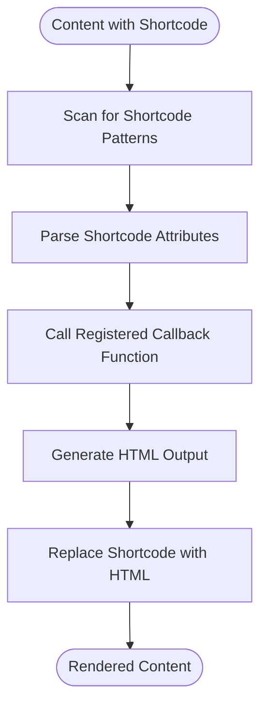
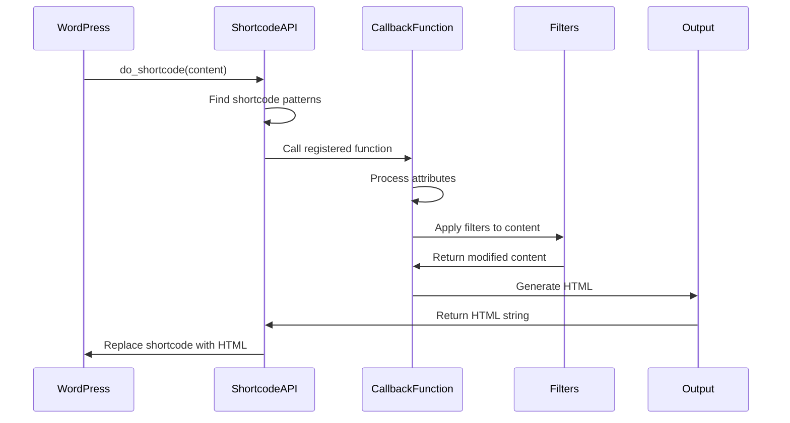

# Shortcode API

<cite>
**Referenced Files in This Document**   
- [exchange.php](file://wp-content/plugins/premiumbox/shortcode/exchange.php)
- [account.php](file://wp-content/plugins/premiumbox/shortcode/account.php)
- [lastexchanges.php](file://wp-content/plugins/premiumbox/shortcode/lastexchanges.php)
- [login.php](file://wp-content/plugins/premiumbox/shortcode/login.php)
- [register.php](file://wp-content/plugins/premiumbox/shortcode/register.php)
- [shortcodes.php](file://wp-includes/shortcodes.php)
</cite>

## Table of Contents
1. [Introduction](#introduction)
2. [Available Shortcodes](#available-shortcodes)
3. [Shortcode Processing and Rendering](#shortcode-processing-and-rendering)
4. [Implementation Examples](#implementation-examples)
5. [Customization and Styling](#customization-and-styling)
6. [Common Issues and Security Considerations](#common-issues-and-security-considerations)
7. [Creating Custom Shortcodes](#creating-custom-shortcodes)
8. [Conclusion](#conclusion)

## Introduction
The Shortcode API in the Premium Exchanger platform provides a powerful way to embed exchange functionality directly into WordPress content. This documentation details all available shortcodes, their parameters, usage examples, and implementation details. The system allows users to create dynamic exchange forms, display user account information, show recent exchanges, and manage user authentication directly within posts, pages, and widgets.

The shortcode system follows WordPress standards while extending them with platform-specific functionality for cryptocurrency and currency exchange operations. Each shortcode is processed server-side and rendered as HTML, providing interactive elements that integrate seamlessly with the rest of the WordPress site.

## Available Shortcodes

### [premium_exchange]
This shortcode displays the main exchange form where users can convert between different currencies.

**Attributes/Parameters:**
- `direction_id` (integer): Specifies the exchange direction ID to display. Default: none (determined by URL)

**Return/Output Format:**
Returns HTML markup containing the complete exchange form with currency selection dropdowns, amount input fields, fee calculations, and submission button. The form includes real-time calculation functionality via JavaScript.

**Usage Examples:**
```
[premium_exchange]
[premium_exchange direction_id="123"]
```

**Section sources**
- [exchange.php](file://wp-content/plugins/premiumbox/shortcode/exchange.php#L440-L469)

### [premium_reserv]
This shortcode is not explicitly defined in the provided codebase. Based on the naming convention, it would likely display reserve information for currencies, but no corresponding implementation was found in the analyzed files.

### [premium_lastexchanges]
This shortcode displays a list of recently completed exchanges.

**Attributes/Parameters:**
- `count` (integer): Number of recent exchanges to display. Default: 1

**Return/Output Format:**
Returns HTML markup containing a formatted list of recent exchanges, showing the currencies exchanged, amounts, and timestamps. If no exchanges are found, it displays "No orders".

**Usage Examples:**
```
[premium_lastexchanges]
[premium_lastexchanges count="5"]
```

**Section sources**
- [lastexchanges.php](file://wp-content/plugins/premiumbox/shortcode/lastexchanges.php#L57-L84)

### [premium_register]
This shortcode displays the user registration form.

**Attributes/Parameters:**
- None

**Return/Output Format:**
Returns HTML markup containing the registration form with fields for login, email, password, and password confirmation. Includes validation and error handling.

**Usage Examples:**
```
[premium_register]
```

**Section sources**
- [register.php](file://wp-content/plugins/premiumbox/shortcode/register.php#L196-L215)

### [premium_login]
This shortcode displays the user login form.

**Attributes/Parameters:**
- None

**Return/Output Format:**
Returns HTML markup containing the login form with fields for username/email and password. Includes links to registration and password recovery.

**Usage Examples:**
```
[premium_login]
```

**Section sources**
- [login.php](file://wp-content/plugins/premiumbox/shortcode/login.php#L142-L161)

## Shortcode Processing and Rendering

### WordPress Shortcode API Foundation
The Premium Exchanger shortcodes are built on WordPress's native shortcode API, which is defined in `wp-includes/shortcodes.php`. The system uses the `add_shortcode()` function to register shortcode tags with their callback functions. When WordPress processes content, it searches for shortcode patterns using regular expressions and replaces them with the output from the corresponding callback functions.

The core processing flow involves:
1. Content scanning for shortcode patterns
2. Parsing shortcode attributes
3. Calling the registered callback function
4. Replacing the shortcode with the returned HTML



**Diagram sources**
- [shortcodes.php](file://wp-includes/shortcodes.php#L44-L90)

### Shortcode Registration and Callbacks
Each shortcode in the Premium Exchanger system follows the same pattern: a callback function is defined and registered using `add_shortcode()`. The callback function typically:
- Processes any provided attributes
- Generates the appropriate HTML markup
- Applies filters for customization
- Returns the final HTML string

For example, the exchange shortcode callback processes the direction_id attribute, sets up the exchange form data, and returns the complete form HTML.



**Diagram sources**
- [exchange.php](file://wp-content/plugins/premiumbox/shortcode/exchange.php#L440-L469)
- [shortcodes.php](file://wp-includes/shortcodes.php#L206-L252)

## Implementation Examples

### Embedding Exchange Functionality in Posts
To embed the exchange form in a post or page, simply use the [premium_exchange] shortcode:

```
<h2>Exchange Currencies Instantly</h2>
<p>Use our secure exchange platform to convert between different currencies:</p>
[premium_exchange]
<p>All transactions are processed securely with competitive rates.</p>
```

### Displaying Recent Exchanges in Sidebar
To show recent exchanges in a widget or sidebar, use the [premium_lastexchanges] shortcode with a specified count:

```
<div class="widget">
    <h3>Recent Exchanges</h3>
    [premium_lastexchanges count="3"]
</div>
```

### Creating a Combined Login/Registration Section
To create a user authentication section with both login and registration options:

```
<div class="auth-section">
    <div class="login-container">
        <h3>Member Login</h3>
        [premium_login]
    </div>
    <div class="register-container">
        <h3>Create Account</h3>
        [premium_register]
    </div>
</div>
```

### Using Shortcodes in Theme Templates
Shortcodes can also be used directly in PHP templates using `do_shortcode()`:

```php
<?php echo do_shortcode('[premium_lastexchanges count="5"]'); ?>
```

This approach allows theme developers to integrate shortcode functionality directly into template files.

**Section sources**
- [exchange.php](file://wp-content/plugins/premiumbox/shortcode/exchange.php#L440-L469)
- [lastexchanges.php](file://wp-content/plugins/premiumbox/shortcode/lastexchanges.php#L57-L84)
- [login.php](file://wp-content/plugins/premiumbox/shortcode/login.php#L142-L161)
- [register.php](file://wp-content/plugins/premiumbox/shortcode/register.php#L196-L215)

## Customization and Styling

### CSS Class Structure
The shortcodes use a consistent CSS class naming convention that allows for easy styling:

- `.shortcode_lchanges` - Container for recent exchanges
- `.xchange_div` - Main exchange form container
- `.log_div_wrap` - Login form container
- `.reg_div_wrap` - Registration form container

These classes can be targeted in custom CSS to modify the appearance of shortcode output.

### Filter Hooks for Customization
The system provides several filter hooks that allow developers to modify shortcode output:

- `lchange_shortcode_block` - Modify the recent exchanges output
- `exchange_html` - Modify the exchange form HTML
- `login_form_temp` - Modify the login form template
- `register_form_temp` - Modify the registration form template

Example of using a filter to customize the exchange form:
```php
add_filter('exchange_html', 'customize_exchange_form');
function customize_exchange_form($html) {
    // Add custom elements or modify existing HTML
    return $html;
}
```

### Responsive Design Considerations
The shortcode output is designed to be responsive, with CSS classes that support different screen sizes. Developers can enhance responsiveness by adding custom media queries targeting the shortcode container classes.

**Section sources**
- [exchange.php](file://wp-content/plugins/premiumbox/shortcode/exchange.php#L271-L438)
- [lastexchanges.php](file://wp-content/plugins/premiumbox/shortcode/lastexchanges.php#L47-L84)
- [login.php](file://wp-content/plugins/premiumbox/shortcode/login.php#L80-L139)
- [register.php](file://wp-content/plugins/premiumbox/shortcode/register.php#L136-L193)

## Common Issues and Security Considerations

### Shortcode Execution Order
Shortcodes are processed during the `the_content` filter phase, which occurs after most other content modifications. This means that shortcodes will be processed after:
- Text widgets
- Post content
- Custom fields

If you need to ensure specific execution order, use `do_shortcode()` explicitly in your PHP code rather than relying on automatic processing.

### Parameter Validation
The system performs validation on shortcode parameters:

- Numeric parameters are validated with `intval()`
- String parameters are sanitized with `pn_strip_input()`
- Attributes are checked for existence before use

Example from the lastexchanges shortcode:
```php
$count = intval(is_isset($atts, 'count'));
if ($count < 1) { $count = 1; }
```

### Security Considerations
When using shortcodes with user input, consider the following security measures:

1. **Input Sanitization**: All user input is sanitized using platform-specific functions like `is_user()`, `is_email()`, and `is_password()`.

2. **Authentication Checks**: Forms check user authentication status before processing:
```php
$ui = wp_get_current_user();
$user_id = intval($ui->ID);
if ($user_id < 1) {
    // Show form only to unauthorized users
}
```

3. **CSRF Protection**: The system uses WordPress nonces and secure cookies for form submissions.

4. **Rate Limiting**: The platform may implement rate limiting for form submissions to prevent abuse.

5. **XSS Prevention**: All output is properly escaped using WordPress escaping functions.

### Error Handling
The system includes comprehensive error handling:
- Form validation errors are displayed inline
- Authentication errors provide specific feedback
- Database errors are logged but not exposed to users
- JavaScript errors are handled gracefully

**Section sources**
- [exchange.php](file://wp-content/plugins/premiumbox/shortcode/exchange.php#L444-L448)
- [lastexchanges.php](file://wp-content/plugins/premiumbox/shortcode/lastexchanges.php#L61-L63)
- [login.php](file://wp-content/plugins/premiumbox/shortcode/login.php#L189-L196)
- [register.php](file://wp-content/plugins/premiumbox/shortcode/register.php#L242-L248)

## Creating Custom Shortcodes

### Basic Shortcode Structure
To create a custom shortcode that extends the existing system, follow this pattern:

```php
function custom_shortcode_handler($atts, $content = "") {
    // Set default attributes
    $atts = shortcode_atts(array(
        'param1' => 'default_value',
        'param2' => 10,
    ), $atts, 'custom_shortcode');
    
    // Process attributes
    $param1 = sanitize_text_field($atts['param1']);
    $param2 = intval($atts['param2']);
    
    // Generate output
    $output = '<div class="custom-shortcode">';
    $output .= '<p>Parameter 1: ' . esc_html($param1) . '</p>';
    $output .= '<p>Parameter 2: ' . esc_html($param2) . '</p>';
    $output .= '</div>';
    
    // Apply filters for extensibility
    $output = apply_filters('custom_shortcode_output', $output, $atts);
    
    return $output;
}
add_shortcode('custom_shortcode', 'custom_shortcode_handler');
```

### Extending Existing Shortcodes
To extend an existing shortcode, use the provided filter hooks:

```php
// Extend the exchange form
add_filter('exchange_html', 'add_custom_fields_to_exchange');
function add_custom_fields_to_exchange($html) {
    $custom_fields = '<div class="custom-field">';
    $custom_fields .= '<label>Custom Field:</label>';
    $custom_fields .= '<input type="text" name="custom_field" />';
    $custom_fields .= '</div>';
    
    // Insert custom fields before the submit button
    $html = str_replace('[submit]', $custom_fields . '[submit]', $html);
    
    return $html;
}

// Extend the registration form
add_filter('registerform_filelds', 'add_custom_registration_fields');
function add_custom_registration_fields($items) {
    $items['phone'] = array(
        'name' => 'phone',
        'title' => 'Phone Number',
        'req' => 0,
        'value' => '',
        'type' => 'input',
    );
    
    return $items;
}
```

### Best Practices for Custom Shortcodes
1. **Use Unique Names**: Prefix shortcode names to avoid conflicts
2. **Sanitize Input**: Always sanitize and validate attributes
3. **Escape Output**: Use appropriate escaping functions
4. **Provide Defaults**: Use `shortcode_atts()` to set default values
5. **Add Filters**: Include filter hooks for extensibility
6. **Document Parameters**: Clearly document all available parameters
7. **Handle Edge Cases**: Account for missing or invalid parameters

**Section sources**
- [exchange.php](file://wp-content/plugins/premiumbox/shortcode/exchange.php#L440-L469)
- [account.php](file://wp-content/plugins/premiumbox/shortcode/account.php#L67-L119)
- [shortcodes.php](file://wp-includes/shortcodes.php#L44-L90)

## Conclusion
The Shortcode API in the Premium Exchanger platform provides a flexible and secure way to embed exchange functionality into WordPress content. By understanding the available shortcodes, their parameters, and implementation details, developers and site administrators can effectively integrate exchange features into posts, pages, and widgets.

The system follows WordPress best practices while extending them with platform-specific functionality. Security considerations are built into the core implementation, with input validation, authentication checks, and proper output escaping. The use of filter hooks allows for extensive customization without modifying core files.

When creating custom shortcodes or extending existing ones, follow the documented patterns and best practices to ensure compatibility and security. The shortcode system is a powerful tool for creating dynamic, interactive content that enhances the user experience on Premium Exchanger platforms.