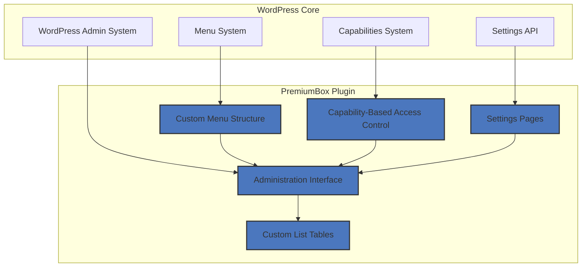
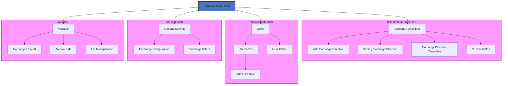
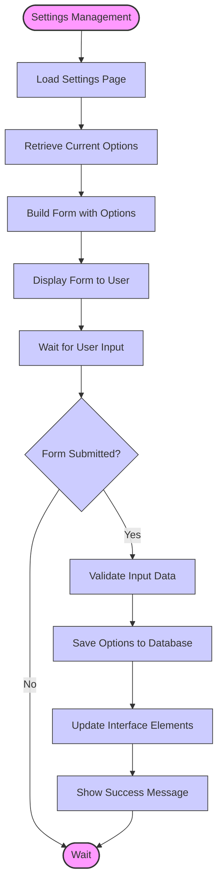
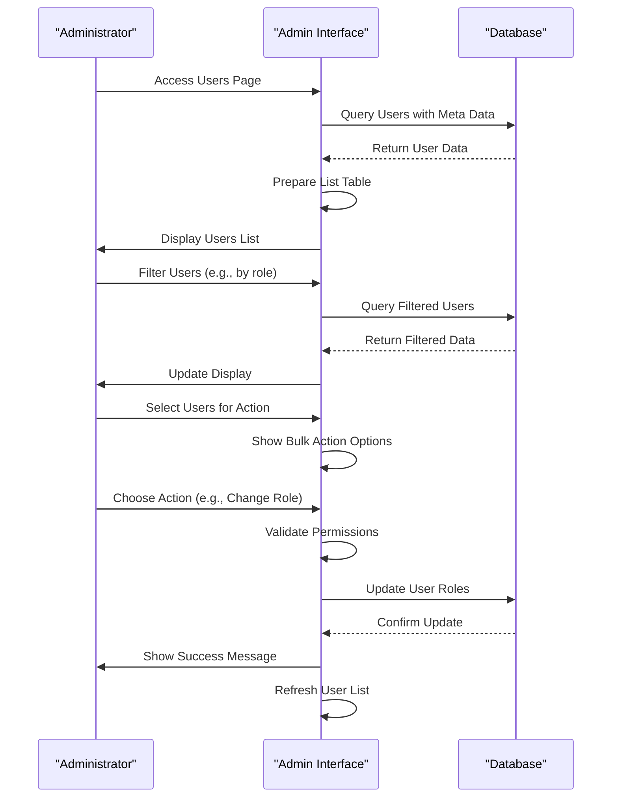
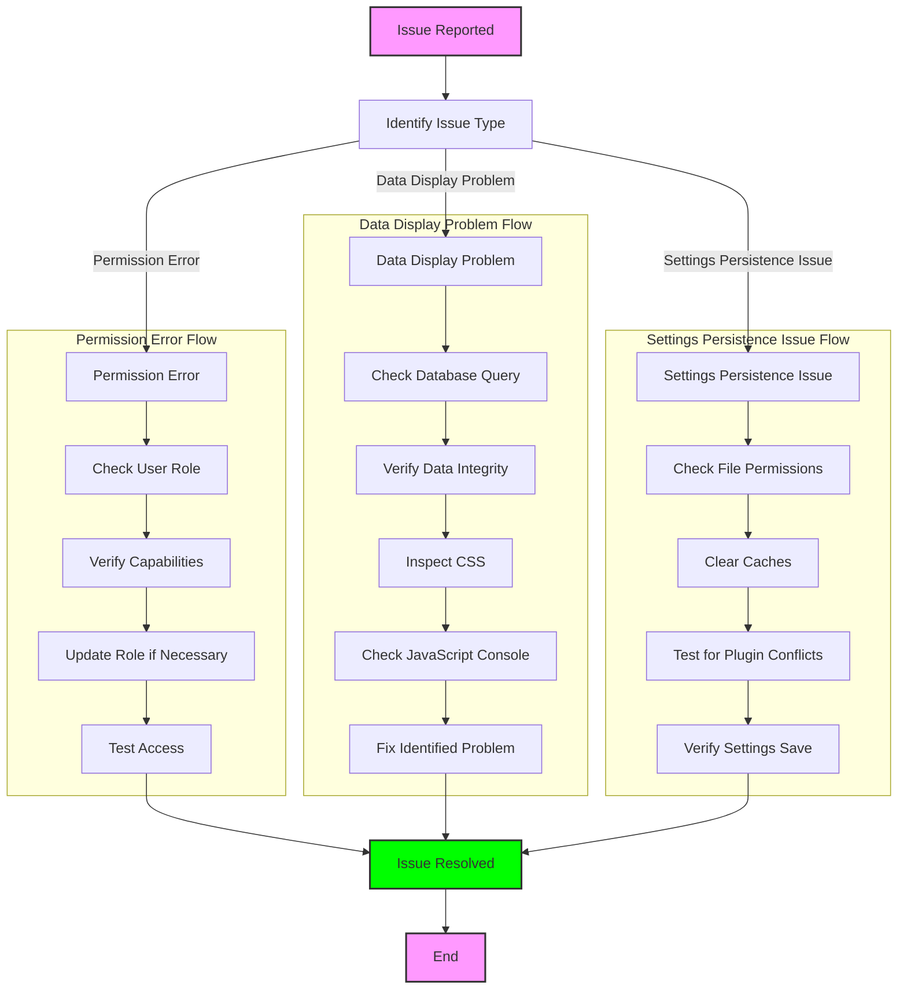

# Administration Panel

<cite>
**Referenced Files in This Document**   
- [menu.php](file://wp-admin/menu.php)
- [class-list-table.php](file://wp-content/plugins/premiumbox/premium/includes/class-list-table.php)
- [settings.php](file://wp-content/plugins/premiumbox/default/settings.php)
- [list_users.php](file://wp-content/plugins/premiumbox/default/users/list_users.php)
- [index.php](file://wp-content/plugins/premiumbox/default/roles/index.php)
- [admin.php](file://wp-admin/includes/admin.php)
- [capabilities.php](file://wp-includes/capabilities.php)
- [exchange.php](file://wp-content/plugins/premiumbox/shortcode/exchange.php)
- [class-wp-user.php](file://wp-includes/class-wp-user.php)
</cite>

## Table of Contents
1. [Introduction](#introduction)
2. [Architecture Overview](#architecture-overview)
3. [Menu Structure](#menu-structure)
4. [Capability-Based Access Control](#capability-based-access-control)
5. [Custom List Tables Implementation](#custom-list-tables-implementation)
6. [Settings Management](#settings-management)
7. [User Management](#user-management)
8. [Data Presentation Components](#data-presentation-components)
9. [Common Issues and Solutions](#common-issues-and-solutions)
10. [Performance Considerations](#performance-considerations)
11. [Security Implications](#security-implications)

## Introduction
The administration interface serves as the central control center for managing all aspects of the exchange platform, providing comprehensive tools for configuration, user management, and transaction monitoring. Built on WordPress admin patterns, the interface extends core functionality with custom list tables and settings pages tailored to the exchange platform's specific requirements. The admin panel enables administrators to configure exchange parameters, manage user accounts, and monitor transaction activity through an intuitive interface that follows WordPress design principles while incorporating specialized features for the exchange domain.

## Architecture Overview
The administration interface architecture follows WordPress conventions while extending them with custom components for exchange-specific functionality. The system integrates with WordPress admin system through standard hooks and APIs, while implementing custom list table classes for data display and the Settings API for configuration storage. The architecture is modular, with different components handling menu management, capability checks, data presentation, and user interface customization.



**Diagram sources**
- [menu.php](file://wp-admin/menu.php)
- [admin.php](file://wp-admin/includes/admin.php)
- [capabilities.php](file://wp-includes/capabilities.php)

## Menu Structure
The administration interface implements a hierarchical menu structure that organizes functionality into logical groups. The menu system follows WordPress patterns using `add_menu_page` and `add_submenu_page` functions to create top-level and nested menu items. Each menu item is associated with specific capabilities that determine user access.

The menu structure includes sections for exchange directions, user management, configuration settings, and various modules. Top-level menu items are registered with specific positions to ensure proper ordering within the WordPress admin sidebar. Submenu items provide access to specific functionality within each section, such as adding new exchange directions or configuring system settings.



**Diagram sources**
- [menu.php](file://wp-admin/menu.php)
- [index.php](file://wp-content/plugins/premiumbox/plugin/directions/index.php)
- [index.php](file://wp-content/plugins/premiumbox/default/roles/index.php)
- [exchange_filters.php](file://wp-content/plugins/premiumbox/plugin/exchange_filters.php)

## Capability-Based Access Control
The administration interface implements a comprehensive capability-based access control system that extends WordPress' native capabilities model. Custom capabilities are defined for specific exchange platform functions, allowing granular control over user permissions. The system uses both WordPress core capabilities and custom capabilities prefixed with "pn_" to determine user access to various admin features.

Capabilities are checked using WordPress functions like `current_user_can()` to control menu item visibility and functionality access. The system implements role-based access where capabilities are assigned to user roles, and users inherit permissions based on their assigned roles. This approach ensures that users can only access functionality appropriate to their responsibilities.

```mermaid
classDiagram
class WP_User {
+ID
+user_login
+user_email
+roles
+allcaps
+has_cap(capability)
+add_cap(capability, grant)
+remove_cap(capability)
}
class WP_Roles {
+roles
+add_role(role_name, display_name, capabilities)
+remove_role(role_name)
+get_role(role_name)
}
class WP_Capabilities {
+map_meta_cap(capability, user_id, args)
+get_capabilities_for_user(user_id)
+user_has_cap(user_id, capability, args)
}
class CustomCapabilities {
+pn_directions
+pn_bids
+pn_currency
+pn_export_exchange
+pn_api
+pn_change_notify
+pn_test_cron
}
WP_User --> WP_Roles : "has"
WP_User --> WP_Capabilities : "uses"
WP_Capabilities --> CustomCapabilities : "includes"
WP_Roles --> CustomCapabilities : "assigns"
note right of WP_User
Manages user capabilities
and role membership
end
note right of WP_Roles
Defines roles and their
associated capabilities
end
note right of CustomCapabilities
Exchange platform-specific
capabilities extending
WordPress core system
end
```

**Diagram sources**
- [capabilities.php](file://wp-includes/capabilities.php)
- [class-wp-user.php](file://wp-includes/class-wp-user.php)
- [index.php](file://wp-content/plugins/premiumbox/default/roles/index.php)

**Section sources**
- [capabilities.php](file://wp-includes/capabilities.php#L1-L34)
- [class-wp-user.php](file://wp-includes/class-wp-user.php#L687-L749)
- [index.php](file://wp-content/plugins/premiumbox/default/roles/index.php#L1-L39)

## Custom List Tables Implementation
The administration interface utilizes custom list table implementations to display data in a structured, interactive format. These custom list tables extend the functionality of WordPress' `WP_List_Table` class, providing enhanced features for the exchange platform's specific needs. The implementation includes features like column visibility control, sorting, filtering, and bulk actions.

The `PremiumTable` class serves as the base for all custom list tables in the administration interface. It provides methods for handling pagination, column display, sorting, and user preferences. Each specific list table (e.g., users, exchange directions, transactions) extends this base class and implements methods to define columns, prepare data, and render rows.

```mermaid
classDiagram
class PremiumTable {
+version
+page
+navi
+count_items
+primary_column
+save_button
+items
+total_items
+txtfile
+__construct(page)
+count_items()
+set_url(not)
+get_pagenum()
+get_offset()
+show_columns()
+head_action()
+searchbox()
+submenu()
+actions(which)
+display_print()
+display()
}
class all_users_Table_List {
+get_thwidth()
+column_default(item, column_name)
+get_columns()
+get_search()
+get_submenu()
+get_bulk_actions()
+prepare_items()
+tr_class(tr_class, item)
+get_row_actions(item)
}
class all_roles_Table_List {
+get_columns()
+column_default(item, column_name)
+get_search()
+get_bulk_actions()
+prepare_items()
}
class pn_bids_Table_List {
+get_columns()
+column_default(item, column_name)
+get_search()
+get_submenu()
+get_bulk_actions()
+prepare_items()
+get_confirm_buttons()
}
PremiumTable <|-- all_users_Table_List
PremiumTable <|-- all_roles_Table_List
PremiumTable <|-- pn_bids_Table_List
note right of PremiumTable
Base class for all custom
list tables with common
functionality
end
note right of all_users_Table_List
Implements user-specific
columns and data handling
end
note right of all_roles_Table_List
Implements role-specific
columns and data handling
end
note right of pn_bids_Table_List
Implements transaction-specific
columns and data handling
end
```

**Diagram sources**
- [class-list-table.php](file://wp-content/plugins/premiumbox/premium/includes/class-list-table.php)
- [list_users.php](file://wp-content/plugins/premiumbox/default/users/list_users.php)

## Settings Management
The administration interface implements a comprehensive settings management system that allows administrators to configure various aspects of the exchange platform. The system follows WordPress patterns while extending them with custom functionality for exchange-specific configuration options. Settings are organized into logical groups and presented through dedicated settings pages accessible from the admin menu.

The settings system uses WordPress' Settings API for data storage and retrieval, ensuring compatibility with WordPress conventions. Custom settings pages are created using the plugin's admin template system, with form elements generated dynamically based on configuration arrays. User interface elements include text inputs, checkboxes, select dropdowns, and specialized controls for different data types.



**Diagram sources**
- [settings.php](file://wp-content/plugins/premiumbox/default/settings.php)
- [config.php](file://wp-content/plugins/premiumbox/plugin/config.php)

## User Management
The administration interface provides comprehensive user management capabilities, allowing administrators to view, edit, and manage user accounts. The user management system includes a custom list table for displaying user information, with support for filtering, sorting, and bulk actions. Administrators can change user roles, edit user profiles, and manage user-specific settings.

The user management interface integrates with WordPress' user system while extending it with exchange platform-specific features. Custom user meta fields store additional information relevant to the exchange platform, such as API access permissions, transaction limits, and verification status. The interface also provides tools for managing user roles and capabilities, allowing administrators to define custom roles with specific permissions.



**Diagram sources**
- [list_users.php](file://wp-content/plugins/premiumbox/default/users/list_users.php)
- [edit_users.php](file://wp-content/plugins/premiumbox/default/users/edit_users.php)

## Data Presentation Components
The administration interface implements several data presentation components that enhance the user experience and provide intuitive ways to interact with data. These components include custom list tables with column visibility controls, sorting capabilities, and filtering options. The interface also includes submenu filters that allow users to quickly filter data by specific criteria.

Key data presentation features include:
- Column visibility controls that allow users to customize which columns are displayed
- Sorting functionality for all sortable columns
- Search and filter forms with various input types (text, date, select)
- Pagination controls with customizable items per page
- Bulk action controls for performing operations on multiple items
- Row action links for item-specific operations
- Responsive design that adapts to different screen sizes

The data presentation components are designed to handle large datasets efficiently, with server-side processing for sorting, filtering, and pagination. This approach ensures good performance even with thousands of records in the database.

```mermaid
flowchart TD
subgraph "Data Presentation Components"
ColumnVisibility["Column Visibility Control"]
Sorting["Sorting Functionality"]
Filtering["Filtering Options"]
Pagination["Pagination Controls"]
BulkActions["Bulk Action Controls"]
RowActions["Row Action Links"]
ResponsiveDesign["Responsive Design"]
end
subgraph "User Interaction"
User["Administrator"]
Interface["Admin Interface"]
Database["Database"]
end
User --> |Configure Display| ColumnVisibility
User --> |Sort Data| Sorting
User --> |Filter Data| Filtering
User --> |Navigate Pages| Pagination
User --> |Perform Actions| BulkActions
User --> |Edit Item| RowActions
ColumnVisibility --> Interface
Sorting --> Interface
Filtering --> Interface
Pagination --> Interface
BulkActions --> Interface
RowActions --> Interface
Interface --> |Query Data| Database
Database --> |Return Data| Interface
Interface --> |Render Components| User
style "Data Presentation Components" fill:#f9f,stroke:#333,stroke-width:1px
style "User Interaction" fill:#f9f,stroke:#333,stroke-width:1px
```

**Diagram sources**
- [class-list-table.php](file://wp-content/plugins/premiumbox/premium/includes/class-list-table.php)
- [list_users.php](file://wp-content/plugins/premiumbox/default/users/list_users.php)

## Common Issues and Solutions
The administration interface may encounter several common issues that administrators should be aware of. Understanding these issues and their solutions helps ensure smooth operation of the exchange platform.

### Permission Errors
Permission errors occur when users don't have the required capabilities to access certain admin features. This typically happens when user roles don't include the necessary capabilities. The solution is to verify the user's role and ensure it has the required capabilities assigned.

### Data Display Problems
Data display problems can include missing data, incorrect formatting, or layout issues. These problems are often caused by:
- Database query errors
- Missing or incorrect data in the database
- CSS conflicts with the admin theme
- JavaScript errors preventing proper rendering

Solutions include verifying database connectivity, checking data integrity, and reviewing browser console errors.

### Settings Persistence Issues
Settings persistence issues occur when configuration changes don't save properly or revert unexpectedly. Common causes include:
- File permission issues preventing database writes
- Caching mechanisms serving stale data
- Plugin conflicts interfering with settings saving

Solutions involve checking file permissions, clearing caches, and testing for plugin conflicts.



**Diagram sources**
- [capabilities.php](file://wp-includes/capabilities.php)
- [class-list-table.php](file://wp-content/plugins/premiumbox/premium/includes/class-list-table.php)
- [settings.php](file://wp-content/plugins/premiumbox/default/settings.php)

## Performance Considerations
The administration interface must handle large datasets efficiently, particularly in list tables displaying transactions, users, or exchange directions. Several performance considerations are critical for maintaining a responsive admin experience.

For large datasets, the system implements server-side processing for sorting, filtering, and pagination rather than loading all data into memory. Database queries are optimized with appropriate indexes on commonly filtered and sorted columns. The system also implements caching mechanisms for frequently accessed data to reduce database load.

Memory usage is managed by limiting the number of items processed at once and using WordPress' built-in pagination. The interface also implements lazy loading for certain components to improve initial page load times.

```mermaid
flowchart TD
subgraph "Performance Optimization"
ServerSide["Server-Side Processing"]
DatabaseIndex["Database Indexing"]
QueryOptimization["Query Optimization"]
Caching["Caching Mechanisms"]
MemoryManagement["Memory Management"]
LazyLoading["Lazy Loading"]
end
subgraph "Implementation"
ListTables["Custom List Tables"]
Database["Database Queries"]
Cache["Object Cache"]
Memory["Memory Usage"]
Components["UI Components"]
end
ServerSide --> ListTables
DatabaseIndex --> Database
QueryOptimization --> Database
Caching --> Cache
MemoryManagement --> Memory
LazyLoading --> Components
style "Performance Optimization" fill:#f9f,stroke:#333,stroke-width:1px
style "Implementation" fill:#f9f,stroke:#333,stroke-width:1px
```

**Diagram sources**
- [class-list-table.php](file://wp-content/plugins/premiumbox/premium/includes/class-list-table.php)
- [list_users.php](file://wp-content/plugins/premiumbox/default/users/list_users.php)

## Security Implications
The administration interface has several security implications that must be carefully managed to protect the exchange platform. The system implements multiple security measures to prevent unauthorized access and data breaches.

Access control is enforced through capability checks on all admin pages and actions. Sensitive operations require additional verification, such as confirmation dialogs for destructive actions. The system also implements protection against common web vulnerabilities like cross-site request forgery (CSRF) through the use of WordPress nonce fields.

User data is protected through proper sanitization and escaping when displayed in the admin interface. Database queries use prepared statements to prevent SQL injection attacks. The system also implements logging of administrative actions to provide an audit trail for security monitoring.

```mermaid
flowchart TD
subgraph "Security Measures"
AccessControl["Access Control"]
CSRFProtection["CSRF Protection"]
InputSanitization["Input Sanitization"]
OutputEscaping["Output Escaping"]
SQLInjection["SQL Injection Prevention"]
ActionLogging["Action Logging"]
end
subgraph "Implementation"
Capabilities["Capability Checks"]
Nonce["Nonce Fields"]
Sanitize["Sanitize Functions"]
Escape["Escape Functions"]
Prepared["Prepared Statements"]
Logs["Audit Logs"]
end
AccessControl --> Capabilities
CSRFProtection --> Nonce
InputSanitization --> Sanitize
OutputEscaping --> Escape
SQLInjection --> Prepared
ActionLogging --> Logs
style "Security Measures" fill:#f9f,stroke:#333,stroke-width:1px
style "Implementation" fill:#f9f,stroke:#333,stroke-width:1px
```

**Diagram sources**
- [capabilities.php](file://wp-includes/capabilities.php)
- [class-list-table.php](file://wp-content/plugins/premiumbox/premium/includes/class-list-table.php)
- [functions.php](file://wp-content/plugins/premiumbox/includes/functions.php)