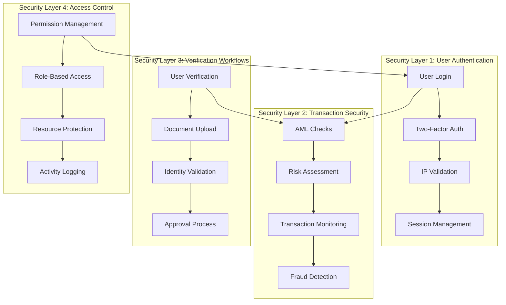
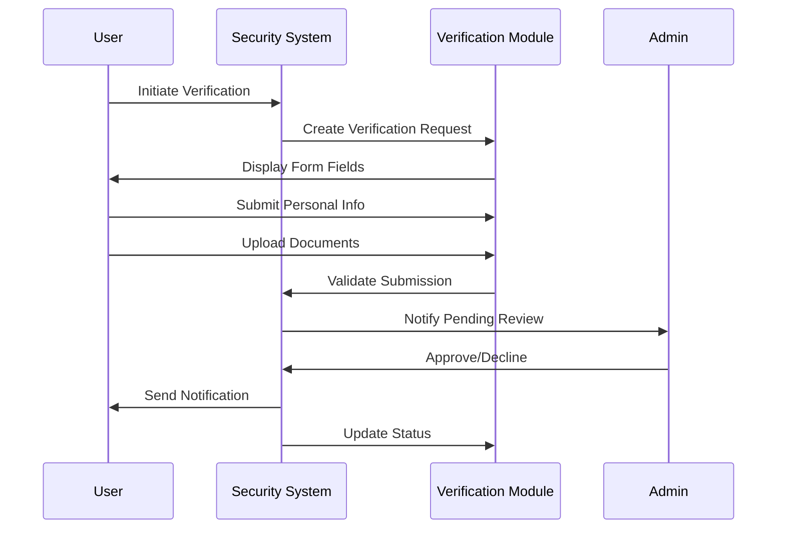
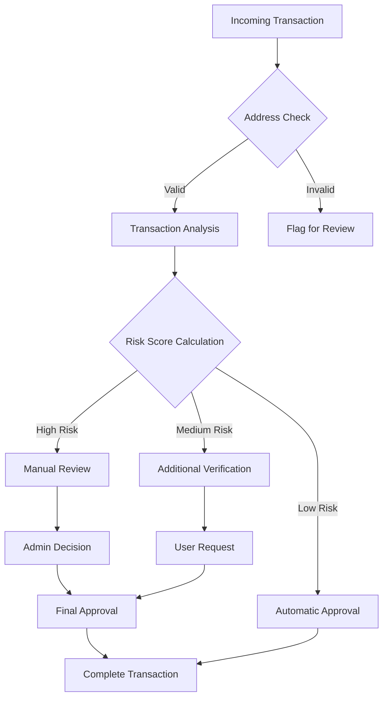
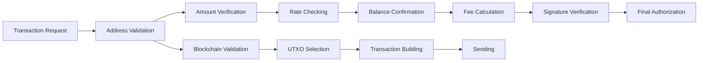
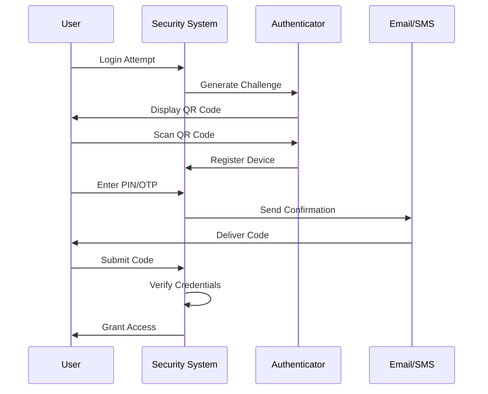
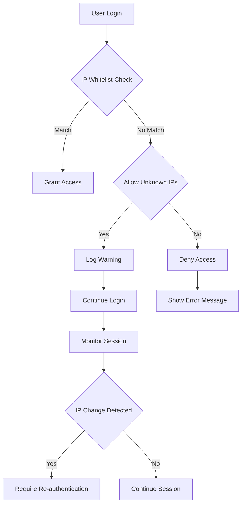
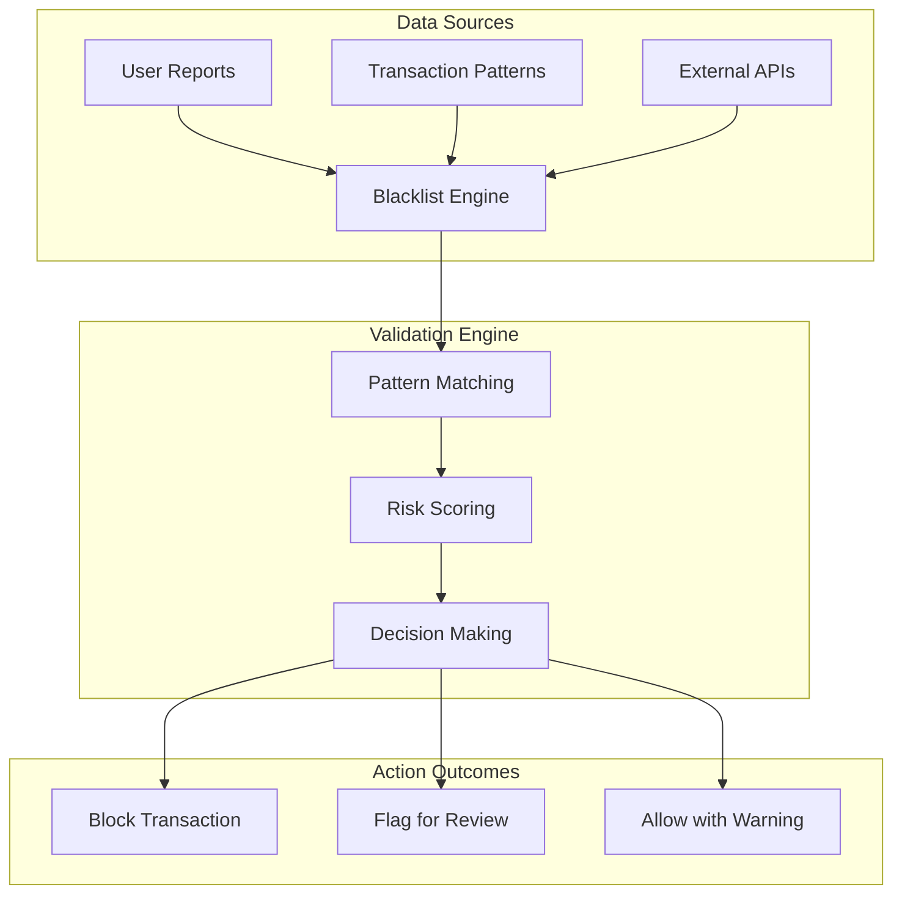
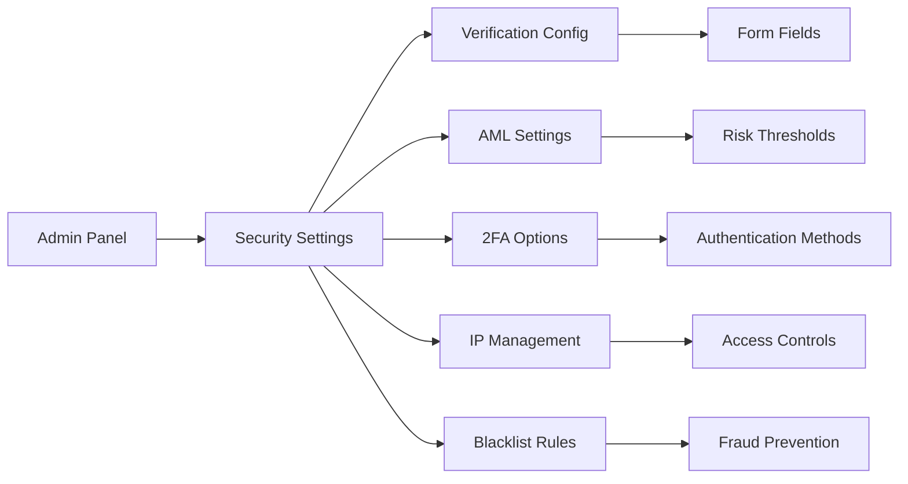

# Security Settings

<cite>
**Referenced Files in This Document**
- [security.php](file://wp-content/plugins/premiumbox/premium/includes/security.php)
- [security.php](file://wp-content/plugins/premiumbox/shortcode/security.php)
- [settings.php](file://wp-content/plugins/premiumbox/default/admin/settings.php)
- [functions.php](file://wp-content/plugins/premiumbox/moduls/amlcheck/functions.php)
- [index.php](file://wp-content/plugins/premiumbox/amlcheck/bitok/index.php)
- [index.php](file://wp-content/plugins/premiumbox/amlcheck/getblock/index.php)
- [userverify.php](file://wp-content/plugins/premiumbox/moduls/userverify/shortcode/userverify.php)
- [twofactorauth.php](file://wp-content/plugins/premiumbox/default/users/twofactorauth.php)
- [enableip.php](file://wp-content/plugins/premiumbox/default/users/enableip.php)
- [premiumbox.php](file://wp-content/plugins/premiumbox/moduls/blacklist/premiumbox.php)
- [index.php](file://wp-content/plugins/premiumbox/moduls/blacklist_bestchange/index.php)
- [index.php](file://wp-content/plugins/premiumbox/moduls/cpattern/index.php)
</cite>

## Table of Contents
1. [Introduction](#introduction)
2. [Security Architecture Overview](#security-architecture-overview)
3. [User Verification Workflows](#user-verification-workflows)
4. [AML and Risk Assessment System](#aml-and-risk-assessment-system)
5. [Transaction Security Controls](#transaction-security-controls)
6. [Two-Factor Authentication](#two-factor-authentication)
7. [IP Address Management](#ip-address-management)
8. [Blacklist and Fraud Detection](#blacklist-and-fraud-detection)
9. [Configuration Options](#configuration-options)
10. [Common Issues and Solutions](#common-issues-and-solutions)
11. [Best Practices](#best-practices)
12. [Troubleshooting Guide](#troubleshooting-guide)

## Introduction

The PremiumBox plugin implements a comprehensive security framework designed to protect cryptocurrency exchange platforms from fraud, unauthorized access, and malicious activities. This security system encompasses multiple layers including user verification, anti-money laundering (AML) checks, transaction monitoring, and advanced threat detection mechanisms.

The security configuration options provide administrators with granular control over verification processes, risk assessment thresholds, and security enforcement policies. These settings directly impact the user experience during transactions while maintaining robust protection against various security threats.

## Security Architecture Overview

The security system operates through several interconnected modules that work together to provide comprehensive protection:

**Diagram sources**
- [security.php](file://wp-content/plugins/premiumbox/premium/includes/security.php#L1-L332)
- [functions.php](file://wp-content/plugins/premiumbox/moduls/amlcheck/functions.php#L1-L770)

**Section sources**
- [security.php](file://wp-content/plugins/premiumbox/premium/includes/security.php#L1-L332)
- [functions.php](file://wp-content/plugins/premiumbox/moduls/amlcheck/functions.php#L1-L770)

## User Verification Workflows

The user verification system provides a structured approach to validating user identities through document uploads and personal information collection.

### Verification Process Flow

**Diagram sources**
- [userverify.php](file://wp-content/plugins/premiumbox/moduls/userverify/shortcode/userverify.php#L110-L736)

### Verification Configuration Options

The verification system offers extensive configuration options:

| Setting | Description | Default Value | Impact |
|---------|-------------|---------------|---------|
| `status` | Enable/disable verification requirement | Enabled | Controls whether users must verify before trading |
| `text` | Custom verification message | Empty | Displays to users requesting verification |
| `auto_status` | Automatic approval flag | 1 | Determines if verification is automatic |
| `field_requirements` | Required form fields | Configurable | Defines mandatory information collection |
| `document_types` | Accepted document formats | Configurable | Specifies valid identification documents |

### Document Validation Process

The system validates uploaded documents through multiple verification stages:

1. **Format Validation**: Ensures documents meet size and format requirements
2. **Content Analysis**: Uses OCR technology to extract text from documents
3. **Pattern Matching**: Validates document structure against known templates
4. **Cross-Reference**: Compares submitted information with external databases

**Section sources**
- [userverify.php](file://wp-content/plugins/premiumbox/moduls/userverify/shortcode/userverify.php#L1-L736)

## AML and Risk Assessment System

The Anti-Money Laundering (AML) system provides sophisticated risk assessment capabilities for both addresses and transactions.

### Risk Assessment Architecture

**Diagram sources**
- [functions.php](file://wp-content/plugins/premiumbox/moduls/amlcheck/functions.php#L229-L371)
- [index.php](file://wp-content/plugins/premiumbox/amlcheck/bitok/index.php#L57-L158)

### AML Configuration Parameters

The AML system provides comprehensive configuration options:

| Parameter | Purpose | Range | Default |
|-----------|---------|-------|---------|
| `addr_max` | Maximum acceptable address risk score | 0-100 | 80 |
| `txid_max` | Maximum acceptable transaction risk score | 0-100 | 85 |
| `api_timeout` | API response timeout (seconds) | 5-30 | 10 |
| `apierror_score` | Risk score for API failures | 1-100 | 100 |
| `curl_timeout` | Script execution timeout | 1-60 | 20 |

### Risk Signal Categories

The system evaluates multiple risk factors:

- **Financial Signals**: Transaction volume, frequency, and patterns
- **Geographic Signals**: Location-based risk assessments
- **Behavioral Signals**: User behavior anomalies
- **Network Signals**: Address reputation and connections
- **Regulatory Signals**: Compliance with legal requirements

**Section sources**
- [functions.php](file://wp-content/plugins/premiumbox/moduls/amlcheck/functions.php#L1-L770)
- [index.php](file://wp-content/plugins/premiumbox/amlcheck/bitok/index.php#L1-L424)
- [index.php](file://wp-content/plugins/premiumbox/amlcheck/getblock/index.php#L1-L378)

## Transaction Security Controls

Transaction security involves multiple validation layers to ensure funds are transferred securely and legitimate transactions are processed efficiently.

### Transaction Validation Pipeline

**Diagram sources**
- [functions.php](file://wp-content/plugins/premiumbox/moduls/amlcheck/functions.php#L374-L537)

### Security Threshold Configuration

| Threshold Type | Configuration Option | Purpose | Recommended Values |
|----------------|---------------------|---------|-------------------|
| Address Risk | `addr_max_*` | Per-risk-factor limits | 5-20% per factor |
| Transaction Risk | `txid_max_*` | Per-risk-factor limits | 10-30% per factor |
| Verification Delay | `api_timeout` | API response wait time | 5-15 seconds |
| Error Tolerance | `apierror_score` | API failure risk score | 80-100 |

### Wallet Address Validation

The system implements comprehensive address validation:

1. **Format Validation**: Ensures addresses match expected patterns
2. **Network Verification**: Confirms addresses belong to correct blockchain networks
3. **Token ID Validation**: Verifies ERC20/BEP20 token contracts
4. **Reputation Checking**: Analyzes address history and reputation

**Section sources**
- [functions.php](file://wp-content/plugins/premiumbox/moduls/amlcheck/functions.php#L374-L537)
- [index.php](file://wp-content/plugins/premiumbox/amlcheck/bitok/index.php#L111-L158)

## Two-Factor Authentication

Two-factor authentication (2FA) adds an extra layer of security by requiring users to provide two forms of identification.

### 2FA Implementation

**Diagram sources**
- [twofactorauth.php](file://wp-content/plugins/premiumbox/default/users/twofactorauth.php#L43-L163)

### 2FA Configuration Options

| Feature | Description | Security Level | User Experience |
|---------|-------------|----------------|-----------------|
| PIN Code | Numeric passcode | Medium | High |
| Email Authentication | Email-based verification | Low | Very High |
| SMS Authentication | SMS-based verification | Medium | High |
| Telegram Authentication | Telegram-based verification | Medium | High |

### 2FA Setup Process

1. **Device Registration**: Users scan QR codes with authenticator apps
2. **Backup Codes**: Generation of recovery codes for lost devices
3. **Multi-device Support**: Ability to register multiple devices
4. **Session Management**: Secure session handling with 2FA

**Section sources**
- [twofactorauth.php](file://wp-content/plugins/premiumbox/default/users/twofactorauth.php#L1-L163)

## IP Address Management

IP address management provides geographic and device-based access control.

### IP Security Features

**Diagram sources**
- [enableip.php](file://wp-content/plugins/premiumbox/default/users/enableip.php#L44-L71)

### IP Configuration Options

| Setting | Purpose | Default Behavior | Security Impact |
|---------|---------|------------------|-----------------|
| `enable_ips` | Allowed IP addresses | Empty (any) | High |
| `allow_unknown` | Permit unknown IPs | Disabled | Medium |
| `session_hash` | Session IP binding | Enabled | High |
| `geo_tracking` | Geographic restrictions | Disabled | Medium |

### IP Validation Process

1. **Initial IP Capture**: Records user's initial IP address
2. **Session Binding**: Links session to originating IP
3. **Continuous Monitoring**: Tracks IP changes during session
4. **Alert Generation**: Notifies admins of suspicious activity

**Section sources**
- [enableip.php](file://wp-content/plugins/premiumbox/default/users/enableip.php#L1-L71)

## Blacklist and Fraud Detection

The blacklist system provides real-time fraud detection and prevention capabilities.

### Blacklist Architecture

**Diagram sources**
- [premiumbox.php](file://wp-content/plugins/premiumbox/moduls/blacklist/premiumbox.php#L220-L260)
- [index.php](file://wp-content/plugins/premiumbox/moduls/blacklist_bestchange/index.php#L49-L92)

### Blacklist Configuration

| Field Type | Validation Method | Real-time Check | Manual Override |
|------------|-------------------|-----------------|-----------------|
| Address | Exact match | Yes | Yes |
| Phone Number | Partial match | Yes | Yes |
| Email | Domain check | Yes | Yes |
| IP Address | Range check | Yes | Yes |
| Username | Pattern match | Yes | Yes |

### Fraud Detection Triggers

The system monitors for various fraudulent patterns:

- **Multiple Accounts**: Same user creating multiple accounts
- **Suspicious Addresses**: Known fraudulent addresses
- **Unusual Patterns**: Abnormal transaction volumes or frequencies
- **Geographic Anomalies**: Transactions from unexpected locations
- **Time-based Patterns**: Suspicious login times or activity

**Section sources**
- [premiumbox.php](file://wp-content/plugins/premiumbox/moduls/blacklist/premiumbox.php#L1-L260)
- [index.php](file://wp-content/plugins/premiumbox/moduls/blacklist_bestchange/index.php#L1-L145)

## Configuration Options

Security settings are managed through comprehensive configuration panels accessible to administrators.

### Security Dashboard

**Diagram sources**
- [settings.php](file://wp-content/plugins/premiumbox/default/admin/settings.php#L1-L208)
- [security.php](file://wp-content/plugins/premiumbox/shortcode/security.php#L1-L221)

### Key Configuration Panels

| Panel | Purpose | Access Level | Impact |
|-------|---------|--------------|--------|
| Admin Panel | General security settings | Administrator | Global |
| Security Settings | User security preferences | User/Admin | Individual |
| Verification Config | User verification setup | Administrator | User Onboarding |
| AML Settings | Risk assessment parameters | Administrator | Transaction Processing |
| 2FA Options | Multi-factor authentication | Administrator | Login Security |

### Trusted Address Management

Administrators can configure trusted addresses for expedited processing:

1. **Whitelist Creation**: Add verified addresses to trusted list
2. **Priority Processing**: Expedited transaction handling
3. **Reduced Monitoring**: Lower scrutiny for trusted addresses
4. **Automatic Approval**: Streamlined verification process

**Section sources**
- [settings.php](file://wp-content/plugins/premiumbox/default/admin/settings.php#L1-L208)
- [security.php](file://wp-content/plugins/premiumbox/shortcode/security.php#L1-L221)

## Common Issues and Solutions

### Verification Email Not Sending

**Problem**: Users report not receiving verification emails.

**Causes and Solutions**:
- **SMTP Configuration**: Verify SMTP settings in WordPress
- **Email Queue**: Check for email delivery delays
- **Spam Filters**: Ensure emails aren't blocked by spam filters
- **Alternative Methods**: Enable SMS or Telegram authentication

### False Positive Fraud Detection

**Problem**: Legitimate transactions flagged as fraudulent.

**Resolution Steps**:
1. **Review Risk Scores**: Analyze individual risk factors
2. **Adjust Thresholds**: Modify risk tolerance levels
3. **Add to Whitelist**: Mark known good addresses
4. **Contact Support**: Escalate complex cases

### Configuration Conflicts

**Problem**: Security settings conflicting with each other.

**Diagnostic Approach**:
- **Log Analysis**: Review security logs for conflicts
- **Setting Validation**: Verify parameter ranges
- **Dependency Checking**: Ensure interdependent settings are compatible
- **Testing Environment**: Validate changes in staging

### Performance Impact

**Problem**: Security checks slowing down transactions.

**Optimization Strategies**:
- **Caching**: Implement caching for frequently accessed data
- **Asynchronous Processing**: Move non-critical checks to background tasks
- **Threshold Tuning**: Adjust risk scores for better performance
- **API Rate Limiting**: Configure appropriate timeouts

## Best Practices

### Security Configuration Guidelines

1. **Layered Defense**: Implement multiple security measures
2. **Regular Updates**: Keep security systems updated
3. **Monitoring**: Continuously monitor security events
4. **Documentation**: Maintain comprehensive security documentation
5. **Training**: Train staff on security protocols

### Risk Management

- **Baseline Assessment**: Establish baseline security requirements
- **Continuous Improvement**: Regularly review and improve security measures
- **Incident Response**: Develop and maintain incident response plans
- **Compliance**: Ensure compliance with relevant regulations

### User Experience Balance

- **Minimal Friction**: Design security measures that don't hinder legitimate users
- **Clear Communication**: Provide clear instructions for security requirements
- **Progressive Enhancement**: Offer multiple security levels for different user needs
- **Accessibility**: Ensure security features are accessible to all users

## Troubleshooting Guide

### Diagnostic Tools

The system provides several diagnostic tools for troubleshooting security issues:

1. **Security Dashboard**: Real-time security status monitoring
2. **Audit Logs**: Comprehensive logging of security events
3. **Performance Metrics**: Transaction processing metrics
4. **Error Reporting**: Automated error detection and reporting

### Common Error Messages

| Error | Cause | Solution |
|-------|-------|----------|
| `anticsfr` | CSRF token validation failed | Refresh page and try again |
| `IP blocked` | Unauthorized IP address | Contact administrator |
| `Verification required` | User not verified | Complete verification process |
| `Risk score exceeded` | Transaction risk too high | Reduce amount or contact support |

### Support Resources

- **Documentation**: Comprehensive online documentation
- **Community Forums**: User community support
- **Technical Support**: Professional support services
- **Knowledge Base**: Troubleshooting articles and guides

**Section sources**
- [security.php](file://wp-content/plugins/premiumbox/premium/includes/security.php#L228-L331)