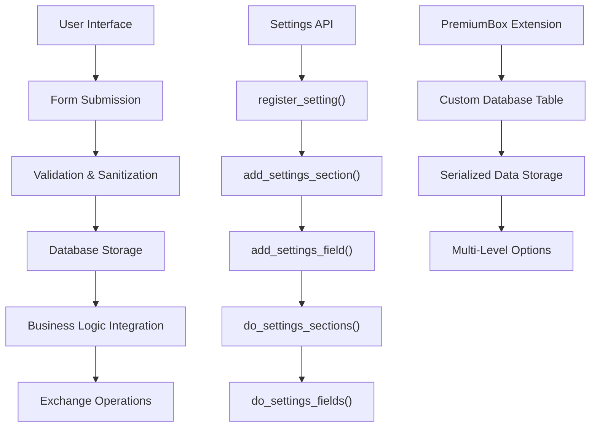
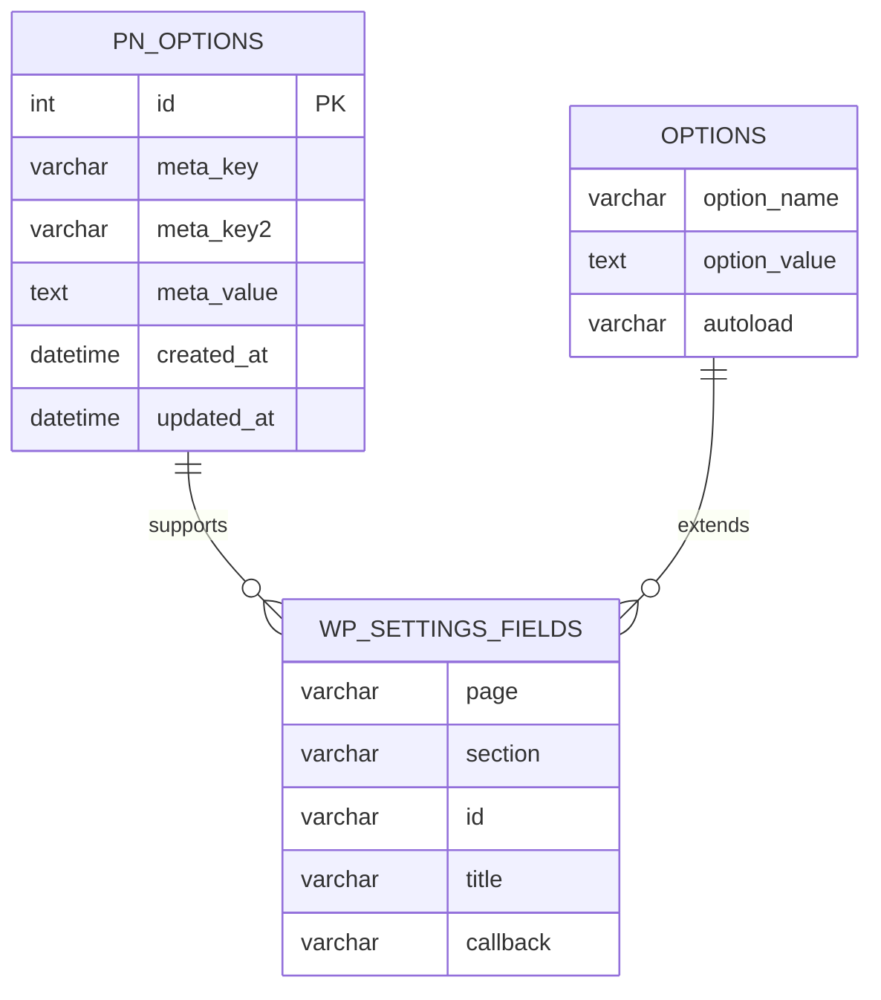
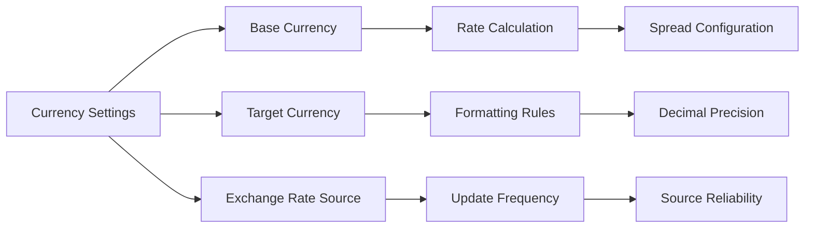
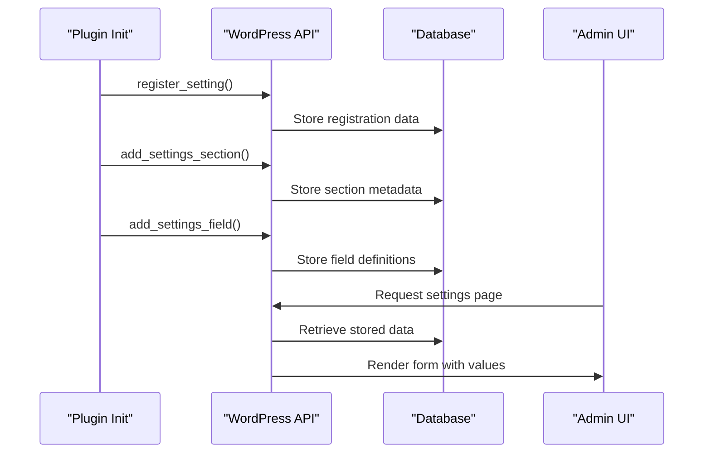
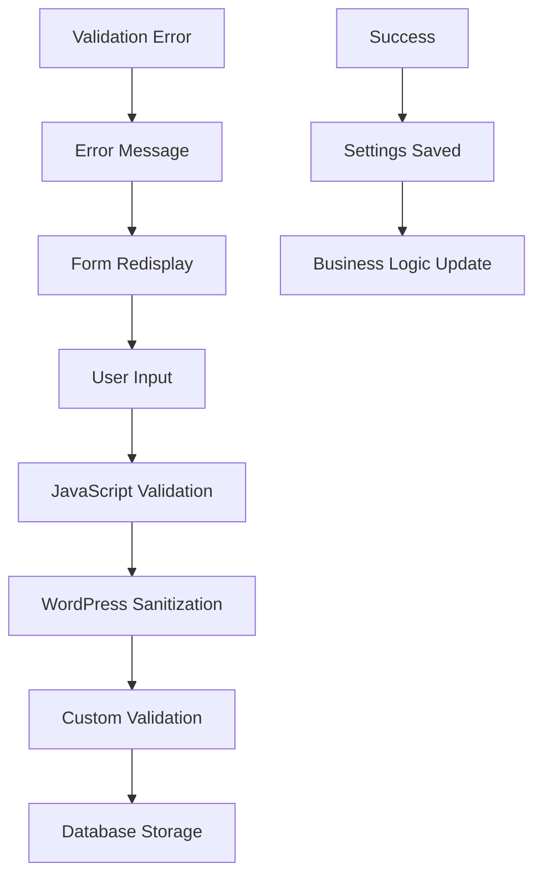
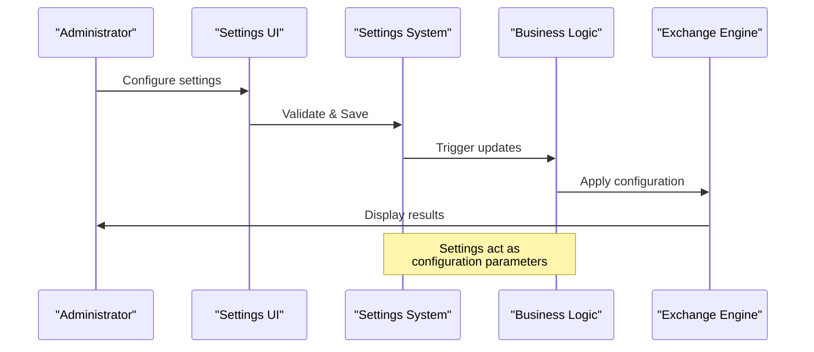

# Settings Configuration

<cite>
**Referenced Files in This Document**
- [settings.php](file://wp-content/plugins/premiumbox/default/settings.php)
- [config.php](file://wp-content/plugins/premiumbox/plugin/config.php)
- [class-form.php](file://wp-content/plugins/premiumbox/premium/includes/class-form.php)
- [class-premium.php](file://wp-content/plugins/premiumbox/premium/includes/class-premium.php)
- [settings.php](file://wp-content/plugins/premiumbox/moduls/bestchange/settings.php)
- [settings.php](file://wp-content/plugins/premiumbox/moduls/api/settings.php)
- [settings.php](file://wp-content/plugins/premiumbox/moduls/bestchangeapi/settings.php)
- [settings.php](file://wp-content/plugins/premiumbox/moduls/direction_xml/settings.php)
- [template.php](file://wp-admin/includes/template.php)
- [option.php](file://wp-includes/option.php)
- [options.php](file://wp-admin/options.php)
</cite>

## Table of Contents
1. [Introduction](#introduction)
2. [WordPress Settings API Overview](#wordpress-settings-api-overview)
3. [PremiumBox Settings Architecture](#premiumbox-settings-architecture)
4. [Core Settings Implementation](#core-settings-implementation)
5. [Data Model for Exchange Parameters](#data-model-for-exchange-parameters)
6. [Settings Registration Patterns](#settings-registration-patterns)
7. [Validation and Sanitization](#validation-and-sanitization)
8. [Common Issues and Solutions](#common-issues-and-solutions)
9. [Integration with Business Logic](#integration-with-business-logic)
10. [Advanced Configuration Examples](#advanced-configuration-examples)
11. [Troubleshooting Guide](#troubleshooting-guide)
12. [Best Practices](#best-practices)

## Introduction

The PremiumBox plugin implements a sophisticated settings configuration system that manages exchange parameters, currency configurations, and platform behavior settings. This system leverages WordPress's native Settings API while extending it with custom functionality to support complex financial exchange operations.

The settings system serves as the bridge between user interface configuration and backend business logic, enabling administrators to control everything from exchange rate calculations to payment processing workflows. Understanding this system is crucial for maintaining and extending the platform's functionality.

## WordPress Settings API Overview

WordPress provides a robust framework for managing plugin and theme settings through its Settings API. The core components include:

### Key Functions

The Settings API consists of several essential functions that handle different aspects of the settings system:

- **register_setting()**: Registers a setting with WordPress
- **add_settings_section()**: Creates a section within a settings page
- **add_settings_field()**: Adds individual fields to sections
- **do_settings_sections()**: Renders all sections on a page
- **do_settings_fields()**: Renders all fields within a section
- **settings_errors()**: Displays validation and error messages

### Settings Storage Mechanism

WordPress stores settings in the database using the `wp_options` table. The system supports both simple options (single values) and serialized options (arrays and objects). PremiumBox extends this with a custom database table (`wp_pn_options`) for more complex data structures.



**Diagram sources**
- [template.php](file://wp-admin/includes/template.php#L1604-L1982)
- [option.php](file://wp-includes/option.php#L2945-L3109)

## PremiumBox Settings Architecture

PremiumBox implements a dual-layer settings architecture that combines WordPress's native functionality with custom extensions for complex financial data management.

### Core Components

The system consists of several interconnected components:

1. **PremiumForm Class**: Handles form rendering and data processing
2. **PremiumBox Class**: Manages custom option storage and retrieval
3. **Settings Callbacks**: WordPress-compatible functions for UI generation
4. **Validation Layer**: Custom sanitization and validation logic

### Database Schema

PremiumBox uses a specialized database table structure for storing complex settings:



**Diagram sources**
- [class-premium.php](file://wp-content/plugins/premiumbox/premium/includes/class-premium.php#L326-L365)
- [template.php](file://wp-admin/includes/template.php#L1604-L1768)

**Section sources**
- [class-premium.php](file://wp-content/plugins/premiumbox/premium/includes/class-premium.php#L283-L365)
- [class-form.php](file://wp-content/plugins/premiumbox/premium/includes/class-form.php#L1-L200)

## Core Settings Implementation

### Basic Settings Registration

The PremiumBox plugin demonstrates several patterns for registering settings with WordPress:

#### Standard WordPress Pattern

```php
// Example from PremiumBox settings
add_action('admin_menu', 'admin_menu_settings');
function admin_menu_settings() {
    $plugin = get_plugin_class();    
    add_submenu_page("options-general.php", 
        __('General settings', 'pn'), 
        __('General settings', 'pn'), 
        'administrator', 
        "all_settings", 
        array($plugin, 'admin_temp'));
}
```

#### PremiumBox Custom Pattern

PremiumBox extends the standard WordPress approach with custom option handling:

```php
// PremiumBox custom implementation
$options['blogname'] = array(
    'view' => 'inputbig',
    'title' => __('Website Title', 'pn'),
    'default' => $row->option_value,
    'name' => 'blogname',
    'work' => 'input',
    'ml' => 1,
);
```

### Settings Field Types

PremiumBox supports various field types for different data requirements:

| Field Type | Purpose | Example Usage |
|------------|---------|---------------|
| `inputbig` | Large text input | Website titles, descriptions |
| `select` | Dropdown selection | Boolean options, predefined lists |
| `textarea` | Multi-line text | Blacklists, white lists |
| `editor` | Rich text editor | Terms of service, help text |
| `user_func` | Custom function | Dynamic content generation |

**Section sources**
- [settings.php](file://wp-content/plugins/premiumbox/default/settings.php#L49-L141)
- [config.php](file://wp-content/plugins/premiumbox/plugin/config.php#L10-L449)

## Data Model for Exchange Parameters

### Exchange Configuration Structure

The exchange settings form organizes parameters into logical sections:

#### General Exchange Settings
- **Table Display Options**: Choose between different table layouts
- **Direction Handling**: Configure behavior for invalid selections
- **Currency Display**: Control currency code visibility
- **Form Behavior**: Manage form validation and error display

#### Advanced Exchange Features
- **Step-by-Step Processing**: Enable confirmation workflows
- **Commission Management**: Configure fee calculation methods
- **Reserve Management**: Control reserve addition logic
- **Minimum/Maximum Limits**: Define amount constraints

#### Platform Integration
- **Merchant Error Handling**: Define fallback behavior
- **Notification Settings**: Configure admin alerts
- **Security Options**: Control development access
- **Export Capabilities**: Enable external data access

### Currency Configuration Parameters

The system supports comprehensive currency configuration:



**Diagram sources**
- [config.php](file://wp-content/plugins/premiumbox/plugin/config.php#L56-L280)

**Section sources**
- [config.php](file://wp-content/plugins/premiumbox/plugin/config.php#L56-L280)

## Settings Registration Patterns

### WordPress Settings API Integration

PremiumBox integrates with WordPress's native settings system while maintaining custom functionality:

#### Registration Process



**Diagram sources**
- [template.php](file://wp-admin/includes/template.php#L1604-L1982)
- [option.php](file://wp-includes/option.php#L2945-L3109)

### PremiumBox Extension Pattern

PremiumBox extends the standard WordPress pattern with custom option handling:

#### Custom Option Storage

The plugin uses a custom database table for complex data structures:

```php
// Custom option update method
function update_option($option = '', $option2 = '', $value = '') {
    global $wpdb, $premium_options;
    
    // Serialize complex data
    if (is_object($value) or is_array($value)) {
        $value = @serialize($value);
    }
    
    // Store in custom table
    $arr = array(
        'meta_key' => $option,
        'meta_key2' => $option2,
        'meta_value' => $value
    );
    
    // Insert or update record
    if (isset($item->id)) {
        $result = $wpdb->update($wpdb->prefix . 'pn_options', $arr, array('id' => $item->id));
    } else {
        $wpdb->insert($wpdb->prefix . 'pn_options', $arr);
        $result = $wpdb->insert_id;
    }
}
```

**Section sources**
- [class-premium.php](file://wp-content/plugins/premiumbox/premium/includes/class-premium.php#L326-L365)

## Validation and Sanitization

### Input Validation Strategies

PremiumBox implements multiple layers of validation to ensure data integrity:

#### Client-Side Validation
- Form field validation using JavaScript
- Real-time feedback for user input
- Preventing invalid submissions

#### Server-Side Validation
- WordPress native sanitization functions
- Custom validation logic for financial data
- Error handling and user feedback

#### Database Validation
- Type checking for numeric values
- Length restrictions for text fields
- Format validation for URLs and emails

### Common Validation Patterns



**Diagram sources**
- [class-form.php](file://wp-content/plugins/premiumbox/premium/includes/class-form.php#L1-L200)

**Section sources**
- [settings.php](file://wp-content/plugins/premiumbox/default/settings.php#L116-L138)
- [config.php](file://wp-content/plugins/premiumbox/plugin/config.php#L385-L449)

## Common Issues and Solutions

### Settings Not Saving

**Problem**: Changes made in the settings interface aren't being persisted.

**Causes and Solutions**:

1. **Missing Nonce Verification**
   ```php
   // Ensure nonce verification in action handlers
   function def_premium_action_all_settings() {
       _method('post');
       $form = new PremiumForm();
       $form->send_header();
       
       // Verify nonce
       if (!isset($_POST['_wpnonce']) || !wp_verify_nonce($_POST['_wpnonce'], 'all_settings-options')) {
           wp_die('Security check failed');
       }
   }
   ```

2. **Insufficient Capabilities**
   ```php
   // Proper capability checks
   function def_premium_action_all_settings() {
       pn_only_caps(array('administrator'));
   }
   ```

3. **Database Permissions**
   - Verify database table permissions
   - Check for table corruption
   - Ensure proper table structure

### Validation Errors

**Problem**: Settings fail validation with error messages.

**Common Solutions**:

1. **Field Name Conflicts**
   - Ensure unique field names
   - Check for reserved WordPress option names
   - Verify proper naming conventions

2. **Data Type Mismatches**
   ```php
   // Proper type casting
   $value = intval(is_param_post('timeout'));
   $value = pn_strip_input(is_param_post('api_key'));
   ```

3. **Required Field Validation**
   - Implement client-side validation
   - Add server-side validation
   - Provide clear error messages

### Caching Conflicts

**Problem**: Settings changes appear immediately in some contexts but not others.

**Solutions**:

1. **Object Cache Clearing**
   ```php
   // Clear object cache after settings update
   wp_cache_delete('premium_options', 'options');
   ```

2. **Transient Cache Management**
   ```php
   // Handle transient cache for settings errors
   delete_transient('settings_errors');
   ```

3. **Browser Cache Issues**
   - Implement cache-busting techniques
   - Use proper HTTP headers
   - Clear browser cache programmatically

**Section sources**
- [options.php](file://wp-admin/options.php#L318-L405)
- [template.php](file://wp-admin/includes/template.php#L1953-L1982)

## Integration with Business Logic

### Settings-to-Business Logic Flow

The settings system serves as the primary interface between administrative configuration and operational functionality:



**Diagram sources**
- [class-premium.php](file://wp-content/plugins/premiumbox/premium/includes/class-premium.php#L283-L365)

### Impact on Exchange Operations

Settings directly influence various aspects of exchange operations:

#### Rate Calculation
- Exchange rate sources and priorities
- Spread configuration
- Floating rate adjustments

#### Transaction Processing
- Minimum/maximum amount limits
- Fee calculation methods
- Reserve management

#### User Experience
- Form layout and behavior
- Error messaging
- Confirmation workflows

**Section sources**
- [config.php](file://wp-content/plugins/premiumbox/plugin/config.php#L209-L242)

## Advanced Configuration Examples

### Complex Settings Implementation

#### Dynamic Field Generation
PremiumBox demonstrates advanced patterns for dynamic field generation:

```php
// Example from BestChange settings
function _bestchange_settings_init($data) {
    global $wpdb, $premiumbox;
    
    // Generate dynamic currency selection
    $lists = array();
    $path = $premiumbox->upload_dir . '/bestchange/bm_cy.dat';
    
    if (is_file($path)) {
        $fdata = @file_get_contents($path);
        $lists = explode("\n", $fdata);
    }
    
    // Create checkboxes for available currencies
    $scroll_lists = array();
    foreach ($lists as $val) {
        $in = explode(";", $val);
        $title = get_tgncp($in[2]) . ' (' . get_tgncp($in[3]) . ') [' . get_tgncp($in[0]) . ']';
        $scroll_lists[] = array(
            'title' => $title,
            'checked' => $checked,
            'value' => $key,
        );
    }
    
    echo get_check_list($scroll_lists, 'pars[]');
}
```

#### Multi-Level Configuration
The system supports hierarchical settings organization:

```php
// Nested configuration structure
$options['exchange_title'] = array(
    'view' => 'h3',
    'title' => __('Exchange settings', 'pn'),
    'submit' => __('Save', 'pn'),
);

$options['tablevid'] = array(
    'view' => 'select',
    'title' => __('Exchange pairs table type', 'pn'),
    'options' => $tablevids,
    'default' => $premiumbox->get_option('exchange', 'tablevid'),
    'name' => 'tablevid',
    'work' => 'int',
);
```

**Section sources**
- [settings.php](file://wp-content/plugins/premiumbox/moduls/bestchange/settings.php#L123-L330)
- [config.php](file://wp-content/plugins/premiumbox/plugin/config.php#L56-L120)

## Troubleshooting Guide

### Diagnostic Tools

#### Settings Debugging
1. **Enable Debug Mode**
   ```php
   // Add to wp-config.php
   define('WP_DEBUG', true);
   define('WP_DEBUG_LOG', true);
   ```

2. **Check Database Entries**
   ```sql
   -- Verify settings table entries
   SELECT * FROM wp_pn_options WHERE meta_key = 'exchange';
   
   -- Check WordPress options
   SELECT * FROM wp_options WHERE option_name LIKE '%pn_%';
   ```

3. **Validate Form Submissions**
   ```php
   // Add logging to action handlers
   error_log(print_r($_POST, true));
   ```

#### Common Error Scenarios

| Error Type | Symptoms | Solution |
|------------|----------|----------|
| Settings not saving | Changes revert after refresh | Check nonce verification and capabilities |
| Validation failures | Error messages on save | Review sanitization functions |
| Missing fields | Some settings not appearing | Verify field registration |
| Permission denied | Access denied errors | Check user capabilities |

### Performance Optimization

#### Caching Strategies
- Implement object caching for frequently accessed settings
- Use transients for temporary settings data
- Optimize database queries for settings retrieval

#### Memory Management
- Limit the amount of data stored in memory
- Clear caches regularly
- Monitor memory usage during settings operations

**Section sources**
- [template.php](file://wp-admin/includes/template.php#L1953-L1982)
- [options.php](file://wp-admin/options.php#L318-L405)

## Best Practices

### Security Considerations

1. **Input Sanitization**
   - Always sanitize user input
   - Use WordPress's built-in sanitization functions
   - Implement custom sanitization for complex data

2. **Capability Checks**
   - Verify user capabilities before processing
   - Use appropriate capability levels
   - Implement role-based access control

3. **Nonce Verification**
   - Always verify nonces for form submissions
   - Use unique nonces for different actions
   - Implement proper nonce expiration

### Code Organization

1. **Separation of Concerns**
   - Keep settings registration separate from business logic
   - Use modular approaches for complex configurations
   - Implement clear interfaces between components

2. **Documentation**
   - Document all settings parameters
   - Provide clear descriptions for each field
   - Include examples and usage guidelines

3. **Testing**
   - Test settings with various input combinations
   - Verify error handling scenarios
   - Validate database storage and retrieval

### Maintenance Guidelines

1. **Version Compatibility**
   - Test settings with different WordPress versions
   - Implement backward compatibility where possible
   - Provide migration paths for settings changes

2. **Backup and Recovery**
   - Implement settings backup mechanisms
   - Provide restore functionality
   - Document recovery procedures

3. **Monitoring**
   - Monitor settings usage patterns
   - Track performance impacts
   - Implement alerting for critical settings changes

The PremiumBox settings configuration system demonstrates a sophisticated approach to managing complex financial exchange parameters while maintaining compatibility with WordPress's native settings infrastructure. By understanding these patterns and implementing the recommended practices, developers can effectively extend and maintain the platform's configuration capabilities.