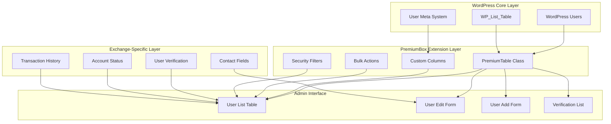
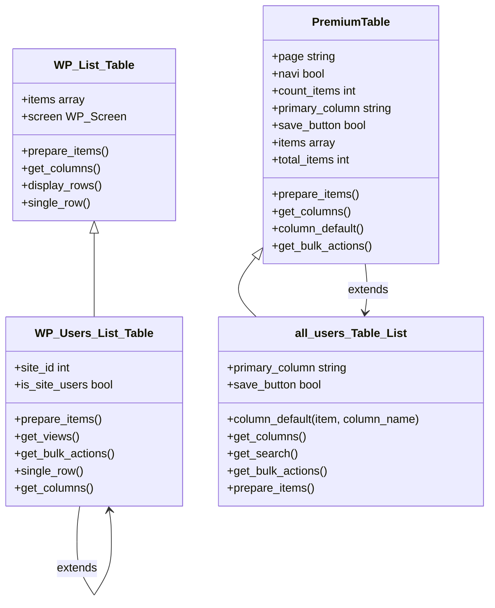
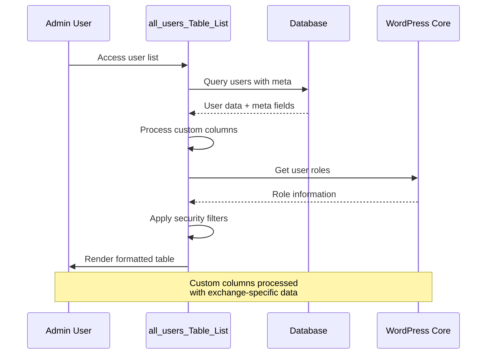
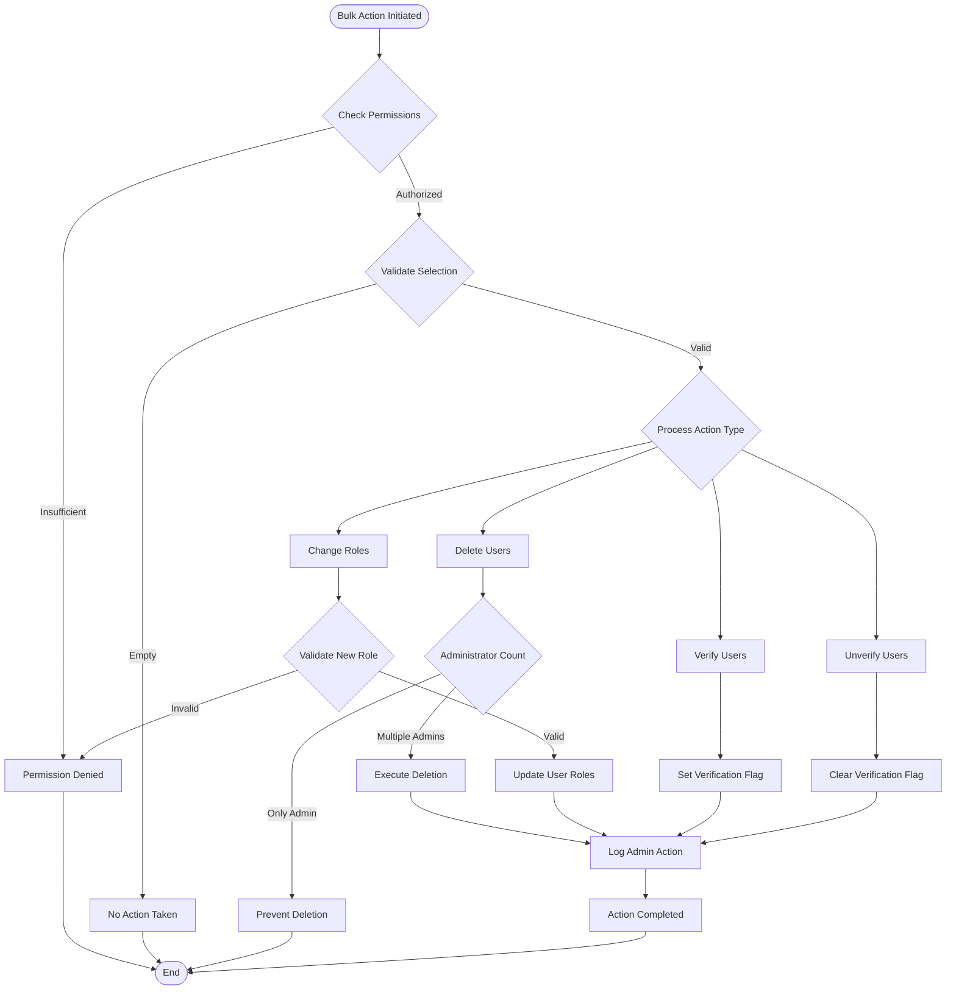
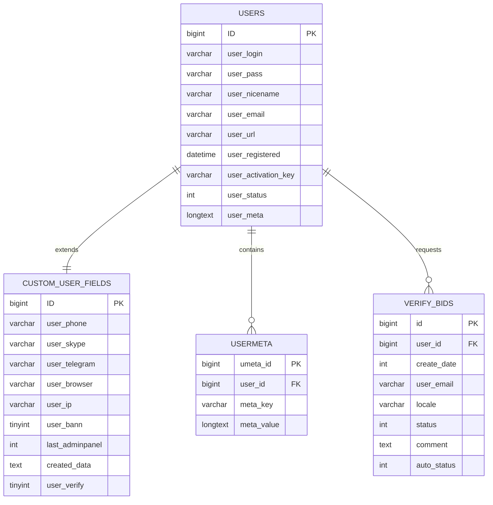
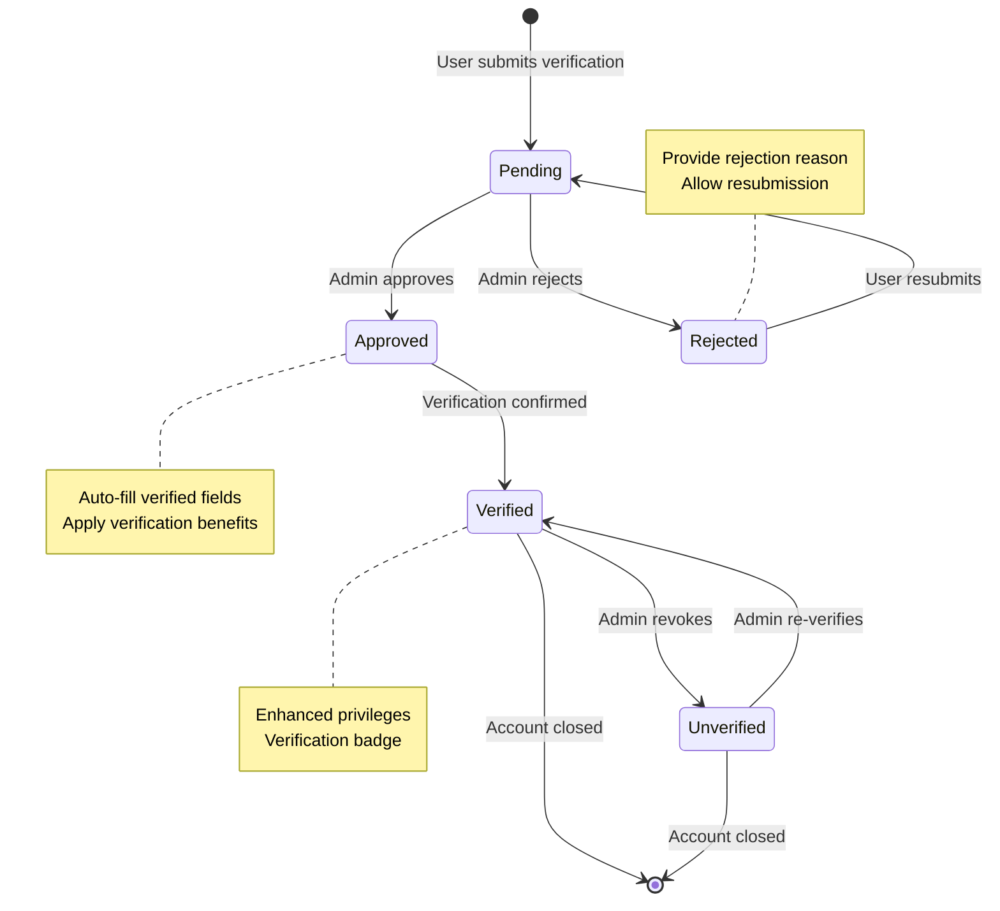
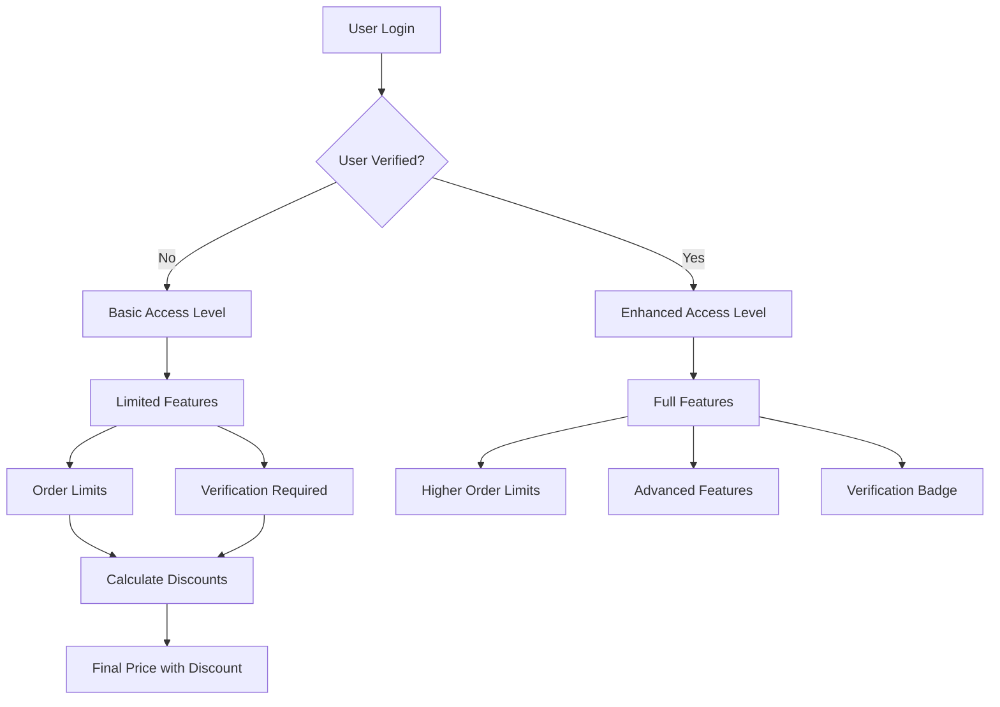
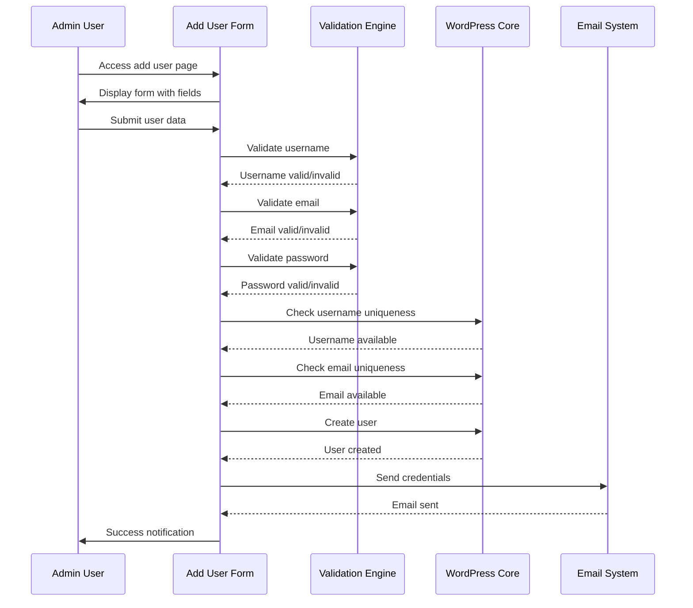
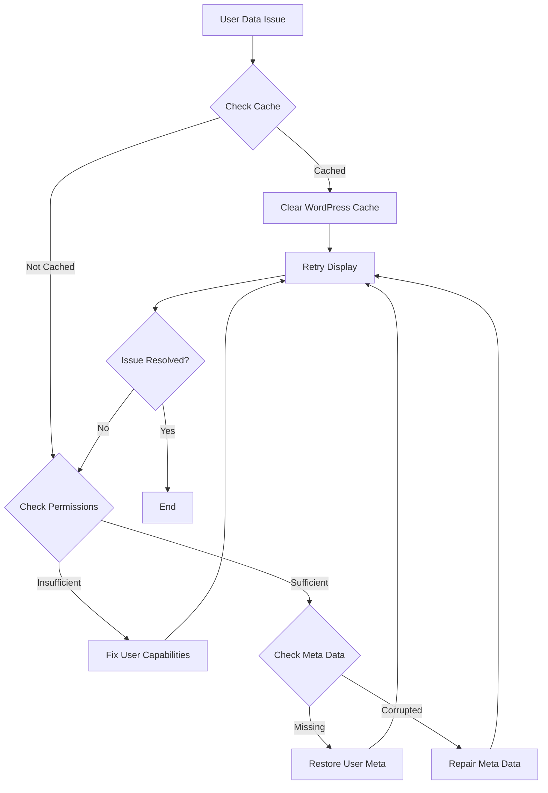
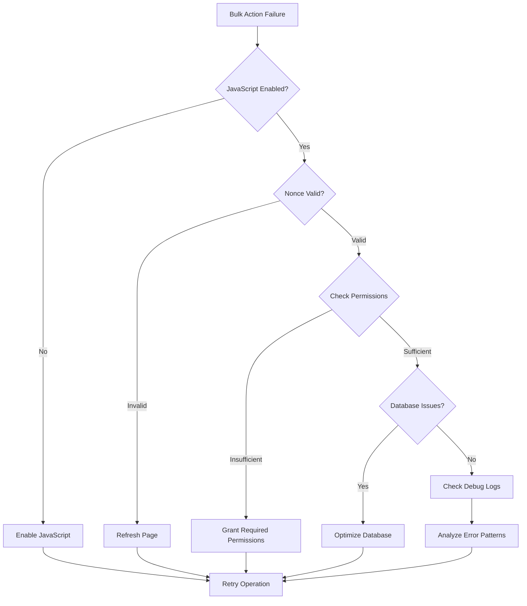

# User Management

<cite>
**Referenced Files in This Document**
- [wp-admin/includes/class-wp-users-list-table.php](file://wp-admin/includes/class-wp-users-list-table.php)
- [wp-admin/includes/class-wp-list-table.php](file://wp-admin/includes/class-wp-list-table.php)
- [wp-content/plugins/premiumbox/default/users/list_users.php](file://wp-content/plugins/premiumbox/default/users/list_users.php)
- [wp-content/plugins/premiumbox/premium/includes/class-list-table.php](file://wp-content/plugins/premiumbox/premium/includes/class-list-table.php)
- [wp-content/plugins/premiumbox/default/users/add_users.php](file://wp-content/plugins/premiumbox/default/users/add_users.php)
- [wp-content/plugins/premiumbox/default/users/edit_users.php](file://wp-content/plugins/premiumbox/default/users/edit_users.php)
- [wp-content/plugins/premiumbox/moduls/userverify/usve.php](file://wp-content/plugins/premiumbox/moduls/userverify/usve.php)
- [wp-content/plugins/premiumbox/moduls/userverify/filters.php](file://wp-content/plugins/premiumbox/moduls/userverify/filters.php)
- [wp-content/plugins/premiumbox/default/users/uf_settings.php](file://wp-content/plugins/premiumbox/default/users/uf_settings.php)
- [wp-admin/users.php](file://wp-admin/users.php)
- [wp-admin/includes/upgrade.php](file://wp-admin/includes/upgrade.php)
</cite>

## Table of Contents
1. [Introduction](#introduction)
2. [System Architecture](#system-architecture)
3. [WordPress List Table Implementation](#wordpress-list-table-implementation)
4. [Custom User Management Features](#custom-user-management-features)
5. [User Data Structure and Storage](#user-data-structure-and-storage)
6. [Security and Verification System](#security-and-verification-system)
7. [Admin Interface Components](#admin-interface-components)
8. [Common Issues and Troubleshooting](#common-issues-and-troubleshooting)
9. [Best Practices](#best-practices)
10. [Conclusion](#conclusion)

## Introduction

The user management system in this premium WordPress exchange platform provides comprehensive administrative capabilities for managing exchange users through a sophisticated interface built on WordPress List Table patterns. The system extends WordPress's native user management functionality with custom columns, specialized data fields, verification workflows, and enhanced security features tailored for cryptocurrency exchange operations.

The implementation combines WordPress's core user management infrastructure with custom extensions that handle exchange-specific requirements such as verification levels, transaction histories, and specialized contact information. The system maintains compatibility with WordPress standards while providing advanced administrative features necessary for professional exchange operations.

## System Architecture

The user management system follows a layered architecture that integrates seamlessly with WordPress while adding specialized exchange functionality:

**Diagram sources**
- [wp-admin/includes/class-wp-list-table.php](file://wp-admin/includes/class-wp-list-table.php#L15-L16)
- [wp-content/plugins/premiumbox/premium/includes/class-list-table.php](file://wp-content/plugins/premiumbox/premium/includes/class-list-table.php#L1-L42)

**Section sources**
- [wp-admin/includes/class-wp-users-list-table.php](file://wp-admin/includes/class-wp-users-list-table.php#L17-L684)
- [wp-content/plugins/premiumbox/premium/includes/class-list-table.php](file://wp-content/plugins/premiumbox/premium/includes/class-list-table.php#L1-L42)

## WordPress List Table Implementation

The system utilizes WordPress's native List Table framework as its foundation, extending it with custom functionality for exchange-specific user management.

### Core List Table Classes

The implementation consists of several key classes that work together to provide the user management interface:

**Diagram sources**
- [wp-admin/includes/class-wp-list-table.php](file://wp-admin/includes/class-wp-list-table.php#L15-L200)
- [wp-admin/includes/class-wp-users-list-table.php](file://wp-admin/includes/class-wp-users-list-table.php#L17-L684)
- [wp-content/plugins/premiumbox/premium/includes/class-list-table.php](file://wp-content/plugins/premiumbox/premium/includes/class-list-table.php#L1-L42)

### Custom Column Implementation

The custom user management system introduces specialized columns that go beyond WordPress's standard user table:

| Column Name | Purpose | Data Source | Custom Features |
|-------------|---------|-------------|-----------------|
| `user_id` | Unique identifier | WordPress users table | Fixed width, sortable |
| `username` | User login name | WordPress users table | Editable links, role indicators |
| `register_date` | Registration timestamp | WordPress users table | Formatted date display |
| `user_email` | Contact email | WordPress users table | Mailto link, clickable |
| `role` | User role assignment | WordPress usermeta | Role name translation |
| `last_adminpanel` | Last admin activity | Custom meta field | Timestamp conversion |
| `user_phone` | Mobile contact | Custom user meta | Contact method display |
| `user_skype` | Skype identifier | Custom user meta | Contact method display |
| `user_telegram` | Telegram handle | Custom user meta | Contact method display |
| `user_browser` | Browser detection | Custom meta field | User agent parsing |
| `user_ip` | IP address tracking | Custom meta field | IP display, security context |
| `user_bann` | Block status | Custom meta field | Visual indicators, status flags |

**Section sources**
- [wp-content/plugins/premiumbox/default/users/list_users.php](file://wp-content/plugins/premiumbox/default/users/list_users.php#L168-L220)
- [wp-content/plugins/premiumbox/default/users/list_users.php](file://wp-content/plugins/premiumbox/default/users/list_users.php#L238-L271)

## Custom User Management Features

### Enhanced User Listing

The custom user management system provides advanced user listing capabilities through the `all_users_Table_List` class, which extends the PremiumTable functionality:

**Diagram sources**
- [wp-content/plugins/premiumbox/default/users/list_users.php](file://wp-content/plugins/premiumbox/default/users/list_users.php#L330-L383)

### Bulk Action Management

The system implements sophisticated bulk action capabilities for efficient user management:

**Diagram sources**
- [wp-content/plugins/premiumbox/default/users/list_users.php](file://wp-content/plugins/premiumbox/default/users/list_users.php#L32-L146)

**Section sources**
- [wp-content/plugins/premiumbox/default/users/list_users.php](file://wp-content/plugins/premiumbox/default/users/list_users.php#L305-L316)
- [wp-content/plugins/premiumbox/default/users/list_users.php](file://wp-content/plugins/premiumbox/default/users/list_users.php#L32-L146)

## User Data Structure and Storage

### Database Schema Integration

The user management system integrates with WordPress's user and usermeta tables while adding custom fields for exchange-specific data:

**Diagram sources**
- [wp-content/plugins/premiumbox/default/users/list_users.php](file://wp-content/plugins/premiumbox/default/users/list_users.php#L366-L369)
- [wp-content/plugins/premiumbox/moduls/userverify/usve.php](file://wp-content/plugins/premiumbox/moduls/userverify/usve.php#L53-L84)

### Custom User Meta Fields

The system defines several custom user meta fields that extend WordPress's standard user profile:

| Field Name | Data Type | Purpose | Storage Method |
|------------|-----------|---------|----------------|
| `user_phone` | VARCHAR(255) | Mobile phone contact | Custom user table field |
| `user_skype` | VARCHAR(255) | Skype identifier | Custom user table field |
| `user_telegram` | VARCHAR(255) | Telegram handle | Custom user table field |
| `user_browser` | TEXT | Browser identification | Custom user table field |
| `user_ip` | VARCHAR(45) | IP address tracking | Custom user table field |
| `user_bann` | TINYINT(1) | Block status flag | Custom user table field |
| `last_adminpanel` | INT | Last admin activity timestamp | Custom user table field |
| `created_data` | TEXT | Creation metadata | Serialized JSON in users table |
| `user_verify` | TINYINT(1) | Verification status | Custom user table field |

**Section sources**
- [wp-content/plugins/premiumbox/default/users/uf_settings.php](file://wp-content/plugins/premiumbox/default/users/uf_settings.php#L1-L55)
- [wp-content/plugins/premiumbox/default/users/list_users.php](file://wp-content/plugins/premiumbox/default/users/list_users.php#L168-L220)

## Security and Verification System

### Identity Verification Workflow

The system implements a comprehensive identity verification process that integrates with the user management interface:

**Diagram sources**
- [wp-content/plugins/premiumbox/moduls/userverify/usve.php](file://wp-content/plugins/premiumbox/moduls/userverify/usve.php#L21-L115)
- [wp-content/plugins/premiumbox/moduls/userverify/filters.php](file://wp-content/plugins/premiumbox/moduls/userverify/filters.php#L43-L80)

### Access Control and Permissions

The verification system implements granular access controls based on user verification status:

**Diagram sources**
- [wp-content/plugins/premiumbox/moduls/userverify/filters.php](file://wp-content/plugins/premiumbox/moduls/userverify/filters.php#L43-L80)

**Section sources**
- [wp-content/plugins/premiumbox/moduls/userverify/usve.php](file://wp-content/plugins/premiumbox/moduls/userverify/usve.php#L21-L200)
- [wp-content/plugins/premiumbox/moduls/userverify/filters.php](file://wp-content/plugins/premiumbox/moduls/userverify/filters.php#L43-L80)

## Admin Interface Components

### User Addition Interface

The system provides a dedicated interface for adding new users with exchange-specific fields:

**Diagram sources**
- [wp-content/plugins/premiumbox/default/users/add_users.php](file://wp-content/plugins/premiumbox/default/users/add_users.php#L96-L169)

### User Editing Interface

The editing interface provides comprehensive user modification capabilities with exchange-specific fields:

| Field Category | Fields | Purpose | Validation |
|----------------|--------|---------|------------|
| Basic Information | Username, Email, Password | Core user identification | WordPress validation rules |
| Contact Information | Phone, Skype, Telegram | Exchange communication | Format validation |
| Administrative Settings | Confirm Deletion, Mini Navigation | User preferences | Boolean values |
| Security Settings | User Ban Status | Access control | Status flags |
| Verification Status | Verification level | Trust assessment | Boolean with workflow |

**Section sources**
- [wp-content/plugins/premiumbox/default/users/edit_users.php](file://wp-content/plugins/premiumbox/default/users/edit_users.php#L83-L135)
- [wp-content/plugins/premiumbox/default/users/add_users.php](file://wp-content/plugins/premiumbox/default/users/add_users.php#L36-L83)

## Common Issues and Troubleshooting

### User Data Display Issues

**Problem**: User data not displaying correctly in the admin interface

**Symptoms**:
- Missing user information in custom columns
- Incorrect role display
- Broken links in user listings
- Formatting errors in date/time fields

**Root Causes**:
1. **Database inconsistencies**: Missing or corrupted user meta data
2. **Caching issues**: Stale data in WordPress object cache
3. **Permission problems**: Insufficient capabilities to access user data
4. **Filter conflicts**: Custom filters interfering with data retrieval

**Solutions**:

**Implementation Steps**:
1. **Clear WordPress cache** using `wp_cache_flush()` or cache plugin
2. **Verify user capabilities** using `current_user_can()` checks
3. **Check database integrity** with `get_userdata()` calls
4. **Validate custom filters** using `remove_all_filters()` temporarily

### Bulk Action Failures

**Problem**: Bulk actions failing or not executing properly

**Symptoms**:
- Bulk actions not appearing in dropdown
- Actions executing but not affecting users
- Permission denied errors during bulk operations
- Partial execution with some users affected

**Root Causes**:
1. **JavaScript conflicts**: jQuery or other scripts interfering
2. **CSRF protection**: Missing or invalid nonce values
3. **Permission escalation**: Insufficient capabilities for bulk operations
4. **Database transaction issues**: Long-running queries timing out

**Solutions**:

### Permission Conflicts

**Problem**: Users experiencing permission-related issues

**Symptoms**:
- Cannot edit certain users
- Bulk actions restricted
- Role changes not applying
- Access denied errors

**Root Causes**:
1. **Administrator protection**: Single administrator remaining issue
2. **Capability inheritance**: Role capability conflicts
3. **Custom capability filters**: Plugin interference
4. **Network restrictions**: Multisite capability limitations

**Solutions**:

| Issue Type | Cause | Solution | Implementation |
|------------|-------|----------|----------------|
| Single Admin Protection | Deleting last administrator | Check administrator count | SQL query before deletion |
| Capability Conflicts | Role capability overlap | Review capability hierarchy | `get_editable_roles()` analysis |
| Plugin Interference | Custom capability filters | Disable conflicting plugins | Filter priority adjustment |
| Network Restrictions | Multisite limitations | Check network capabilities | `current_user_can('manage_network_users')` |

**Section sources**
- [wp-content/plugins/premiumbox/default/users/list_users.php](file://wp-content/plugins/premiumbox/default/users/list_users.php#L32-L146)
- [wp-admin/users.php](file://wp-admin/users.php#L204-L272)

## Best Practices

### Database Query Optimization

When working with user data queries, follow these optimization practices:

1. **Use appropriate joins**: Prefer INNER JOIN over LEFT JOIN when only matching records are needed
2. **Index user meta keys**: Ensure proper indexing on frequently queried meta keys
3. **Limit result sets**: Use pagination and limit clauses for large datasets
4. **Cache user data**: Implement object caching for frequently accessed user information
5. **Batch operations**: Group related user updates into single database transactions

### Security Considerations

Implement these security measures for user management operations:

1. **Input validation**: Always validate and sanitize user input using WordPress sanitization functions
2. **Capability checks**: Verify user capabilities before performing sensitive operations
3. **Nonce verification**: Use WordPress nonces for all form submissions and AJAX requests
4. **Rate limiting**: Implement rate limiting for bulk operations to prevent abuse
5. **Audit logging**: Log all user management actions for security monitoring

### Performance Optimization

Optimize user management performance through these techniques:

1. **Lazy loading**: Load user meta data only when needed
2. **Pagination**: Implement proper pagination for large user lists
3. **Caching strategies**: Use appropriate caching mechanisms for user data
4. **Database indexing**: Ensure proper indexing on user and meta tables
5. **Memory management**: Clear unused user data from memory after processing

## Conclusion

The user management system in this premium WordPress exchange platform demonstrates a sophisticated implementation that extends WordPress's native capabilities with exchange-specific functionality. Through the integration of WordPress List Table patterns with custom PremiumTable extensions, the system provides administrators with powerful tools for managing exchange users while maintaining compatibility with WordPress standards.

Key strengths of the implementation include:

- **Extensible architecture**: Clean separation between WordPress core functionality and custom exchange features
- **Comprehensive verification system**: Robust identity verification workflow with automated field population
- **Flexible column system**: Customizable user table columns with exchange-specific data fields
- **Secure bulk operations**: Sophisticated bulk action handling with permission validation
- **Integrated security**: Built-in protection against common user management vulnerabilities

The system successfully addresses the complex requirements of professional exchange user management while providing an intuitive administrative interface. The combination of WordPress's proven user management foundation with custom exchange-specific enhancements creates a robust platform capable of handling the demands of modern cryptocurrency exchange operations.

Future enhancements could include real-time user activity monitoring, advanced analytics dashboards, and expanded verification workflow automation. The modular architecture ensures that such improvements can be implemented without disrupting existing functionality.