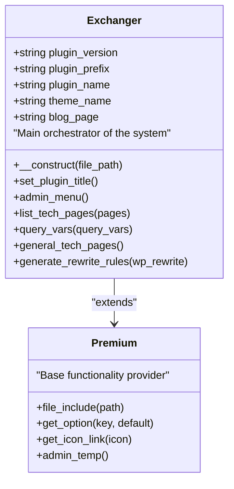
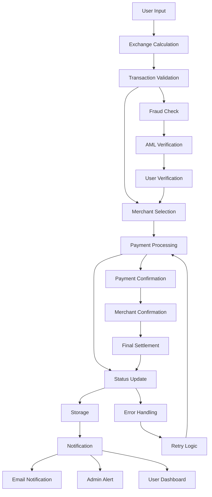
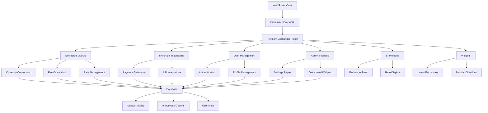

# Core Architecture

<cite>
**Referenced Files in This Document**   
- [premiumbox.php](file://wp-content/plugins/premiumbox/premiumbox.php)
- [class-plugin.php](file://wp-content/plugins/premiumbox/includes/class-plugin.php)
- [functions.php](file://wp-content/plugins/premiumbox/includes/functions.php)
- [post_types.php](file://wp-content/plugins/premiumbox/includes/post_types.php)
- [index.php](file://wp-content/plugins/premiumbox/premium/index.php)
- [class-premium.php](file://wp-content/plugins/premiumbox/premium/includes/class-premium.php)
- [exchange/index.php](file://wp-content/plugins/premiumbox/plugin/exchange/index.php)
- [merchants/index.php](file://wp-content/plugins/premiumbox/merchants/index.php)
</cite>

## Table of Contents
1. [Introduction](#introduction)
2. [Project Structure](#project-structure)
3. [Core Components](#core-components)
4. [Architecture Overview](#architecture-overview)
5. [Detailed Component Analysis](#detailed-component-analysis)
6. [Dependency Analysis](#dependency-analysis)
7. [Performance Considerations](#performance-considerations)
8. [Troubleshooting Guide](#troubleshooting-guide)
9. [Conclusion](#conclusion)

## Introduction
The Premium Exchanger core system is a modular WordPress plugin designed for professional e-currency exchange operations. This document provides comprehensive architectural documentation for the system, detailing its modular design, separation of concerns, and integration with the WordPress ecosystem. The architecture follows a structured approach with clear separation between business logic, data access, and presentation layers, leveraging WordPress hooks for event-driven design. The system is built to handle complex exchange operations, merchant integrations, and transaction processing within the constraints of the WordPress platform.

## Project Structure
The Premium Exchanger plugin follows a well-organized directory structure that separates concerns and facilitates modular development. The main components are organized into distinct directories, each serving a specific purpose in the system architecture.

```mermaid
graph TB
A[Premium Exchanger Plugin] --> B[activation]
A --> C[amlcheck]
A --> D[default]
A --> E[includes]
A --> F[languages]
A --> G[merchants]
A --> H[moduls]
A --> I[paymerchants]
A --> J[plugin]
A --> K[premium]
A --> L[shortcode]
A --> M[sms]
A --> N[wchecks]
A --> O[widget]
A --> P[index.php]
A --> Q[premiumbox.php]
A --> R[style.css]
A --> S[userdata.php]
B --> B1[db.php]
B --> B2[index.php]
B --> B3[migrate.php]
C --> C1[amlbot]
C --> C2[bitok]
C --> C3[coinkyt]
C --> C4[getblock]
C --> C5[index.php]
D --> D1[admin]
D --> D2[captcha]
D --> D3[globalajax]
D --> D4[lang]
D --> D5[logs_settings]
D --> D6[newadminpanel]
D --> D7[roles]
D --> D8[rtl]
D --> D9[up_mode]
D --> D10[users]
D --> D11[cron.php]
D --> D12[index.php]
D --> D13[mail_temps.php]
D --> D14[moduls.php]
D --> D15[settings.php]
D --> D16[themesettings.php]
E --> E1[class-plugin.php]
E --> E2[deprecated.php]
E --> E3[functions.php]
E --> E4[hashed_bd_functions.php]
E --> E5[hashed_functions.php]
E --> E6[index.php]
E --> E7[migrate-constants.php]
E --> E8[post_types.php]
G --> G1[abcex_crypto]
G --> G2[advcash]
G --> G3[aipay]
G --> G4[alfabit_crypto]
G --> G5[anymoney]
G --> G6[bankoro]
G --> G7[bimbo_account]
G --> G8[bimbo_url]
G --> G9[bitbanker]
G --> G10[bitconce_card]
G --> G11[bitconce_link]
G --> G12[coinbase]
G --> G13[coinpayments]
G --> G14[cryptocash_crypto]
G --> G15[diffpay]
G --> G16[epaycore]
G --> G17[evo]
G --> G18[exnode]
G --> G19[finora]
G --> G20[firekassa_card]
G --> G21[firekassa_link]
G --> G22[goatx]
G --> G23[heleket]
G --> G24[iac]
G --> G25[ivanpay]
G --> G26[koshelek_ru]
G --> G27[luckypay]
G --> G28[merchant001]
G --> G29[moneygo]
G --> G30[nicepay]
G --> G31[nixmoney]
G --> G32[odysseq]
G --> G33[onlypays]
G --> G34[optimoney]
G --> G35[pandapay]
G --> G36[paycrown]
G --> G37[payeer]
G --> G38[paykassa]
G --> G39[paymatrix]
G --> G40[paypal]
G --> G41[payscrow]
G --> G42[payscrow_cascade]
G --> G43[perfectmoney]
G --> G44[pspware]
G --> G45[quickex]
G --> G46[quixfer]
G --> G47[rapira]
G --> G48[supermoney]
G --> G49[trustixpay]
G --> G50[utopia]
G --> G51[utopia_coupon]
G --> G52[webmoney]
G --> G53[westwallet]
G --> G54[xpaypro]
G --> G55[yamoney]
G --> G56[yobit]
G --> G57[index.php]
J --> J1[migrate]
J --> J2[admin]
J --> J3[config]
J --> J4[contacts]
J --> J5[update]
J --> J6[users]
J --> J7[directions]
J --> J8[currency]
J --> J9[reserv]
J --> J10[exchange]
J --> J11[bids]
J --> J12[merchants]
J --> J13[stats]
J --> J14[exchange_filters]
K --> K1[includes]
K --> K2[js]
K --> K3[languages]
K --> K4[all_style.css]
K --> K5[index.php]
K --> K6[style.css]
K1 --> K11[class-extension.php]
K1 --> K12[class-form.php]
K1 --> K13[class-list-table.php]
K1 --> K14[class-premium.php]
K1 --> K15[comment_system.php]
K1 --> K16[constructs.php]
K1 --> K17[cookie.php]
K1 --> K18[db.php]
K1 --> K19[default-constants.php]
K1 --> K110[files_functions.php]
K1 --> K111[functions.php]
K1 --> K112[index.php]
K1 --> K113[init_cron.php]
K1 --> K114[init_page.php]
K1 --> K115[lang_filters.php]
K1 --> K116[lang_functions.php]
K1 --> K117[mail_filters.php]
K1 --> K118[menu_filters.php]
K1 --> K119[pagenavi.php]
K1 --> K120[rtl_functions.php]
K1 --> K121[security.php]
K1 --> K122[wp_comments.php]
```

**Diagram sources**
- [premiumbox.php](file://wp-content/plugins/premiumbox/premiumbox.php)
- [class-plugin.php](file://wp-content/plugins/premiumbox/includes/class-plugin.php)

**Section sources**
- [premiumbox.php](file://wp-content/plugins/premiumbox/premiumbox.php)
- [class-plugin.php](file://wp-content/plugins/premiumbox/includes/class-plugin.php)

## Core Components
The Premium Exchanger system consists of several core components that work together to provide a comprehensive e-currency exchange platform. The main plugin class serves as the central orchestrator, managing the initialization and coordination of various modules. The modular architecture allows for extensibility through merchant integrations, exchange direction management, and user account systems. Business logic is separated from data access and presentation layers, following a MVC-like pattern within the WordPress plugin framework. The system leverages WordPress hooks extensively for event-driven interactions between components.

**Section sources**
- [premiumbox.php](file://wp-content/plugins/premiumbox/premiumbox.php)
- [class-plugin.php](file://wp-content/plugins/premiumbox/includes/class-plugin.php)

## Architecture Overview
The Premium Exchanger architecture is built as a modular WordPress plugin with a clear separation of concerns between different layers of functionality. The system follows an event-driven design pattern using WordPress hooks to facilitate communication between components. The architecture can be understood as having three main layers: presentation, business logic, and data access, with additional cross-cutting concerns like security and logging.

```mermaid
graph TD
A[WordPress Core] --> B[Premium Exchanger Plugin]
B --> C[Main Plugin Class]
C --> D[Business Logic Layer]
C --> E[Data Access Layer]
C --> F[Presentation Layer]
C --> G[Event System]
D --> H[Exchange Calculation]
D --> I[Transaction Processing]
D --> J[Merchant Integration]
D --> K[User Management]
E --> L[Database Operations]
E --> M[Option Storage]
E --> N[Custom Post Types]
F --> O[Admin Interface]
F --> P[Frontend Templates]
F --> Q[Shortcodes]
F --> R[Widgets]
G --> S[Action Hooks]
G --> T[Filter Hooks]
H --> U[Exchange Rates]
H --> V[Fee Calculation]
H --> W[Currency Conversion]
I --> X[Order Status Management]
I --> Y[Payment Processing]
I --> Z[Fraud Detection]
J --> AA[Merchant APIs]
J --> AB[Payment Gateways]
J --> AC[Currency Support]
K --> AD[User Authentication]
K --> AE[Profile Management]
K --> AF[Role-Based Access]
L --> AG[Custom Tables]
L --> AH[WordPress Options]
L --> AI[User Meta]
M --> AJ[Settings Storage]
M --> AK[Configuration]
M --> AL[Cache Management]
N --> AM[Exchange Directions]
N --> AN[Transaction Records]
N --> AO[User Accounts]
S --> AP[add_action]
S --> AQ[do_action]
T --> AR[add_filter]
T --> AS[apply_filters]
```

**Diagram sources**
- [premiumbox.php](file://wp-content/plugins/premiumbox/premiumbox.php)
- [class-plugin.php](file://wp-content/plugins/premiumbox/includes/class-plugin.php)
- [functions.php](file://wp-content/plugins/premiumbox/includes/functions.php)

## Detailed Component Analysis

### Main Plugin Class Analysis
The main plugin class serves as the central component of the Premium Exchanger system, extending the base Premium class and initializing all subsystems. It follows the singleton pattern with a global instance accessible throughout the application.

**Diagram sources**
- [class-plugin.php](file://wp-content/plugins/premiumbox/includes/class-plugin.php)
- [premium/index.php](file://wp-content/plugins/premiumbox/premium/index.php)

### Merchant Integration System
The merchant integration system is a key component of the Premium Exchanger architecture, allowing for flexible integration with various payment processors and currency providers. Each merchant has its own directory with class and index files, following a consistent interface.

```mermaid
graph TD
A[Merchants Directory] --> B[abcex_crypto]
A --> C[advcash]
A --> D[aipay]
A --> E[alfabit_crypto]
A --> F[anymoney]
A --> G[bankoro]
A --> H[bimbo_account]
A --> I[bimbo_url]
A --> J[bitbanker]
A --> K[bitconce_card]
A --> L[bitconce_link]
A --> M[coinbase]
A --> N[coinpayments]
A --> O[cryptocash_crypto]
A --> P[diffpay]
A --> Q[epaycore]
A --> R[evo]
A --> S[exnode]
A --> T[finora]
A --> U[firekassa_card]
A --> V[firekassa_link]
A --> W[goatx]
A --> X[heleket]
A --> Y[iac]
A --> Z[ivanpay]
A --> AA[koshelek_ru]
A --> AB[luckypay]
A --> AC[merchant001]
A --> AD[moneygo]
A --> AE[nicepay]
A --> AF[nixmoney]
A --> AG[odysseq]
A --> AH[onlypays]
A --> AI[optimoney]
A --> AJ[pandapay]
A --> AK[paycrown]
A --> AL[payeer]
A --> AM[paykassa]
A --> AN[paymatrix]
A --> AO[paypal]
A --> AP[payscrow]
A --> AQ[payscrow_cascade]
A --> AR[perfectmoney]
A --> AS[pspware]
A --> AT[quickex]
A --> AU[quixfer]
A --> AV[rapira]
A --> AW[supermoney]
A --> AX[trustixpay]
A --> AY[utopia]
A --> AZ[utopia_coupon]
A --> BA[webmoney]
A --> BB[westwallet]
A --> BC[xpaypro]
A --> BD[yamoney]
A --> BE[yobit]
B --> B1[class.php]
B --> B2[index.php]
C --> C1[class.php]
C --> C2[index.php]
D --> D1[class.php]
D --> D2[index.php]
E --> E1[class.php]
E --> E2[index.php]
F --> F1[class.php]
F --> F2[index.php]
G --> G1[class.php]
G --> G2[index.php]
H --> H1[index.php]
I --> I1[index.php]
J --> J1[class.php]
J --> J2[index.php]
K --> K1[class.php]
K --> K2[index.php]
L --> L1[class.php]
L --> L2[index.php]
M --> M1[class.php]
M --> M2[index.php]
N --> N1[class.php]
N --> N2[index.php]
O --> O1[class.php]
O --> O2[index.php]
P --> P1[class.php]
P --> P2[index.php]
Q --> Q1[class.php]
Q --> Q2[index.php]
R --> R1[class.php]
R --> R2[index.php]
S --> S1[class.php]
S --> S2[index.php]
T --> T1[class.php]
T --> T2[index.php]
U --> U1[class.php]
U --> U2[index.php]
V --> V1[class.php]
V --> V2[index.php]
W --> W1[class.php]
W --> W2[index.php]
X --> X1[class.php]
X --> X2[index.php]
Y --> Y1[index.php]
Z --> Z1[class.php]
Z --> Z2[index.php]
AA --> AA1[class.php]
AA --> AA2[index.php]
AB --> AB1[class.php]
AB --> AB2[index.php]
AC --> AC1[class.php]
AC --> AC2[index.php]
AD --> AD1[class.php]
AD --> AD2[index.php]
AE --> AE1[class.php]
AE --> AE2[index.php]
AF --> AF1[class.php]
AF --> AF2[index.php]
AG --> AG1[class.php]
AG --> AG2[index.php]
AH --> AH1[class.php]
AH --> AH2[index.php]
AI --> AI1[class.php]
AI --> AI2[index.php]
AJ --> AJ1[class.php]
AJ --> AJ2[index.php]
AK --> AK1[class.php]
AK --> AK2[index.php]
AL --> AL1[index.php]
AM --> AM1[class.php]
AM --> AM2[index.php]
AN --> AN1[class.php]
AN --> AN2[index.php]
AO --> AO1[index.php]
AP --> AP1[class.php]
AP --> AP2[index.php]
AQ --> AQ1[class.php]
AQ --> AQ2[index.php]
AR --> AR1[class.php]
AR --> AR2[index.php]
AS --> AS1[class.php]
AS --> AS2[index.php]
AT --> AT1[class.php]
AT --> AT2[index.php]
AU --> AU1[class.php]
AU --> AU2[index.php]
AV --> AV1[class.php]
AV --> AV2[index.php]
AW --> AW1[class.php]
AW --> AW2[index.php]
AX --> AX1[class.php]
AX --> AX2[index.php]
AY --> AY1[class.php]
AY --> AY2[index.php]
AZ --> AZ1[index.php]
BA --> BA1[class.php]
BA --> BA2[index.php]
BB --> BB1[class.php]
BB --> BB2[index.php]
BC --> BC1[class.php]
BC --> BC2[index.php]
BD --> BD1[class.php]
BD --> BD2[index.php]
BE --> BE1[class.php]
BE --> BE2[index.php]
A --> A57[index.php]
```

**Diagram sources**
- [merchants/index.php](file://wp-content/plugins/premiumbox/merchants/index.php)
- [premiumbox.php](file://wp-content/plugins/premiumbox/premiumbox.php)

### Exchange Processing Workflow
The exchange processing workflow handles the complete lifecycle of an exchange transaction, from user input to final processing and storage. The system uses a state machine approach with various status transitions to manage order states.

**Diagram sources**
- [exchange/index.php](file://wp-content/plugins/premiumbox/plugin/exchange/index.php)
- [functions.php](file://wp-content/plugins/premiumbox/includes/functions.php)

**Section sources**
- [exchange/index.php](file://wp-content/plugins/premiumbox/plugin/exchange/index.php)
- [functions.php](file://wp-content/plugins/premiumbox/includes/functions.php)

## Dependency Analysis
The Premium Exchanger system has a well-defined dependency structure that follows the WordPress plugin architecture. The main plugin depends on the base Premium framework, which provides core functionality, while various modules depend on the main plugin instance for access to shared resources and configuration.

**Diagram sources**
- [premiumbox.php](file://wp-content/plugins/premiumbox/premiumbox.php)
- [class-plugin.php](file://wp-content/plugins/premiumbox/includes/class-plugin.php)
- [premium/index.php](file://wp-content/plugins/premiumbox/premium/index.php)

## Performance Considerations
The Premium Exchanger system is designed to handle high transaction volumes with considerations for scalability and performance. The architecture leverages WordPress caching mechanisms and database optimization techniques to ensure responsive performance under load. The modular design allows for horizontal scaling of merchant integration components, while the event-driven architecture enables asynchronous processing of time-consuming operations like payment confirmations and fraud checks. The system utilizes WordPress cron for scheduled tasks and background processing, reducing the impact on user-facing operations.

## Troubleshooting Guide
The Premium Exchanger system includes comprehensive error handling and logging mechanisms to facilitate troubleshooting and debugging. The system uses a detailed status management approach with various order states that help identify issues in the transaction flow. The architecture includes hooks for monitoring and alerting, allowing administrators to track system health and performance metrics. The modular design enables isolation of issues to specific components, such as merchant integrations or exchange calculation modules, simplifying the debugging process.

**Section sources**
- [functions.php](file://wp-content/plugins/premiumbox/includes/functions.php)
- [class-plugin.php](file://wp-content/plugins/premiumbox/includes/class-plugin.php)

## Conclusion
The Premium Exchanger core system demonstrates a sophisticated architectural approach to building a complex e-currency exchange platform within the WordPress ecosystem. By leveraging WordPress hooks for event-driven design and following a modular plugin architecture, the system achieves a clean separation of concerns between business logic, data access, and presentation layers. The architecture balances tight WordPress integration with standalone system capabilities, allowing for extensibility through merchant integrations and custom modules. The system's design considerations for scalability, security, and maintainability make it well-suited for handling high transaction volumes in a production environment.