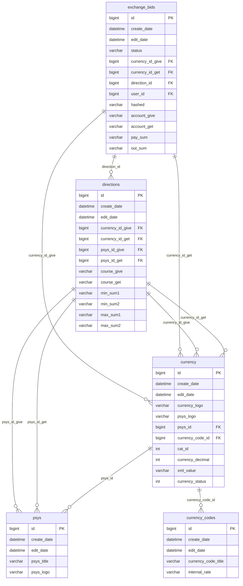
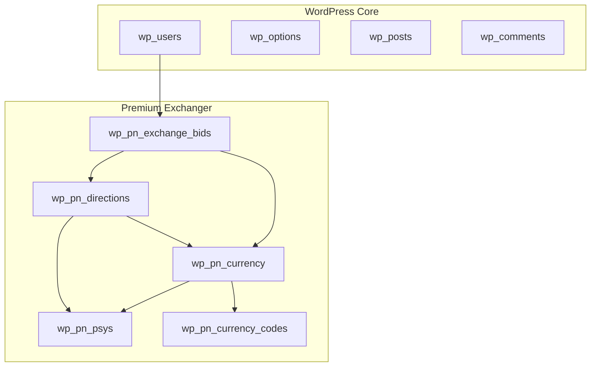

# Data Modeling

<cite>
**Referenced Files in This Document**   
- [db.php](file://wp-content/plugins/premiumbox/activation/db.php)
- [functions.php](file://wp-content/plugins/premiumbox/includes/functions.php)
- [exchange.php](file://wp-content/plugins/premiumbox/moduls/export/exchange.php)
- [merch_func.php](file://wp-content/plugins/premiumbox/plugin/merchants/merch_func.php)
- [directions.php](file://wp-content/plugins/premiumbox/plugin/directions/functions.php)
</cite>

## Table of Contents
1. [Introduction](#introduction)
2. [Core Data Entities](#core-data-entities)
3. [Custom Post Types and Data Structures](#custom-post-types-and-data-structures)
4. [Entity Relationships](#entity-relationships)
5. [Field Definitions and Meta Information](#field-definitions-and-meta-information)
6. [Data Validation and Sanitization](#data-validation-and-sanitization)
7. [Database Schema and WordPress Integration](#database-schema-and-wordpress-integration)
8. [Data Access Patterns](#data-access-patterns)
9. [Performance Considerations](#performance-considerations)
10. [Data Lifecycle Management](#data-lifecycle-management)

## Introduction
The Premium Exchanger system implements a comprehensive data model for managing currency exchange operations, with specialized data structures for exchange transactions, currency pairs, exchange directions, and merchant accounts. Built on WordPress, the system extends the native platform with custom database tables and data relationships to support complex exchange operations. This documentation details the complete data model, including entity relationships, field definitions, validation mechanisms, and performance optimization strategies.

## Core Data Entities

The Premium Exchanger system is built around several core data entities that represent the fundamental components of the exchange platform. These entities include exchange transactions, currency pairs, exchange directions, and merchant accounts, each with specific attributes and relationships that enable the system's functionality.

**Section sources**
- [db.php](file://wp-content/plugins/premiumbox/activation/db.php#L340-L400)
- [functions.php](file://wp-content/plugins/premiumbox/includes/functions.php#L166-L192)

## Custom Post Types and Data Structures

The Premium Exchanger system implements custom data structures through dedicated database tables rather than WordPress custom post types. These tables are created and managed through the plugin's activation process and include specialized fields for exchange operations.

### Exchange Transactions (exchange_bids)
The `exchange_bids` table stores all exchange transaction records with comprehensive details about each exchange operation.

### Currency Management (currency)
The `currency` table manages currency definitions with attributes for display, formatting, and operational parameters.

### Exchange Directions (directions)
The `directions` table defines available exchange routes between currency pairs with pricing, limits, and commission structures.

### Payment Systems (psys)
The `psys` table manages payment system configurations used in exchange operations.

### Currency Codes (currency_codes)
The `currency_codes` table stores currency code definitions with internal rate information.

**Section sources**
- [db.php](file://wp-content/plugins/premiumbox/activation/db.php#L8-L400)

## Entity Relationships

The Premium Exchanger system implements a relational data model with well-defined relationships between entities. These relationships enable the system to track exchange operations from initiation through completion while maintaining data integrity.

**Diagram sources **
- [db.php](file://wp-content/plugins/premiumbox/activation/db.php#L340-L400)
- [db.php](file://wp-content/plugins/premiumbox/activation/db.php#L226-L295)
- [db.php](file://wp-content/plugins/premiumbox/activation/db.php#L75-L112)

## Field Definitions and Meta Information

### Exchange Transactions (exchange_bids) Fields
The exchange_bids table contains comprehensive information about each exchange transaction:

- **id**: Primary key, auto-incrementing identifier
- **create_date**: Timestamp of record creation
- **edit_date**: Timestamp of last modification
- **status**: Current status of the exchange (e.g., 'new', 'payed', 'success')
- **currency_id_give**: Foreign key to currency table for source currency
- **currency_id_get**: Foreign key to currency table for target currency
- **currency_code_give**: Currency code for source currency
- **currency_code_get**: Currency code for target currency
- **psys_give**: Payment system information for source
- **psys_get**: Payment system information for target
- **direction_id**: Foreign key to directions table
- **user_id**: WordPress user ID associated with the exchange
- **user_login**: User login name
- **user_ip**: User IP address
- **user_agent**: User agent string
- **account_give**: Source account information
- **account_get**: Target account information
- **pay_sum**: Amount to be paid by user
- **out_sum**: Amount to be received by user
- **to_account**: Destination account number
- **from_account**: Source account number
- **dest_tag**: Destination tag/memo
- **txid_in**: Transaction ID for incoming payment
- **txid_out**: Transaction ID for outgoing payment
- **course_give**: Exchange rate for source currency
- **course_get**: Exchange rate for target currency

### Exchange Directions (directions) Fields
The directions table defines exchange routes with pricing and operational parameters:

- **id**: Primary key, auto-incrementing identifier
- **create_date**: Timestamp of record creation
- **edit_date**: Timestamp of last modification
- **auto_status**: Status flag (1=active, 0=inactive)
- **direction_status**: Direction status (1=active, 2=frozen)
- **direction_name**: Unique name for the exchange direction
- **currency_id_give**: Foreign key to currency table for source currency
- **currency_id_get**: Foreign key to currency table for target currency
- **psys_id_give**: Foreign key to psys table for source payment system
- **psys_id_get**: Foreign key to psys table for target payment system
- **course_give**: Exchange rate for source currency
- **course_get**: Exchange rate for target currency
- **min_sum1**: Minimum amount for source currency
- **min_sum2**: Minimum amount for target currency
- **max_sum1**: Maximum amount for source currency
- **max_sum2**: Maximum amount for target currency
- **com_sum1**: Fixed commission for source currency
- **com_sum2**: Fixed commission for target currency
- **com_pers1**: Percentage commission for source currency
- **com_pers2**: Percentage commission for target currency

### Currency (currency) Fields
The currency table manages currency definitions:

- **id**: Primary key, auto-incrementing identifier
- **create_date**: Timestamp of record creation
- **edit_date**: Timestamp of last modification
- **auto_status**: Status flag (1=active, 0=inactive)
- **currency_logo**: URL or path to currency logo
- **psys_logo**: URL or path to payment system logo
- **psys_id**: Foreign key to psys table
- **currency_code_id**: Foreign key to currency_codes table
- **cat_id**: Category ID (1=Cryptocurrencies, 2=Electronic currencies, 3=Cash, 4=Bank card)
- **currency_decimal**: Number of decimal places
- **show_give**: Flag indicating if currency is available for giving
- **show_get**: Flag indicating if currency is available for receiving
- **currency_reserv**: Reserve amount
- **currency_status**: Currency status (1=active, 0=inactive)
- **reserv_place**: Source of reserve information
- **xml_value**: Value used in XML feeds

### Meta Information Storage
The system uses meta tables to store additional information:

- **currency_meta**: Stores additional metadata for currencies
- **directions_meta**: Stores additional metadata for exchange directions
- **metas, dmetas, unmetas**: Fields in exchange_bids table for storing serialized metadata

**Section sources**
- [db.php](file://wp-content/plugins/premiumbox/activation/db.php#L340-L400)
- [db.php](file://wp-content/plugins/premiumbox/activation/db.php#L226-L295)
- [db.php](file://wp-content/plugins/premiumbox/activation/db.php#L75-L112)

## Data Validation and Sanitization

The Premium Exchanger system implements comprehensive data validation and sanitization mechanisms to ensure data integrity and security.

### Input Validation
The system validates input data through various functions and filters:

- **Numeric validation**: Functions like `intval()`, `is_sum()`, and `is_out_sum()` ensure proper numeric formatting
- **Date validation**: The `is_pn_date()` function validates date inputs
- **Status validation**: The `list_bid_status()` function defines valid status values for exchange transactions
- **Currency validation**: Functions like `get_currency_data()` and `get_currency_title()` validate currency references

### Data Sanitization
The system employs WordPress standard sanitization functions and custom sanitization routines:

- **Text sanitization**: Uses `pn_strip_input()`, `pn_maxf_mb()`, and WordPress `sanitize_text_field()`
- **Email validation**: Implements `sanitize_email()` for email address validation
- **Key sanitization**: Uses `sanitize_key()` for sanitizing keys
- **HTML sanitization**: Employs `wp_kses_post()` and similar functions for HTML content

### Custom Validation Functions
The system includes specialized validation functions:

- **Currency validation**: Validates currency codes and amounts against defined limits
- **Exchange direction validation**: Ensures exchange directions are active and properly configured
- **User input validation**: Validates user-provided account information and personal details
- **Transaction validation**: Validates transaction amounts, fees, and exchange rates

### Error Handling
The system implements comprehensive error handling:

- **Status tracking**: Uses defined status codes to track exchange progress and errors
- **Error logging**: Records error conditions in transaction records
- **User feedback**: Provides appropriate error messages to users during the exchange process

**Section sources**
- [functions.php](file://wp-content/plugins/premiumbox/includes/functions.php#L166-L200)
- [merch_func.php](file://wp-content/plugins/premiumbox/plugin/merchants/merch_func.php#L1009-L1023)
- [exchange.php](file://wp-content/plugins/premiumbox/moduls/export/exchange.php#L208-L254)

## Database Schema and WordPress Integration

The Premium Exchanger system extends WordPress with custom database tables while maintaining integration with the WordPress data model.

### Database Schema Overview
The system creates several custom tables prefixed with the WordPress table prefix:

- **wp_pn_psys**: Payment system configurations
- **wp_pn_currency_codes**: Currency code definitions
- **wp_pn_currency**: Currency configurations
- **wp_pn_directions**: Exchange direction configurations
- **wp_pn_exchange_bids**: Exchange transaction records
- **wp_pn_currency_reserv**: Reserve transaction records
- **wp_pn_currency_meta**: Currency metadata
- **wp_pn_directions_meta**: Direction metadata

### WordPress Integration
The system integrates with WordPress core functionality:

- **User management**: Uses WordPress user system for account management
- **Authentication**: Leverages WordPress authentication mechanisms
- **Capabilities**: Implements WordPress capabilities for access control
- **Hooks and filters**: Uses WordPress action and filter hooks for extensibility
- **Admin interface**: Integrates with WordPress admin dashboard

### Indexing Strategy
The database schema includes comprehensive indexing for performance optimization:

- **Primary keys**: Auto-incrementing bigint fields
- **Status indexes**: Indexes on status fields for quick filtering
- **Date indexes**: Indexes on create_date and edit_date for time-based queries
- **Foreign key indexes**: Indexes on foreign key fields for join operations
- **Composite indexes**: Multi-column indexes for common query patterns

**Diagram sources **
- [db.php](file://wp-content/plugins/premiumbox/activation/db.php#L8-L400)

## Data Access Patterns

The Premium Exchanger system implements various data access patterns using WordPress query APIs and custom functions.

### WordPress Query API Usage
The system leverages WordPress database abstraction layer:

- **$wpdb->get_results()**: Retrieves multiple records from database tables
- **$wpdb->get_row()**: Retrieves a single record from database tables
- **$wpdb->get_var()**: Retrieves a single value from database queries
- **$wpdb->query()**: Executes general SQL queries
- **$wpdb->prepare()**: Prepares SQL queries with parameter binding

### Custom Query Functions
The system implements specialized functions for data retrieval:

- **get_exchange_html()**: Generates HTML for exchange interface
- **set_directions_data()**: Sets direction data for exchange operations
- **set_exchange_shortcode()**: Configures exchange shortcode parameters
- **get_currency_data()**: Retrieves currency configuration data
- **list_bid_status()**: Returns list of valid bid statuses

### Common Query Patterns
The system uses consistent query patterns for data access:

- **Exchange transaction queries**: Filter by status, date range, and currency pairs
- **Direction queries**: Filter by currency pairs and status
- **Currency queries**: Retrieve currency configurations with metadata
- **User-specific queries**: Filter transactions by user ID
- **Reporting queries**: Aggregate data for export and analysis

### Data Filtering and Sorting
The system implements comprehensive filtering and sorting:

- **Status filtering**: Filter transactions by current status
- **Date filtering**: Filter by creation or modification date
- **Currency filtering**: Filter by source or target currency
- **User filtering**: Filter by user account
- **Sorting**: Sort by date, amount, or other relevant fields

**Section sources**
- [exchange.php](file://wp-content/plugins/premiumbox/moduls/export/exchange.php#L208-L254)
- [directions.php](file://wp-content/plugins/premiumbox/plugin/directions/functions.php#L209-L251)
- [db.php](file://wp-content/plugins/premiumbox/activation/db.php#L340-L400)

## Performance Considerations

The Premium Exchanger system implements several performance optimization strategies to handle high volumes of exchange records efficiently.

### Query Optimization
The system employs various query optimization techniques:

- **Index utilization**: Comprehensive indexing on frequently queried fields
- **Query caching**: Caching of frequently accessed data
- **Batch operations**: Processing multiple records in single operations
- **Efficient joins**: Minimizing join complexity and using appropriate indexes
- **Pagination**: Implementing pagination for large result sets

### Indexing Strategy
The database schema includes strategic indexing:

- **Primary keys**: Auto-incrementing bigint fields with indexes
- **Status indexes**: Indexes on status fields for quick filtering of active transactions
- **Date indexes**: Indexes on create_date and edit_date for time-based queries
- **Foreign key indexes**: Indexes on foreign key fields to optimize joins
- **Composite indexes**: Multi-column indexes for common query patterns

### Caching Approaches
The system implements multiple caching layers:

- **Object caching**: Caching of frequently accessed objects
- **Query result caching**: Caching of common query results
- **Transient storage**: Using WordPress transients for temporary data storage
- **Browser caching**: Implementing browser caching for static assets
- **CDN integration**: Potential integration with content delivery networks

### Data Partitioning
The system can be extended with data partitioning strategies:

- **Time-based partitioning**: Partitioning exchange records by date ranges
- **Status-based partitioning**: Separating active and completed transactions
- **Currency-based partitioning**: Partitioning by currency pairs for high-volume exchanges

### Performance Monitoring
The system supports performance monitoring:

- **Query logging**: Logging slow queries for analysis
- **Execution time tracking**: Monitoring execution time of critical operations
- **Resource usage monitoring**: Tracking database and server resource usage
- **Load testing**: Supporting load testing to identify performance bottlenecks

**Section sources**
- [db.php](file://wp-content/plugins/premiumbox/activation/db.php#L340-L400)
- [exchange.php](file://wp-content/plugins/premiumbox/moduls/export/exchange.php#L208-L254)

## Data Lifecycle Management

The Premium Exchanger system implements comprehensive data lifecycle management policies for transaction records and related data.

### Data Retention Policies
The system follows defined retention policies for different data types:

- **Active transactions**: Retained until completion or cancellation
- **Completed transactions**: Retained for regulatory and audit purposes
- **Cancelled transactions**: Retained with appropriate status marking
- **Error transactions**: Retained for troubleshooting and analysis

### Archival Procedures
The system supports archival of historical data:

- **Time-based archiving**: Moving older records to archive storage
- **Status-based archiving**: Archiving completed and cancelled transactions
- **Batch processing**: Archiving records in batches to minimize system impact
- **Data compression**: Compressing archived data to reduce storage requirements

### Data Purging
The system implements controlled data purging:

- **Temporary data**: Removing temporary data after processing
- **Failed transactions**: Purging failed transactions after analysis
- **Duplicate records**: Identifying and removing duplicate records
- **Orphaned data**: Removing data without valid references

### Backup and Recovery
The system supports data backup and recovery:

- **Regular backups**: Scheduled backups of database and configuration
- **Incremental backups**: Incremental backup strategies for efficiency
- **Disaster recovery**: Procedures for data recovery in case of system failure
- **Data integrity checks**: Regular checks to ensure data consistency

### Compliance Considerations
The system addresses regulatory compliance:

- **Audit trails**: Maintaining complete audit trails for financial transactions
- **Data privacy**: Protecting personal and financial information
- **Regulatory reporting**: Supporting generation of required regulatory reports
- **Retention periods**: Adhering to legal and regulatory retention requirements

**Section sources**
- [exchange.php](file://wp-content/plugins/premiumbox/moduls/export/exchange.php#L208-L254)
- [db.php](file://wp-content/plugins/premiumbox/activation/db.php#L340-L400)