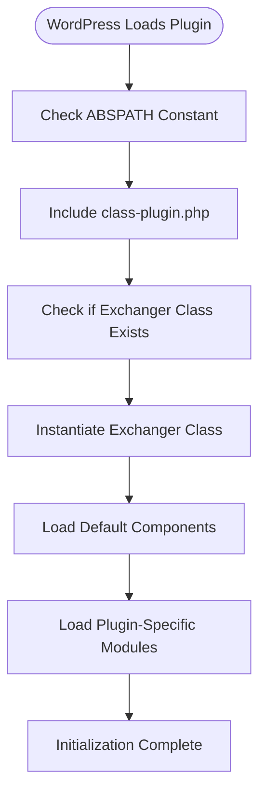
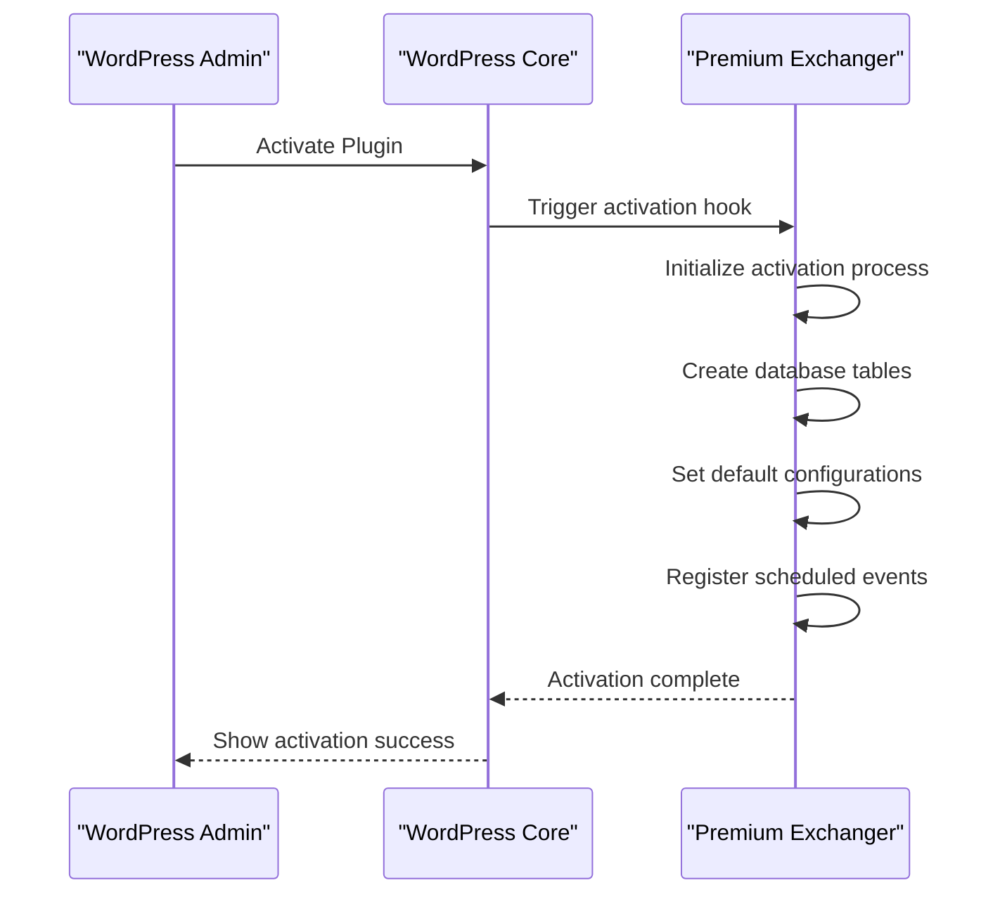
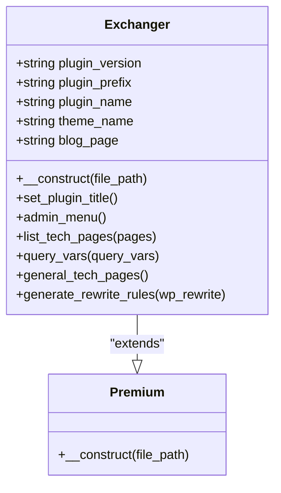
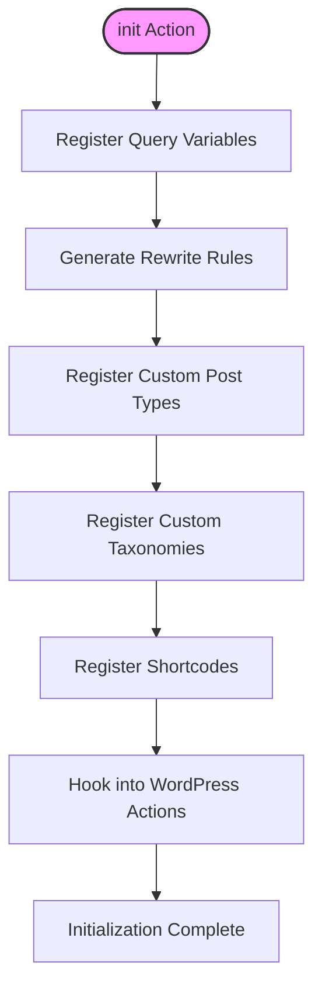

# Plugin Initialization

<cite>
**Referenced Files in This Document**   
- [premiumbox.php](file://wp-content/plugins/premiumbox/premiumbox.php)
- [class-plugin.php](file://wp-content/plugins/premiumbox/includes/class-plugin.php)
- [db.php](file://wp-content/plugins/premiumbox/activation/db.php)
- [migrate.php](file://wp-content/plugins/premiumbox/activation/migrate.php)
- [index.php](file://wp-content/plugins/premiumbox/activation/index.php)
</cite>

## Table of Contents
1. [Introduction](#introduction)
2. [Plugin Bootstrapping Sequence](#plugin-bootstrapping-sequence)
3. [Activation and Deactivation Hooks](#activation-and-deactivation-hooks)
4. [Database Setup and Migration](#database-setup-and-migration)
5. [Core Plugin Class and Singleton Pattern](#core-plugin-class-and-singleton-pattern)
6. [Initialization Process and WordPress Hooks](#initialization-process-and-wordpress-hooks)
7. [Dependency Checking and ionCube Loader Requirements](#dependency-checking-and-ioncube-loader-requirements)
8. [Extending the Initialization Process](#extending-the-initialization-process)
9. [Best Practices for Hook Priority Management](#best-practices-for-hook-priority-management)
10. [Troubleshooting Common Issues](#troubleshooting-common-issues)

## Introduction
The Premium Exchanger plugin follows a structured initialization process when loaded by WordPress. This document details the complete bootstrapping sequence from the main plugin file registration to the instantiation of the core Plugin class. The initialization process includes activation and deactivation hooks, database setup routines, scheduled events registration, and the registration of custom post types, taxonomies, and shortcodes through the init() method. The plugin implements the singleton pattern to ensure a single instance throughout the application lifecycle.

**Section sources**
- [premiumbox.php](file://wp-content/plugins/premiumbox/premiumbox.php#L1-L51)

## Plugin Bootstrapping Sequence
The plugin initialization begins with the main plugin file premiumbox.php, which contains the standard WordPress plugin header information. When WordPress loads the plugin, it first checks if the ABSPATH constant is defined to ensure the file is being accessed through WordPress. The plugin then includes the core class-plugin.php file which contains the Exchanger class that extends the Premium base class.

The bootstrapping sequence follows these steps:
1. Define plugin metadata in the header comment block
2. Verify ABSPATH to prevent direct access
3. Include the core plugin class file
4. Check if the Exchanger class already exists to prevent conflicts
5. Instantiate the Exchanger class with the plugin file path
6. Load various plugin components through file_include method calls

The plugin systematically loads different modules and components in a specific order, starting with default configurations and settings, followed by plugin-specific functionality. This modular approach allows for organized code structure and easier maintenance.

**Diagram sources**
- [premiumbox.php](file://wp-content/plugins/premiumbox/premiumbox.php#L1-L51)

**Section sources**
- [premiumbox.php](file://wp-content/plugins/premiumbox/premiumbox.php#L1-L51)

## Activation and Deactivation Hooks
The Premium Exchanger plugin implements activation and deactivation hooks to manage plugin state changes. During activation, the plugin performs essential setup tasks including database table creation and default data insertion. The activation process is triggered when a user activates the plugin through the WordPress admin interface.

The activation hook is registered through WordPress's register_activation_hook function, which calls the activation routine when the plugin is activated. Similarly, the deactivation hook is registered using register_deactivation_hook to handle cleanup tasks when the plugin is deactivated.

During activation, the plugin:
- Creates necessary database tables for storing exchange data
- Sets up default configuration values
- Registers scheduled events for automated tasks
- Initializes default settings and options

The deactivation process handles cleanup tasks such as:
- Unregistering scheduled events
- Clearing transients and caches
- Performing any necessary data cleanup

**Diagram sources**
- [index.php](file://wp-content/plugins/premiumbox/activation/index.php#L1-L50)
- [class-plugin.php](file://wp-content/plugins/premiumbox/includes/class-plugin.php#L34-L181)

**Section sources**
- [index.php](file://wp-content/plugins/premiumbox/activation/index.php#L1-L50)
- [class-plugin.php](file://wp-content/plugins/premiumbox/includes/class-plugin.php#L34-L181)

## Database Setup and Migration
The plugin's database setup process is comprehensive, creating multiple tables to store various types of data required for the exchange functionality. The database initialization occurs during plugin activation and includes the creation of tables for payment systems, currencies, exchange directions, bids, and related metadata.

Key database tables created during initialization:
- **psys**: Stores payment system information including titles and logos
- **currency_codes**: Contains currency code data with internal exchange rates
- **currency**: Manages currency details including logos, decimal places, and status
- **directions**: Defines exchange directions between currencies
- **exchange_bids**: Records exchange transaction bids
- **currency_custom_fields** and **direction_custom_fields**: Store custom field configurations

The migration system handles database schema updates when upgrading from previous versions. The migrate.php file contains logic to detect missing columns and add them to existing tables, ensuring backward compatibility. This incremental migration approach allows the plugin to evolve its database schema without data loss.

```mermaid
erDiagram
psys {
bigint id PK
datetime create_date
datetime edit_date
int auto_status
bigint edit_user_id
longtext psys_title
longtext psys_logo
bigint t2_1
bigint t2_2
}
currency_codes {
bigint id PK
datetime create_date
datetime edit_date
int auto_status
bigint edit_user_id
longtext currency_code_title
longtext internal_rate
}
currency {
bigint id PK
datetime create_date
datetime edit_date
int auto_status
bigint edit_user_id
longtext currency_logo
longtext psys_logo
bigint psys_id
longtext psys_title
bigint currency_code_id
longtext currency_code_title
bigint cat_id
int currency_decimal
int show_give
int show_get
bigint reserv_order
bigint t1_1
bigint t1_2
varchar currency_reserv
int currency_status
varchar reserv_place
varchar xml_value
}
directions {
bigint id PK
datetime create_date
datetime edit_date
int auto_status
bigint edit_user_id
int direction_status
varchar direction_name
longtext tech_name
bigint currency_id_give
bigint currency_id_get
bigint psys_id_give
bigint psys_id_get
varchar course_give
varchar course_get
int enable_user_discount
varchar max_user_discount
varchar min_sum1
varchar min_sum2
varchar max_sum1
varchar max_sum2
varchar com_sum1
varchar com_sum2
varchar com_pers1
varchar com_pers2
int pay_com1
int pay_com2
int dcom1
int dcom2
int nscom1
int nscom2
int com_det1
int com_det2
varchar minsum1com
varchar minsum2com
varchar com_box_sum1
varchar com_box_pers1
varchar com_box_min1
int com_box_ns1
int com_box_det1
varchar com_box_sum2
varchar com_box_pers2
varchar com_box_min2
int com_box_ns2
int com_box_det2
varchar profit_sum1
varchar profit_sum2
varchar profit_pers1
varchar profit_pers2
longtext m_in
longtext m_out
bigint to3_1
bigint site_order1
longtext mailtemp
longtext maildata
}
exchange_bids {
bigint id PK
datetime create_date
datetime edit_date
varchar status
varchar bid_locale
bigint currency_id_give
bigint currency_id_get
varchar currency_code_give
varchar currency_code_get
bigint currency_code_id_give
bigint currency_code_id_get
longtext psys_give
longtext psys_get
bigint psys_id_give
bigint psys_id_get
varchar hashed
bigint direction_id
bigint user_id
varchar user_login
varchar user_ip
varchar user_agent
longtext metas
longtext dmetas
longtext unmetas
varchar account_give
varchar account_get
varchar pay_ac
varchar pay_sum
varchar out_sum
varchar user_discount
varchar user_discount_sum
varchar first_name
varchar last_name
varchar second_name
varchar user_phone
varchar user_skype
varchar user_telegram
varchar user_email
varchar user_passport
varchar to_account
varchar from_account
varchar dest_tag
varchar trans_in
varchar trans_out
varchar txid_in
varchar txid_out
varchar user_hash
longtext hashdata
int exceed_pay
datetime touap_date
varchar course_give
varchar course_get
varchar exsum
varchar sum1dc
varchar sum2c
varchar profit
varchar sum1
varchar dop_com1
varchar com_ps1
varchar com_ps2
varchar sum1c
varchar sum1r
varchar sum2t
varchar sum2
varchar dop_com2
varchar sum2dc
varchar sum2r
varchar m_in
varchar m_out
}
psys ||--o{ currency : "has"
currency_codes ||--o{ currency : "has"
currency ||--o{ exchange_bids : "used in"
directions ||--o{ exchange_bids : "defines"
```

**Diagram sources**
- [db.php](file://wp-content/plugins/premiumbox/activation/db.php#L1-L438)
- [migrate.php](file://wp-content/plugins/premiumbox/activation/migrate.php#L1-L136)

**Section sources**
- [db.php](file://wp-content/plugins/premiumbox/activation/db.php#L1-L438)
- [migrate.php](file://wp-content/plugins/premiumbox/activation/migrate.php#L1-L136)

## Core Plugin Class and Singleton Pattern
The Exchanger class serves as the core plugin class and extends the Premium base class. This class implements the singleton pattern to ensure only one instance exists throughout the application lifecycle. The singleton pattern is crucial for maintaining consistent state and preventing conflicts that could arise from multiple instances.

The Exchanger class constructor initializes key plugin properties including:
- plugin_version: Current version of the plugin (2.7)
- plugin_prefix: Database prefix and text domain identifier (pn)
- plugin_name: Display name of the plugin
- theme_name: Associated theme name
- blog_page: Default blog page slug

The class also sets up global access to the plugin instance by assigning it to the $premiumbox global variable, allowing other components to access the main plugin instance without creating new instances.

Key methods in the Exchanger class include:
- __construct(): Initializes plugin properties and parent class
- set_plugin_title(): Defines plugin title and description in multiple languages
- admin_menu(): Registers admin menu items and submenus
- list_tech_pages(): Defines technical pages required for plugin functionality
- query_vars(): Adds custom query variables to WordPress
- generate_rewrite_rules(): Creates custom URL rewrite rules

**Diagram sources**
- [class-plugin.php](file://wp-content/plugins/premiumbox/includes/class-plugin.php#L34-L181)

**Section sources**
- [class-plugin.php](file://wp-content/plugins/premiumbox/includes/class-plugin.php#L34-L181)

## Initialization Process and WordPress Hooks
The plugin's initialization process hooks into various WordPress lifecycle events to register functionality at appropriate times. The init() method is central to this process, serving as the main entry point for registering custom post types, taxonomies, shortcodes, and other WordPress elements.

During initialization, the plugin:
1. Registers custom query variables (pnhash, hashed) to support custom URL parameters
2. Generates rewrite rules for exchange-related pages
3. Registers custom post types and taxonomies as needed
4. Hooks into WordPress actions and filters for various functionality
5. Loads required components and modules

The plugin uses WordPress hooks to integrate with the core system at strategic points:
- 'query_vars' filter: Adds custom query variables to WordPress
- 'generate_rewrite_rules' filter: Creates custom URL rewrite rules for exchange functionality
- 'init' action: Registers post types, taxonomies, and other elements
- 'admin_menu' action: Adds menu items to the WordPress admin interface

The rewrite rules system enables clean URLs for exchange functionality, mapping URLs like 'exchange_[hash]' to the appropriate exchange page with query parameters. This enhances user experience and SEO while maintaining functionality.

**Diagram sources**
- [class-plugin.php](file://wp-content/plugins/premiumbox/includes/class-plugin.php#L34-L181)

**Section sources**
- [class-plugin.php](file://wp-content/plugins/premiumbox/includes/class-plugin.php#L34-L181)

## Dependency Checking and ionCube Loader Requirements
The Premium Exchanger plugin has specific dependency requirements that must be met for proper functionality. The plugin requires the ionCube PHP Loader to be installed and enabled on the server, as some components are encoded with ionCube for protection and licensing purposes.

During initialization, the plugin should check for the presence of required dependencies:
- PHP version compatibility (specifically PHP 8.3 as indicated in the repository path)
- ionCube Loader extension availability
- WordPress version requirements
- Required PHP extensions and server configurations

The plugin may implement dependency checking through:
1. Pre-activation checks that prevent activation if requirements are not met
2. Admin notices that alert users to missing dependencies
3. Graceful degradation when certain features are unavailable
4. Detailed error messages explaining missing requirements

The ionCube Loader requirement is particularly important as it affects the plugin's ability to execute encoded files. Without the loader, critical functionality may be unavailable, leading to initialization failures or degraded performance.

**Section sources**
- [premiumbox.php](file://wp-content/plugins/premiumbox/premiumbox.php#L1-L51)
- [class-plugin.php](file://wp-content/plugins/premiumbox/includes/class-plugin.php#L34-L181)

## Extending the Initialization Process
The plugin architecture supports extension through a modular system that allows for adding custom functionality. Developers can extend the initialization process by creating new modules that integrate with the existing system.

Extension points include:
- Adding new payment methods through the merchants directory
- Creating custom modules in the moduls directory
- Implementing new shortcodes in the shortcode directory
- Developing custom widgets in the widget directory
- Adding SMS integration through the sms directory

To extend the initialization process, developers should:
1. Create a new directory for the custom module
2. Implement the module functionality following the existing code patterns
3. Register the module in the appropriate include file
4. Ensure proper dependency management
5. Test the extension thoroughly before deployment

The plugin's file_include method provides a standardized way to load additional components, making it easier to maintain a consistent structure across extensions.

**Section sources**
- [premiumbox.php](file://wp-content/plugins/premiumbox/premiumbox.php#L1-L51)
- [class-plugin.php](file://wp-content/plugins/premiumbox/includes/class-plugin.php#L34-L181)

## Best Practices for Hook Priority Management
Effective hook priority management is essential for ensuring that plugin functionality executes at the appropriate time in the WordPress lifecycle. The Premium Exchanger plugin demonstrates several best practices in this area.

Key considerations for hook priority management:
- Use appropriate priority values to ensure execution order
- Avoid conflicts with other plugins by selecting unique priorities
- Document priority choices for maintainability
- Test hook execution order thoroughly
- Use WordPress standard priorities when possible

The plugin uses specific priority values for admin menu items (500, 600, 700) to control their position in the WordPress admin menu. This strategic placement ensures that plugin menu items appear in a logical order relative to other admin menu items.

Best practices demonstrated by the plugin:
1. Consistent priority numbering system for admin menus
2. Proper use of WordPress action and filter hooks
3. Clear separation of initialization stages
4. Appropriate timing for database operations
5. Efficient resource loading

**Section sources**
- [class-plugin.php](file://wp-content/plugins/premiumbox/includes/class-plugin.php#L64-L83)

## Troubleshooting Common Issues
Several common issues may arise during the plugin initialization process, particularly related to activation conflicts, dependency issues, and server configuration.

Common activation issues and solutions:
- **ionCube Loader not installed**: Install and enable the ionCube PHP Loader extension
- **PHP version incompatibility**: Ensure PHP 8.3 or compatible version is running
- **Memory limit exceeded**: Increase PHP memory limit in php.ini
- **Timeout errors**: Increase max_execution_time for large database operations
- **File permission issues**: Ensure proper file and directory permissions

Activation conflicts may occur when:
- Another plugin uses the same class or function names
- Database table prefixes conflict with existing tables
- WordPress constants are already defined by other plugins
- There are conflicts in rewrite rules with other plugins

To resolve activation conflicts:
1. Check for naming conflicts in the codebase
2. Verify database table existence before creation
3. Use proper conditional checks for constants and classes
4. Implement graceful error handling
5. Provide clear error messages to users

Server configuration issues often relate to:
- ionCube Loader compatibility with PHP version
- Suhosin security module restrictions
- ModSecurity rules blocking certain operations
- Open basedir restrictions limiting file access

**Section sources**
- [premiumbox.php](file://wp-content/plugins/premiumbox/premiumbox.php#L1-L51)
- [class-plugin.php](file://wp-content/plugins/premiumbox/includes/class-plugin.php#L34-L181)
- [index.php](file://wp-content/plugins/premiumbox/activation/index.php#L1-L50)