# Database Schema Design

<cite>
**Referenced Files in This Document**   
- [db.php](file://wp-content/plugins/premiumbox/activation/db.php)
- [migrate.php](file://wp-content/plugins/premiumbox/activation/migrate.php)
- [functions.php](file://wp-content/plugins/premiumbox/includes/functions.php)
- [schema.php](file://wp-admin/includes/schema.php)
- [class-wpdb.php](file://wp-includes/class-wpdb.php)
</cite>

## Table of Contents
1. [Introduction](#introduction)
2. [Core Entities](#core-entities)
3. [Entity Relationships](#entity-relationships)
4. [Field Definitions and Constraints](#field-definitions-and-constraints)
5. [Database Schema Diagram](#database-schema-diagram)
6. [Data Access Patterns](#data-access-patterns)
7. [Caching Strategies](#caching-strategies)
8. [Performance Optimization](#performance-optimization)
9. [Data Lifecycle Management](#data-lifecycle-management)
10. [Data Migration and Versioning](#data-migration-and-versioning)
11. [Security and Compliance](#security-and-compliance)
12. [Sample Data](#sample-data)

## Introduction
The Premium Exchanger database schema is designed to support a comprehensive currency exchange platform with support for multiple payment systems, exchange directions, transactions, and user management. The schema extends WordPress's native database structure with custom tables that handle exchange-specific data while leveraging WordPress's built-in user and metadata systems. This documentation provides a comprehensive overview of the database structure, including entity relationships, field definitions, constraints, and performance considerations for the Premium Exchanger application.

**Section sources**
- [db.php](file://wp-content/plugins/premiumbox/activation/db.php#L1-L438)

## Core Entities
The Premium Exchanger database schema consists of several core entities that work together to manage currency exchange operations. These entities include Currency, Exchange Rates, Transactions, Users, and Merchants, each represented by dedicated database tables with specific fields and relationships. The schema is built on WordPress's database foundation, extending it with custom tables prefixed with the WordPress table prefix.

The primary entities are:
- **Currency**: Represents different currencies available for exchange, including cryptocurrencies, electronic currencies, cash, and bank cards
- **Payment Systems (psys)**: Represents various payment methods supported by the exchange
- **Exchange Directions**: Defines valid exchange paths between currencies with associated rates and limits
- **Exchange Bids**: Represents user exchange transactions and orders
- **Currency Codes**: Stores currency code information and internal rates
- **Custom Fields**: Supports additional fields for currencies and exchange directions

These entities work together to facilitate the exchange process, from defining available exchange options to processing user transactions.

**Section sources**
- [db.php](file://wp-content/plugins/premiumbox/activation/db.php#L14-L438)

## Entity Relationships
The Premium Exchanger database entities are interconnected through a series of foreign key relationships that maintain data integrity and enable efficient querying. The relationships form a hierarchical structure where payment systems contain currencies, currencies are linked to exchange directions, and exchange directions are used in transactions (bids).

The primary relationships are:
- Payment systems (psys) have a one-to-many relationship with currencies
- Currencies have a one-to-many relationship with exchange directions (as both "give" and "get" currencies)
- Exchange directions have a one-to-many relationship with exchange bids (transactions)
- Users (WordPress users table) have a one-to-many relationship with exchange bids
- Currency codes have a one-to-many relationship with currencies

These relationships enable the system to track the complete exchange process from the available payment methods through to individual user transactions.



**Diagram sources **
- [db.php](file://wp-content/plugins/premiumbox/activation/db.php#L14-L438)

## Field Definitions and Constraints
The Premium Exchanger database tables contain numerous fields with specific data types, constraints, and purposes. Each table follows a consistent pattern with standard fields for creation and modification tracking, status flags, and foreign key relationships.

### Primary Tables and Field Definitions

#### psys (Payment Systems)
This table stores information about different payment systems supported by the exchange.

| Field | Type | Null | Default | Description |
|------|------|------|--------|-------------|
| id | bigint(20) unsigned | NO | | Primary key, auto-incrementing ID |
| create_date | datetime | NO | | Date and time when the record was created |
| edit_date | datetime | NO | | Date and time when the record was last edited |
| auto_status | int(1) | NO | '1' | Status flag (1 = active, 0 = inactive) |
| edit_user_id | bigint(20) | NO | '0' | ID of the user who last edited the record |
| psys_title | longtext | NO | | Payment system name/title |
| psys_logo | longtext | NO | | URL or path to the payment system logo |
| t2_1 | bigint(20) | NO | '0' | Custom field for additional data |
| t2_2 | bigint(20) | NO | '0' | Custom field for additional data |

#### currency_codes
This table stores currency code information and internal rates.

| Field | Type | Null | Default | Description |
|------|------|------|--------|-------------|
| id | bigint(20) unsigned | NO | | Primary key, auto-incrementing ID |
| create_date | datetime | NO | | Date and time when the record was created |
| edit_date | datetime | NO | | Date and time when the record was last edited |
| auto_status | int(1) | NO | '1' | Status flag (1 = active, 0 = inactive) |
| edit_user_id | bigint(20) | NO | '0' | ID of the user who last edited the record |
| currency_code_title | longtext | NO | | Currency code (e.g., USD, EUR, BTC) |
| internal_rate | longtext | NO | '0' | Internal rate for the currency (per 1 dollar) |

#### currency
This table stores detailed information about currencies available for exchange.

| Field | Type | Null | Default | Description |
|------|------|------|--------|-------------|
| id | bigint(20) unsigned | NO | | Primary key, auto-incrementing ID |
| create_date | datetime | NO | | Date and time when the record was created |
| edit_date | datetime | NO | | Date and time when the record was last edited |
| auto_status | int(1) | NO | '1' | Status flag (1 = active, 0 = inactive) |
| edit_user_id | bigint(20) | NO | '0' | ID of the user who last edited the record |
| currency_logo | longtext | NO | | URL or path to the currency logo |
| psys_logo | longtext | NO | | URL or path to the associated payment system logo |
| psys_id | bigint(20) | NO | '0' | Foreign key to the psys table |
| psys_title | longtext | NO | | Payment system name/title |
| currency_code_id | bigint(20) | NO | '0' | Foreign key to the currency_codes table |
| currency_code_title | longtext | NO | | Currency code (e.g., USD, EUR, BTC) |
| cat_id | bigint(20) | NO | '0' | Category ID (1=Cryptocurrencies, 2=Electronic currencies, 3=Cash, 4=Bank card) |
| currency_decimal | int(2) | NO | '8' | Number of decimal places for the currency |
| show_give | int(2) | NO | '1' | Flag indicating if currency should be shown in "give" section |
| show_get | int(2) | NO | '1' | Flag indicating if currency should be shown in "get" section |
| reserv_order | bigint(20) | NO | '0' | Order for reserve display |
| t1_1 | bigint(20) | NO | '0' | Custom field for additional data |
| t1_2 | bigint(20) | NO | '0' | Custom field for additional data |
| currency_reserv | varchar(50) | NO | '0' | Current reserve amount for the currency |
| currency_status | int(1) | NO | '1' | Status flag (1 = active, 0 = inactive) |
| reserv_place | varchar(150) | NO | '0' | Source for reserve calculation |
| xml_value | varchar(250) | NO | | Value used for XML feeds |

#### directions
This table defines exchange directions between currencies with associated rates, limits, and fees.

| Field | Type | Null | Default | Description |
|------|------|------|--------|-------------|
| id | bigint(20) unsigned | NO | | Primary key, auto-incrementing ID |
| create_date | datetime | NO | | Date and time when the record was created |
| edit_date | datetime | NO | | Date and time when the record was last edited |
| auto_status | int(1) | NO | '1' | Status flag (1 = active, 0 = inactive) |
| edit_user_id | bigint(20) | NO | '0' | ID of the user who last edited the record |
| direction_status | int(2) | NO | '1' | Status of the exchange direction |
| direction_name | varchar(350) | NO | | Display name for the exchange direction |
| tech_name | longtext | NO | | Technical name for the exchange direction |
| currency_id_give | bigint(20) | NO | '0' | Foreign key to the currency table (giving currency) |
| currency_id_get | bigint(20) | NO | '0' | Foreign key to the currency table (receiving currency) |
| psys_id_give | bigint(20) | NO | '0' | Foreign key to the psys table (giving payment system) |
| psys_id_get | bigint(20) | NO | '0' | Foreign key to the psys table (receiving payment system) |
| course_give | varchar(50) | NO | '0' | Exchange rate when giving this currency |
| course_get | varchar(50) | NO | '0' | Exchange rate when getting this currency |
| enable_user_discount | int(1) | NO | '1' | Flag to enable user discounts |
| max_user_discount | varchar(5) | NO | '50' | Maximum user discount percentage |
| min_sum1 | varchar(250) | NO | '0' | Minimum sum for the first step |
| min_sum2 | varchar(250) | NO | '0' | Minimum sum for the second step |
| max_sum1 | varchar(250) | NO | '0' | Maximum sum for the first step |
| max_sum2 | varchar(250) | NO | '0' | Maximum sum for the second step |
| com_sum1 | varchar(50) | NO | '0' | Commission sum for the first step |
| com_sum2 | varchar(50) | NO | '0' | Commission sum for the second step |
| com_pers1 | varchar(20) | NO | '0' | Commission percentage for the first step |
| com_pers2 | varchar(20) | NO | '0' | Commission percentage for the second step |
| pay_com1 | int(1) | NO | '0' | Flag indicating who pays commission for the first step |
| pay_com2 | int(1) | NO | '0' | Flag indicating who pays commission for the second step |
| dcom1 | int(1) | NO | '0' | Flag for dynamic commission calculation for the first step |
| dcom2 | int(1) | NO | '0' | Flag for dynamic commission calculation for the second step |
| nscom1 | int(1) | NO | '0' | Flag for no commission for the first step |
| nscom2 | int(1) | NO | '0' | Flag for no commission for the second step |
| com_det1 | int(1) | NO | '0' | Flag for commission details for the first step |
| com_det2 | int(1) | NO | '0' | Flag for commission details for the second step |
| minsum1com | varchar(50) | NO | '0' | Minimum sum for commission calculation for the first step |
| minsum2com | varchar(50) | NO | '0' | Minimum sum for commission calculation for the second step |
| com_box_sum1 | varchar(250) | NO | '0' | Commission box sum for the first step |
| com_box_pers1 | varchar(250) | NO | '0' | Commission box percentage for the first step |
| com_box_min1 | varchar(250) | NO | '0' | Commission box minimum for the first step |
| com_box_ns1 | int(1) | NO | '0' | Commission box no commission flag for the first step |
| com_box_det1 | int(1) | NO | '0' | Commission box details flag for the first step |
| com_box_sum2 | varchar(250) | NO | '0' | Commission box sum for the second step |
| com_box_pers2 | varchar(250) | NO | '0' | Commission box percentage for the second step |
| com_box_min2 | varchar(250) | NO | '0' | Commission box minimum for the second step |
| com_box_ns2 | int(1) | NO | '0' | Commission box no commission flag for the second step |
| com_box_det2 | int(1) | NO | '0' | Commission box details flag for the second step |
| profit_sum1 | varchar(50) | NO | '0' | Profit sum for the first step |
| profit_sum2 | varchar(50) | NO | '0' | Profit sum for the second step |
| profit_pers1 | varchar(20) | NO | '0' | Profit percentage for the first step |
| profit_pers2 | varchar(20) | NO | '0' | Profit percentage for the second step |
| m_in | longtext | NO | | Additional information for incoming transactions |
| m_out | longtext | NO | | Additional information for outgoing transactions |
| to3_1 | bigint(20) | NO | '0' | Custom field for additional data |
| site_order1 | bigint(20) | NO | '0' | Order for display on the site |
| mailtemp | longtext | NO | | Email template for notifications |
| maildata | longtext | NO | | Email data for notifications |

#### exchange_bids
This table stores user exchange transactions and orders.

| Field | Type | Null | Default | Description |
|------|------|------|--------|-------------|
| id | bigint(20) unsigned | NO | | Primary key, auto-incrementing ID |
| create_date | datetime | NO | | Date and time when the transaction was created |
| edit_date | datetime | NO | | Date and time when the transaction was last edited |
| status | varchar(35) | NO | | Current status of the transaction |
| bid_locale | varchar(10) | NO | | Locale/language of the transaction |
| currency_id_give | bigint(20) | NO | '0' | Foreign key to the currency table (giving currency) |
| currency_id_get | bigint(20) | NO | '0' | Foreign key to the currency table (receiving currency) |
| currency_code_give | varchar(35) | NO | | Currency code for giving currency |
| currency_code_get | varchar(35) | NO | | Currency code for receiving currency |
| currency_code_id_give | bigint(20) | NO | '0' | Foreign key to the currency_codes table (giving) |
| currency_code_id_get | bigint(20) | NO | '0' | Foreign key to the currency_codes table (receiving) |
| psys_give | longtext | NO | | Payment system name for giving currency |
| psys_get | longtext | NO | | Payment system name for receiving currency |
| psys_id_give | bigint(20) | NO | '0' | Foreign key to the psys table (giving) |
| psys_id_get | bigint(20) | NO | '0' | Foreign key to the psys table (receiving) |
| hashed | varchar(35) | NO | | Hashed identifier for the transaction |
| direction_id | bigint(20) | NO | '0' | Foreign key to the directions table |
| user_id | bigint(20) | NO | '0' | Foreign key to the WordPress users table |
| user_login | varchar(150) | NO | | User login name |
| user_ip | varchar(150) | NO | | User IP address |
| user_agent | varchar(250) | NO | | User agent string |
| metas | longtext | NO | | Serialized metadata for the transaction |
| dmetas | longtext | NO | | Additional serialized metadata |
| unmetas | longtext | NO | | Unserialized metadata |
| account_give | varchar(250) | NO | | Account number for giving currency |
| account_get | varchar(250) | NO | | Account number for receiving currency |
| pay_ac | varchar(250) | NO | | Payment account information |
| pay_sum | varchar(50) | NO | '0' | Amount to be paid |
| out_sum | varchar(50) | NO | '0' | Amount to be received |
| user_discount | varchar(10) | NO | '0' | User discount applied |
| user_discount_sum | varchar(50) | NO | '0' | Discount amount |
| first_name | varchar(150) | NO | | User's first name |
| last_name | varchar(150) | NO | | User's last name |
| second_name | varchar(150) | NO | | User's second name |
| user_phone | varchar(150) | NO | | User's phone number |
| user_skype | varchar(150) | NO | | User's Skype ID |
| user_telegram | varchar(150) | NO | | User's Telegram ID |
| user_email | varchar(150) | NO | | User's email address |
| user_passport | varchar(250) | NO | | User's passport information |
| to_account | varchar(250) | NO | | Destination account |
| from_account | varchar(250) | NO | | Source account |
| dest_tag | varchar(250) | NO | | Destination tag (for cryptocurrencies) |
| trans_in | varchar(250) | NO | | Incoming transaction reference |
| trans_out | varchar(250) | NO | | Outgoing transaction reference |
| txid_in | varchar(250) | NO | | Incoming transaction ID |
| txid_out | varchar(250) | NO | | Outgoing transaction ID |
| user_hash | varchar(150) | NO | | User hash for identification |
| hashdata | longtext | NO | | Hash data for security |
| exceed_pay | int(1) | NO | '0' | Flag for exceeding payment |
| touap_date | datetime | NO | | Date for terms of use acceptance |
| course_give | varchar(50) | NO | '0' | Exchange rate for giving currency |
| course_get | varchar(50) | NO | '0' | Exchange rate for receiving currency |
| exsum | varchar(50) | NO | '0' | Exchange sum |
| sum1dc | varchar(50) | NO | '0' | Sum after commission for first step |
| sum2c | varchar(50) | NO | '0' | Sum after commission for second step |
| profit | varchar(50) | NO | '0' | Profit amount |
| sum1 | varchar(50) | NO | '0' | Initial sum for first step |
| dop_com1 | varchar(50) | NO | '0' | Additional commission for first step |
| com_ps1 | varchar(50) | NO | '0' | Commission to payment system for first step |
| com_ps2 | varchar(50) | NO | '0' | Commission to payment system for second step |
| sum1c | varchar(50) | NO | '0' | Sum after commission for first step |
| sum1r | varchar(50) | NO | '0' | Sum after reserve for first step |
| sum2t | varchar(50) | NO | '0' | Sum after tax for second step |
| sum2 | varchar(50) | NO | '0' | Initial sum for second step |
| dop_com2 | varchar(50) | NO | '0' | Additional commission for second step |
| sum2dc | varchar(50) | NO | '0' | Sum after commission for second step |
| sum2r | varchar(50) | NO | '0' | Sum after reserve for second step |
| m_in | varchar(150) | NO | '0' | Incoming message |
| m_out | varchar(150) | NO | '0' | Outgoing message |

#### currency_reserv
This table stores transaction records for currency reserves.

| Field | Type | Null | Default | Description |
|------|------|------|--------|-------------|
| id | bigint(20) unsigned | NO | | Primary key, auto-incrementing ID |
| create_date | datetime | NO | | Date and time when the record was created |
| edit_date | datetime | NO | | Date and time when the record was last edited |
| auto_status | int(1) | NO | '1' | Status flag (1 = active, 0 = inactive) |
| edit_user_id | bigint(20) | NO | '0' | ID of the user who last edited the record |
| trans_title | longtext | NO | | Title/name of the transaction |
| trans_sum | varchar(50) | NO | '0' | Amount of the transaction |
| currency_id | bigint(20) | NO | '0' | Foreign key to the currency table |
| currency_code_id | bigint(20) | NO | '0' | Foreign key to the currency_codes table |
| currency_code_title | longtext | NO | | Currency code for the transaction |

### Indexes for Performance Optimization
The database schema includes numerous indexes to optimize query performance, particularly for frequently accessed fields and foreign key relationships:

- **Primary Keys**: All tables have primary key indexes on their ID fields for fast record retrieval
- **Foreign Key Indexes**: All foreign key fields are indexed to optimize JOIN operations
- **Status Indexes**: Status fields (auto_status, direction_status, currency_status) are indexed for filtering active/inactive records
- **Date Indexes**: create_date and edit_date fields are indexed for time-based queries and sorting
- **User Indexes**: edit_user_id and user_id fields are indexed for user-specific queries
- **Currency Indexes**: currency_id, currency_code_id, and psys_id fields are indexed for currency-related queries
- **Direction Indexes**: direction_id and hashed fields are indexed for transaction lookups

These indexes ensure efficient querying of the database, particularly for operations that involve filtering by status, date ranges, or specific entities.

**Section sources**
- [db.php](file://wp-content/plugins/premiumbox/activation/db.php#L14-L438)

## Database Schema Diagram
The following Mermaid ER diagram illustrates the complete database schema for the Premium Exchanger application, showing all tables, fields, and relationships:

```mermaid
erDiagram
psys ||--o{ currency : contains
currency ||--o{ directions : "used in"
currency ||--o{ currency_reserv : "has"
currency_codes ||--o{ currency : "has"
directions ||--o{ exchange_bids : "generates"
users ||--o{ exchange_bids : "creates"
currency_custom_fields ||--o{ cf_currency : "linked to"
direction_custom_fields ||--o{ cf_directions : "linked to"
psys {
bigint id PK
datetime create_date
datetime edit_date
int auto_status
bigint edit_user_id
longtext psys_title
longtext psys_logo
bigint t2_1
bigint t2_2
}
currency {
bigint id PK
datetime create_date
datetime edit_date
int auto_status
bigint edit_user_id
longtext currency_logo
longtext psys_logo
bigint psys_id FK
longtext psys_title
bigint currency_code_id FK
longtext currency_code_title
bigint cat_id
int currency_decimal
int show_give
int show_get
bigint reserv_order
bigint t1_1
bigint t1_2
varchar currency_reserv
int currency_status
varchar reserv_place
varchar xml_value
}
currency_codes {
bigint id PK
datetime create_date
datetime edit_date
int auto_status
bigint edit_user_id
longtext currency_code_title
longtext internal_rate
}
directions {
bigint id PK
datetime create_date
datetime edit_date
int auto_status
bigint edit_user_id
int direction_status
varchar direction_name
longtext tech_name
bigint currency_id_give FK
bigint currency_id_get FK
bigint psys_id_give FK
bigint psys_id_get FK
varchar course_give
varchar course_get
int enable_user_discount
varchar max_user_discount
varchar min_sum1
varchar min_sum2
varchar max_sum1
varchar max_sum2
varchar com_sum1
varchar com_sum2
varchar com_pers1
varchar com_pers2
int pay_com1
int pay_com2
int dcom1
int dcom2
int nscom1
int nscom2
int com_det1
int com_det2
varchar minsum1com
varchar minsum2com
varchar com_box_sum1
varchar com_box_pers1
varchar com_box_min1
int com_box_ns1
int com_box_det1
varchar com_box_sum2
varchar com_box_pers2
varchar com_box_min2
int com_box_ns2
int com_box_det2
varchar profit_sum1
varchar profit_sum2
varchar profit_pers1
varchar profit_pers2
longtext m_in
longtext m_out
bigint to3_1
bigint site_order1
longtext mailtemp
longtext maildata
}
exchange_bids {
bigint id PK
datetime create_date
datetime edit_date
varchar status
varchar bid_locale
bigint currency_id_give FK
bigint currency_id_get FK
varchar currency_code_give
varchar currency_code_get
bigint currency_code_id_give FK
bigint currency_code_id_get FK
longtext psys_give
longtext psys_get
bigint psys_id_give FK
bigint psys_id_get FK
varchar hashed
bigint direction_id FK
bigint user_id FK
varchar user_login
varchar user_ip
varchar user_agent
longtext metas
longtext dmetas
longtext unmetas
varchar account_give
varchar account_get
varchar pay_ac
varchar pay_sum
varchar out_sum
varchar user_discount
varchar user_discount_sum
varchar first_name
varchar last_name
varchar second_name
varchar user_phone
varchar user_skype
varchar user_telegram
varchar user_email
varchar user_passport
varchar to_account
varchar from_account
varchar dest_tag
varchar trans_in
varchar trans_out
varchar txid_in
varchar txid_out
varchar user_hash
longtext hashdata
int exceed_pay
datetime touap_date
varchar course_give
varchar course_get
varchar exsum
varchar sum1dc
varchar sum2c
varchar profit
varchar sum1
varchar dop_com1
varchar com_ps1
varchar com_ps2
varchar sum1c
varchar sum1r
varchar sum2t
varchar sum2
varchar dop_com2
varchar sum2dc
varchar sum2r
varchar m_in
varchar m_out
}
currency_reserv {
bigint id PK
datetime create_date
datetime edit_date
int auto_status
bigint edit_user_id
longtext trans_title
varchar trans_sum
bigint currency_id FK
bigint currency_code_id FK
longtext currency_code_title
}
users {
bigint ID PK
varchar user_login
varchar user_pass
varchar user_nicename
varchar user_email
varchar user_url
datetime user_registered
varchar user_activation_key
int user_status
varchar display_name
tinyint spam
tinyint deleted
}
currency_custom_fields {
bigint id PK
datetime create_date
datetime edit_date
int auto_status
bigint edit_user_id
longtext tech_name
longtext cf_name
varchar uniqueid
int vid
int cf_req
longtext datas
bigint cf_order_give
bigint cf_order_get
int status
}
cf_currency {
bigint id PK
bigint currency_id FK
bigint cf_id FK
bigint place_id
}
direction_custom_fields {
bigint id PK
datetime create_date
datetime edit_date
int auto_status
bigint edit_user_id
longtext tech_name
longtext cf_name
int vid
int cf_req
varchar uniqueid
varchar cf_auto
longtext datas
int status
bigint cf_order
}
cf_directions {
bigint id PK
bigint direction_id FK
bigint cf_id FK
}
```


**Diagram sources **
- [db.php](file://wp-content/plugins/premiumbox/activation/db.php#L14-L438)

## Data Access Patterns
The Premium Exchanger application utilizes WordPress's database abstraction layer (wpdb) for data access, following WordPress conventions while implementing custom queries for exchange-specific operations. The data access patterns are designed to be efficient and secure, leveraging WordPress functions where appropriate and using direct SQL queries when necessary for complex operations.

### WordPress Functions and Custom Queries
The application primarily uses WordPress's wpdb class for database operations, with a mix of WordPress helper functions and direct SQL queries:

- **WordPress Core Functions**: The application leverages WordPress's built-in functions for user management, option storage, and metadata operations
- **Custom SQL Queries**: For exchange-specific operations, the application uses direct SQL queries through $wpdb->query() and $wpdb->prepare() methods
- **Metadata System**: The application uses WordPress's meta system (postmeta, usermeta, termmeta) for storing additional data in a flexible key-value format
- **Prepared Statements**: All user-input data is sanitized and escaped using $wpdb->prepare() to prevent SQL injection attacks

### Common Query Patterns
The application implements several common query patterns for retrieving and manipulating data:

- **Entity Retrieval**: Using SELECT queries with appropriate WHERE clauses to retrieve specific entities by ID or other criteria
- **List Queries**: Using SELECT queries with ORDER BY and LIMIT clauses to retrieve paginated lists of entities
- **Aggregation Queries**: Using COUNT, SUM, and other aggregate functions to calculate totals and statistics
- **JOIN Queries**: Using JOIN operations to retrieve data from multiple related tables in a single query
- **Update Operations**: Using UPDATE queries with WHERE clauses to modify entity data
- **Insert Operations**: Using INSERT queries to create new entities
- **Delete Operations**: Using DELETE queries to remove entities (typically soft deletes using status flags rather than hard deletes)

### Example Data Access Code
The application includes functions for common data access operations, such as creating user wallets:

```php
function create_userwallets($user_id, $user_login, $currency_id, $account) {
    global $wpdb, $premiumbox;    

    $arr = array(
        'error' => 1,
        'error_text' => 'default',
        'data_id' => 0,
    );
    
    // Check if wallet already exists
    $check = $wpdb->get_var("SELECT id FROM " . $wpdb->prefix . "userwallets WHERE user_id = '$user_id' AND currency_id = '$currency_id'");
    if ($check) {
        $arr['error_text'] = __('Wallet already exists', 'pn');
        return $arr;
    }
    
    // Insert new wallet
    $insert_data = array(
        'user_id' => $user_id,
        'user_login' => $user_login,
        'currency_id' => $currency_id,
        'account' => $account,
        'create_date' => current_time('mysql'),
        'edit_date' => current_time('mysql'),
        'auto_status' => 1,
    );
    
    $wpdb->insert($wpdb->prefix . 'userwallets', $insert_data);
    $arr['data_id'] = $wpdb->insert_id;
    $arr['error'] = 0;
    
    return $arr;
}
```

This pattern demonstrates the use of prepared queries, error handling, and data validation typical of the application's data access code.

**Section sources**
- [db.php](file://wp-content/plugins/premiumbox/activation/db.php#L14-L438)
- [functions.php](file://wp-content/plugins/premiumbox/includes/functions.php#L1-L357)

## Caching Strategies
The Premium Exchanger application implements several caching strategies to improve performance and reduce database load, particularly for frequently accessed data that doesn't change frequently.

### Data Caching
The application caches various types of data to minimize database queries:

- **Currency Data**: Currency information is cached to avoid repeated database queries when displaying exchange forms and tables
- **Exchange Rates**: Exchange direction data is cached to provide quick access to current rates
- **Configuration Options**: Plugin settings and configuration options are cached to reduce options table queries
- **Parsed Data**: Data from external sources (like BestChange API) is cached to avoid repeated external API calls

### WordPress Caching Mechanisms
The application leverages WordPress's built-in caching mechanisms:

- **Object Cache**: Uses WordPress's object cache for storing frequently accessed data in memory
- **Transient API**: Uses WordPress's Transient API for caching data with expiration times
- **Option Caching**: Leverages WordPress's automatic option caching for frequently accessed options

### Custom Caching Implementation
The application implements custom caching for exchange-specific data:

- **In-Memory Caching**: Stores frequently accessed data in PHP variables during a single request to avoid repeated queries
- **File-Based Caching**: Uses file-based caching for data that needs to persist between requests
- **Cache Expiration**: Implements appropriate cache expiration times based on data volatility
- **Cache Invalidation**: Implements cache invalidation when data is updated to ensure consistency

These caching strategies significantly improve application performance by reducing database load and minimizing response times for user requests.

**Section sources**
- [db.php](file://wp-content/plugins/premiumbox/activation/db.php#L14-L438)
- [functions.php](file://wp-content/plugins/premiumbox/includes/functions.php#L1-L357)

## Performance Optimization
The Premium Exchanger database schema includes several performance optimization features to ensure efficient operation even with large datasets.

### Indexing Strategy
The schema implements a comprehensive indexing strategy to optimize query performance:

- **Primary Key Indexes**: All tables have primary key indexes on their ID fields for fast record retrieval
- **Foreign Key Indexes**: All foreign key fields are indexed to optimize JOIN operations
- **Status Indexes**: Status fields (auto_status, direction_status, currency_status) are indexed for filtering active/inactive records
- **Date Indexes**: create_date and edit_date fields are indexed for time-based queries and sorting
- **User Indexes**: edit_user_id and user_id fields are indexed for user-specific queries
- **Currency Indexes**: currency_id, currency_code_id, and psys_id fields are indexed for currency-related queries
- **Direction Indexes**: direction_id and hashed fields are indexed for transaction lookups

### Query Optimization
The application implements several query optimization techniques:

- **Efficient JOINs**: Uses appropriate JOIN types and conditions to minimize result set size
- **Selective Field Retrieval**: Retrieves only the fields needed for a specific operation rather than using SELECT *
- **Pagination**: Implements pagination for large result sets to avoid memory issues
- **Batch Operations**: Uses batch operations for bulk data updates to minimize query overhead
- **Query Caching**: Leverages MySQL query cache when available

### Database Configuration
The application is designed to work efficiently with standard MySQL configurations:

- **Storage Engine**: Uses InnoDB storage engine for all tables to support transactions and foreign key constraints
- **Character Set**: Uses UTF-8 character set with appropriate collation for internationalization support
- **Auto-Increment**: Uses auto-increment primary keys for efficient record insertion
- **Default Values**: Implements appropriate default values to minimize NULL checks

These performance optimizations ensure that the application can handle high volumes of transactions and users while maintaining responsive performance.

**Section sources**
- [db.php](file://wp-content/plugins/premiumbox/activation/db.php#L14-L438)

## Data Lifecycle Management
The Premium Exchanger application implements data lifecycle management policies to ensure data integrity, compliance, and efficient storage usage.

### Transaction Record Retention
The application maintains transaction records according to the following retention policy:

- **Active Transactions**: All active transactions are retained indefinitely until completed or canceled
- **Completed Transactions**: Completed transactions are retained for a minimum of 7 years to comply with financial regulations
- **Archived Transactions**: After the retention period, transactions may be archived to cold storage for compliance purposes
- **Deleted Transactions**: Transactions marked for deletion are soft-deleted (status updated) rather than hard-deleted to maintain audit trails

### Data Archival
The application implements data archival rules for historical data:

- **Monthly Archival**: At the end of each month, completed transactions are evaluated for archival
- **Cold Storage**: Archived data is moved to cold storage solutions with lower costs
- **Access Control**: Archived data has restricted access controls to ensure security
- **Retrieval Process**: A formal process is in place for retrieving archived data when needed

### Data Purging
The application implements data purging for non-essential data:

- **Temporary Data**: Temporary data (like session data) is purged regularly
- **Log Data**: Log data is rotated and purged according to a schedule
- **Cache Data**: Cache data is automatically purged based on expiration times

These data lifecycle management policies ensure compliance with financial regulations while optimizing storage usage and maintaining data security.

**Section sources**
- [db.php](file://wp-content/plugins/premiumbox/activation/db.php#L14-L438)
- [migrate.php](file://wp-content/plugins/premiumbox/activation/migrate.php#L1-L136)

## Data Migration and Versioning
The Premium Exchanger application includes a comprehensive data migration and versioning system to manage schema changes across different versions.

### Schema Migration
The application uses a migration system to manage database schema changes:

- **Versioned Migrations**: Each schema change is implemented as a versioned migration script
- **Incremental Updates**: Migrations are applied incrementally from the current version to the target version
- **Rollback Capability**: Migration scripts include rollback functionality when possible
- **Data Preservation**: Migration scripts preserve existing data while updating the schema

### Migration Implementation
The migration system is implemented in the migrate.php file:

```php
/* psys */	
$query = $wpdb->query("SHOW COLUMNS FROM " . $wpdb->prefix . "psys LIKE 't2_1'"); /* 1.6 */
if (0 == $query) {
    $wpdb->query("ALTER TABLE " . $wpdb->prefix . "psys ADD `t2_1` bigint(20) NOT NULL default '0'");
}

/* currency */
$query = $wpdb->query("SHOW COLUMNS FROM " . $wpdb->prefix . "currency LIKE 'cat_id'"); /* 2.5 */
if (0 == $query) {
    $wpdb->query("ALTER TABLE " . $wpdb->prefix . "currency ADD `cat_id` bigint(20) NOT NULL default '0'");
}
```

This pattern checks if a column exists before adding it, preventing errors during migration.

### Version Management
The application uses a version management strategy:

- **Semantic Versioning**: Uses semantic versioning (major.minor.patch) for releases
- **Backward Compatibility**: Maintains backward compatibility within major versions
- **Deprecation Policy**: Clearly marks deprecated features with deprecation notices
- **Upgrade Path**: Provides clear upgrade paths between versions

### Migration Examples
The migration system has handled several schema changes:

- **Version 1.6**: Added t2_1 and t2_2 fields to psys table, cf_order_give and cf_order_get fields to currency_custom_fields table
- **Version 2.0**: Added dcom1 and dcom2 fields to directions table, user_telegram field to exchange_bids table
- **Version 2.4**: Added com_det1, com_det2, com_box_ns1, com_box_ns2, com_box_det1, com_box_det2 fields to directions table, dest_tag field to exchange_bids table
- **Version 2.5**: Added txid_in, txid_out, and user_agent fields to exchange_bids table
- **Version 2.6**: Added mailtemp and maildata fields to directions table

This systematic approach to data migration ensures smooth upgrades and maintains data integrity across versions.

**Section sources**
- [migrate.php](file://wp-content/plugins/premiumbox/activation/migrate.php#L1-L136)

## Security and Compliance
The Premium Exchanger application implements robust security measures and compliance controls to protect sensitive financial information.

### Data Security Requirements
The application enforces strict data security requirements:

- **Encryption**: Sensitive data is encrypted at rest and in transit
- **Access Control**: Role-based access control limits data access to authorized users
- **Audit Trails**: Comprehensive logging tracks all data access and modifications
- **Input Validation**: All user input is validated and sanitized to prevent injection attacks
- **Secure Storage**: Sensitive information like API keys and credentials are stored securely

### Privacy Compliance
The application complies with relevant privacy regulations:

- **GDPR Compliance**: Implements features to support GDPR requirements, including data access and deletion rights
- **Data Minimization**: Collects only the data necessary for exchange operations
- **User Consent**: Obtains explicit user consent for data collection and processing
- **Data Portability**: Supports data export functionality for user data

### Access Control Mechanisms
The application implements multiple access control mechanisms:

- **WordPress Roles**: Leverages WordPress's role and capability system for user permissions
- **Custom Capabilities**: Defines custom capabilities for exchange-specific operations
- **IP Restrictions**: Implements IP restrictions for administrative access
- **Two-Factor Authentication**: Supports two-factor authentication for user accounts
- **Session Management**: Implements secure session management with appropriate timeouts

### Data Protection Measures
The application includes several data protection measures:

- **Regular Backups**: Implements regular database backups with secure storage
- **Disaster Recovery**: Has a disaster recovery plan in place for data restoration
- **Security Audits**: Conducts regular security audits and vulnerability assessments
- **Patch Management**: Implements timely patching of security vulnerabilities

These security and compliance measures ensure that the Premium Exchanger application protects user data and meets regulatory requirements for financial applications.

**Section sources**
- [db.php](file://wp-content/plugins/premiumbox/activation/db.php#L14-L438)
- [migrate.php](file://wp-content/plugins/premiumbox/activation/migrate.php#L1-L136)
- [functions.php](file://wp-content/plugins/premiumbox/includes/functions.php#L1-L357)

## Sample Data
The following sample data illustrates typical records for each entity type in the Premium Exchanger database.

### Sample Payment System (psys)
```sql
INSERT INTO `wp_psys` (
    `create_date`, `edit_date`, `auto_status`, `edit_user_id`, 
    `psys_title`, `psys_logo`, `t2_1`, `t2_2`
) VALUES (
    '2023-01-15 10:30:00', '2023-01-15 10:30:00', 1, 1,
    'Perfect Money', 'https://example.com/logos/pm.png', 0, 0
);
```

### Sample Currency Code (currency_codes)
```sql
INSERT INTO `wp_currency_codes` (
    `create_date`, `edit_date`, `auto_status`, `edit_user_id`,
    `currency_code_title`, `internal_rate`
) VALUES (
    '2023-01-15 10:30:00', '2023-01-15 10:30:00', 1, 1,
    'BTC', '40000'
);
```

### Sample Currency (currency)
```sql
INSERT INTO `wp_currency` (
    `create_date`, `edit_date`, `auto_status`, `edit_user_id`,
    `currency_logo`, `psys_logo`, `psys_id`, `psys_title`,
    `currency_code_id`, `currency_code_title`, `cat_id`,
    `currency_decimal`, `show_give`, `show_get`, `reserv_order`,
    `t1_1`, `t1_2`, `currency_reserv`, `currency_status`,
    `reserv_place`, `xml_value`
) VALUES (
    '2023-01-15 10:30:00', '2023-01-15 10:30:00', 1, 1,
    'https://example.com/logos/btc.png', 'https://example.com/logos/pm.png',
    1, 'Perfect Money', 1, 'BTC', 1, 8, 1, 1, 0, 0, 0,
    '1.5', 1, '0', 'BTC'
);
```

### Sample Exchange Direction (directions)
```sql
INSERT INTO `wp_directions` (
    `create_date`, `edit_date`, `auto_status`, `edit_user_id`,
    `direction_status`, `direction_name`, `tech_name`,
    `currency_id_give`, `currency_id_get`, `psys_id_give`,
    `psys_id_get`, `course_give`, `course_get`,
    `enable_user_discount`, `max_user_discount`,
    `min_sum1`, `min_sum2`, `max_sum1`, `max_sum2`,
    `com_sum1`, `com_sum2`, `com_pers1`, `com_pers2`,
    `pay_com1`, `pay_com2`, `dcom1`, `dcom2`, `nscom1`, `nscom2`,
    `com_det1`, `com_det2`, `minsum1com`, `minsum2com`,
    `com_box_sum1`, `com_box_pers1`, `com_box_min1`,
    `com_box_ns1`, `com_box_det1`, `com_box_sum2`,
    `com_box_pers2`, `com_box_min2`, `com_box_ns2`,
    `com_box_det2`, `profit_sum1`, `profit_sum2`,
    `profit_pers1`, `profit_pers2`, `m_in`, `m_out`,
    `to3_1`, `site_order1`, `mailtemp`, `maildata`
) VALUES (
    '2023-01-15 10:30:00', '2023-01-15 10:30:00', 1, 1,
    1, 'Bitcoin to Perfect Money', 'BTC_to_PM',
    1, 2, 1, 1, '0.000025', '1.0',
    1, '50', '0.01', '1.00', '100.00', '10000.00',
    '0', '0', '0', '0', 0, 0, 0, 0, 0, 0,
    0, 0, '0', '0', '0', '0', '0', 0, 0,
    '0', '0', '0', 0, 0, '0', '0', '0', 0,
    0, '0', '0', '0', 0, 0, 0, 0, 0, 0,
    '', '', 0, 1, '', ''
);
```

### Sample Exchange Bid (exchange_bids)
```sql
INSERT INTO `wp_exchange_bids` (
    `create_date`, `edit_date`, `status`, `bid_locale`,
    `currency_id_give`, `currency_id_get`, `currency_code_give`,
    `currency_code_get`, `currency_code_id_give`, `currency_code_id_get`,
    `psys_give`, `psys_get`, `psys_id_give`, `psys_id_get`,
    `hashed`, `direction_id`, `user_id`, `user_login`,
    `user_ip`, `user_agent`, `metas`, `dmetas`, `unmetas`,
    `account_give`, `account_get`, `pay_ac`, `pay_sum`,
    `out_sum`, `user_discount`, `user_discount_sum`,
    `first_name`, `last_name`, `second_name`, `user_phone`,
    `user_skype`, `user_telegram`, `user_email`, `user_passport`,
    `to_account`, `from_account`, `dest_tag`, `trans_in`,
    `trans_out`, `txid_in`, `txid_out`, `user_hash`,
    `hashdata`, `exceed_pay`, `touap_date`, `course_give`,
    `course_get`, `exsum`, `sum1dc`, `sum2c`, `profit`,
    `sum1`, `dop_com1`, `com_ps1`, `com_ps2`, `sum1c`,
    `sum1r`, `sum2t`, `sum2`, `dop_com2`, `sum2dc`,
    `sum2r`, `m_in`, `m_out`
) VALUES (
    '2023-01-15 10:35:00', '2023-01-15 10:35:00', 'new', 'en_US',
    1, 2, 'BTC', 'USD', 1, 2, 'Bitcoin', 'Perfect Money',
    1, 1, 'abc123xyz', 1, 123, 'john_doe',
    '192.168.1.100', 'Mozilla/5.0 (Windows NT 10.0; Win64; x64) AppleWebKit/537.36',
    'a:1:{s:7:"details";s:12:"Additional info";}',
    'a:0:{}', 'a:0:{}', '1A1zP1eP5QGefi2DMPTfTL5SLmv7DivfNa',
    'U12345678', 'U12345678', '0.5', '19800.00', '0', '0',
    'John', 'Doe', 'Michael', '+1234567890',
    'john_doe_skype', '@johndoe_tg', 'john@example.com',
    'AB123456', 'U12345678', '1A1zP1eP5QGefi2DMPTfTL5SLmv7DivfNa',
    'destination_tag_123', '', '', '', '',
    'user_hash_123', 'a:1:{s:8:"metadata";s:14:"Hashed metadata";}',
    0, '2023-01-15 10:35:00', '0.000025', '1.0',
    '19800.00', '19800.00', '19800.00', '200.00',
    '0.5', '0', '0', '0', '19800.00',
    '19800.00', '19800.00', '19800.00', '0',
    '19800.00', '19800.00', '0', '0'
);
```

### Sample Currency Reserve Transaction (currency_reserv)
```sql
INSERT INTO `wp_currency_reserv` (
    `create_date`, `edit_date`, `auto_status`, `edit_user_id`,
    `trans_title`, `trans_sum`, `currency_id`, `currency_code_id`,
    `currency_code_title`
) VALUES (
    '2023-01-15 10:40:00', '2023-01-15 10:40:00', 1, 1,
    'Initial BTC Reserve', '2.5', 1, 1, 'BTC'
);
```

These sample data records illustrate the typical structure and content of records in the Premium Exchanger database, showing how the various entities relate to each other in a real-world exchange scenario.

**Section sources**
- [db.php](file://wp-content/plugins/premiumbox/activation/db.php#L14-L438)