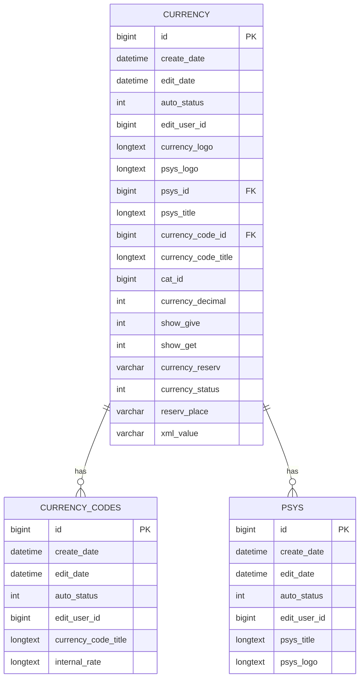
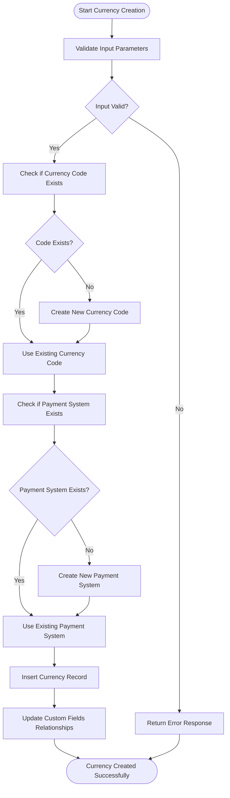
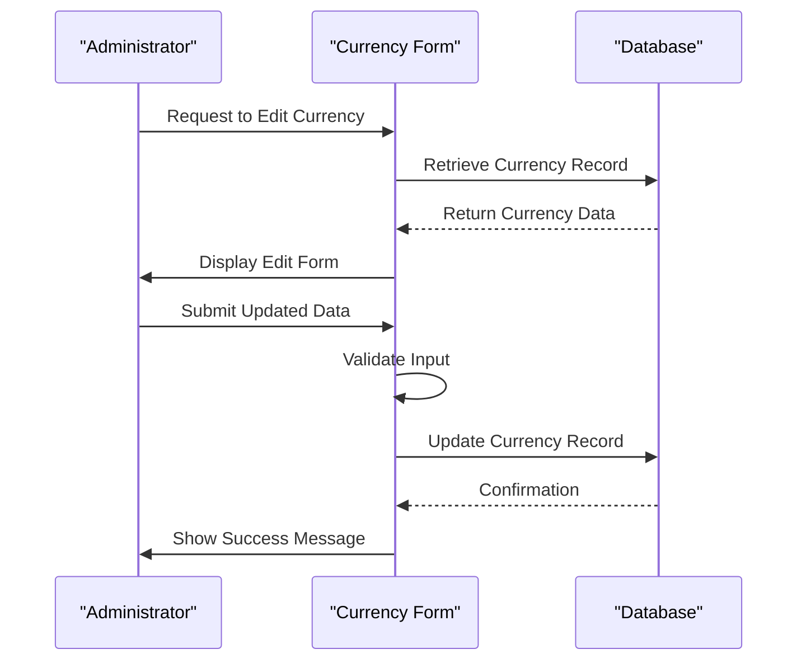
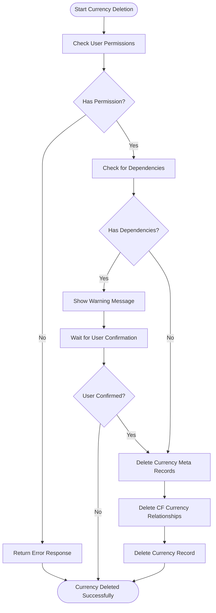
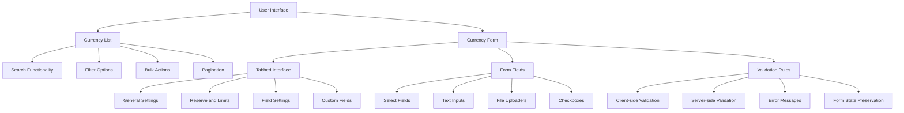
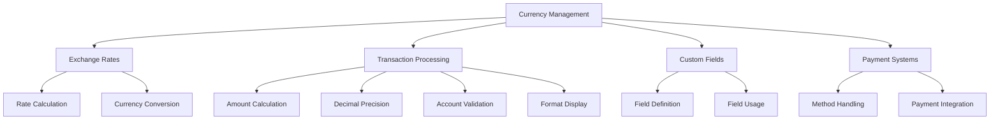

# Currency Management

<cite>
**Referenced Files in This Document**   
- [index.php](file://wp-content/plugins/premiumbox/plugin/currency/index.php)
- [add_currency.php](file://wp-content/plugins/premiumbox/plugin/currency/add_currency.php)
- [list_currency.php](file://wp-content/plugins/premiumbox/plugin/currency/list_currency.php)
- [add_currency_codes.php](file://wp-content/plugins/premiumbox/plugin/currency/add_currency_codes.php)
- [list_currency_codes.php](file://wp-content/plugins/premiumbox/plugin/currency/list_currency_codes.php)
- [list_psys.php](file://wp-content/plugins/premiumbox/plugin/currency/list_psys.php)
- [db.php](file://wp-content/plugins/premiumbox/activation/db.php)
</cite>

## Table of Contents
1. [Introduction](#introduction)
2. [Data Model](#data-model)
3. [Currency Creation](#currency-creation)
4. [Currency Editing](#currency-editing)
5. [Currency Deletion](#currency-deletion)
6. [User Interface Components](#user-interface-components)
7. [Relationships with Other Components](#relationships-with-other-components)
8. [Common Issues and Solutions](#common-issues-and-solutions)
9. [Conclusion](#conclusion)

## Introduction
The currency management system in the exchange platform is designed to handle various aspects of currency configuration, including creation, editing, and deletion of currency records. The system uses WordPress database tables to store currency information and provides a comprehensive interface for administrators to manage currencies. This document details the implementation of currency management functionality, focusing on the data model, user interface components, and integration with other system components.

## Data Model
The currency management system uses several database tables to store currency-related information. The primary table is `currency`, which stores the main currency records. This table is linked to other tables such as `currency_codes` and `psys` (payment systems) through foreign key relationships.

### Currency Table Structure
The `currency` table contains the following fields:
- `id`: Primary key, auto-incrementing identifier
- `create_date`: Timestamp of record creation
- `edit_date`: Timestamp of last modification
- `auto_status`: Status flag (1 for active, 0 for inactive)
- `edit_user_id`: ID of the user who last edited the record
- `currency_logo`: Serialized array containing main and additional logos
- `psys_logo`: Logo of the payment system
- `psys_id`: Foreign key linking to the payment system
- `psys_title`: Title of the payment system
- `currency_code_id`: Foreign key linking to the currency code
- `currency_code_title`: Title of the currency code
- `cat_id`: Category ID
- `currency_decimal`: Number of decimal places
- `show_give`: Flag indicating whether the currency should be shown for giving
- `show_get`: Flag indicating whether the currency should be shown for receiving
- `currency_reserv`: Reserve amount
- `currency_status`: Status flag (1 for active, 0 for inactive)
- `reserv_place`: Source of reserve information
- `xml_value`: XML name for the currency

### Currency Codes Table Structure
The `currency_codes` table contains the following fields:
- `id`: Primary key, auto-incrementing identifier
- `create_date`: Timestamp of record creation
- `edit_date`: Timestamp of last modification
- `auto_status`: Status flag (1 for active, 0 for inactive)
- `edit_user_id`: ID of the user who last edited the record
- `currency_code_title`: Title of the currency code
- `internal_rate`: Internal exchange rate relative to the base currency

### Payment Systems Table Structure
The `psys` table contains the following fields:
- `id`: Primary key, auto-incrementing identifier
- `create_date`: Timestamp of record creation
- `edit_date`: Timestamp of last modification
- `auto_status`: Status flag (1 for active, 0 for inactive)
- `edit_user_id`: ID of the user who last edited the record
- `psys_title`: Title of the payment system
- `psys_logo`: Logo of the payment system

**Diagram sources**
- [db.php](file://wp-content/plugins/premiumbox/activation/db.php#L75-L112)
- [db.php](file://wp-content/plugins/premiumbox/activation/db.php#L40-L54)
- [db.php](file://wp-content/plugins/premiumbox/activation/db.php#L14-L30)

**Section sources**
- [db.php](file://wp-content/plugins/premiumbox/activation/db.php#L58-L112)

## Currency Creation
The process of creating a new currency involves several steps, including form validation, data insertion, and relationship management. The system provides a user-friendly interface for administrators to add new currencies.

### Form Structure
The currency creation form is divided into several tabs:
- **General settings**: Includes status, category, payment system, currency code, logos, XML name, and decimal places
- **Reserve and limits**: Manages reserve information and limits
- **Field settings**: Controls visibility of "From Account" and "Onto Account" fields
- **Custom fields**: Allows selection of custom fields for sending and receiving

### Data Validation
The system performs several validation checks during currency creation:
- Ensures the currency code is not empty and has at least 2 characters
- Validates the decimal places value, defaulting to 4 if negative
- Checks for existing currency codes to prevent duplicates
- Validates XML name format (3-30 alphanumeric characters)

### Database Operations
When creating a new currency, the system performs the following database operations:
1. Checks if the currency code exists; if not, creates a new entry in the `currency_codes` table
2. Checks if the payment system exists; if not, creates a new entry in the `psys` table
3. Inserts the new currency record into the `currency` table
4. Updates relationships in the `cf_currency` table for custom fields

**Diagram sources**
- [add_currency.php](file://wp-content/plugins/premiumbox/plugin/currency/add_currency.php#L82-L305)
- [add_currency_codes.php](file://wp-content/plugins/premiumbox/plugin/currency/add_currency_codes.php#L105-L173)

**Section sources**
- [add_currency.php](file://wp-content/plugins/premiumbox/plugin/currency/add_currency.php#L82-L305)

## Currency Editing
The currency editing functionality allows administrators to modify existing currency records. The system provides a comprehensive interface for updating various aspects of a currency.

### Edit Process
The currency editing process follows these steps:
1. Retrieve the existing currency record from the database
2. Display the current values in the form
3. Allow the administrator to make changes
4. Validate the updated data
5. Update the database records

### Key Features
- **Status Management**: Administrators can activate or deactivate currencies
- **Category Assignment**: Currencies can be assigned to different categories
- **Logo Management**: Both main and additional logos can be updated
- **Decimal Precision**: The number of decimal places can be modified
- **Custom Fields**: Relationships with custom fields can be updated

### Database Operations
When editing a currency, the system performs the following operations:
1. Updates the main currency record in the `currency` table
2. Updates relationships in the `cf_currency` table for custom fields
3. Maintains audit trail with `edit_date` and `edit_user_id`

**Diagram sources**
- [add_currency.php](file://wp-content/plugins/premiumbox/plugin/currency/add_currency.php#L82-L305)
- [list_currency.php](file://wp-content/plugins/premiumbox/plugin/currency/list_currency.php#L218-L216)

**Section sources**
- [add_currency.php](file://wp-content/plugins/premiumbox/plugin/currency/add_currency.php#L82-L305)

## Currency Deletion
The currency deletion process is designed to maintain data integrity while allowing administrators to remove unwanted currency records.

### Deletion Process
The system handles currency deletion through the following steps:
1. Verify user permissions (administrator or pn_currency capability)
2. Check for dependencies and relationships
3. Remove related records from `currency_meta` table
4. Remove relationships from `cf_currency` table
5. Delete the main currency record

### Safety Measures
The system implements several safety measures to prevent accidental data loss:
- Requires explicit user confirmation
- Maintains audit trail with action hooks
- Provides "basket" functionality as an intermediate step before permanent deletion
- Validates user capabilities before proceeding

### Database Operations
When deleting a currency, the system performs the following operations:
1. Deletes related records from the `currency_meta` table
2. Removes relationships from the `cf_currency` table
3. Deletes the main currency record from the `currency` table

**Diagram sources**
- [index.php](file://wp-content/plugins/premiumbox/plugin/currency/index.php#L32-L45)
- [list_currency.php](file://wp-content/plugins/premiumbox/plugin/currency/list_currency.php#L193-L204)

**Section sources**
- [index.php](file://wp-content/plugins/premiumbox/plugin/currency/index.php#L32-L45)

## User Interface Components
The currency management system provides a comprehensive user interface for administrators to manage currencies effectively.

### Main Interface
The main currency management interface includes:
- **List View**: Displays all currencies in a tabular format with sortable columns
- **Search Functionality**: Allows filtering by currency code, payment system, category, and XML name
- **Bulk Actions**: Supports batch operations like activation, deactivation, and moving to basket
- **Pagination**: Handles large numbers of currencies with pagination

### Form Components
The currency creation and editing forms include several components:
- **Tabs**: Organizes form fields into logical groups
- **Select Fields**: Dropdown menus for selecting payment systems and currency codes
- **Text Inputs**: For entering currency details like XML name and decimal places
- **File Uploaders**: For uploading currency logos
- **Checkboxes**: For managing custom field relationships

### Validation and Error Handling
The system implements robust validation and error handling:
- **Client-side Validation**: Immediate feedback on form input
- **Server-side Validation**: Comprehensive checks on submitted data
- **Error Messages**: Clear, descriptive error messages in the user's language
- **Form State Preservation**: Maintains entered data when validation fails

**Diagram sources**
- [list_currency.php](file://wp-content/plugins/premiumbox/plugin/currency/list_currency.php#L219-L461)
- [add_currency.php](file://wp-content/plugins/premiumbox/plugin/currency/add_currency.php#L29-L76)

**Section sources**
- [list_currency.php](file://wp-content/plugins/premiumbox/plugin/currency/list_currency.php#L219-L461)

## Relationships with Other Components
The currency management system integrates with several other components in the exchange platform.

### Exchange Rates
Currencies are directly related to exchange rates through the `internal_rate` field in the `currency_codes` table. This rate defines the value of one unit of the currency relative to the base currency.

### Transaction Processing
Currencies are used in transaction processing to:
- Calculate amounts in different currencies
- Apply appropriate decimal precision
- Validate account numbers based on currency rules
- Display correct currency symbols and formats

### Custom Fields
The system supports custom fields for currencies through the `currency_custom_fields` and `cf_currency` tables. This allows for currency-specific fields that can be used in various contexts.

### Payment Systems
Currencies are linked to payment systems, which define the payment method associated with the currency. This relationship enables the system to handle different payment methods for different currencies.

**Diagram sources**
- [add_currency.php](file://wp-content/plugins/premiumbox/plugin/currency/add_currency.php#L255-L305)
- [index.php](file://wp-content/plugins/premiumbox/plugin/currency/index.php#L120-L125)

**Section sources**
- [add_currency.php](file://wp-content/plugins/premiumbox/plugin/currency/add_currency.php#L255-L305)

## Common Issues and Solutions
This section addresses common issues encountered in currency management and their solutions.

### Currency Code Conflicts
**Issue**: Attempting to create a currency with a code that already exists.
**Solution**: The system checks for existing currency codes before creation and displays an error message if a conflict is detected. Administrators should use unique currency codes or modify existing ones.

### Symbol Display Problems
**Issue**: Currency symbols not displaying correctly in the interface.
**Solution**: Ensure that the currency code is properly formatted and that the system's character encoding supports the required symbols. The system uses UTF-8 encoding to support a wide range of characters.

### Decimal Precision Errors
**Issue**: Calculations producing incorrect results due to decimal precision issues.
**Solution**: The system allows administrators to set the appropriate number of decimal places for each currency. Additionally, the `beautynum` module provides options to control the maximum number of decimal places in calculations.

### Performance Issues with Large Currency Sets
**Issue**: Slow loading times when managing a large number of currencies.
**Solution**: The system implements pagination and filtering to improve performance. Administrators can use search and filter options to quickly find specific currencies.

### Integration Issues with External Systems
**Issue**: Problems when integrating with external exchange rate providers or payment gateways.
**Solution**: Ensure that the XML name and currency codes match the requirements of external systems. The system provides validation for XML names to ensure compatibility with standards like Jsons.info.

**Section sources**
- [beautynum/index.php](file://wp-content/plugins/premiumbox/moduls/beautynum/index.php#L46-L103)
- [field_format/index.php](file://wp-content/plugins/premiumbox/moduls/field_format/index.php#L124-L151)

## Conclusion
The currency management system in the exchange platform provides a comprehensive solution for managing currencies within a WordPress environment. By using custom database tables instead of WordPress custom post types, the system achieves greater flexibility and control over currency data. The implementation includes robust features for currency creation, editing, and deletion, with comprehensive validation and error handling. The system integrates seamlessly with other components such as exchange rates and transaction processing, providing a cohesive experience for administrators and users alike. With proper configuration and attention to common issues, the currency management system can effectively support a wide range of exchange operations.