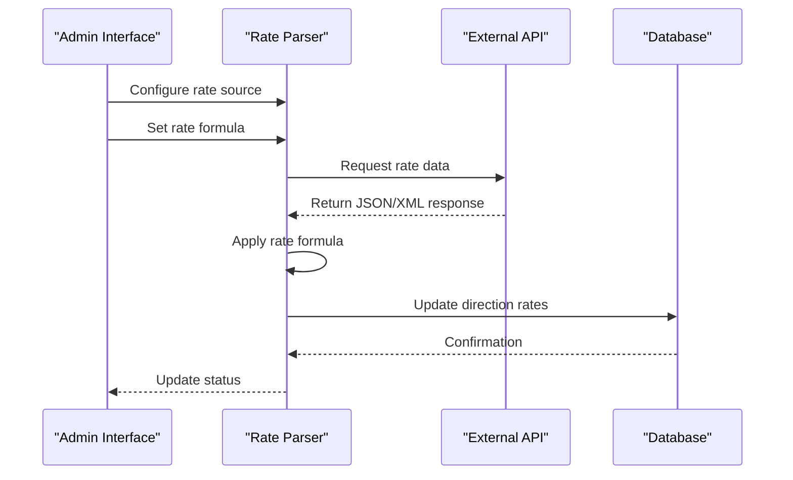
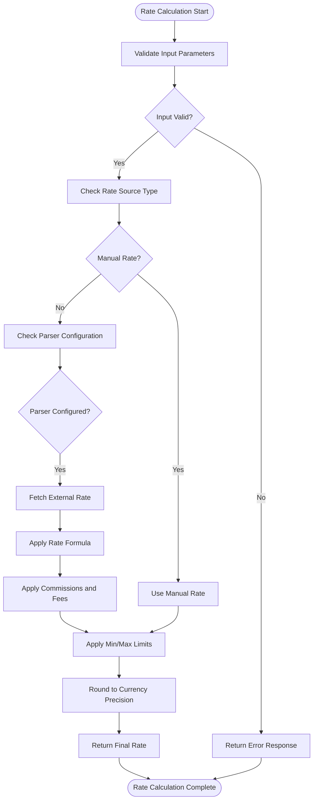
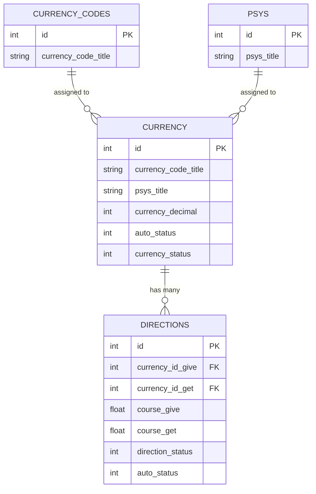

# Exchange Rate Configuration

<cite>
**Referenced Files in This Document**   
- [index.php](file://wp-content/plugins/premiumbox/plugin/exchange/index.php)
- [funcs.php](file://wp-content/plugins/premiumbox/plugin/exchange/funcs.php)
- [calculator.php](file://wp-content/plugins/premiumbox/plugin/exchange/calculator.php)
- [output.php](file://wp-content/plugins/premiumbox/moduls/direction_xml/output.php)
- [add.php](file://wp-content/plugins/premiumbox/moduls/parser_settings/add.php)
- [birg_filters.php](file://wp-content/plugins/premiumbox/moduls/parser_settings/birg_filters.php)
- [filters.php](file://wp-content/plugins/premiumbox/moduls/parser_settings/filters.php)
- [index.php](file://wp-content/plugins/premiumbox/plugin/currency/index.php)
- [display.php](file://wp-content/plugins/premiumbox/moduls/bestchange/display.php)
- [currtable/index.php](file://wp-content/plugins/premiumbox/moduls/currtable/index.php)
</cite>

## Table of Contents
1. [Introduction](#introduction)
2. [Currency Pairs and Direction Configuration](#currency-pairs-and-direction-configuration)
3. [Manual Rate Setting](#manual-rate-setting)
4. [Automatic Rate Synchronization](#automatic-rate-synchronization)
5. [Rate Calculation Algorithms](#rate-calculation-algorithms)
6. [Commission and Fee Configuration](#commission-and-fee-configuration)
7. [Availability and Reserve Rules](#availability-and-reserve-rules)
8. [Caching and Performance](#caching-and-performance)
9. [Integration with Currency Management](#integration-with-currency-management)
10. [Common Issues and Solutions](#common-issues-and-solutions)
11. [Admin Interface Configuration](#admin-interface-configuration)

## Introduction
The exchange rate configuration system provides a comprehensive framework for managing currency exchange rates in the premiumbox platform. This system supports both manual rate setting and automatic synchronization from external sources like BestChange, Quickex.io, and Hybrid-rate.com. The architecture is built around currency pairs (referred to as "directions") that define exchange relationships between different currencies, with configurable buy/sell rates, commissions, and availability rules. The system integrates with currency management components and transaction processing to ensure accurate exchange calculations. This documentation provides a detailed explanation of the implementation, covering rate storage, update mechanisms, calculation algorithms, and common configuration scenarios.

## Currency Pairs and Direction Configuration
The exchange rate system is organized around currency pairs, referred to as "directions" in the codebase. Each direction represents a specific exchange relationship between two currencies, defining the exchange rate from a "give" currency to a "get" currency. Directions are stored in the database table `wp_directions` with key fields including `currency_id_give`, `currency_id_get`, `course_give`, and `course_get` which store the exchange rates. Each direction has a status field that controls its availability, with values like '1' for active and '2' for disabled. The system supports multiple exchange directions for the same currency pair, allowing for different rate configurations based on various criteria. Currency information is managed separately in the `wp_currency` table and linked to directions through their respective IDs. The direction configuration also includes decimal precision settings for both currencies, which are used in rate calculations and display formatting.

**Section sources**
- [funcs.php](file://wp-content/plugins/premiumbox/plugin/exchange/funcs.php#L53-L58)
- [index.php](file://wp-content/plugins/premiumbox/plugin/currency/index.php#L134-L173)

## Manual Rate Setting
Manual rate configuration allows administrators to set fixed exchange rates for currency pairs through the admin interface. The system provides a form-based interface where administrators can input the exchange rate for both directions of a currency pair (give and get). Manual rates can be set directly in the direction configuration form, where the `course_give` and `course_get` fields accept decimal values representing the exchange rate. The system validates these values to ensure they are positive numbers and within acceptable ranges. When a direction is configured with a manual rate, the `param` field in the direction data contains the value 'manual' to indicate this configuration. The manual rate setting takes precedence over automatically synchronized rates, ensuring that administrator-defined rates are used even when automatic synchronization is enabled. The interface also allows setting minimum and maximum exchange amounts, which control the transaction size limits for each direction.

**Section sources**
- [output.php](file://wp-content/plugins/premiumbox/moduls/direction_xml/output.php#L198-L200)
- [add.php](file://wp-content/plugins/premiumbox/moduls/parser_settings/add.php#L106-L119)

## Automatic Rate Synchronization
The system supports automatic synchronization of exchange rates from external sources through a parser mechanism. External rate sources are defined in the `birg_filters.php` file, which contains configuration for various exchange rate providers including Abcex.io, Grinex.io, Quickex.io, Nicepay.io, and Hybrid-rate.com. Each source is configured with a title, URL endpoint, and unique identifier. The synchronization process is triggered by scheduled tasks or manual updates, retrieving rate data from the configured endpoints. For JSON-based sources like Hybrid-rate.com, the system parses the response and extracts rate information based on predefined patterns. The parser uses rate formulas defined in the admin interface to calculate final exchange rates from the raw data. These formulas can include mathematical operations like multiplication, division, addition, and subtraction, allowing complex rate calculations that combine multiple data sources. The synchronized rates are then applied to the corresponding currency directions in the system.

**Diagram sources**
- [birg_filters.php](file://wp-content/plugins/premiumbox/moduls/parser_settings/birg_filters.php#L326-L378)
- [add.php](file://wp-content/plugins/premiumbox/moduls/parser_settings/add.php#L43-L49)

## Rate Calculation Algorithms
The exchange rate calculation system implements several algorithms to determine the final exchange rate based on various factors. The primary calculation occurs in the `get_calc_data` function, which processes the exchange parameters and applies the appropriate rate. For currency pairs with automatic rate synchronization, the system first retrieves the base rate from the parser, then applies any configured adjustments. The calculation considers the transaction direction (give/get), user role, and any applicable discounts. The system uses precision settings from the currency configuration to round rates to the appropriate decimal places. When calculating the inverse rate (from get to give), the system uses the formula `1/rate` to ensure mathematical consistency. The calculation also incorporates commission adjustments, applying percentage and fixed fee components to the base rate. For floating rates, the system may apply dynamic adjustments based on market conditions or reserve levels. The final rate is validated against minimum and maximum limits before being returned for use in the exchange process.

**Diagram sources**
- [funcs.php](file://wp-content/plugins/premiumbox/plugin/exchange/funcs.php#L117-L118)
- [output.php](file://wp-content/plugins/premiumbox/moduls/direction_xml/output.php#L163-L170)

## Commission and Fee Configuration
The system supports flexible commission and fee structures for exchange transactions. Commissions can be configured as percentage-based, fixed amounts, or a combination of both. The commission configuration is stored in the `fromfee` and `tofee` fields of the direction data, with values formatted as comma-separated strings containing percentage and fixed fee components. For example, a commission value of "2%,5" represents a 2% fee plus a fixed fee of 5 units of the currency. The system parses these values using the `json_commission` function, which separates percentage and fixed components for processing. Percentage commissions are applied to the transaction amount, while fixed fees are added as a flat amount. The system also supports minimum fee configurations through the `minfee` field, ensuring that transactions always generate a minimum revenue regardless of size. Commission calculations are applied during the rate calculation process, adjusting the effective exchange rate to include these costs. The admin interface provides separate fields for configuring commissions on both the give and get sides of the exchange.

**Section sources**
- [output.php](file://wp-content/plugins/premiumbox/moduls/direction_xml/output.php#L70-L92)
- [add.php](file://wp-content/plugins/premiumbox/moduls/parser_settings/add.php#L106-L119)

## Availability and Reserve Rules
Exchange direction availability is controlled through multiple mechanisms including status flags, reserve requirements, and time-based rules. Each direction has a `direction_status` field that determines its availability, with values like '1' for active and '2' for disabled. The system also checks currency availability through the `currency_status` field in the currency table. Reserve rules are implemented through minimum and maximum amount configurations (`minamount` and `maxamount` fields), which define the acceptable transaction size range. These limits can be specified as fixed values or as formulas that reference external data sources. The system validates transactions against these limits during the calculation process, returning appropriate error messages if limits are exceeded. For exchanges integrated with BestChange, additional reserve rules are applied based on the exchanger's available funds, with a minimum reserve threshold configurable in the admin interface. The system also supports city-specific availability through the `city` field, allowing different rates and availability for different geographic locations.

**Section sources**
- [output.php](file://wp-content/plugins/premiumbox/moduls/direction_xml/output.php#L177-L185)
- [display.php](file://wp-content/plugins/premiumbox/moduls/bestchange/display.php#L17-L18)

## Caching and Performance
The exchange rate system implements several caching mechanisms to improve performance and reduce database load. Currency data is cached using WordPress's object cache system, with currency information retrieved in bulk through the `get_currency_data` function. This function accepts an array of currency IDs and returns a complete dataset, minimizing database queries. Exchange direction data is also cached, with the system retrieving all active directions in a single query when needed for rate calculations. The system uses transient caching for external API responses, storing rate data for a configurable period to avoid excessive requests to external services. The XML/JSON output generation process includes caching through the `pn_directions_filedata` option, which stores pre-processed direction data to speed up file generation. The system also implements client-side caching through HTTP headers, setting appropriate `Last-Modified` timestamps to allow browser caching of rate files. For high-traffic scenarios, the system can be configured to use external caching solutions like Redis or Memcached through WordPress's object cache interface.

**Section sources**
- [funcs.php](file://wp-content/plugins/premiumbox/plugin/exchange/funcs.php#L56-L57)
- [output.php](file://wp-content/plugins/premiumbox/moduls/direction_xml/output.php#L144-L146)

## Integration with Currency Management
The exchange rate system is tightly integrated with the currency management component, sharing data and configuration through a common database structure. Currency information is stored in the `wp_currency` table and referenced by exchange directions through foreign key relationships. The currency management system provides essential data for rate calculations, including currency codes, decimal precision, and payment system information. When a new currency is added or modified, the changes are automatically reflected in the exchange rate system. The integration also extends to currency codes and payment systems, with separate tables (`wp_currency_codes` and `wp_psys`) that store additional metadata used in rate configuration. The system uses the `get_currency_data` function to retrieve comprehensive currency information, including meta fields that may affect rate calculations. Currency status changes (activation/deactivation) are synchronized between the systems, ensuring that disabled currencies are not available for exchange. The admin interface provides unified management of currencies and exchange directions, allowing administrators to configure both aspects from a single interface.

**Diagram sources**
- [index.php](file://wp-content/plugins/premiumbox/plugin/currency/index.php#L134-L173)
- [funcs.php](file://wp-content/plugins/premiumbox/plugin/exchange/funcs.php#L56-L57)

## Common Issues and Solutions
Several common issues may arise in the exchange rate configuration system, along with their respective solutions. Rate synchronization failures can occur due to network issues, API changes, or incorrect parser configurations. These are typically resolved by verifying the API endpoint URL, checking authentication credentials, and validating the rate formula syntax. Incorrect commission calculations often result from improperly formatted commission strings or incorrect application of percentage vs. fixed fees. This is addressed by ensuring commission values follow the correct format (e.g., "2%,5" for 2% plus 5 units) and by testing calculations with various transaction amounts. Stale rate data issues may occur when caching is too aggressive or when scheduled tasks fail to execute. Solutions include adjusting cache expiration times, verifying cron job functionality, and implementing manual refresh options. Configuration conflicts between manual and automatic rates can be resolved by ensuring the 'manual' parameter is correctly set and by establishing clear precedence rules. Performance issues with rate calculations can be mitigated by optimizing database queries, implementing efficient caching strategies, and reducing the number of active exchange directions.

**Section sources**
- [output.php](file://wp-content/plugins/premiumbox/moduls/direction_xml/output.php#L123-L135)
- [funcs.php](file://wp-content/plugins/premiumbox/plugin/exchange/funcs.php#L143-L157)

## Admin Interface Configuration
The admin interface provides comprehensive tools for configuring exchange rates through a series of forms and settings pages. The main configuration is accessed through the "Add rate" and "Edit rate" forms, which provide fields for setting the source name, currency pair names, and rate formulas. The interface includes contextual help that explains the syntax for rate formulas, including supported mathematical operations and variable references. For automatic rate synchronization, administrators can configure parser settings including the data source URL, update frequency, and error handling options. The interface also provides options for setting minimum and maximum exchange amounts, commission structures, and availability rules. Currency selection is enhanced with search functionality, allowing administrators to quickly find specific currencies from large lists. The configuration forms include validation to prevent common errors like invalid rate formulas or conflicting settings. Changes are saved through AJAX requests, providing immediate feedback on the success or failure of the configuration update. The interface also supports copying existing rate configurations, allowing administrators to create new rates based on established templates.

**Section sources**
- [add.php](file://wp-content/plugins/premiumbox/moduls/parser_settings/add.php#L77-L127)
- [currtable/index.php](file://wp-content/plugins/premiumbox/moduls/currtable/index.php#L53-L86)