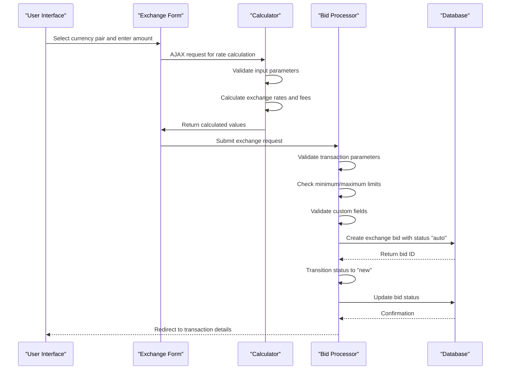
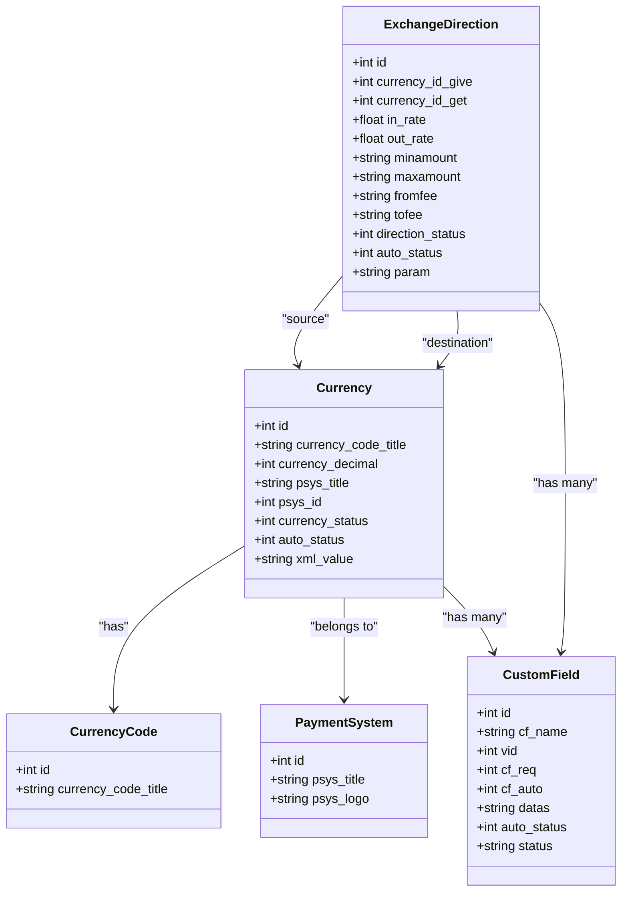
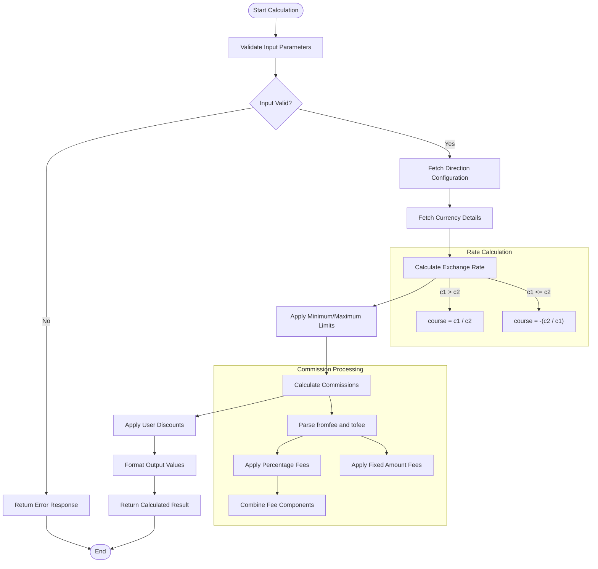
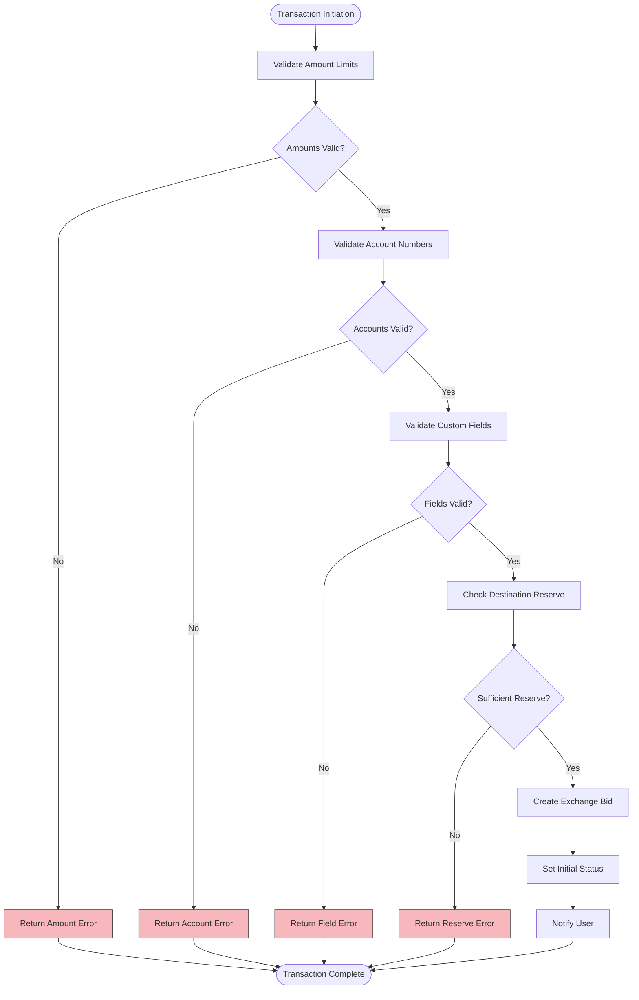

# Exchange System

<cite>
**Referenced Files in This Document**   
- [index.php](file://wp-content/plugins/premiumbox/plugin/exchange/index.php)
- [funcs.php](file://wp-content/plugins/premiumbox/plugin/exchange/funcs.php)
- [calculator.php](file://wp-content/plugins/premiumbox/plugin/exchange/calculator.php)
- [action.php](file://wp-content/plugins/premiumbox/plugin/exchange/action.php)
- [output.php](file://wp-content/plugins/premiumbox/moduls/direction_xml/output.php)
- [exchange.php](file://wp-content/plugins/premiumbox/shortcode/exchange.php)
- [lastexchanges.php](file://wp-content/plugins/premiumbox/widget/lastexchanges.php)
- [index.php](file://wp-content/plugins/premiumbox/plugin/currency/index.php)
</cite>

## Table of Contents
1. [Introduction](#introduction)
2. [Exchange Workflow Architecture](#exchange-workflow-architecture)
3. [Currency and Direction Management](#currency-and-direction-management)
4. [Rate Calculation and Commission Logic](#rate-calculation-and-commission-logic)
5. [Transaction Processing and Validation](#transaction-processing-and-validation)
6. [Public Interfaces and API Endpoints](#public-interfaces-and-api-endpoints)
7. [Data Model and Relationships](#data-model-and-relationships)
8. [Common Issues and Solutions](#common-issues-and-solutions)
9. [Performance Considerations](#performance-considerations)
10. [Conclusion](#conclusion)

## Introduction

The Exchange System serves as the core transaction processing engine for currency conversion operations within the platform. It handles the complete lifecycle of exchange transactions from user input to completed transaction, managing currency pair configurations, rate calculations, commission applications, and order validation. The system is designed to support multiple payment systems and currency pairs with configurable exchange parameters.

The architecture follows a modular approach with distinct components for exchange processing, currency management, and data export. The system integrates with various merchant services through API calls and maintains transaction state through a comprehensive status management system. Exchange rates are dynamically calculated based on configured parameters and can be exported in multiple formats including JSON, XML, and TXT for integration with external services like BestChange.

**Section sources**
- [index.php](file://wp-content/plugins/premiumbox/plugin/exchange/index.php#L1-L47)
- [funcs.php](file://wp-content/plugins/premiumbox/plugin/exchange/funcs.php#L1-L532)

## Exchange Workflow Architecture

The exchange workflow follows a multi-step process from user initiation to transaction completion. The system begins with user input on the exchange form where users select currency pairs and enter transaction amounts. The workflow then proceeds through validation, calculation, and confirmation stages before finalizing the transaction.

The process starts with the exchange shortcode that renders the exchange form interface. When users interact with the form, AJAX calls are made to the calculator endpoint to dynamically update exchange rates and fees based on input amounts. The system supports bidirectional calculation, allowing users to input either the amount they want to send or receive, with the complementary amount calculated automatically.

Upon form submission, the system creates a preliminary bid with status "auto" which is then validated and converted to a "new" status if all requirements are met. The transaction progresses through various statuses including "new", "techpay", "coldpay", "success", and "cancel" as it moves through the processing pipeline. Each status transition triggers appropriate actions and notifications.

**Diagram sources **
- [action.php](file://wp-content/plugins/premiumbox/plugin/exchange/action.php#L410-L480)
- [calculator.php](file://wp-content/plugins/premiumbox/plugin/exchange/calculator.php#L4-L159)
- [exchange.php](file://wp-content/plugins/premiumbox/shortcode/exchange.php#L440-L469)

**Section sources**
- [action.php](file://wp-content/plugins/premiumbox/plugin/exchange/action.php#L410-L480)
- [calculator.php](file://wp-content/plugins/premiumbox/plugin/exchange/calculator.php#L4-L159)
- [exchange.php](file://wp-content/plugins/premiumbox/shortcode/exchange.php#L271-L438)

## Currency and Direction Management

The system implements a comprehensive currency management system that supports multiple currencies and payment systems. Currencies are configured with essential attributes including currency code, decimal precision, payment system association, and display titles. The currency system allows for flexible configuration through custom fields that can be applied to specific currencies or exchange directions.

Exchange directions define the available currency pairs for conversion, specifying the source (give) and destination (get) currencies. Each direction includes configuration for exchange rates, minimum and maximum transaction limits, and associated fees. The system supports both fixed and floating exchange rates, with the ability to configure rate calculations based on reserve levels and market conditions.

Currency pairs are organized in a directional relationship where each direction represents a unidirectional exchange path. The system maintains separate configurations for each direction, allowing different rates and fees for reciprocal currency pairs. This enables operators to set different terms for buying versus selling specific currencies.

**Diagram sources **
- [index.php](file://wp-content/plugins/premiumbox/plugin/currency/index.php#L1-L186)
- [output.php](file://wp-content/plugins/premiumbox/moduls/direction_xml/output.php#L1-L523)

**Section sources**
- [index.php](file://wp-content/plugins/premiumbox/plugin/currency/index.php#L1-L186)
- [output.php](file://wp-content/plugins/premiumbox/moduls/direction_xml/output.php#L1-L523)

## Rate Calculation and Commission Logic

The exchange system implements sophisticated rate calculation algorithms that determine the exchange rate based on configured parameters and current market conditions. The rate calculation process considers multiple factors including base rates, reserve levels, and directional configuration. The system supports both percentage-based and fixed-amount commissions, which can be applied to either the source or destination currency.

Rate calculations are performed using a formula that takes into account the inbound and outbound rates configured for each exchange direction. When the inbound rate is greater than the outbound rate, the system calculates the exchange rate as the ratio of inbound to outbound amounts. Otherwise, it calculates the inverse ratio and applies a negative sign to indicate the direction of exchange.

Commission structures are highly configurable, supporting multiple fee types including percentage fees, fixed fees, or a combination of both. The system can apply different commission structures for the source and destination currencies, allowing for complex fee arrangements. Commission calculations are performed during the exchange process and reflected in the final transaction amounts.

**Diagram sources **
- [output.php](file://wp-content/plugins/premiumbox/moduls/direction_xml/output.php#L147-L194)
- [funcs.php](file://wp-content/plugins/premiumbox/plugin/exchange/funcs.php#L109-L142)
- [calculator.php](file://wp-content/plugins/premiumbox/plugin/exchange/calculator.php#L64-L93)

**Section sources**
- [output.php](file://wp-content/plugins/premiumbox/moduls/direction_xml/output.php#L147-L194)
- [funcs.php](file://wp-content/plugins/premiumbox/plugin/exchange/funcs.php#L109-L142)
- [calculator.php](file://wp-content/plugins/premiumbox/plugin/exchange/calculator.php#L64-L93)

## Transaction Processing and Validation

The transaction processing system implements a robust validation framework that ensures all exchange requests meet configured requirements before processing. The validation process checks multiple aspects including amount limits, account validity, and custom field requirements. Each exchange direction can have specific validation rules that must be satisfied for the transaction to proceed.

The system performs comprehensive validation of transaction amounts against configured minimum and maximum limits. These limits can be defined globally for the currency pair or customized for specific exchange directions. The validation also considers the available reserve for the destination currency to ensure sufficient funds are available to complete the transaction.

Custom field validation is a key component of the transaction processing system, allowing operators to collect additional information from users based on the selected exchange direction. These custom fields can be mandatory or optional and support various input types including text, dropdowns, and account number validation. The system validates all required custom fields before allowing the transaction to proceed.

**Diagram sources **
- [funcs.php](file://wp-content/plugins/premiumbox/plugin/exchange/funcs.php#L143-L173)
- [action.php](file://wp-content/plugins/premiumbox/plugin/exchange/action.php#L461-L468)
- [funcs.php](file://wp-content/plugins/premiumbox/plugin/exchange/funcs.php#L470-L532)

**Section sources**
- [funcs.php](file://wp-content/plugins/premiumbox/plugin/exchange/funcs.php#L143-L173)
- [action.php](file://wp-content/plugins/premiumbox/plugin/exchange/action.php#L461-L468)
- [funcs.php](file://wp-content/plugins/premiumbox/plugin/exchange/funcs.php#L470-L532)

## Public Interfaces and API Endpoints

The exchange system provides several public interfaces and API endpoints that enable interaction with the system from both user interfaces and external applications. These interfaces follow a consistent pattern of accepting parameters, performing validation, and returning structured responses with status codes and relevant data.

The primary user interface is exposed through the [exchange] shortcode, which renders the exchange form on designated pages. This form provides a complete interface for users to initiate exchange transactions, with dynamic calculation of rates and fees through AJAX calls to the calculator endpoint. The form supports both single-step and multi-step exchange processes based on configuration.

The system exposes several AJAX endpoints for programmatic interaction:
- **exchange_calculator**: Calculates exchange rates and fees based on input parameters
- **create_bid**: Creates a new exchange transaction
- **confirm_bid**: Confirms a pending exchange transaction
- **canceledbids**: Cancels an existing exchange transaction
- **payedbids**: Marks a transaction as paid

These endpoints return JSON responses containing status information, calculated values, and error messages when applicable. The responses include detailed information about the exchange calculation including gross and net amounts, commission details, and user discount information.

```mermaid
erDiagram
EXCHANGE_BIDS {
bigint id PK
datetime create_date
datetime edit_date
varchar status
varchar bid_locale
bigint currency_id_give FK
bigint currency_id_get FK
varchar currency_code_give
varchar currency_code_get
bigint currency_code_id_give FK
bigint currency_code_id_get FK
longtext psys_give
longtext psys_get
bigint psys_id_give FK
bigint psys_id_get FK
varchar hashed UK
bigint direction_id FK
bigint user_id FK
varchar user_login
varchar user_ip
varchar user_agent
longtext metas
longtext dmetas
longtext unmetas
varchar account_give
varchar account_get
varchar pay_ac
varchar pay_sum
varchar out_sum
varchar user_discount
varchar user_discount_sum
varchar exsum
varchar sum1
varchar sum1dc
varchar sum1r
varchar sum1c
varchar sum2t
varchar sum2
varchar dop_com2
varchar sum2dc
varchar sum2r
varchar sum2c
varchar profit
varchar user_hash
varchar txid_in
varchar txid_out
varchar trans_in
varchar trans_out
varchar m_in
varchar m_out
varchar ref_id
varchar ref_percent
varchar ref_sum
varchar ref_status
varchar ref_payed
varchar ref_payed_sum
varchar ref_payed_date
varchar ref_payed_trans
varchar ref_payed_m_out
varchar ref_payed_m_place
varchar ref_payed_system
varchar ref_payed_status
varchar ref_payed_hashed
varchar ref_payed_id
varchar ref_payed_user_id
varchar ref_payed_user_login
varchar ref_payed_user_ip
varchar ref_payed_user_agent
varchar ref_payed_metas
varchar ref_payed_dmetas
varchar ref_payed_unmetas
varchar ref_payed_account_give
varchar ref_payed_account_get
varchar ref_payed_pay_ac
varchar ref_payed_pay_sum
varchar ref_payed_out_sum
varchar ref_payed_user_discount
varchar ref_payed_user_discount_sum
varchar ref_payed_exsum
varchar ref_payed_sum1
varchar ref_payed_sum1dc
varchar ref_payed_sum1r
varchar ref_payed_sum1c
varchar ref_payed_sum2t
varchar ref_payed_sum2
varchar ref_payed_dop_com2
varchar ref_payed_sum2dc
varchar ref_payed_sum2r
varchar ref_payed_sum2c
varchar ref_payed_profit
varchar ref_payed_user_hash
varchar ref_payed_txid_in
varchar ref_payed_txid_out
varchar ref_payed_trans_in
varchar ref_payed_trans_out
varchar ref_payed_m_in
varchar ref_payed_m_out
}
DIRECTIONS {
bigint id PK
bigint currency_id_give FK
bigint currency_id_get FK
float in_rate
float out_rate
varchar minamount
varchar maxamount
varchar fromfee
varchar tofee
varchar param
varchar city
varchar direction_name UK
varchar direction_status
varchar auto_status
varchar direction_title
varchar direction_desc
varchar direction_keywords
varchar direction_template
varchar direction_order
varchar direction_sort
varchar direction_image
varchar direction_color
varchar direction_icon
varchar direction_logo
varchar direction_banner
varchar direction_promo
varchar direction_promo_text
varchar direction_promo_link
varchar direction_promo_image
varchar direction_promo_color
varchar direction_promo_icon
varchar direction_promo_banner
varchar direction_promo_order
varchar direction_promo_sort
}
CURRENCY {
bigint id PK
varchar currency_code_title
int currency_decimal
varchar psys_title
int psys_id
varchar currency_status
varchar auto_status
varchar xml_value
varchar currency_code_id FK
varchar psys_logo
varchar currency_template
varchar currency_order
varchar currency_sort
varchar currency_image
varchar currency_color
varchar currency_icon
varchar currency_logo
varchar currency_banner
varchar currency_promo
varchar currency_promo_text
varchar currency_promo_link
varchar currency_promo_image
varchar currency_promo_color
varchar currency_promo_icon
varchar currency_promo_banner
varchar currency_promo_order
varchar currency_promo_sort
}
CURRENCY_CODES {
bigint id PK
varchar currency_code_title
varchar currency_code_status
varchar currency_code_sort
}
PSYS {
bigint id PK
varchar psys_title
varchar psys_logo
varchar psys_status
varchar psys_sort
}
EXCHANGE_BIDS ||--o{ DIRECTIONS : "belongs to"
EXCHANGE_BIDS ||--o{ CURRENCY : "currency_id_give"
EXCHANGE_BIDS ||--o{ CURRENCY : "currency_id_get"
CURRENCY ||--o{ CURRENCY_CODES : "has"
CURRENCY ||--o{ PSYS : "has"
DIRECTIONS ||--o{ CURRENCY : "currency_id_give"
DIRECTIONS ||--o{ CURRENCY : "currency_id_get"
```

**Diagram sources **
- [activation/db.php](file://wp-content/plugins/premiumbox/activation/db.php#L340-L438)
- [action.php](file://wp-content/plugins/premiumbox/plugin/exchange/action.php#L410-L480)
- [calculator.php](file://wp-content/plugins/premiumbox/plugin/exchange/calculator.php#L4-L159)

**Section sources**
- [activation/db.php](file://wp-content/plugins/premiumbox/activation/db.php#L340-L438)
- [action.php](file://wp-content/plugins/premiumbox/plugin/exchange/action.php#L410-L480)
- [calculator.php](file://wp-content/plugins/premiumbox/plugin/exchange/calculator.php#L4-L159)

## Data Model and Relationships

The exchange system utilizes a comprehensive data model centered around the exchange_bids table, which stores all transaction records. This table maintains detailed information about each exchange transaction including amounts, fees, user information, and transaction status. The data model is designed to support complex exchange operations with multiple configurable parameters.

The core entity is the exchange_bid, which represents a single exchange transaction. Each bid is associated with an exchange direction that defines the currency pair and exchange parameters. The bid record stores both the source and destination currency information, including currency codes, payment systems, and decimal precision. This allows for accurate calculation and display of amounts in their respective formats.

The system implements a flexible metadata structure that supports custom fields for both exchange directions and individual currencies. These custom fields are stored in serialized format within the bid record, allowing for dynamic collection of additional information based on the specific exchange requirements. The metadata system supports various field types including text inputs, dropdowns, and account number validation.

Relationships between entities are established through foreign key references, with the exchange_bids table linking to directions, currencies, and payment systems. The system also maintains user information and referral data, enabling comprehensive tracking of transaction history and affiliate relationships. Transaction status is managed through a state transition system that records the current status and allows for appropriate actions based on the status value.

**Section sources**
- [activation/db.php](file://wp-content/plugins/premiumbox/activation/db.php#L340-L438)
- [funcs.php](file://wp-content/plugins/premiumbox/plugin/exchange/funcs.php#L337-L388)
- [migrate.php](file://wp-content/plugins/premiumbox/plugin/migrate/migrate.php#L2021-L2044)

## Common Issues and Solutions

The exchange system may encounter several common issues during operation, primarily related to rate synchronization, currency availability, and transaction validation. Understanding these issues and their solutions is crucial for maintaining system reliability and user satisfaction.

Rate synchronization problems can occur when exchange rates become outdated or inconsistent between different system components. This typically happens when rate updates fail to propagate to all required locations. The solution involves ensuring the rate update cron jobs are running correctly and verifying that the rate cache is properly invalidated after updates. Operators should monitor the rate update logs and implement alerting for failed update attempts.

Currency availability errors occur when the system lacks sufficient reserve to fulfill exchange requests. This can happen when the reserve levels are not properly maintained or when sudden spikes in demand exceed available funds. The solution involves implementing reserve monitoring with threshold alerts and establishing procedures for timely reserve replenishment. The system should also provide clear error messages to users when transactions cannot be processed due to insufficient reserves.

Transaction validation failures commonly stem from incorrect input data, expired sessions, or configuration issues. These include invalid account numbers, amounts outside minimum/maximum limits, and missing required custom fields. The solution involves improving user interface validation with real-time feedback, implementing session management to prevent expiration during the exchange process, and conducting regular audits of exchange direction configurations to ensure all requirements are properly defined.

Other common issues include:
- **Duplicate transaction IDs**: Prevented by checking for existing transactions with the same ID before processing
- **Payment confirmation failures**: Addressed through merchant cron jobs that periodically check transaction status
- **User authentication issues**: Resolved by ensuring proper session management and user hash validation
- **Form submission errors**: Mitigated by implementing robust AJAX error handling and user feedback

**Section sources**
- [funcs.php](file://wp-content/plugins/premiumbox/plugin/exchange/funcs.php#L143-L173)
- [action.php](file://wp-content/plugins/premiumbox/plugin/exchange/action.php#L461-L468)
- [merch_func.php](file://wp-content/plugins/premiumbox/plugin/merchants/merch_func.php#L1009-L1023)

## Performance Considerations

The exchange system's performance is primarily influenced by rate calculation algorithms, database queries, and caching strategies. The rate calculation process involves multiple database queries to fetch direction configurations, currency details, and user-specific parameters. Optimizing these queries through proper indexing and query optimization is essential for maintaining responsive performance.

Caching plays a critical role in system performance, particularly for frequently accessed exchange data. The system implements several caching mechanisms including:
- **Rate caching**: Storing calculated exchange rates to avoid recalculation for identical requests
- **Direction caching**: Caching exchange direction configurations to reduce database queries
- **Currency caching**: Maintaining currency and payment system information in memory
- **User session caching**: Storing user-specific data to minimize database lookups

The calculator functionality is particularly performance-sensitive as it is called frequently during user interaction with the exchange form. Optimizing this component through efficient algorithms and response caching can significantly improve user experience. The system should also implement rate limiting for API endpoints to prevent abuse and ensure fair resource allocation.

Database performance can be enhanced through proper indexing of frequently queried fields such as status, direction_id, currency_id_give, and currency_id_get. Regular database maintenance including optimization and defragmentation should be performed to maintain optimal performance. For high-volume systems, consider implementing database replication or sharding to distribute the load.

**Section sources**
- [output.php](file://wp-content/plugins/premiumbox/moduls/direction_xml/output.php#L147-L194)
- [calculator.php](file://wp-content/plugins/premiumbox/plugin/exchange/calculator.php#L4-L159)
- [activation/db.php](file://wp-content/plugins/premiumbox/activation/db.php#L402-L438)

## Conclusion

The Exchange System provides a comprehensive solution for currency conversion and transaction processing with robust features for rate management, commission calculation, and order validation. Its modular architecture allows for flexible configuration of currency pairs, exchange parameters, and custom fields, making it adaptable to various business requirements.

The system's strength lies in its comprehensive workflow management, from user input through transaction completion, with proper validation at each stage. The integration with multiple merchant services and support for various data export formats enhances its versatility for different use cases. The detailed data model and status management system provide excellent traceability and audit capabilities for all transactions.

For optimal operation, administrators should focus on maintaining accurate exchange rates, ensuring sufficient reserves, and regularly monitoring system performance. Implementing proper monitoring and alerting for critical components such as rate updates and merchant cron jobs will help prevent service disruptions. The system's extensibility through hooks and filters allows for customization to meet specific business needs without modifying core functionality.