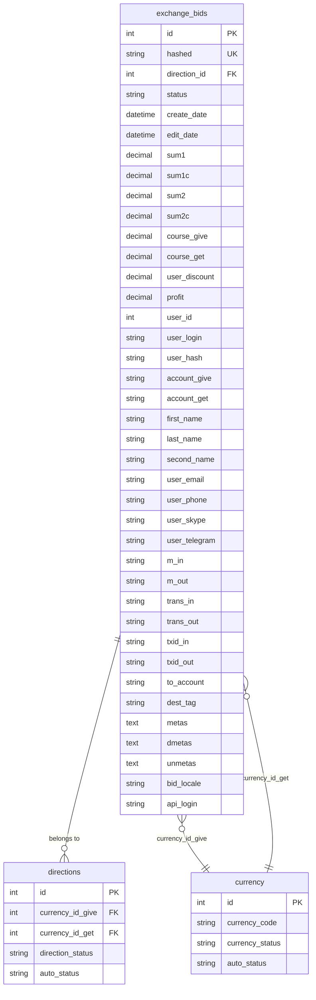
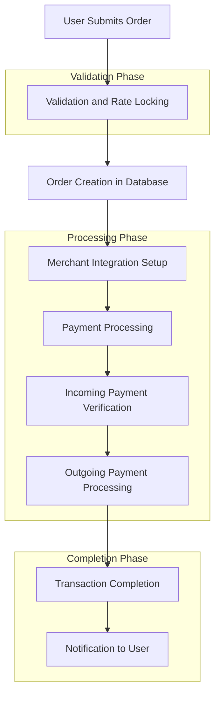
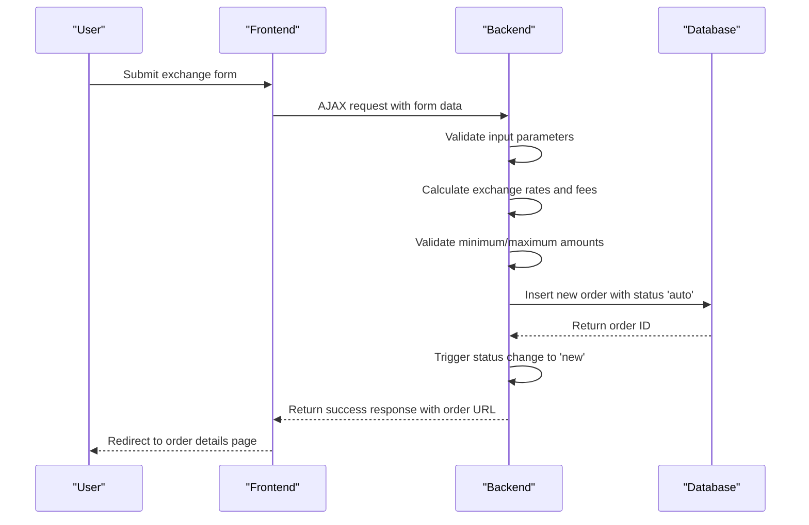
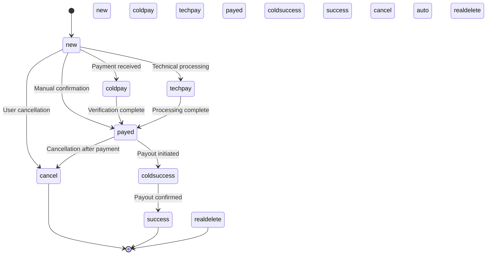
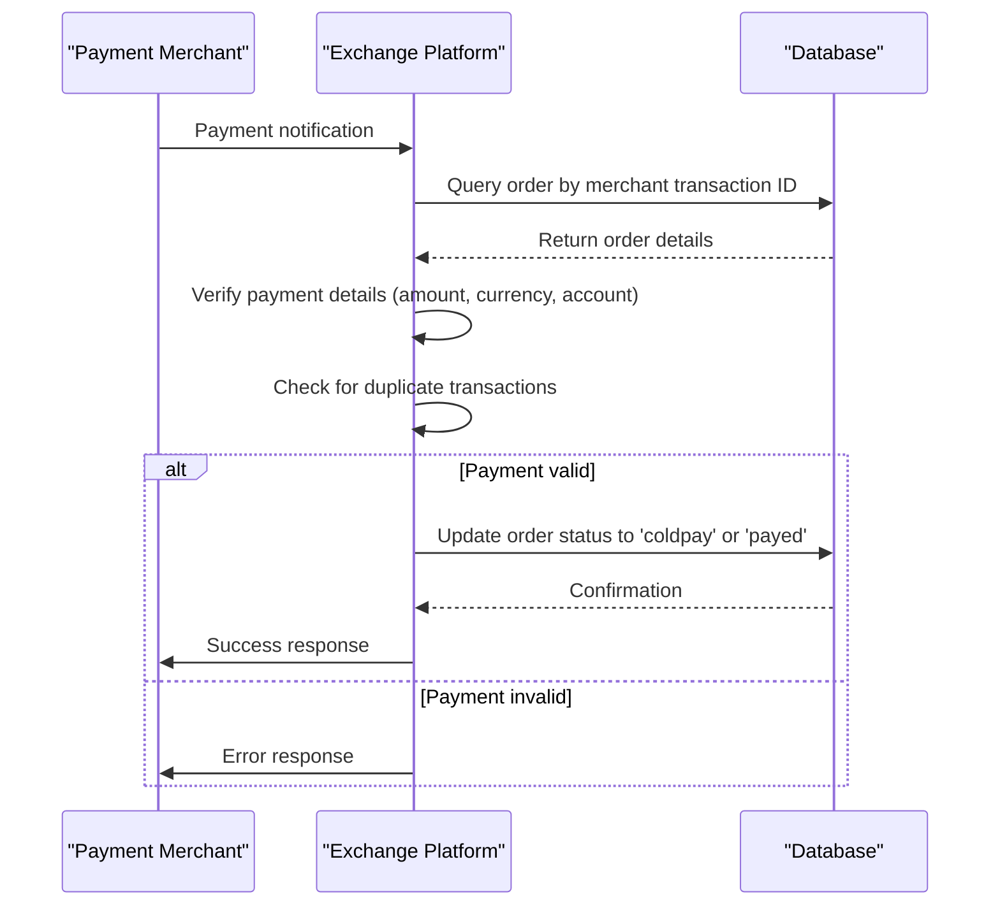
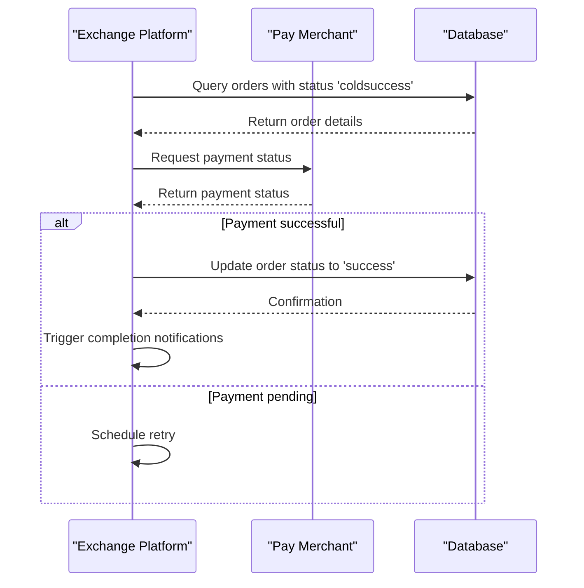
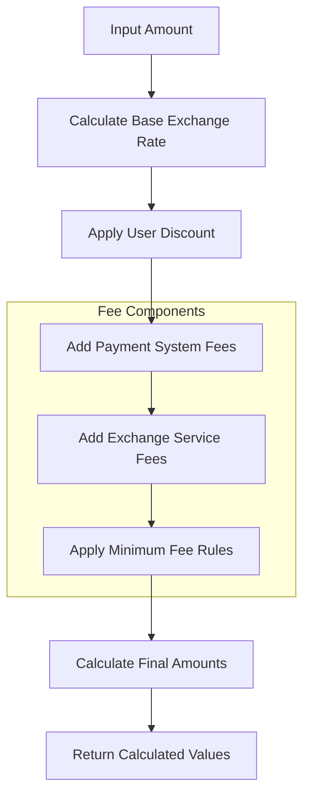
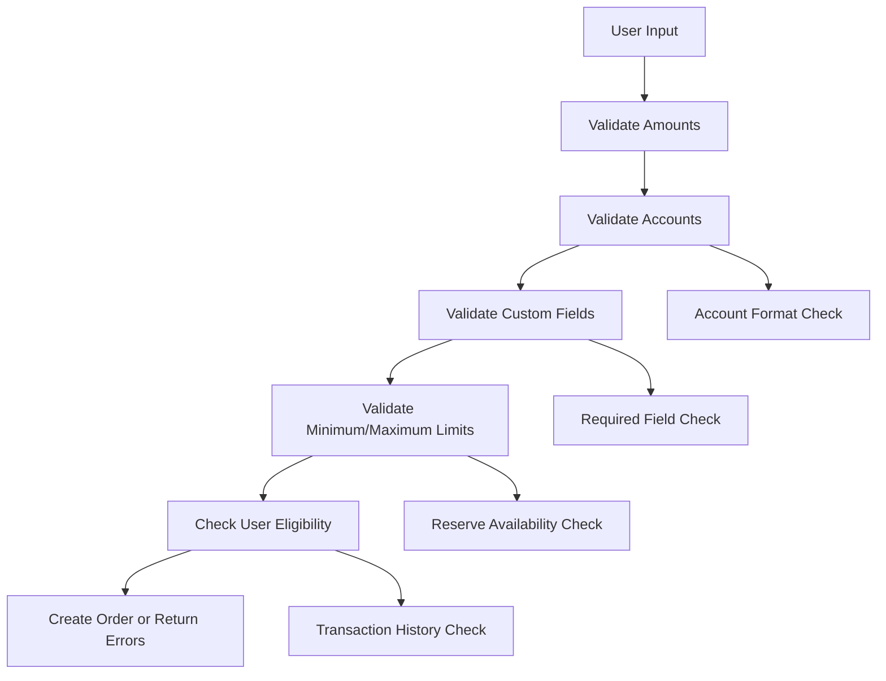
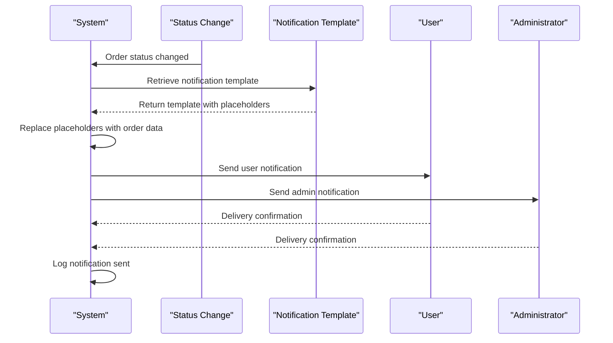

# Transaction Processing

<cite>
**Referenced Files in This Document**   
- [index.php](file://wp-content/plugins/premiumbox/plugin/exchange/index.php)
- [action.php](file://wp-content/plugins/premiumbox/plugin/exchange/action.php)
- [funcs.php](file://wp-content/plugins/premiumbox/plugin/exchange/funcs.php)
- [calculator.php](file://wp-content/plugins/premiumbox/plugin/exchange/calculator.php)
- [cron.php](file://wp-content/plugins/premiumbox/plugin/exchange/cron.php)
- [mails.php](file://wp-content/plugins/premiumbox/plugin/exchange/mails.php)
- [merch_func.php](file://wp-content/plugins/premiumbox/plugin/merchants/merch_func.php)
- [rapira/index.php](file://wp-content/plugins/premiumbox/merchants/rapira/index.php)
- [quickex/index.php](file://wp-content/plugins/premiumbox/paymerchants/quickex/index.php)
- [exnode/index.php](file://wp-content/plugins/premiumbox/paymerchants/exnode/index.php)
- [aipay/index.php](file://wp-content/plugins/premiumbox/merchants/aipay/index.php)
- [payscrow_cascade/index.php](file://wp-content/plugins/premiumbox/merchants/payscrow_cascade/index.php)
- [cryptocash_crypto/index.php](file://wp-content/plugins/premiumbox/paymerchants/cryptocash_crypto/index.php)
- [evo/index.php](file://wp-content/plugins/premiumbox/merchants/evo/index.php)
- [goatx/index.php](file://wp-content/plugins/premiumbox/merchants/goatx/index.php)
- [paycrown/index.php](file://wp-content/plugins/premiumbox/merchants/paycrown/index.php)
- [checkexchanges/index.php](file://wp-content/plugins/premiumbox/moduls/checkexchanges/index.php)
</cite>

## Table of Contents
1. [Introduction](#introduction)
2. [Exchange Order Data Model](#exchange-order-data-model)
3. [Transaction Workflow](#transaction-workflow)
4. [Order Creation Process](#order-creation-process)
5. [Status Transition System](#status-transition-system)
6. [Merchant Integration and Payment Processing](#merchant-integration-and-payment-processing)
7. [Commission Calculation](#commission-calculation)
8. [Validation and Error Handling](#validation-and-error-handling)
9. [Notification System](#notification-system)
10. [Administrative Order Management](#administrative-order-management)
11. [Troubleshooting Common Issues](#troubleshooting-common-issues)
12. [Conclusion](#conclusion)

## Introduction
The transaction processing system in this exchange platform handles the complete lifecycle of exchange orders from submission to completion. The system manages bid creation, validation, rate locking, commission calculation, status tracking, and merchant integration for both incoming and outgoing transactions. This documentation provides a comprehensive overview of the exchange transaction workflow, focusing on the implementation details of the order processing system, data model, and integration points with merchant services.

**Section sources**
- [index.php](file://wp-content/plugins/premiumbox/plugin/exchange/index.php#L1-L47)
- [action.php](file://wp-content/plugins/premiumbox/plugin/exchange/action.php#L1-L732)

## Exchange Order Data Model
The exchange order (bid) data model contains comprehensive information about each transaction, including financial details, user information, status tracking, and merchant integration data. The core fields are stored in the `exchange_bids` database table and include:

**Core Transaction Fields:**
- `id`: Unique order identifier
- `hashed`: Unique hash identifier for the order
- `direction_id`: Reference to the exchange direction
- `status`: Current status of the order (new, payed, success, etc.)
- `create_date`: Timestamp when the order was created
- `edit_date`: Timestamp of the last status change

**Financial Information:**
- `sum1`: Amount to send (source currency)
- `sum1c`: Amount to send including payment system fees
- `sum2`: Amount to receive (destination currency)
- `sum2c`: Amount to receive including payment system fees
- `course_give`: Exchange rate for sending currency
- `course_get`: Exchange rate for receiving currency
- `user_discount`: Discount applied to the user
- `profit`: Profit from the exchange

**User and Account Information:**
- `user_id`: ID of the user who created the order
- `user_login`: Username of the user
- `user_hash`: Hash identifier for user session
- `account_give`: Source account number
- `account_get`: Destination account number
- `first_name`, `last_name`, `second_name`: User's personal information
- `user_email`, `user_phone`, `user_skype`, `user_telegram`: Contact information

**Merchant Integration Fields:**
- `m_in`: Incoming merchant identifier
- `m_out`: Outgoing merchant identifier
- `trans_in`: Merchant transaction ID for incoming payment
- `trans_out`: Merchant transaction ID for outgoing payment
- `txid_in`: Transaction hash for incoming payment
- `txid_out`: Transaction hash for outgoing payment
- `to_account`: Destination account for outgoing payment
- `dest_tag`: Destination tag/memo for certain currencies

**Additional Metadata:**
- `metas`: Serialized array of custom field values
- `dmetas`: Serialized array of direction-specific metadata
- `unmetas`: Serialized array of unique metadata values
- `bid_locale`: Locale setting for the order
- `api_login`: API login identifier for programmatic access

**Diagram sources**
- [action.php](file://wp-content/plugins/premiumbox/plugin/exchange/action.php#L411-L412)
- [funcs.php](file://wp-content/plugins/premiumbox/plugin/exchange/funcs.php#L411-L412)
- [mails.php](file://wp-content/plugins/premiumbox/plugin/exchange/mails.php#L58-L165)

## Transaction Workflow
The exchange transaction workflow follows a structured process from order creation to completion, with multiple validation and processing steps. The workflow is designed to ensure security, accuracy, and reliability in all transactions.

**Diagram sources**
- [action.php](file://wp-content/plugins/premiumbox/plugin/exchange/action.php#L410-L732)
- [funcs.php](file://wp-content/plugins/premiumbox/plugin/exchange/funcs.php#L470-L532)
- [merch_func.php](file://wp-content/plugins/premiumbox/plugin/merchants/merch_func.php#L4-L50)

## Order Creation Process
The order creation process begins when a user submits an exchange request through the frontend interface. The system validates the input, calculates the exchange parameters, and creates a new order in the database.

The process starts with the `def_premium_siteaction_create_bid` function, which handles the initial order submission:

**Diagram sources**
- [action.php](file://wp-content/plugins/premiumbox/plugin/exchange/action.php#L410-L480)
- [funcs.php](file://wp-content/plugins/premiumbox/plugin/exchange/funcs.php#L4-L468)
- [calculator.php](file://wp-content/plugins/premiumbox/plugin/exchange/calculator.php#L4-L159)

The order creation process involves several key steps:

1. **Input Validation**: The system validates all input parameters including the exchange direction, amounts, and user accounts.

2. **Rate Calculation**: The exchange rates are calculated based on the current market rates and any applicable discounts or fees.

3. **Minimum/Maximum Validation**: The system checks if the requested amounts fall within the allowed minimum and maximum limits for the selected exchange direction.

4. **Order Creation**: A new order is created in the database with the status 'auto', containing all the calculated values and user information.

5. **Status Transition**: The order status is immediately changed from 'auto' to 'new' through the `_create_bid_new` function, which triggers additional processing and notifications.

The `_create_bid_auto` function in `funcs.php` handles the core logic of order creation, performing validation and calculation before inserting the order into the database. This function also handles custom fields and user metadata that may be required for specific exchange directions.

**Section sources**
- [action.php](file://wp-content/plugins/premiumbox/plugin/exchange/action.php#L410-L480)
- [funcs.php](file://wp-content/plugins/premiumbox/plugin/exchange/funcs.php#L4-L468)
- [calculator.php](file://wp-content/plugins/premiumbox/plugin/exchange/calculator.php#L4-L159)

## Status Transition System
The exchange platform implements a comprehensive status transition system that tracks the lifecycle of each order from creation to completion. The system uses a state machine pattern with well-defined status values and transition rules.

### Status Definitions
The system defines the following status values for exchange orders:

- **new**: Order has been created but payment has not been received
- **coldpay**: Payment has been received but is being held for verification
- **techpay**: Technical payment status during processing
- **payed**: Payment has been confirmed and verified
- **coldsuccess**: Outgoing payment has been initiated but not yet confirmed
- **success**: Transaction has been successfully completed
- **cancel**: Order has been canceled by the user
- **auto**: Temporary status for newly created orders
- **realdelete**: Order has been completely deleted

The status transitions are managed by the `set_bid_status` function, which updates the order status and triggers appropriate actions based on the new status.

**Diagram sources**
- [action.php](file://wp-content/plugins/premiumbox/plugin/exchange/action.php#L618-L732)
- [merch_func.php](file://wp-content/plugins/premiumbox/plugin/merchants/merch_func.php#L1018-L1023)
- [cron.php](file://wp-content/plugins/premiumbox/plugin/exchange/cron.php#L4-L32)

The status transition system includes several important features:

1. **Automated Status Updates**: The system automatically updates order statuses based on payment verification and processing events.

2. **Merchant Integration**: Different merchant plugins can update order statuses based on their specific payment verification processes.

3. **Cron Cleanup**: The system includes a cron job that automatically removes orders with the 'auto' status after a configurable time period (default 15 minutes) to clean up incomplete orders.

4. **Event Hooks**: The system triggers actions and notifications when order statuses change, allowing for integration with notification systems and external services.

The status transition process is implemented through the `_change_bid_status` function, which is called whenever an order status changes. This function triggers appropriate actions based on the new status, such as sending notifications to users and administrators.

**Section sources**
- [action.php](file://wp-content/plugins/premiumbox/plugin/exchange/action.php#L618-L732)
- [merch_func.php](file://wp-content/plugins/premiumbox/plugin/merchants/merch_func.php#L1018-L1023)
- [cron.php](file://wp-content/plugins/premiumbox/plugin/exchange/cron.php#L4-L32)

## Merchant Integration and Payment Processing
The exchange platform integrates with multiple merchant services to handle incoming and outgoing payments. The merchant integration system is designed to be modular, allowing for easy addition of new payment providers.

### Incoming Payment Processing
The system processes incoming payments through merchant plugins that verify payment transactions and update order statuses accordingly. Each merchant plugin implements a similar pattern for payment verification:

**Diagram sources**
- [rapira/index.php](file://wp-content/plugins/premiumbox/merchants/rapira/index.php#L201-L234)
- [aipay/index.php](file://wp-content/plugins/premiumbox/merchants/aipay/index.php#L347-L371)
- [payscrow_cascade/index.php](file://wp-content/plugins/premiumbox/merchants/payscrow_cascade/index.php#L432-L456)

The incoming payment process involves several key steps:

1. **Transaction Verification**: The merchant plugin verifies the payment transaction by checking the amount, currency, and destination account against the order details.

2. **Duplicate Prevention**: The system checks for duplicate transactions using the `check_txid_in` function to prevent double-processing of payments.

3. **Status Update**: If the payment is valid, the order status is updated to 'coldpay' or 'payed' depending on the merchant configuration and payment verification level.

4. **Error Handling**: If the payment details don't match the order (incorrect amount, currency, or account), the system logs the discrepancy and may update the status to 'techpay' for manual review.

### Outgoing Payment Processing
The system handles outgoing payments through pay merchant plugins that initiate payouts to users. The process is triggered when an order reaches the 'coldsuccess' status:

**Diagram sources**
- [quickex/index.php](file://wp-content/plugins/premiumbox/paymerchants/quickex/index.php#L177-L230)
- [exnode/index.php](file://wp-content/plugins/premiumbox/paymerchants/exnode/index.php#L201-L216)
- [cryptocash_crypto/index.php](file://wp-content/plugins/premiumbox/paymerchants/cryptocash_crypto/index.php#L262-L295)

The outgoing payment process includes:

1. **Status Monitoring**: The system periodically checks the status of orders with the 'coldsuccess' status to verify that payouts have been processed.

2. **Payment Initiation**: When a payout is initiated, the pay merchant plugin creates a transaction with the external payment service.

3. **Status Verification**: The system verifies the payout status by querying the payment service API.

4. **Completion**: Once the payout is confirmed, the order status is updated to 'success' and completion notifications are sent.

The merchant integration system includes configuration options for each merchant, including:
- Payment instruction templates
- Amount tolerance settings (correction percentage)
- Daily and monthly transaction limits
- IP address restrictions for security
- Webhook URLs for status notifications
- Timeout settings for API requests

**Section sources**
- [rapira/index.php](file://wp-content/plugins/premiumbox/merchants/rapira/index.php#L201-L234)
- [quickex/index.php](file://wp-content/plugins/premiumbox/paymerchants/quickex/index.php#L177-L230)
- [exnode/index.php](file://wp-content/plugins/premiumbox/paymerchants/exnode/index.php#L201-L216)
- [aipay/index.php](file://wp-content/plugins/premiumbox/merchants/aipay/index.php#L347-L371)
- [payscrow_cascade/index.php](file://wp-content/plugins/premiumbox/merchants/payscrow_cascade/index.php#L432-L456)
- [cryptocash_crypto/index.php](file://wp-content/plugins/premiumbox/paymerchants/cryptocash_crypto/index.php#L262-L295)
- [evo/index.php](file://wp-content/plugins/premiumbox/merchants/evo/index.php#L180-L201)
- [goatx/index.php](file://wp-content/plugins/premiumbox/merchants/goatx/index.php#L316-L342)
- [paycrown/index.php](file://wp-content/plugins/premiumbox/merchants/paycrown/index.php#L336-L362)

## Commission Calculation
The exchange platform implements a comprehensive commission calculation system that accounts for multiple fee components. The system calculates fees for both the user and the exchange service, with different fee structures for different exchange directions and merchant integrations.

The commission calculation process occurs during order creation and is handled by the `get_calc_data` function, which is called from multiple locations including the exchange calculator and order creation functions.

**Diagram sources**
- [calculator.php](file://wp-content/plugins/premiumbox/plugin/exchange/calculator.php#L4-L159)
- [funcs.php](file://wp-content/plugins/premiumbox/plugin/exchange/funcs.php#L4-L468)
- [mails.php](file://wp-content/plugins/premiumbox/plugin/exchange/mails.php#L216-L239)

The system calculates several types of fees:

1. **Payment System Fees**: Fees charged by the payment processing service, which can be a percentage of the transaction amount and/or a fixed amount.

2. **Exchange Service Fees**: Additional fees charged by the exchange service, which can also be percentage-based and/or fixed.

3. **User Discounts**: Discounts applied to regular users based on their transaction history or membership level.

The fee calculation process considers several factors:

- The exchange direction (currency pair)
- The transaction amount
- The selected payment method
- The user's discount level
- Any promotional offers or special rates

The system also enforces minimum fee rules to ensure that very small transactions are not processed at a loss. These rules are configurable for each exchange direction and can be based on either a minimum percentage or a minimum fixed amount.

The calculated commission values are stored in the order record and include:
- `com_sum1`, `com_pers1`: Payment system fee for the sender
- `com_sum2`, `com_pers2`: Payment system fee for the recipient
- `com_box_sum1`, `com_box_pers1`: Exchange service fee from the sender
- `com_box_sum2`, `com_box_pers2`: Exchange service fee from the recipient

These values are used in the user interface to show a detailed breakdown of the transaction costs and in the notification system to provide transparency about the fee structure.

**Section sources**
- [calculator.php](file://wp-content/plugins/premiumbox/plugin/exchange/calculator.php#L4-L159)
- [funcs.php](file://wp-content/plugins/premiumbox/plugin/exchange/funcs.php#L4-L468)
- [mails.php](file://wp-content/plugins/premiumbox/plugin/exchange/mails.php#L216-L239)

## Validation and Error Handling
The exchange platform implements comprehensive validation and error handling mechanisms to ensure the integrity and security of transactions. The system validates input at multiple levels and provides detailed error feedback to users.

### Input Validation
The system performs extensive validation on all user inputs, including:

1. **Amount Validation**: Ensures that the requested amounts are within the minimum and maximum limits for the selected exchange direction.

2. **Account Validation**: Verifies that account numbers are in the correct format for the selected payment method.

3. **Currency Validation**: Confirms that the selected currencies are supported for the exchange direction.

4. **User Information Validation**: Validates user contact information and personal details.

The validation process is implemented in the `_create_bid_auto` function, which checks all input parameters before creating an order:

**Diagram sources**
- [funcs.php](file://wp-content/plugins/premiumbox/plugin/exchange/funcs.php#L4-L468)
- [action.php](file://wp-content/plugins/premiumbox/plugin/exchange/action.php#L410-L480)
- [checkexchanges/index.php](file://wp-content/plugins/premiumbox/moduls/checkexchanges/index.php#L39-L72)

### Error Handling
The system implements a robust error handling mechanism that provides clear feedback to users and logs detailed information for administrators:

1. **User-Facing Errors**: The system returns specific error messages for different validation failures, helping users correct their inputs.

2. **System Errors**: Internal errors are logged for debugging purposes without exposing sensitive information to users.

3. **Merchant Integration Errors**: Payment verification errors are logged with detailed information about the discrepancy (incorrect amount, currency, account, etc.).

4. **Status Synchronization Errors**: The system detects and handles cases where payment status cannot be synchronized with merchant systems.

The error handling system includes several key features:

- **Detailed Error Messages**: Users receive specific guidance on how to correct input errors.
- **Error Logging**: All validation and processing errors are logged for administrative review.
- **Graceful Degradation**: The system continues to operate even when individual components fail.
- **Retry Mechanisms**: Failed payment verifications are automatically retried after a delay.

The system also includes a debug mode that can be enabled for specific merchants to help diagnose integration issues. This mode provides detailed logging of API requests and responses without affecting the user experience.

**Section sources**
- [funcs.php](file://wp-content/plugins/premiumbox/plugin/exchange/funcs.php#L4-L468)
- [action.php](file://wp-content/plugins/premiumbox/plugin/exchange/action.php#L410-L480)
- [checkexchanges/index.php](file://wp-content/plugins/premiumbox/moduls/checkexchanges/index.php#L39-L72)
- [merch_func.php](file://wp-content/plugins/premiumbox/plugin/merchants/merch_func.php#L410-L417)

## Notification System
The exchange platform includes a comprehensive notification system that keeps users and administrators informed about order status changes and important events.

### Notification Triggers
The system sends notifications for the following events:

1. **Order Creation**: Confirmation that an order has been successfully created.
2. **Payment Received**: Notification that payment has been received and is being processed.
3. **Payment Sent**: Confirmation that the payout has been sent to the user.
4. **Order Completion**: Final confirmation that the transaction has been successfully completed.
5. **Order Cancellation**: Notification that an order has been canceled.
6. **Status Changes**: Notifications for any significant status changes during processing.

### Notification Channels
The system supports multiple notification channels:

- **Email**: Detailed notifications sent to the user's registered email address.
- **SMS**: Short text messages for important status updates.
- **Telegram**: Messages sent to the user's Telegram account.
- **Admin Notifications**: Alerts sent to administrators for manual review or intervention.

The notification system is implemented through the `goed_mail_to_changestatus_bids` function, which is triggered whenever an order status changes:

**Diagram sources**
- [mails.php](file://wp-content/plugins/premiumbox/plugin/exchange/mails.php#L371-L592)
- [action.php](file://wp-content/plugins/premiumbox/plugin/exchange/action.php#L566-L595)
- [index.php](file://wp-content/plugins/premiumbox/plugin/exchange/index.php#L4-L28)

The notification templates include numerous placeholders that are replaced with actual order data, such as:
- `[sum1]`, `[sum2]`: Transaction amounts
- `[course_give]`, `[course_get]`: Exchange rates
- `[account_give]`, `[account_get]`: Account numbers
- `[trans_in]`, `[trans_out]`: Transaction IDs
- `[txid_in]`, `[txid_out]`: Transaction hashes
- `[bidurl]`: Link to the order details page

Administrators can customize the notification templates for each exchange direction, allowing for tailored messaging based on the specific payment methods and user expectations.

**Section sources**
- [mails.php](file://wp-content/plugins/premiumbox/plugin/exchange/mails.php#L371-L592)
- [action.php](file://wp-content/plugins/premiumbox/plugin/exchange/action.php#L566-L595)
- [index.php](file://wp-content/plugins/premiumbox/plugin/exchange/index.php#L4-L28)

## Administrative Order Management
The platform provides administrators with comprehensive tools for managing exchange orders and monitoring system performance.

### Administrative Interface
The administrative interface includes the following features:

1. **Order List**: A comprehensive list of all exchange orders with filtering and sorting capabilities.
2. **Order Details**: Detailed view of individual orders with all transaction data and status history.
3. **Status Management**: Tools for manually changing order statuses when necessary.
4. **Search and Filter**: Advanced search capabilities to find specific orders based on various criteria.
5. **Bulk Operations**: Ability to perform actions on multiple orders simultaneously.

### Monitoring and Reporting
The system provides administrators with monitoring and reporting tools:

1. **Real-time Status**: Live view of order statuses and processing queues.
2. **Transaction Volumes**: Statistics on transaction volumes by currency pair and time period.
3. **Success Rates**: Metrics on transaction success and failure rates.
4. **Processing Times**: Average times for different stages of the transaction workflow.
5. **Error Logs**: Comprehensive logs of validation and processing errors.

The administrative system integrates with the status transition mechanism, allowing administrators to manually intervene in the transaction process when necessary. This is particularly useful for resolving edge cases or handling exceptional circumstances that cannot be processed automatically.

**Section sources**
- [action.php](file://wp-content/plugins/premiumbox/plugin/exchange/action.php#L618-L732)
- [mails.php](file://wp-content/plugins/premiumbox/plugin/exchange/mails.php#L371-L592)
- [merch_func.php](file://wp-content/plugins/premiumbox/plugin/merchants/merch_func.php#L52-L158)

## Troubleshooting Common Issues
This section addresses common issues that may occur during transaction processing and provides solutions for each.

### Transaction Validation Failures
**Issue**: Orders fail validation due to amount, account, or currency mismatches.

**Solutions**:
1. Verify that the entered amounts are within the minimum and maximum limits for the exchange direction.
2. Check that account numbers are in the correct format for the selected payment method.
3. Ensure that the correct currency is selected for the exchange direction.
4. Clear browser cache and cookies, then retry the transaction.

### Payment Processing Errors
**Issue**: Payments are not being processed or verified correctly.

**Solutions**:
1. Check the merchant integration settings to ensure API credentials are correct.
2. Verify that the merchant's webhook URLs are properly configured.
3. Check server logs for any API connectivity issues.
4. Ensure that the server's IP address is included in the merchant's allowed IP list.
5. Test the merchant integration in debug mode to identify specific issues.

### Status Synchronization Problems
**Issue**: Order statuses are not updating correctly or are stuck in a particular status.

**Solutions**:
1. Check the cron job configuration to ensure it is running regularly.
2. Verify that the merchant's status notification URLs are correctly set up.
3. Check for any database connectivity issues that might prevent status updates.
4. Review error logs for any failed status update attempts.
5. Manually update the status if necessary, then investigate the root cause.

### Commission Calculation Discrepancies
**Issue**: Commission amounts are not calculated correctly.

**Solutions**:
1. Verify the fee settings for the exchange direction in the administration panel.
2. Check that the correct fee structure (percentage, fixed, or combination) is selected.
3. Ensure that any user discounts are correctly applied.
4. Verify that minimum fee rules are properly configured.
5. Test the calculation with different amount ranges to identify threshold issues.

### Notification Delivery Failures
**Issue**: Users are not receiving transaction notifications.

**Solutions**:
1. Verify that the notification system is properly configured with valid SMTP settings.
2. Check that user contact information (email, phone, Telegram) is correctly entered.
3. Review spam filters that might be blocking notification emails.
4. Verify that SMS and Telegram gateways are properly configured and have sufficient credits.
5. Check server logs for any delivery errors.

**Section sources**
- [action.php](file://wp-content/plugins/premiumbox/plugin/exchange/action.php#L410-L732)
- [funcs.php](file://wp-content/plugins/premiumbox/plugin/exchange/funcs.php#L4-L468)
- [merch_func.php](file://wp-content/plugins/premiumbox/plugin/merchants/merch_func.php#L4-L50)
- [mails.php](file://wp-content/plugins/premiumbox/plugin/exchange/mails.php#L371-L592)

## Conclusion
The transaction processing system in this exchange platform provides a robust and secure framework for handling cryptocurrency and fiat currency exchanges. The system's modular architecture allows for easy integration with multiple payment providers while maintaining a consistent user experience.

Key features of the system include:
- Comprehensive order data model with detailed transaction tracking
- Well-defined status transition system that ensures proper transaction lifecycle management
- Flexible merchant integration that supports both incoming and outgoing payments
- Transparent commission calculation with detailed fee breakdowns
- Robust validation and error handling to prevent fraudulent transactions
- Multi-channel notification system to keep users informed
- Administrative tools for monitoring and managing transactions

The system is designed to be both user-friendly for customers and administratively powerful for operators, providing a balance between automation and manual control. The modular design allows for easy extension and customization to meet specific business requirements.

For developers, the system provides clear hooks and filters for extending functionality, while maintaining a consistent API for merchant integrations. The comprehensive logging and error handling make troubleshooting and maintenance straightforward.

Overall, the transaction processing system represents a mature and reliable solution for operating a cryptocurrency exchange service with support for multiple payment methods and currencies.

**Section sources**
- [index.php](file://wp-content/plugins/premiumbox/plugin/exchange/index.php#L1-L47)
- [action.php](file://wp-content/plugins/premiumbox/plugin/exchange/action.php#L1-L732)
- [funcs.php](file://wp-content/plugins/premiumbox/plugin/exchange/funcs.php#L1-L532)
- [calculator.php](file://wp-content/plugins/premiumbox/plugin/exchange/calculator.php#L1-L159)
- [cron.php](file://wp-content/plugins/premiumbox/plugin/exchange/cron.php#L1-L58)
- [mails.php](file://wp-content/plugins/premiumbox/plugin/exchange/mails.php#L1-L592)
- [merch_func.php](file://wp-content/plugins/premiumbox/plugin/merchants/merch_func.php#L1-L2116)