# API Configuration

<cite>
**Referenced Files in This Document**   
- [merchant001/class.php](file://wp-content/plugins/premiumbox/merchants/merchant001/class.php)
- [merchant001/index.php](file://wp-content/plugins/premiumbox/merchants/merchant001/index.php)
- [aipay/index.php](file://wp-content/plugins/premiumbox/paymerchants/aipay/index.php)
- [aipay/class.php](file://wp-content/plugins/premiumbox/merchants/aipay/class.php)
- [optimoney/class.php](file://wp-content/plugins/premiumbox/merchants/optimoney/class.php)
- [supermoney/class.php](file://wp-content/plugins/premiumbox/merchants/supermoney/class.php)
- [advcash/class.php](file://wp-content/plugins/premiumbox/merchants/advcash/class.php)
- [advcash/index.php](file://wp-content/plugins/premiumbox/paymerchants/advcash/index.php)
- [paymerch_func.php](file://wp-content/plugins/premiumbox/plugin/merchants/paymerch_func.php)
</cite>

## Table of Contents
1. [Introduction](#introduction)
2. [API Abstraction Layer Architecture](#api-abstraction-layer-architecture)
3. [Core Interface Contracts](#core-interface-contracts)
4. [Authentication Mechanisms](#authentication-mechanisms)
5. [Merchant Implementation Patterns](#merchant-implementation-patterns)
6. [Transaction Lifecycle Management](#transaction-lifecycle-management)
7. [Error Handling and Rate Limiting](#error-handling-and-rate-limiting)
8. [Best Practices for API Integration](#best-practices-for-api-integration)
9. [Conclusion](#conclusion)

## Introduction

The merchant integration system provides a standardized API abstraction layer for communicating with diverse payment providers. This documentation details the implementation of the API configuration system, focusing on the interface contracts, authentication methods, and transaction management patterns used across different merchant implementations. The architecture enables seamless integration with various payment providers while maintaining a consistent interface for balance checking, transaction initiation, and status verification.

## API Abstraction Layer Architecture

The API abstraction layer standardizes communication with payment providers through a consistent interface while accommodating the specific requirements of each merchant. The architecture follows a plugin-based design where each merchant implements a standardized set of methods while handling provider-specific authentication and data formatting.

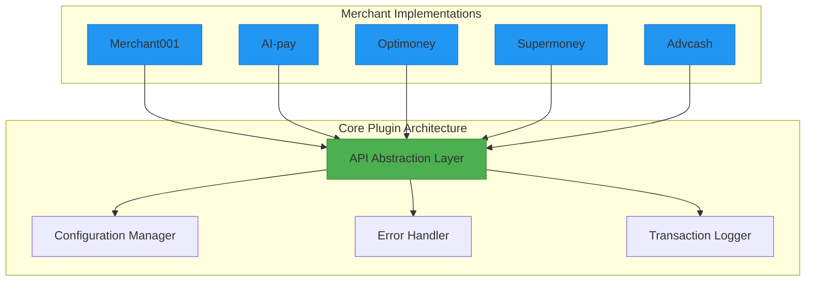

**Diagram sources**
- [merchant001/class.php](file://wp-content/plugins/premiumbox/merchants/merchant001/class.php#L1-L99)
- [aipay/class.php](file://wp-content/plugins/premiumbox/merchants/aipay/class.php#L1-L206)
- [supermoney/class.php](file://wp-content/plugins/premiumbox/merchants/supermoney/class.php#L1-L143)

**Section sources**
- [merchant001/class.php](file://wp-content/plugins/premiumbox/merchants/merchant001/class.php#L1-L99)
- [aipay/class.php](file://wp-content/plugins/premiumbox/merchants/aipay/class.php#L1-L206)

## Core Interface Contracts

All merchant classes implement standardized interface contracts that define the essential methods for payment processing. These contracts ensure consistency across different payment providers while allowing for provider-specific implementations.

### Standardized Method Contracts

The following table outlines the core interface contracts that all merchant classes must implement:

| Method | Parameters | Return Value | Purpose | Merchant Examples |
|--------|------------|--------------|---------|-------------------|
| payment_methods() | None | Array of available payment methods | Retrieves available payment methods from the provider | merchant001, aipay, optimoney |
| create_transaction() / create_tx() | Transaction data array | Transaction response object | Initiates a new transaction with the payment provider | merchant001, optimoney, supermoney |
| get_transaction() / get_tx() | Transaction ID | Transaction details object | Retrieves the status and details of a specific transaction | merchant001, optimoney, aipay |
| get_transactions() / get_txs() | Filter parameters | Array of transaction objects | Retrieves multiple transactions with optional filtering | optimoney, supermoney, advcash |
| balance() / get_balance() | None | Balance information object | Retrieves current account balance from the provider | aipay, advcash |

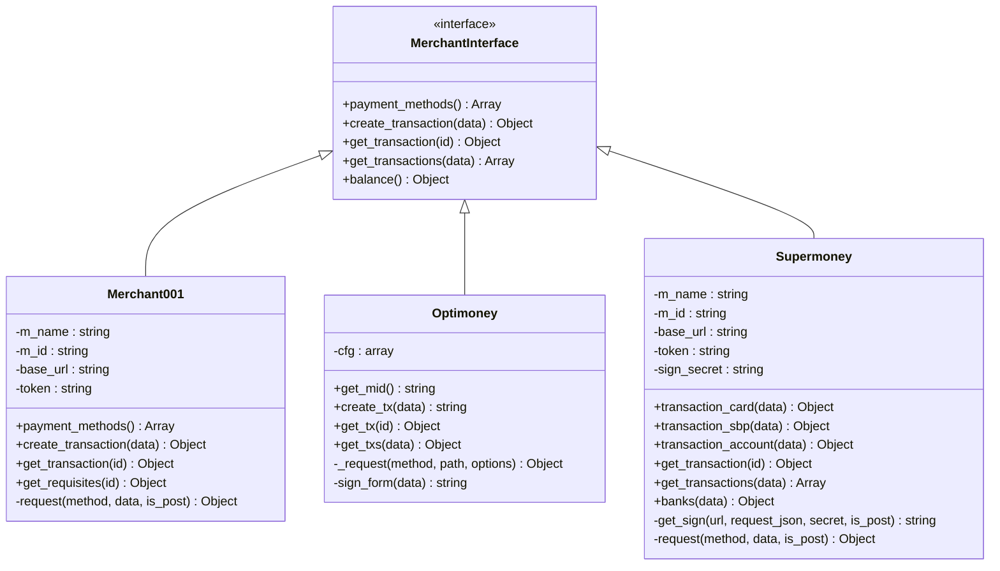

**Diagram sources**
- [merchant001/class.php](file://wp-content/plugins/premiumbox/merchants/merchant001/class.php#L1-L99)
- [optimoney/class.php](file://wp-content/plugins/premiumbox/merchants/optimoney/class.php#L1-L206)
- [supermoney/class.php](file://wp-content/plugins/premiumbox/merchants/supermoney/class.php#L1-L143)

**Section sources**
- [merchant001/class.php](file://wp-content/plugins/premiumbox/merchants/merchant001/class.php#L1-L99)
- [optimoney/class.php](file://wp-content/plugins/premiumbox/merchants/optimoney/class.php#L1-L206)
- [supermoney/class.php](file://wp-content/plugins/premiumbox/merchants/supermoney/class.php#L1-L143)

## Authentication Mechanisms

The system supports multiple authentication mechanisms to accommodate different payment provider requirements. Each merchant implementation handles its specific authentication method while maintaining a consistent interface.

### API Key Authentication

The Merchant001 implementation uses Bearer token authentication with API keys:

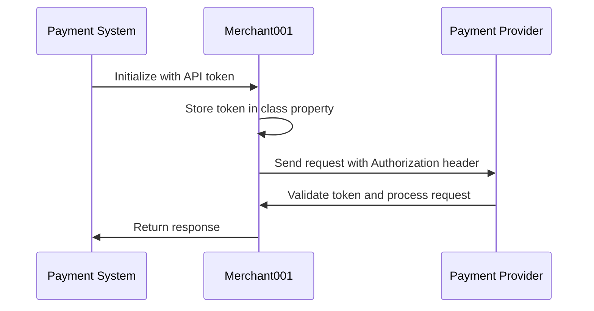

**Diagram sources**
- [merchant001/class.php](file://wp-content/plugins/premiumbox/merchants/merchant001/class.php#L47-L50)

### HMAC Signature Authentication

The Optimoney implementation uses HMAC-SHA256 signatures for request authentication:

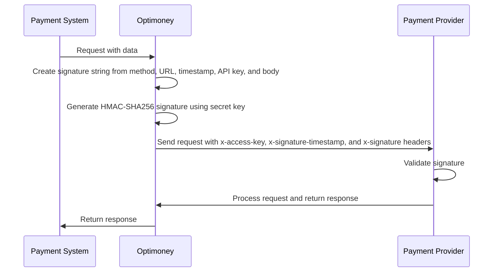

**Diagram sources**
- [optimoney/class.php](file://wp-content/plugins/premiumbox/merchants/optimoney/class.php#L123-L133)

### Multiple Credential Authentication

The Supermoney implementation uses both Bearer token and HMAC signature authentication:

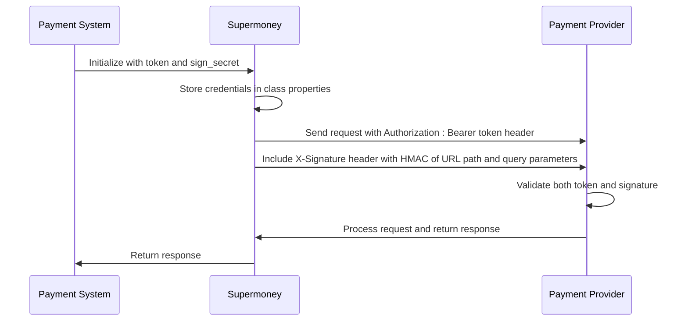

**Diagram sources**
- [supermoney/class.php](file://wp-content/plugins/premiumbox/merchants/supermoney/class.php#L89-L100)

### WMID Signature Authentication

The Advcash implementation uses WMID-style signature authentication with API password tokens:

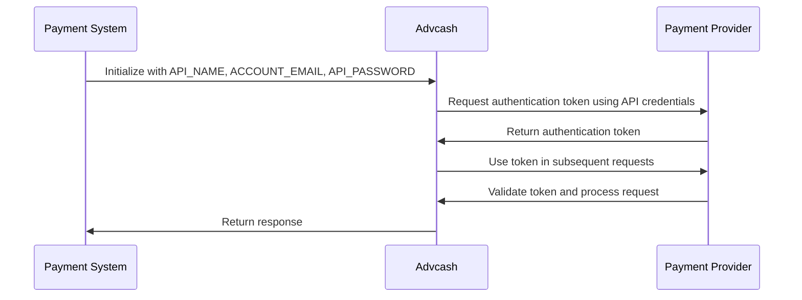

**Diagram sources**
- [advcash/class.php](file://wp-content/plugins/premiumbox/merchants/advcash/class.php#L1677-L1755)

## Merchant Implementation Patterns

Different merchant implementations follow specific patterns based on their API requirements and capabilities. These patterns demonstrate how the core abstraction layer accommodates diverse payment provider interfaces.

### REST API Pattern (Merchant001)

The Merchant001 implementation follows a standard REST API pattern with JSON requests and responses:

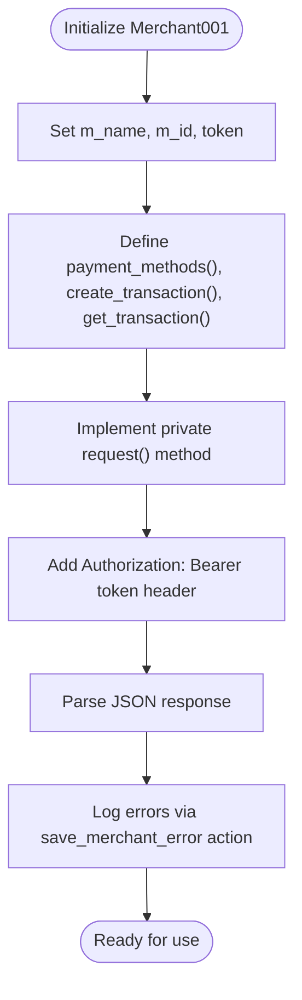

**Diagram sources**
- [merchant001/class.php](file://wp-content/plugins/premiumbox/merchants/merchant001/class.php#L1-L99)

### Form-Based Payment Pattern (Optimoney)

The Optimoney implementation uses form-based payments with server-side signing:

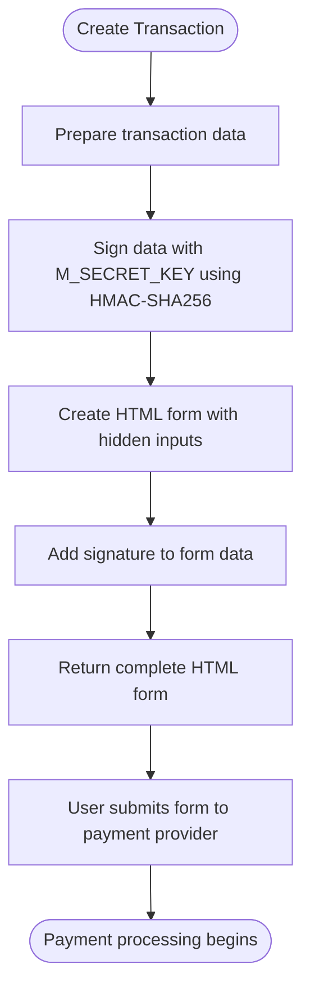

**Diagram sources**
- [optimoney/class.php](file://wp-content/plugins/premiumbox/merchants/optimoney/class.php#L59-L83)

### Multi-Endpoint Pattern (Supermoney)

The Supermoney implementation provides specialized methods for different transaction types:

```mermaid
classDiagram
class Supermoney {
+transaction_card(data) Object
+transaction_sbp(data) Object
+transaction_account(data) Object
+get_transaction(id) Object
+get_transactions(data) Array
+banks(data) Object
}
transaction_card --> /v2/merchant/transactions
transaction_sbp --> /v2/merchant/transactions/sbp
transaction_account --> /v2/merchant/transactions/account
get_transaction --> /v2/merchant/transactions/{id}
get_transactions --> /v2/merchant/transactions
banks --> /v2/merchant/banks
```

**Diagram sources**
- [supermoney/class.php](file://wp-content/plugins/premiumbox/merchants/supermoney/class.php#L28-L67)

## Transaction Lifecycle Management

The system manages the complete transaction lifecycle from initiation to status verification, with different patterns for synchronous and asynchronous processing.

### Synchronous Transaction Flow

For merchants that support immediate transaction processing:

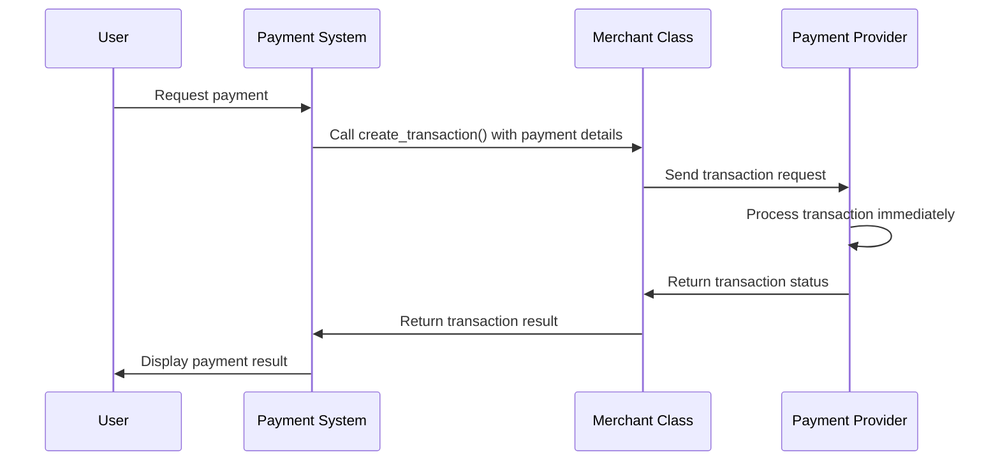

**Diagram sources**
- [merchant001/class.php](file://wp-content/plugins/premiumbox/merchants/merchant001/class.php#L28-L31)

### Asynchronous Transaction Flow

For merchants that use callback-based processing:

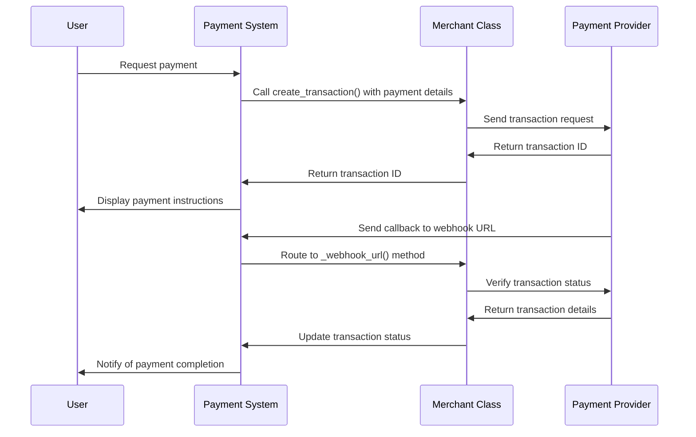

**Diagram sources**
- [aipay/index.php](file://wp-content/plugins/premiumbox/paymerchants/aipay/index.php#L253-L278)

### Status Verification Flow

The system periodically verifies transaction status for reliability:

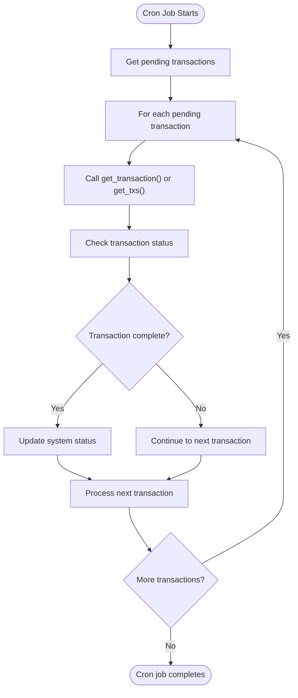

**Diagram sources**
- [aipay/index.php](file://wp-content/plugins/premiumbox/paymerchants/aipay/index.php#L280-L284)

## Error Handling and Rate Limiting

The system implements comprehensive error handling and rate limiting strategies to ensure reliability and prevent service disruption.

### Standardized Error Handling

All merchant implementations follow a consistent error handling pattern:

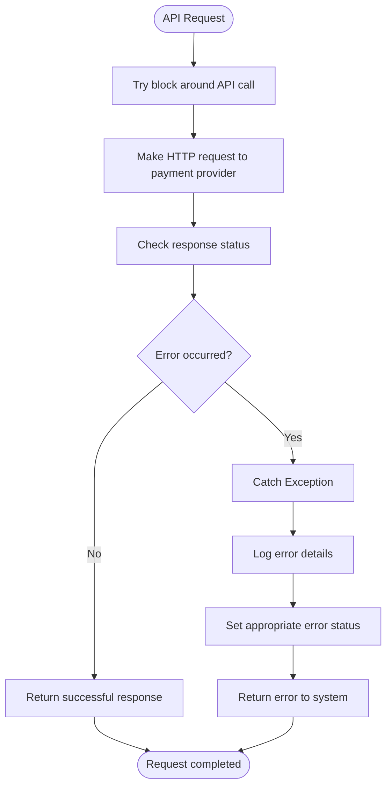

**Diagram sources**
- [aipay/index.php](file://wp-content/plugins/premiumbox/paymerchants/aipay/index.php#L187-L221)

### Rate Limiting Implementation

The system handles API rate limiting through WordPress's built-in HTTP API and custom error handling:

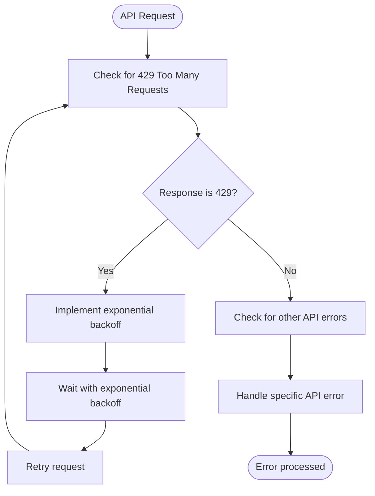

**Diagram sources**
- [wp-includes/Requests/src/Exception/Http/Status429.php](file://wp-includes/Requests/src/Exception/Http/Status429.php#L1-L35)

### Common Error Types

The system handles various common API errors:

| Error Type | Handling Strategy | Example Merchants |
|------------|-------------------|-------------------|
| Authentication Failure | Retry with refreshed credentials or notify administrator | All merchants |
| Rate Limiting (429) | Implement exponential backoff and retry logic | All merchants |
| Connection Timeout | Retry with increased timeout or fail gracefully | All merchants |
| Invalid Parameters | Validate parameters before sending and provide clear error messages | All merchants |
| Insufficient Funds | Check balance before transaction and provide appropriate error | Advcash, Supermoney |
| Transaction Failure | Log detailed error and provide fallback options | All merchants |

## Best Practices for API Integration

Based on the analysis of multiple merchant implementations, the following best practices ensure reliable and maintainable API integrations.

### Configuration Management

Store API credentials securely and provide clear configuration interfaces:

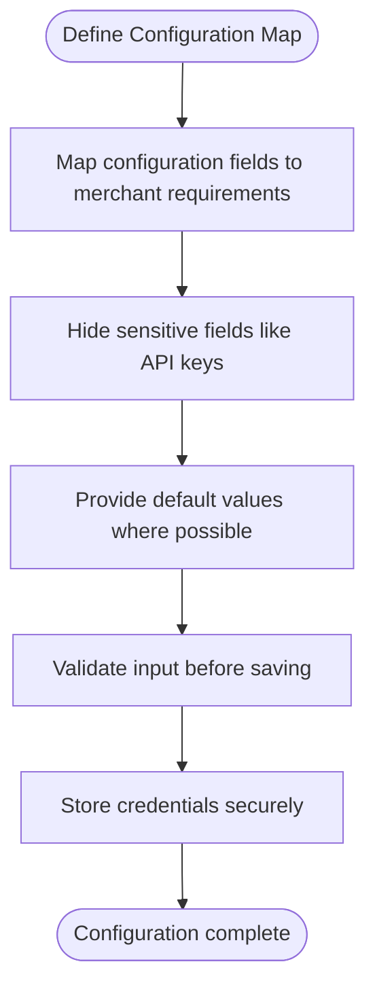

**Diagram sources**
- [aipay/index.php](file://wp-content/plugins/premiumbox/paymerchants/aipay/index.php#L34-L51)

### Secure Credential Handling

Implement secure handling of API credentials:

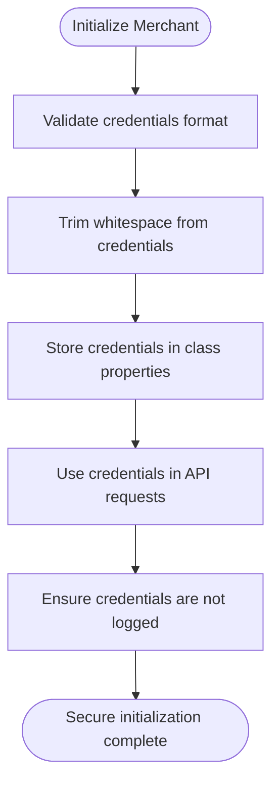

**Diagram sources**
- [merchant001/class.php](file://wp-content/plugins/premiumbox/merchants/merchant001/class.php#L15-L21)

### Comprehensive Logging

Implement detailed logging for debugging and monitoring:

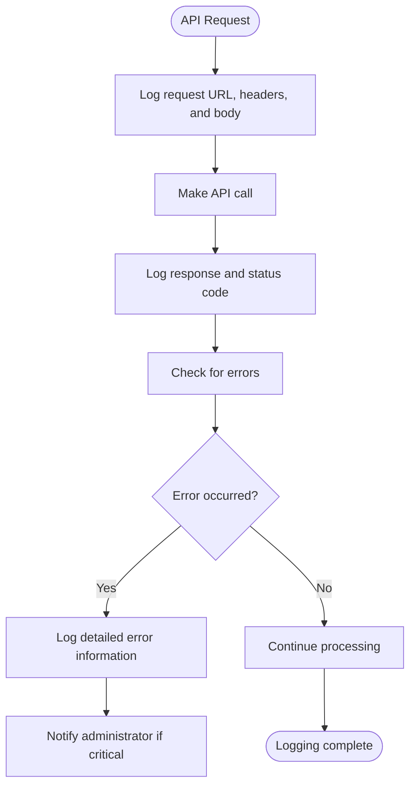

**Diagram sources**
- [merchant001/class.php](file://wp-content/plugins/premiumbox/merchants/merchant001/class.php#L88-L89)

### Fallback Mechanisms

Implement fallback mechanisms for improved reliability:

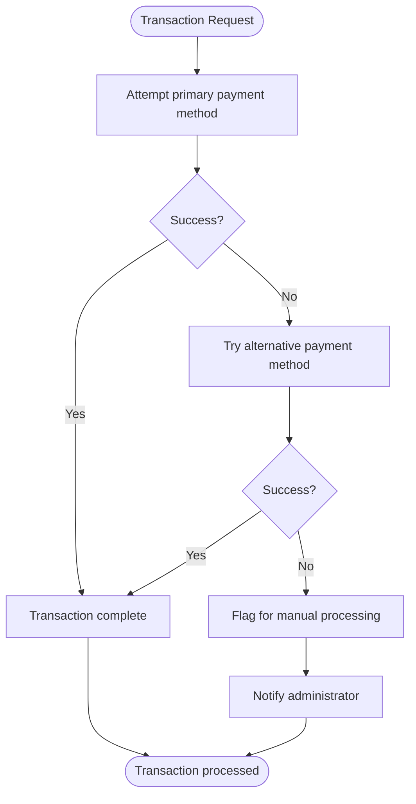

**Diagram sources**
- [paymerch_func.php](file://wp-content/plugins/premiumbox/plugin/merchants/paymerch_func.php#L844-L875)

## Conclusion

The API configuration system for merchant integrations provides a robust and flexible framework for connecting with diverse payment providers. By implementing standardized interface contracts, the system ensures consistency across different merchants while accommodating provider-specific authentication methods and API patterns. The architecture supports various authentication mechanisms including API keys, HMAC signatures, and multi-credential approaches, allowing integration with a wide range of payment providers.

Key strengths of the system include its comprehensive error handling, support for both synchronous and asynchronous transaction processing, and detailed logging capabilities. The implementation patterns demonstrated across different merchants provide valuable insights into best practices for API integration, including secure credential handling, configuration management, and fallback mechanisms.

To maintain reliability, administrators should monitor API rate limits, ensure credentials are kept up to date, and regularly review error logs. When integrating new payment providers, developers should follow the established patterns for method naming, error handling, and logging to ensure consistency with the existing system.