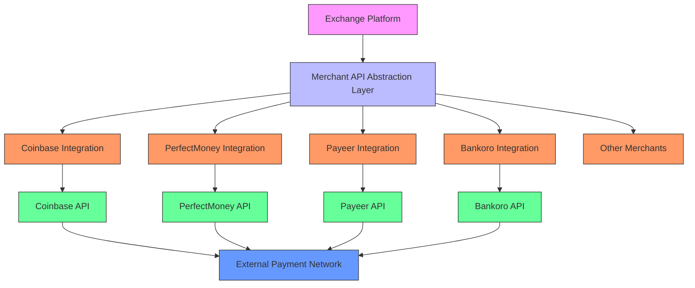
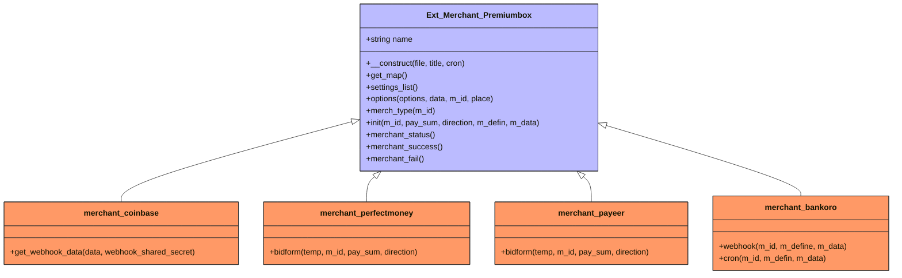
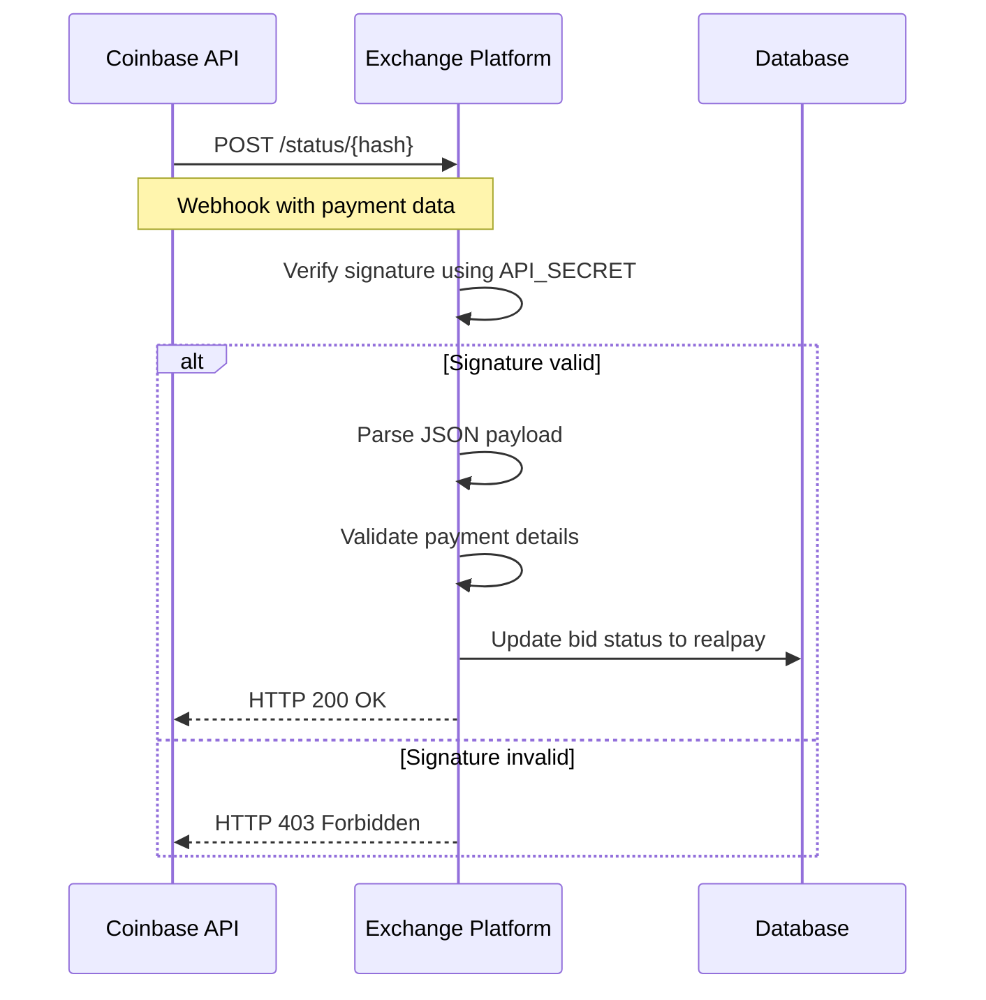
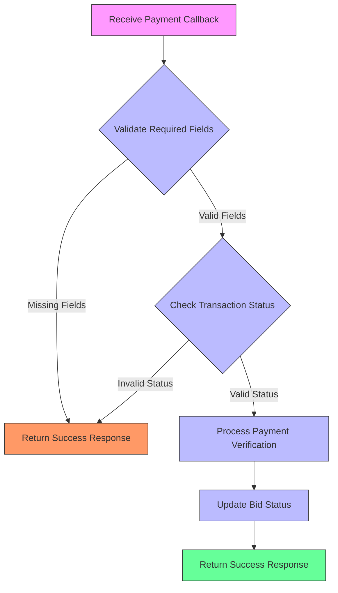
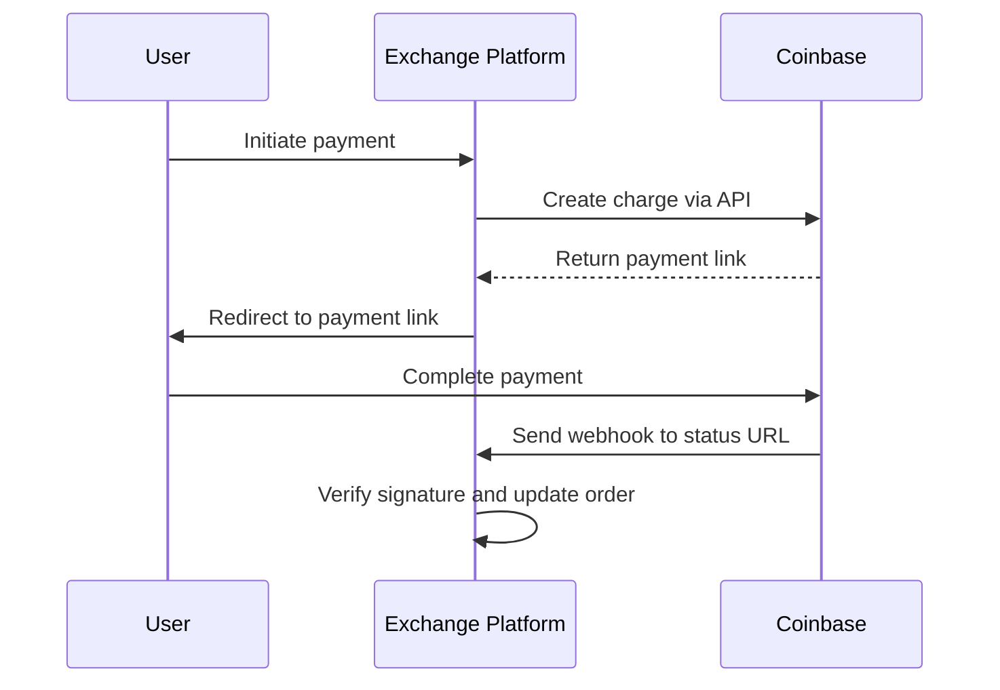

# Merchant Integration

<cite>
**Referenced Files in This Document**   
- [coinbase/index.php](file://wp-content/plugins/premiumbox/merchants/coinbase/index.php)
- [perfectmoney/index.php](file://wp-content/plugins/premiumbox/merchants/perfectmoney/index.php)
- [payeer/index.php](file://wp-content/plugins/premiumbox/merchants/payeer/index.php)
- [bankoro/index.php](file://wp-content/plugins/premiumbox/merchants/bankoro/index.php)
- [coinbase/class.php](file://wp-content/plugins/premiumbox/merchants/coinbase/class.php)
- [perfectmoney/class.php](file://wp-content/plugins/premiumbox/merchants/perfectmoney/class.php)
- [bankoro/class.php](file://wp-content/plugins/premiumbox/merchants/bankoro/class.php)
- [merch_func.php](file://wp-content/plugins/premiumbox/plugin/merchants/merch_func.php)
</cite>

## Table of Contents
1. [Introduction](#introduction)
2. [Architecture Overview](#architecture-overview)
3. [Merchant API Abstraction Layer](#merchant-api-abstraction-layer)
4. [Transaction Verification Processes](#transaction-verification-processes)
5. [Callback Handling Mechanisms](#callback-handling-mechanisms)
6. [Integration Examples](#integration-examples)
7. [Public Interfaces for Merchant Developers](#public-interfaces-for-merchant-developers)
8. [Common Issues and Solutions](#common-issues-and-solutions)
9. [Performance and Security Considerations](#performance-and-security-considerations)

## Introduction

The merchant integration system serves as the payment processing gateway that connects the exchange platform with external payment providers and cryptocurrency networks. This modular system enables seamless integration with various merchants through a standardized interface while maintaining flexibility for specific merchant requirements. The architecture supports multiple payment processor integrations, allowing the platform to accept payments through diverse channels including cryptocurrency networks and traditional payment systems.

The system is designed to handle the complete payment lifecycle from initiation to verification, with robust security measures and error handling protocols. It provides a consistent experience for users while accommodating the unique requirements of different payment providers through its abstraction layer.

**Section sources**
- [coinbase/index.php](file://wp-content/plugins/premiumbox/merchants/coinbase/index.php#L1-L291)
- [perfectmoney/index.php](file://wp-content/plugins/premiumbox/merchants/perfectmoney/index.php#L1-L362)
- [payeer/index.php](file://wp-content/plugins/premiumbox/merchants/payeer/index.php#L1-L254)

## Architecture Overview

The merchant integration system follows a modular design pattern with a clear separation between the core platform and individual merchant implementations. The architecture consists of a base merchant class that defines the common interface and functionality, with specific merchant implementations extending this base class to handle provider-specific requirements.



**Diagram sources **
- [coinbase/index.php](file://wp-content/plugins/premiumbox/merchants/coinbase/index.php#L1-L291)
- [perfectmoney/index.php](file://wp-content/plugins/premiumbox/merchants/perfectmoney/index.php#L1-L362)
- [payeer/index.php](file://wp-content/plugins/premiumbox/merchants/payeer/index.php#L1-L254)
- [bankoro/index.php](file://wp-content/plugins/premiumbox/merchants/bankoro/index.php#L1-L450)

The system utilizes WordPress actions and filters to manage the integration points, allowing for event-driven processing of payment status updates, success and failure callbacks, and cron-based verification tasks. Each merchant implementation registers its specific callback URLs and handlers during initialization, creating a flexible and extensible architecture.

**Section sources**
- [merch_func.php](file://wp-content/plugins/premiumbox/plugin/merchants/merch_func.php#L1520-L1699)
- [bankoro/index.php](file://wp-content/plugins/premiumbox/merchants/bankoro/index.php#L1-L450)

## Merchant API Abstraction Layer

The merchant API abstraction layer provides a consistent interface for interacting with different payment providers while encapsulating the specific implementation details of each merchant. This layer is implemented through the `Ext_Merchant_Premiumbox` base class, which defines the common methods and properties that all merchant integrations must implement.

The abstraction layer includes several key components:



**Diagram sources **
- [merch_func.php](file://wp-content/plugins/premiumbox/plugin/merchants/merch_func.php#L1520-L1699)
- [coinbase/index.php](file://wp-content/plugins/premiumbox/merchants/coinbase/index.php#L1-L291)
- [perfectmoney/index.php](file://wp-content/plugins/premiumbox/merchants/perfectmoney/index.php#L1-L362)
- [payeer/index.php](file://wp-content/plugins/premiumbox/merchants/payeer/index.php#L1-L254)
- [bankoro/index.php](file://wp-content/plugins/premiumbox/merchants/bankoro/index.php#L1-L450)

The `get_map()` method defines the configuration parameters required for each merchant, which are typically sensitive credentials like API keys and secrets. The `settings_list()` method specifies which of these parameters should be grouped together in the configuration interface. The `options()` method customizes the merchant settings form, adding provider-specific fields and instructions.

The `init()` method is responsible for initializing the payment process, while the `merch_type()` method determines the payment flow type (e.g., 'link', 'address', 'form'). These abstractions allow the core platform to interact with merchants in a consistent manner while accommodating their unique requirements.

**Section sources**
- [merch_func.php](file://wp-content/plugins/premiumbox/plugin/merchants/merch_func.php#L1520-L1699)
- [coinbase/index.php](file://wp-content/plugins/premiumbox/merchants/coinbase/index.php#L28-L52)
- [perfectmoney/index.php](file://wp-content/plugins/premiumbox/merchants/perfectmoney/index.php#L29-L72)
- [payeer/index.php](file://wp-content/plugins/premiumbox/merchants/payeer/index.php#L28-L41)

## Transaction Verification Processes

The transaction verification process ensures that payments are properly validated before updating the order status. Each merchant implementation has its own verification mechanism tailored to the specific provider's API and security requirements.

For Coinbase integration, the system verifies webhook signatures using HMAC-SHA256 with the shared secret key. The verification process checks that the signature in the `X-CC-Webhook-Signature` header matches the hash of the request body, ensuring the authenticity of the callback.



**Diagram sources **
- [coinbase/index.php](file://wp-content/plugins/premiumbox/merchants/coinbase/index.php#L127-L172)
- [coinbase/class.php](file://wp-content/plugins/premiumbox/merchants/coinbase/class.php#L38-L108)

For PerfectMoney, the system verifies payments using a V2 hash signature that combines multiple payment parameters with the alternative passphrase. The verification includes checking the currency type, signature validity, and seller's account number to prevent fraudulent transactions.

For Payeer, the system validates the SHA256 signature of the payment data, which includes operation details and the secret key. The verification process also checks the payment status to ensure it is marked as "success" before processing the payment.

Bankoro implements a more comprehensive verification process that supports both webhook and cron-based verification. The system validates incoming webhook requests by checking required fields and transaction status, then processes the payment through the `_payment_check` method.



**Diagram sources **
- [perfectmoney/index.php](file://wp-content/plugins/premiumbox/merchants/perfectmoney/index.php#L200-L232)
- [payeer/index.php](file://wp-content/plugins/premiumbox/merchants/payeer/index.php#L136-L152)
- [bankoro/index.php](file://wp-content/plugins/premiumbox/merchants/bankoro/index.php#L253-L289)

**Section sources**
- [coinbase/index.php](file://wp-content/plugins/premiumbox/merchants/coinbase/index.php#L127-L287)
- [perfectmoney/index.php](file://wp-content/plugins/premiumbox/merchants/perfectmoney/index.php#L200-L358)
- [payeer/index.php](file://wp-content/plugins/premiumbox/merchants/payeer/index.php#L136-L246)
- [bankoro/index.php](file://wp-content/plugins/premiumbox/merchants/bankoro/index.php#L253-L413)

## Callback Handling Mechanisms

The callback handling system manages incoming notifications from payment providers about transaction status changes. The architecture supports multiple callback types including status updates, success notifications, and failure indications.

Each merchant registers its callback handlers during initialization using WordPress actions. For example, Coinbase registers handlers for status, success, and failure callbacks:

```php
$ids = $this->get_ids('merchants', $this->name);
foreach ($ids as $id) {
    add_action('premium_merchant_' . $id . '_status' . hash_url($id), array($this, 'merchant_status'));
    add_action('premium_merchant_' . $id . '_fail', array($this, 'merchant_fail'));
    add_action('premium_merchant_' . $id . '_success', array($this, 'merchant_success'));
}
```

The `merchant_status()` method serves as the primary entry point for payment verification, receiving callback data from the payment provider and validating the transaction. The method performs several critical security checks before processing the payment:

1. Validates the authenticity of the callback using provider-specific signature verification
2. Checks that the payment currency matches the expected currency
3. Verifies that the payment amount meets or exceeds the required amount
4. Confirms that the transaction is associated with a valid order

For merchants that support webhook URLs (like Bankoro), the system implements a dedicated `_webhook_url()` method that routes the request to the appropriate processing method. This allows for more flexible callback handling and better separation of concerns.

The callback system also includes error logging and debugging capabilities. When `show_error` is enabled and the user has administrator privileges, detailed error messages are displayed, aiding in troubleshooting integration issues.

**Section sources**
- [coinbase/index.php](file://wp-content/plugins/premiumbox/merchants/coinbase/index.php#L21-L24)
- [perfectmoney/index.php](file://wp-content/plugins/premiumbox/merchants/perfectmoney/index.php#L21-L25)
- [payeer/index.php](file://wp-content/plugins/premiumbox/merchants/payeer/index.php#L20-L24)
- [bankoro/index.php](file://wp-content/plugins/premiumbox/merchants/bankoro/index.php#L31-L35)

## Integration Examples

### Coinbase Integration

The Coinbase integration enables merchants to accept cryptocurrency payments through Coinbase Commerce. The configuration requires two key parameters:

- **API**: The API key for authentication
- **API_SECRET**: The Webhook Shared Secret for signature verification

During initialization, the system creates a payment link using the Coinbase API with the specified amount, currency, and metadata including the bid ID. The payment flow is of type 'link', meaning users are redirected to Coinbase to complete the payment.



**Diagram sources **
- [coinbase/index.php](file://wp-content/plugins/premiumbox/merchants/coinbase/index.php#L92-L125)
- [coinbase/class.php](file://wp-content/plugins/premiumbox/merchants/coinbase/class.php#L38-L108)

### PerfectMoney Integration

The PerfectMoney integration supports direct payments through the PerfectMoney system. Configuration requires several account details:

- **PM_ACCOUNT_ID**: Account ID
- **PM_PHRASE**: Account password
- **PM_U_ACCOUNT**: USD wallet number
- **PM_E_ACCOUNT**: EUR wallet number
- **PM_G_ACCOUNT**: GOLD wallet number
- **PM_B_ACCOUNT**: BTC wallet number
- **PM_PAYEE_NAME**: Payee name
- **PM_ALTERNATE_PHRASE**: Alternative passphrase

The integration generates a payment form that submits directly to PerfectMoney. The system verifies payments using a V2 hash signature that combines payment details with the alternative passphrase.

### Payeer Integration

The Payeer integration enables payments through the Payeer payment system. Configuration requires:

- **PAYEER_SEKRET_KEY**: Secret key
- **PAYEER_SHOP_ID**: Merchant ID

The integration generates a payment form with a SHA256 signature that includes the order details and secret key. Payments are verified by validating the signature and checking the payment status.

### Bankoro Integration

The Bankoro integration supports both webhook and cron-based verification. Configuration requires:

- **BASE_URL**: Domain
- **API_KEY**: API key
- **SECRET_KEY**: Secret key

The integration supports multiple merchant types, with 'address' being the primary type that provides payment addresses to users. The system verifies payments through webhook callbacks or periodic cron checks.

**Section sources**
- [coinbase/index.php](file://wp-content/plugins/premiumbox/merchants/coinbase/index.php#L29-L52)
- [perfectmoney/index.php](file://wp-content/plugins/premiumbox/merchants/perfectmoney/index.php#L31-L72)
- [payeer/index.php](file://wp-content/plugins/premiumbox/merchants/payeer/index.php#L31-L41)
- [bankoro/index.php](file://wp-content/plugins/premiumbox/merchants/bankoro/index.php#L47-L62)

## Public Interfaces for Merchant Developers

The merchant integration system provides a comprehensive set of public interfaces for developers creating new merchant integrations. These interfaces are defined through the `Ext_Merchant_Premiumbox` base class and include several key methods that must be implemented:

### Required Methods

- **`__construct($file, $title, $cron = 0)`**: Initializes the merchant class, registering callback handlers and setting up the integration
- **`get_map()`**: Returns an array defining the configuration parameters required for the merchant
- **`settings_list()`**: Specifies which configuration parameters should be grouped together
- **`options($options, $data, $m_id, $place)`**: Customizes the merchant settings form
- **`merch_type($m_id)`**: Returns the payment flow type ('link', 'address', 'form', etc.)
- **`init($m_id, $pay_sum, $direction, $m_defin, $m_data)`**: Initializes the payment process
- **`merchant_status()`**: Handles payment status callbacks
- **`merchant_success()`**: Handles successful payment callbacks
- **`merchant_fail()`**: Handles failed payment callbacks

### Callback Formats

The system expects specific callback formats from payment providers:

- **Status callbacks**: POST requests to the status URL with payment details
- **Success callbacks**: GET or POST requests to the success URL
- **Failure callbacks**: GET or POST requests to the fail URL
- **Webhook callbacks**: POST requests with JSON payload and signature headers

### Error Handling Protocols

The system implements a comprehensive error handling protocol:

1. Invalid data: Return appropriate error messages and terminate processing
2. Signature verification failures: Log the error and reject the callback
3. Invalid currency: Reject payments in unsupported currencies
4. Insufficient amount: Reject payments below the required amount
5. Invalid order status: Reject payments for orders in incorrect states

Developers should implement similar error handling in their merchant integrations, using the provided logging methods to record issues for troubleshooting.

**Section sources**
- [merch_func.php](file://wp-content/plugins/premiumbox/plugin/merchants/merch_func.php#L1520-L1699)
- [coinbase/index.php](file://wp-content/plugins/premiumbox/merchants/coinbase/index.php#L15-L291)
- [perfectmoney/index.php](file://wp-content/plugins/premiumbox/merchants/perfectmoney/index.php#L13-L362)
- [payeer/index.php](file://wp-content/plugins/premiumbox/merchants/payeer/index.php#L15-L254)

## Common Issues and Solutions

### Payment Verification Delays

Payment verification delays can occur due to network latency, API rate limiting, or processing queues. The system addresses this through multiple mechanisms:

1. **Webhook fallback**: For merchants supporting both webhooks and cron, the system can verify payments through periodic checks if webhooks are delayed
2. **Retry logic**: The system implements retry mechanisms for failed API calls
3. **Status caching**: Recent transaction statuses are cached to reduce API calls

Solution: Ensure webhook URLs are accessible and configure cron jobs as a backup verification method.

### Callback Security Concerns

Callback security is critical to prevent fraudulent payment notifications. The system implements several security measures:

1. **Signature verification**: All callbacks are verified using provider-specific signature methods
2. **Data validation**: Payment details are validated against the original order
3. **Order status checks**: Payments are only processed for orders in appropriate states
4. **Transaction ID uniqueness**: Each transaction ID is checked to prevent replay attacks

Solution: Always implement signature verification and validate all payment details against the original order.

### Merchant API Changes

Changes to merchant APIs can break integrations. The system addresses this through:

1. **Modular design**: Each merchant integration is isolated, allowing updates without affecting other integrations
2. **Configuration flexibility**: Merchant settings can be adjusted without code changes
3. **Error logging**: API changes are typically accompanied by error responses that are logged for troubleshooting

Solution: Monitor merchant API documentation for changes and update integrations accordingly. Use the logging system to identify and resolve issues quickly.

**Section sources**
- [coinbase/index.php](file://wp-content/plugins/premiumbox/merchants/coinbase/index.php#L127-L287)
- [perfectmoney/index.php](file://wp-content/plugins/premiumbox/merchants/perfectmoney/index.php#L200-L358)
- [payeer/index.php](file://wp-content/plugins/premiumbox/merchants/payeer/index.php#L136-L246)
- [bankoro/index.php](file://wp-content/plugins/premiumbox/merchants/bankoro/index.php#L253-L413)

## Performance and Security Considerations

### Performance Considerations

The merchant integration system is designed to handle multiple concurrent connections efficiently:

1. **Asynchronous processing**: Webhook callbacks are processed quickly, with minimal blocking operations
2. **Connection pooling**: API calls use persistent connections where supported
3. **Caching**: Frequently accessed data is cached to reduce database queries
4. **Rate limiting awareness**: The system respects API rate limits and implements retry logic with exponential backoff

For high-volume environments, consider:
- Optimizing database queries for bid status updates
- Implementing queue-based processing for heavy verification tasks
- Monitoring API response times and adjusting timeout settings

### Security Requirements

The system implements stringent security requirements for protecting merchant credentials and payment data:

1. **Credential storage**: API keys and secrets are stored securely in the configuration files, not in the database
2. **Transmission security**: All API calls use HTTPS with certificate verification
3. **Input validation**: All callback data is thoroughly validated before processing
4. **Signature verification**: All incoming callbacks are verified using provider-specific methods
5. **Error handling**: Detailed error information is only shown to administrators to prevent information disclosure

Security best practices:
- Regularly rotate API keys and secrets
- Restrict API key permissions to minimum required scope
- Monitor logs for suspicious activity
- Keep the system and dependencies up to date
- Implement IP filtering for webhook endpoints when supported by the provider

**Section sources**
- [coinbase/class.php](file://wp-content/plugins/premiumbox/merchants/coinbase/class.php#L78-L98)
- [perfectmoney/class.php](file://wp-content/plugins/premiumbox/merchants/perfectmoney/class.php#L87-L107)
- [bankoro/class.php](file://wp-content/plugins/premiumbox/merchants/bankoro/class.php#L177-L178)
- [merch_func.php](file://wp-content/plugins/premiumbox/plugin/merchants/merch_func.php#L1520-L1699)