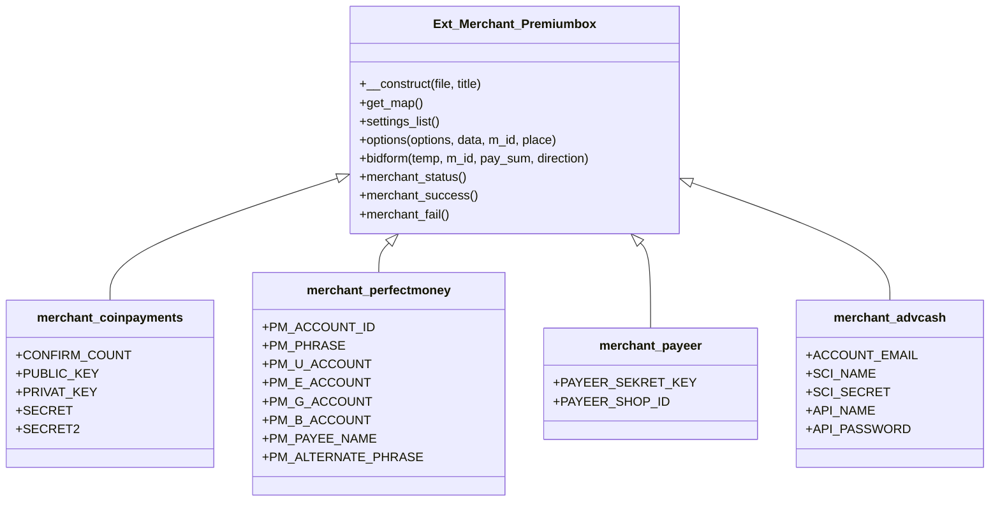
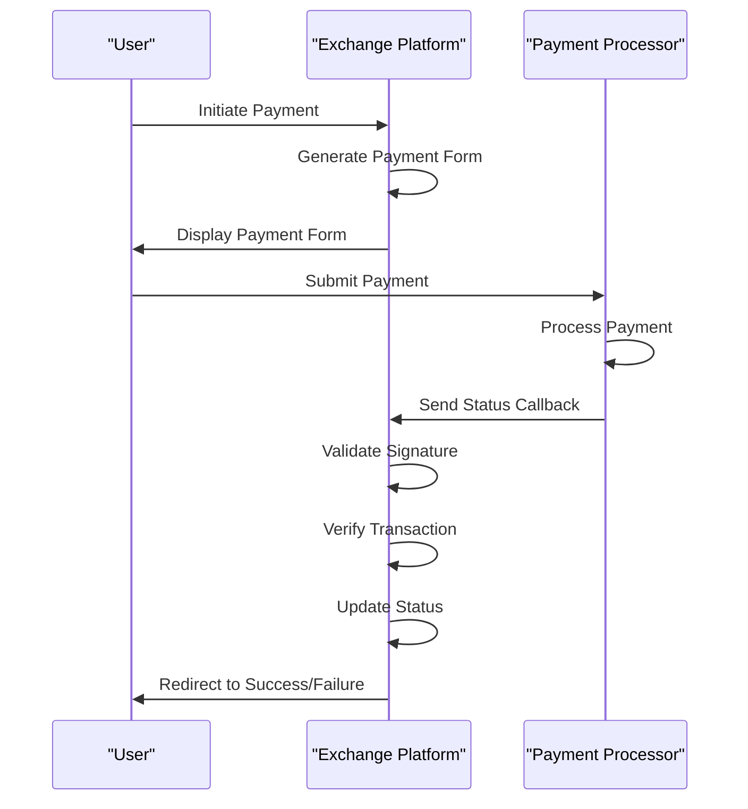
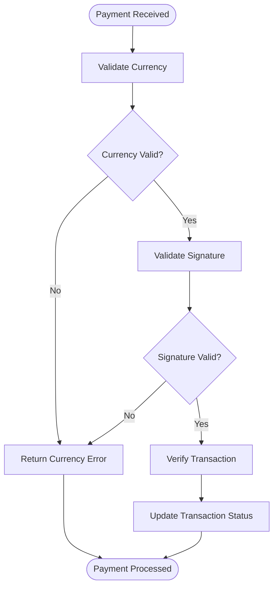

# Payment Processor Setup

<cite>
**Referenced Files in This Document**   
- [coinpayments/index.php](file://wp-content/plugins/premiumbox/merchants/coinpayments/index.php)
- [perfectmoney/index.php](file://wp-content/plugins/premiumbox/merchants/perfectmoney/index.php)
- [payeer/index.php](file://wp-content/plugins/premiumbox/merchants/payeer/index.php)
- [advcash/index.php](file://wp-content/plugins/premiumbox/merchants/advcash/index.php)
- [coinpayments/class.php](file://wp-content/plugins/premiumbox/merchants/coinpayments/class.php)
- [merch_func.php](file://wp-content/plugins/premiumbox/plugin/merchants/merch_func.php)
- [coinbase/index.php](file://wp-content/plugins/premiumbox/merchants/coinbase/index.php)
</cite>

## Table of Contents
1. [Introduction](#introduction)
2. [Architecture Overview](#architecture-overview)
3. [Core Components](#core-components)
4. [Processor Implementation Details](#processor-implementation-details)
5. [Setup Process for Major Processors](#setup-process-for-major-processors)
6. [Common Issues and Solutions](#common-issues-and-solutions)
7. [Best Practices](#best-practices)
8. [Conclusion](#conclusion)

## Introduction
This document provides comprehensive guidance on configuring payment processors within the exchange platform. It covers the implementation details for various payment processors including cryptocurrency wallets and e-currency systems. The document details the step-by-step setup process for major processors like Coinbase, PerfectMoney, and Payeer, including required API keys, account credentials, and callback URL configuration. It also explains the relationship between the main merchant system and individual processor implementations, addresses common issues, and provides best practices for securely storing merchant credentials and testing processor connectivity.

**Section sources**
- [coinpayments/index.php](file://wp-content/plugins/premiumbox/merchants/coinpayments/index.php#L1-L276)
- [perfectmoney/index.php](file://wp-content/plugins/premiumbox/merchants/perfectmoney/index.php#L1-L362)

## Architecture Overview
The payment processor system follows a modular architecture where each payment processor is implemented as a separate merchant class that extends the base `Ext_Merchant_Premiumbox` class. This design allows for consistent integration while accommodating the unique requirements of each payment processor.

**Diagram sources**
- [coinpayments/index.php](file://wp-content/plugins/premiumbox/merchants/coinpayments/index.php#L1-L276)
- [perfectmoney/index.php](file://wp-content/plugins/premiumbox/merchants/perfectmoney/index.php#L1-L362)
- [payeer/index.php](file://wp-content/plugins/premiumbox/merchants/payeer/index.php#L1-L254)
- [advcash/index.php](file://wp-content/plugins/premiumbox/merchants/advcash/index.php#L1-L301)

## Core Components
The payment processor system consists of several core components that work together to facilitate secure and reliable payment processing. The base `Ext_Merchant_Premiumbox` class provides the foundation for all merchant implementations, defining the common interface and functionality. Each specific payment processor extends this base class and implements processor-specific configuration options, payment forms, and callback handlers.

The system uses WordPress actions and filters to manage the payment flow, with specific hooks for status updates, success and failure handling, and merchant initialization. The architecture supports both cryptocurrency wallets and traditional e-currency systems, providing a unified interface for diverse payment methods.

**Section sources**
- [merch_func.php](file://wp-content/plugins/premiumbox/plugin/merchants/merch_func.php#L1-L200)
- [coinpayments/class.php](file://wp-content/plugins/premiumbox/merchants/coinpayments/class.php#L1-L76)

## Processor Implementation Details
Each payment processor implementation follows a consistent pattern while accommodating the specific requirements of the payment service. The implementation includes configuration options, payment form generation, and callback handling.

### Configuration Options
The `get_map()` method defines the configuration options required for each processor, including API keys, account credentials, and other settings. These options are displayed in the administration interface and stored securely.

### Payment Form Generation
The `bidform()` method generates the payment form that is presented to users when they initiate a transaction. This form contains the necessary fields and parameters required by the payment processor, including amounts, currencies, and return URLs.

### Callback Handling
The `merchant_status()`, `merchant_success()`, and `merchant_fail()` methods handle callbacks from the payment processor. These methods validate the incoming data, verify signatures, and update the transaction status accordingly.

**Diagram sources**
- [perfectmoney/index.php](file://wp-content/plugins/premiumbox/merchants/perfectmoney/index.php#L120-L189)
- [payeer/index.php](file://wp-content/plugins/premiumbox/merchants/payeer/index.php#L73-L112)
- [coinpayments/index.php](file://wp-content/plugins/premiumbox/merchants/coinpayments/index.php#L80-L147)

## Setup Process for Major Processors

### Coinbase Setup
To configure Coinbase as a payment processor:

1. Obtain API credentials from your Coinbase Commerce account
2. Configure the following settings in the platform:
   - API Key: Your Coinbase Commerce API key
   - Webhook Secret: The secret used to verify webhook signatures
   - Supported Currencies: Select the cryptocurrencies you want to accept

The platform uses webhook callbacks to receive payment notifications from Coinbase. The `merchant_status()` method validates the webhook signature using the shared secret and processes the payment information.

**Section sources**
- [coinbase/index.php](file://wp-content/plugins/premiumbox/merchants/coinbase/index.php#L127-L172)

### PerfectMoney Setup
To configure PerfectMoney as a payment processor:

1. Create a PerfectMoney account and enable the API
2. Configure the following settings in the platform:
   - Account ID: Your PerfectMoney account ID
   - Account Password: Your PerfectMoney account password
   - USD Wallet Number: Your USD wallet (U-XXXXXXX)
   - EUR Wallet Number: Your EUR wallet (E-XXXXXXX)
   - GOLD Wallet Number: Your GOLD wallet (O-XXXXXXX)
   - BTC Wallet Number: Your BTC wallet
   - Payee Name: Your business name
   - Alternative Passphrase: Used for signature verification

The payment form is generated using the PerfectMoney API, and status updates are received via POST callbacks to the status URL. The system verifies the control signature using the alternative passphrase.

**Section sources**
- [perfectmoney/index.php](file://wp-content/plugins/premiumbox/merchants/perfectmoney/index.php#L32-L72)

### Payeer Setup
To configure Payeer as a payment processor:

1. Create a Payeer merchant account
2. Configure the following settings in the platform:
   - Merchant ID: Your Payeer shop ID
   - Secret Key: Your Payeer secret key

The payment form is generated with a SHA-256 signature that includes the shop ID, order ID, amount, currency, description, and secret key. Status updates are received via POST callbacks, and the system verifies the signature using the same algorithm.

**Section sources**
- [payeer/index.php](file://wp-content/plugins/premiumbox/merchants/payeer/index.php#L31-L41)

## Common Issues and Solutions

### Incorrect API Key Formatting
**Issue**: API keys are rejected due to incorrect formatting.
**Solution**: Ensure that API keys are entered exactly as provided by the payment processor, without any additional spaces or characters. The system validates API keys using a 32-character alphanumeric pattern.

### Callback URL Validation Failures
**Issue**: Callbacks from payment processors are rejected due to validation failures.
**Solution**: Verify that the callback URLs in the payment processor settings match exactly with the URLs generated by the platform. Check that the server can receive POST requests and that SSL certificates are valid if using HTTPS.

### Currency Mismatch Errors
**Issue**: Payments are rejected due to currency mismatches.
**Solution**: Ensure that the currency specified in the payment form matches the currency supported by the payment processor. The system performs currency validation in the `merchant_status()` method and rejects payments with unsupported currencies.

**Diagram sources**
- [perfectmoney/index.php](file://wp-content/plugins/premiumbox/merchants/perfectmoney/index.php#L224-L232)
- [payeer/index.php](file://wp-content/plugins/premiumbox/merchants/payeer/index.php#L136-L152)

## Best Practices

### Secure Credential Storage
Store all API keys and credentials securely using the platform's built-in encryption. Never store credentials in plain text or version control systems. The platform automatically handles secure storage of merchant configuration data.

### Testing Before Going Live
Always test processor connectivity in sandbox mode before enabling live transactions. Use test accounts and small transaction amounts to verify that:
- Payment forms are generated correctly
- Callbacks are received and processed
- Transaction status updates are reflected in the system
- Error handling works as expected

### Monitoring and Logging
Enable detailed logging for payment processors to monitor transaction flow and troubleshoot issues. Regularly review logs for failed transactions and validation errors. The platform provides comprehensive logging through the `logs()` method in each merchant class.

## Conclusion
The payment processor system provides a flexible and secure framework for integrating various payment methods into the exchange platform. By following the setup procedures and best practices outlined in this document, administrators can successfully configure and manage payment processors like Coinbase, PerfectMoney, and Payeer. The modular architecture ensures consistency across different processors while accommodating their unique requirements, and the comprehensive error handling and logging capabilities help maintain reliable payment processing.