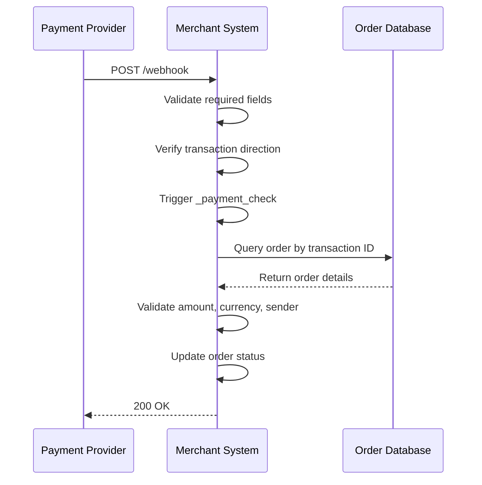
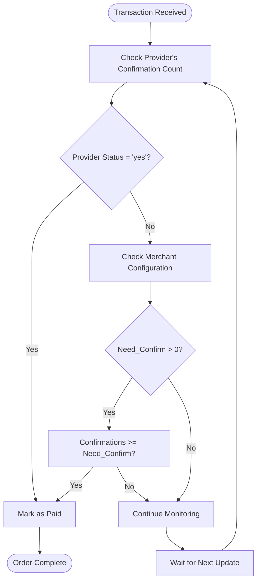
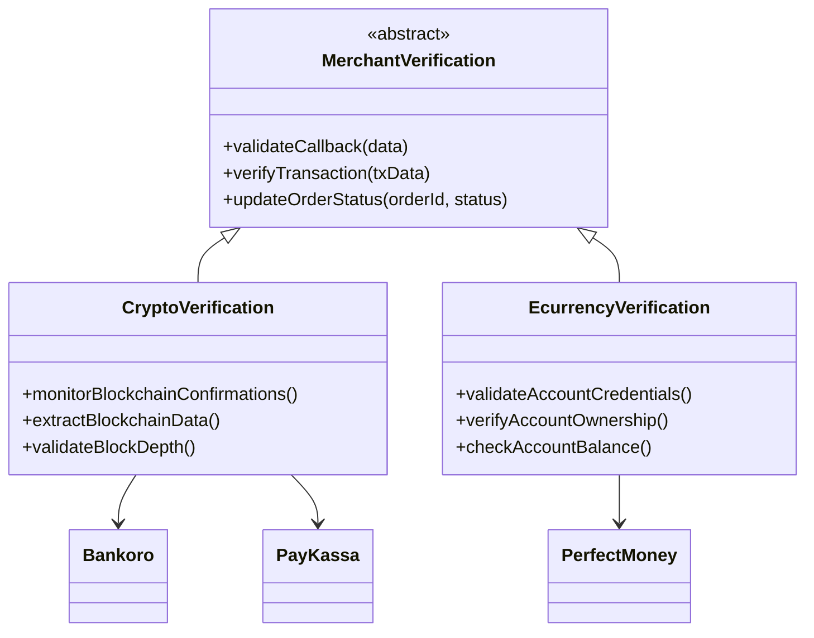
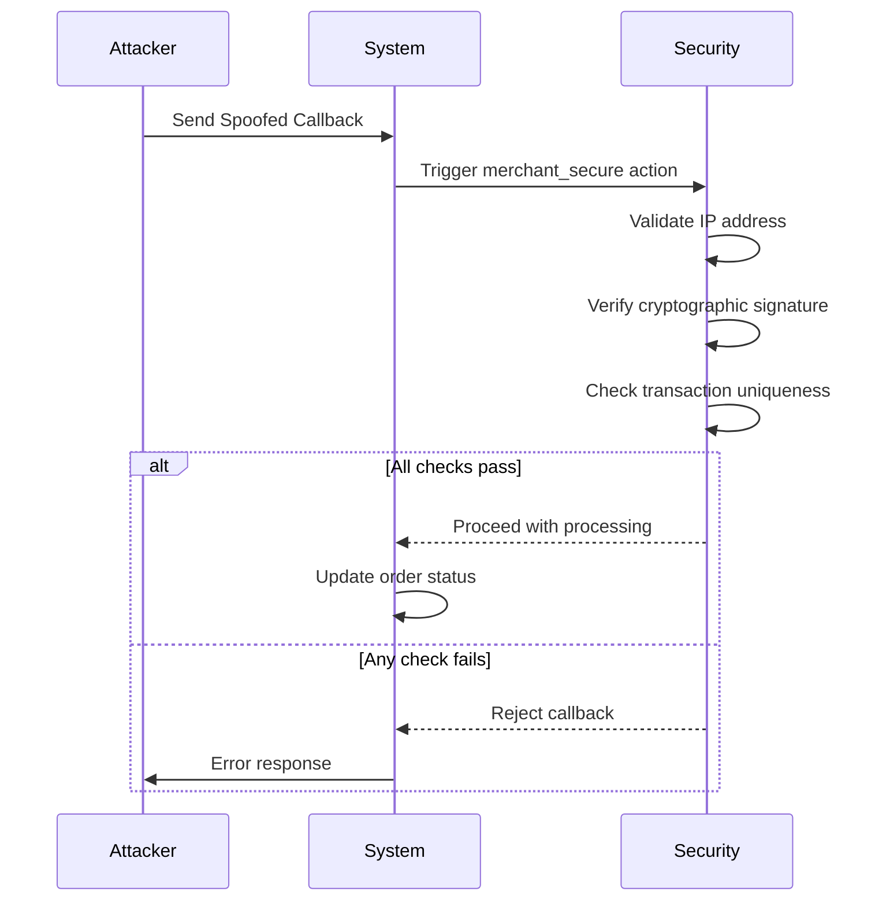
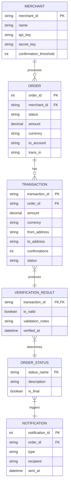
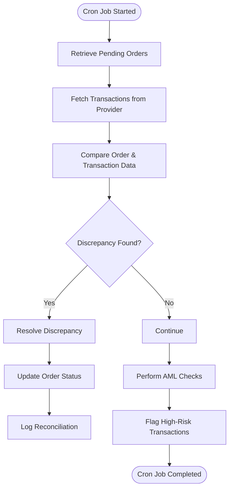

# Transaction Verification

<cite>
**Referenced Files in This Document**   
- [merch_func.php](file://wp-content/plugins/premiumbox/plugin/merchants/merch_func.php)
- [bankoro/index.php](file://wp-content/plugins/premiumbox/merchants/bankoro/index.php)
- [paykassa/index.php](file://wp-content/plugins/premiumbox/merchants/paykassa/index.php)
- [perfectmoney/index.php](file://wp-content/plugins/premiumbox/merchants/perfectmoney/index.php)
- [getblock/class.php](file://wp-content/plugins/premiumbox/amlcheck/getblock/class.php)
- [getblock/index.php](file://wp-content/plugins/premiumbox/amlcheck/getblock/index.php)
</cite>

## Table of Contents
1. [Introduction](#introduction)
2. [Transaction Verification Workflows](#transaction-verification-workflows)
3. [Callback Handling and IPN Processing](#callback-handling-and-ipn-processing)
4. [Blockchain Confirmation Monitoring](#blockchain-confirmation-monitoring)
5. [Merchant-Specific Verification Processes](#merchant-specific-verification-processes)
6. [Security Measures Against Spoofing](#security-measures-against-spoofing)
7. [Relationship with Order Management System](#relationship-with-order-management-system)
8. [Common Issues and Solutions](#common-issues-and-solutions)
9. [Best Practices for Confirmation Thresholds](#best-practices-for-confirmation-thresholds)
10. [Automated Reconciliation Implementation](#automated-reconciliation-implementation)

## Introduction
The transaction verification system in this merchant integration platform provides a comprehensive framework for validating incoming payments from various external providers. The system supports multiple merchant types including cryptocurrency gateways, e-currency processors, and traditional payment systems. Verification processes are designed to ensure payment authenticity, prevent fraud, and maintain accurate order status tracking. The architecture incorporates callback handling, IPN (Instant Payment Notification) processing, and blockchain confirmation monitoring to provide robust transaction validation across different payment methods.

## Transaction Verification Workflows
The transaction verification system follows a standardized workflow across different merchant integrations, with variations based on the specific payment provider's requirements. The core verification process begins when a payment notification is received, either through a callback webhook or IPN. The system then validates the transaction details against the corresponding order in the database, checking critical parameters such as transaction ID, amount, currency, and sender information.

For cryptocurrency transactions, the verification process includes blockchain confirmation monitoring, where the system tracks the number of confirmations a transaction has received. The verification workflow continues with status updates to the order management system, transitioning orders from pending to paid status once all verification criteria are met. The system also handles edge cases such as partial payments, overpayments, and payments from unauthorized addresses through configurable business rules.

**Section sources**
- [merch_func.php](file://wp-content/plugins/premiumbox/plugin/merchants/merch_func.php#L1022-L1049)
- [bankoro/index.php](file://wp-content/plugins/premiumbox/merchants/bankoro/index.php#L258-L413)

## Callback Handling and IPN Processing
The system implements a robust callback handling mechanism that processes payment notifications from external providers through dedicated endpoint URLs. Each merchant integration defines specific callback URLs for different transaction states, including success, failure, and status verification endpoints. The callback processing follows a security-first approach, with multiple validation layers to prevent spoofing attacks.

When a callback is received, the system first performs basic validation of required fields such as transaction ID, status, and direction. For Bankoro integration, the webhook validates that the transaction type is 'DEPOSIT' and that all critical fields are present and non-empty. The system then triggers the payment verification process by calling the private `_payment_check` method, which retrieves the corresponding order from the database and validates the transaction details against the order requirements.

**Diagram sources**
- [bankoro/index.php](file://wp-content/plugins/premiumbox/merchants/bankoro/index.php#L258-L276)
- [merch_func.php](file://wp-content/plugins/premiumbox/plugin/merchants/merch_func.php#L1022-L1049)

## Blockchain Confirmation Monitoring
For cryptocurrency transactions, the system implements comprehensive blockchain confirmation monitoring to ensure transaction finality. The PayKassa integration demonstrates this functionality by tracking both the current number of confirmations and the required number of confirmations for transaction validity. The merchant configuration includes a "Required number of transaction confirmations" setting that determines how many blockchain confirmations are needed before a transaction is considered fully verified.

The system evaluates confirmation status in two ways: first by checking the confirmation count reported by the payment provider, and second by applying merchant-configured rules. In PayKassa's implementation, there is a configurable option that allows merchants to determine whether the order status should be updated based on the provider's confirmation status or according to a fixed number of confirmations specified in the merchant settings. This flexibility enables merchants to balance security requirements with the need for timely order processing.

**Diagram sources**
- [paykassa/index.php](file://wp-content/plugins/premiumbox/merchants/paykassa/index.php#L221-L372)
- [bankoro/index.php](file://wp-content/plugins/premiumbox/merchants/bankoro/index.php#L306-L330)

## Merchant-Specific Verification Processes
The system supports different verification processes tailored to specific merchant types and their unique requirements. For cryptocurrency merchants like Bankoro, the verification process includes detailed blockchain data analysis, extracting information such as transaction hash, sender address, recipient address, and net amount from the blockchain data provided by the payment processor. The system validates that the sender address matches the expected sender (if configured) and that the transaction amount meets the order requirements.

For e-currency processors like Perfect Money, the verification process focuses on account-based validation rather than blockchain confirmations. The system validates that the payment was sent from a legitimate account and that the account type matches the expected currency. The Perfect Money integration verifies the payment by checking that the PAYEE_ACCOUNT in the callback matches one of the configured account constants (PM_U_ACCOUNT, PM_E_ACCOUNT, etc.) for the corresponding currency.

**Diagram sources**
- [bankoro/index.php](file://wp-content/plugins/premiumbox/merchants/bankoro/index.php#L258-L413)
- [paykassa/index.php](file://wp-content/plugins/premiumbox/merchants/paykassa/index.php#L221-L372)
- [perfectmoney/index.php](file://wp-content/plugins/premiumbox/merchants/perfectmoney/index.php#L207-L357)

## Security Measures Against Spoofing
The system implements multiple security layers to protect against callback spoofing attacks. The primary defense mechanism is the use of merchant-specific security actions that are triggered at the beginning of callback processing. In the Bankoro integration, the `do_action('merchant_secure', ...)` function is called immediately upon receiving a webhook, allowing for additional security checks to be implemented through WordPress hooks.

For Perfect Money, the system implements cryptographic signature verification using MD5 hashing. The callback includes a V2_HASH parameter that is compared against a calculated hash of key transaction parameters combined with the merchant's alternate passphrase. This ensures that only legitimate notifications from Perfect Money can be processed, as an attacker would need to know the merchant's secret passphrase to generate a valid signature.

The system also implements transaction uniqueness checks through the `check_trans_in()` function, which prevents duplicate processing of the same transaction ID for a given order. Additional security measures include IP address validation through the `enableip` configuration option, which restricts callback processing to requests originating from authorized IP addresses.

**Diagram sources**
- [bankoro/index.php](file://wp-content/plugins/premiumbox/merchants/bankoro/index.php#L262)
- [perfectmoney/index.php](file://wp-content/plugins/premiumbox/merchants/perfectmoney/index.php#L229-L231)
- [merch_func.php](file://wp-content/plugins/premiumbox/plugin/merchants/merch_func.php#L1022-L1049)

## Relationship with Order Management System
The transaction verification system is tightly integrated with the order management system through the `set_bid_status()` function, which updates the status of exchange orders based on verification results. When a transaction is successfully verified, the system calls `set_bid_status()` with parameters including the new status (e.g., 'realpay' or 'coldpay'), transaction details, and order information. This function serves as the primary interface between the payment verification layer and the order management system.

The integration supports various order status transitions, including moving from 'new' to 'realpay' for fully verified payments, or to 'coldpay' for payments that meet amount requirements but have not yet reached the required confirmation depth. The system also handles edge cases such as payments from unauthorized senders or incorrect currencies by logging the discrepancy and optionally updating the order status based on merchant-configurable rules.

**Diagram sources**
- [merch_func.php](file://wp-content/plugins/premiumbox/plugin/merchants/merch_func.php#L1022-L1049)
- [bankoro/index.php](file://wp-content/plugins/premiumbox/merchants/bankoro/index.php#L371-L391)

## Common Issues and Solutions
The system addresses several common issues in transaction verification through configurable parameters and automated processes. Delayed confirmations are handled through the cron-based verification system, which periodically checks the status of pending transactions and updates their confirmation count. The Bankoro integration implements this through the `cron()` method, which calls the same `_payment_check` function used for webhook processing, ensuring consistent verification logic across both real-time and batch processing.

Duplicate callbacks are prevented through the `check_trans_in()` function, which verifies that a transaction ID has not already been processed for a given order. This function is called early in the verification process for multiple merchants including Bankoro, PayKassa, and Perfect Money, providing a consistent defense against duplicate processing.

Fraudulent payment attempts are mitigated through multiple layers of validation, including sender address verification, amount validation, and currency verification. The system allows merchants to configure how to handle various validation failures through settings such as 'invalid_ctype' (incorrect currency), 'invalid_minsum' (amount too low), and 'invalid_maxsum' (amount too high). These settings determine whether orders with validation issues should remain in the 'new' status, be moved to 'on checking', or be automatically marked as 'paid'.

**Section sources**
- [bankoro/index.php](file://wp-content/plugins/premiumbox/merchants/bankoro/index.php#L341-L369)
- [paykassa/index.php](file://wp-content/plugins/premiumbox/merchants/paykassa/index.php#L330-L358)
- [perfectmoney/index.php](file://wp-content/plugins/premiumbox/merchants/perfectmoney/index.php#L318-L353)

## Best Practices for Confirmation Thresholds
The system provides flexible configuration options for setting appropriate confirmation thresholds based on the specific cryptocurrency and risk tolerance. For Bitcoin transactions, the recommended threshold is typically 3-6 confirmations, while for faster blockchains like Litecoin or Dash, a lower threshold of 2-3 confirmations may be sufficient. The PayKassa integration allows merchants to set a custom "Required number of transaction confirmations" value, balancing security needs with customer experience.

Best practices suggest setting higher confirmation thresholds for larger transactions and lower thresholds for smaller ones. The system supports this approach through merchant configuration options that can be adjusted based on the specific use case. For high-risk transactions or when processing large amounts, it is recommended to use the payment provider's confirmation status rather than a fixed threshold, as this leverages the provider's own risk assessment algorithms.

Merchants should also consider the trade-off between security and customer experience when setting confirmation thresholds. While higher thresholds provide greater protection against double-spending attacks, they also increase the time customers must wait for order confirmation. The system's dual verification approach in PayKassa—checking both the provider's status and a configurable threshold—provides flexibility to optimize this balance based on the merchant's specific requirements.

**Section sources**
- [paykassa/index.php](file://wp-content/plugins/premiumbox/merchants/paykassa/index.php#L92-L102)
- [bankoro/index.php](file://wp-content/plugins/premiumbox/merchants/bankoro/index.php#L113-L125)

## Automated Reconciliation Implementation
The system implements automated reconciliation through periodic cron jobs that verify transaction status and update order records accordingly. The reconciliation process compares the status of transactions in the merchant system with the status reported by payment providers, identifying and resolving discrepancies. For Bankoro, the cron job calls the `_payment_check` method without a specific transaction ID, causing the system to retrieve all recent transactions from the provider's API and compare them with pending orders in the database.

The reconciliation process handles various scenarios, including transactions that were missed by webhook processing due to temporary connectivity issues, transactions with delayed confirmations, and transactions that have been reversed or canceled by the payment provider. When a discrepancy is found, the system updates the order status accordingly and logs the reconciliation action for audit purposes.

The system also supports AML (Anti-Money Laundering) checks through integrations with services like GetBlock, which can verify the risk level of transaction addresses. The GetBlockAML class provides methods to verify transactions and addresses against AML databases, allowing merchants to automatically flag or reject transactions from high-risk addresses. This functionality is accessible through the AML check interface, where merchants can test address and transaction verification.

**Diagram sources**
- [bankoro/index.php](file://wp-content/plugins/premiumbox/merchants/bankoro/index.php#L278-L282)
- [getblock/class.php](file://wp-content/plugins/premiumbox/amlcheck/getblock/class.php#L1-L65)
- [getblock/index.php](file://wp-content/plugins/premiumbox/amlcheck/getblock/index.php#L352-L378)