# Module Configuration

<cite>
**Referenced Files in This Document**
- [wp-admin/includes/options.php](file://wp-admin/includes/options.php)
- [wp-admin/options.php](file://wp-admin/options.php)
- [wp-content/plugins/premiumbox/moduls/beautyemail/settings.php](file://wp-content/plugins/premiumbox/moduls/beautyemail/settings.php)
- [wp-content/plugins/premiumbox/moduls/api/settings.php](file://wp-content/plugins/premiumbox/moduls/api/settings.php)
- [wp-content/plugins/premiumbox/moduls/bestchange/settings.php](file://wp-content/plugins/premiumbox/moduls/bestchange/settings.php)
- [wp-content/plugins/premiumbox/premium/includes/class-form.php](file://wp-content/plugins/premiumbox/premium/includes/class-form.php)
- [wp-content/plugins/premiumbox/default/admin/settings.php](file://wp-content/plugins/premiumbox/default/admin/settings.php)
- [wp-content/plugins/premiumbox/default/users/uf_settings.php](file://wp-content/plugins/premiumbox/default/users/uf_settings.php)
- [wp-includes/option.php](file://wp-includes/option.php)
- [wp-content/plugins/premiumbox/premium/includes/functions.php](file://wp-content/plugins/premiumbox/premium/includes/functions.php)
</cite>

## Table of Contents
1. [Introduction](#introduction)
2. [System Architecture](#system-architecture)
3. [Configuration Interface System](#configuration-interface-system)
4. [Settings Form Rendering](#settings-form-rendering)
5. [Data Flow and Processing](#data-flow-and-processing)
6. [Configuration Schema Design](#configuration-schema-design)
7. [Validation Patterns](#validation-patterns)
8. [Security Mechanisms](#security-mechanisms)
9. [Usage Examples](#usage-examples)
10. [Common Issues and Solutions](#common-issues-and-solutions)
11. [Performance Considerations](#performance-considerations)
12. [Troubleshooting Guide](#troubleshooting-guide)

## Introduction

The Module Configuration system in the PremiumBox plugin framework provides a comprehensive solution for managing administrative settings across multiple modules. This system enables administrators to customize module behavior through intuitive web interfaces while maintaining robust security, validation, and persistence mechanisms.

The configuration system is built around a flexible form rendering engine (PremiumForm) that generates HTML forms dynamically based on configuration schemas. These schemas define field types, validation rules, default values, and presentation logic, enabling consistent and maintainable configuration interfaces across all modules.

## System Architecture

The configuration system follows a layered architecture that separates concerns between form rendering, data processing, and storage:

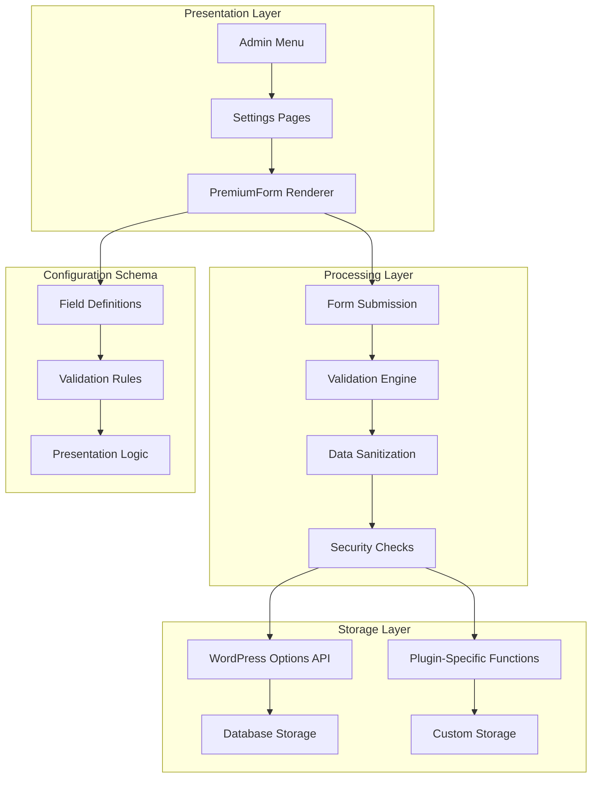

**Diagram sources**
- [wp-content/plugins/premiumbox/premium/includes/class-form.php](file://wp-content/plugins/premiumbox/premium/includes/class-form.php#L1-L200)
- [wp-admin/options.php](file://wp-admin/options.php#L1-L447)

**Section sources**
- [wp-content/plugins/premiumbox/premium/includes/class-form.php](file://wp-content/plugins/premiumbox/premium/includes/class-form.php#L1-L200)
- [wp-admin/options.php](file://wp-admin/options.php#L1-L447)

## Configuration Interface System

### PremiumForm Class Architecture

The PremiumForm class serves as the core component for rendering configuration interfaces. It provides a unified API for creating various field types with consistent styling and behavior:

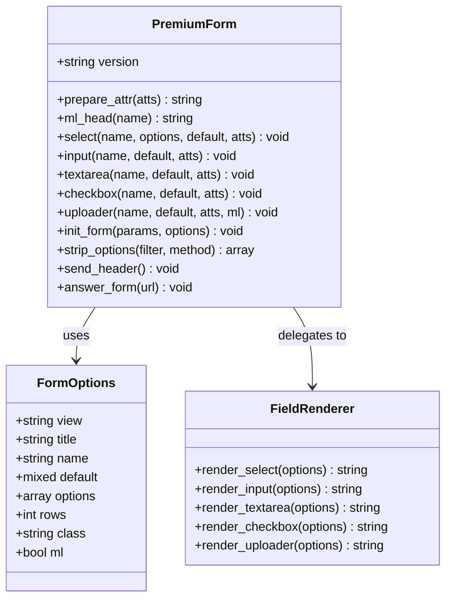

**Diagram sources**
- [wp-content/plugins/premiumbox/premium/includes/class-form.php](file://wp-content/plugins/premiumbox/premium/includes/class-form.php#L4-L200)

### Field Type System

The system supports multiple field types, each with specific rendering and validation logic:

| Field Type | Purpose | Attributes | Validation |
|------------|---------|------------|------------|
| `select` | Dropdown selection | `options`, `default` | Required value in options |
| `input` | Text input | `maxlength`, `placeholder` | Length limits, type validation |
| `textarea` | Multi-line text | `rows`, `cols` | Length limits, content filtering |
| `checkbox` | Boolean toggle | `value`, `checked` | Boolean conversion |
| `uploader` | File upload | `accept`, `multiple` | File type and size validation |
| `colorpicker` | Color selection | `default` | Hex color format |
| `user_func` | Custom rendering | `func`, `func_data` | Custom validation logic |

**Section sources**
- [wp-content/plugins/premiumbox/premium/includes/class-form.php](file://wp-content/plugins/premiumbox/premium/includes/class-form.php#L67-L200)

## Settings Form Rendering

### Dynamic Form Generation

Forms are generated dynamically from configuration arrays that define field properties and behavior. The rendering process involves several stages:

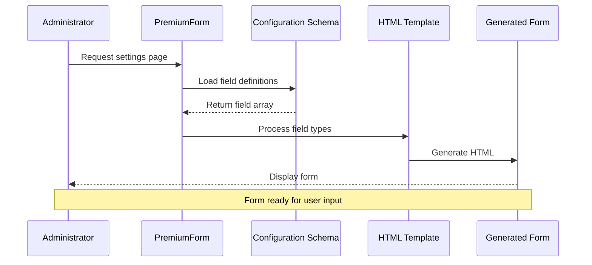

**Diagram sources**
- [wp-content/plugins/premiumbox/premium/includes/class-form.php](file://wp-content/plugins/premiumbox/premium/includes/class-form.php#L1105-L1150)

### Form Initialization Process

The form initialization process follows a structured approach:

1. **Parameter Processing**: Validate and sanitize initialization parameters
2. **Filter Application**: Apply filters to modify field definitions
3. **Field Preparation**: Process individual field configurations
4. **HTML Generation**: Render field markup with appropriate attributes
5. **JavaScript Integration**: Add form-specific JavaScript functionality

**Section sources**
- [wp-content/plugins/premiumbox/premium/includes/class-form.php](file://wp-content/plugins/premiumbox/premium/includes/class-form.php#L1105-L1150)

## Data Flow and Processing

### Submission Handling

The data flow from user input to persistent storage involves multiple validation and processing stages:

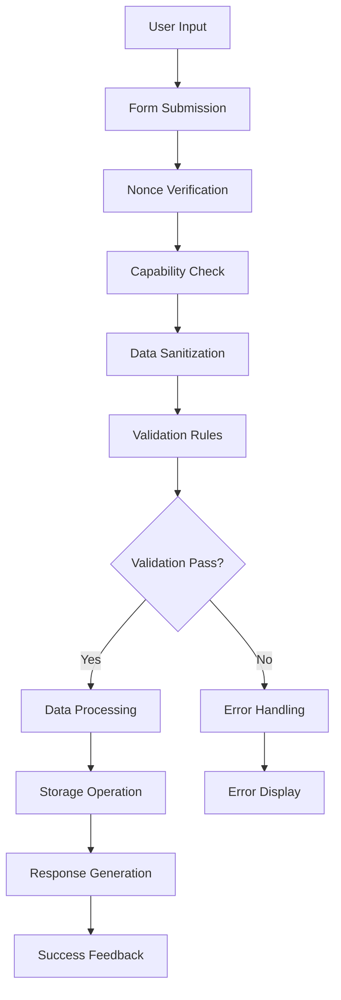

**Diagram sources**
- [wp-content/plugins/premiumbox/moduls/beautyemail/settings.php](file://wp-content/plugins/premiumbox/moduls/beautyemail/settings.php#L132-L166)
- [wp-content/plugins/premiumbox/moduls/api/settings.php](file://wp-content/plugins/premiumbox/moduls/api/settings.php#L101-L138)

### Storage Mechanisms

The system supports multiple storage approaches depending on the configuration requirements:

| Storage Method | Use Case | Implementation | Performance |
|----------------|----------|----------------|-------------|
| WordPress Options API | General settings | `update_option()` | Good for small datasets |
| Plugin-Specific Functions | Complex configurations | Custom serialization | Optimized for specific needs |
| Database Tables | Structured data | Direct SQL operations | Excellent for large datasets |
| File-Based Storage | Static configurations | JSON/XML files | Fast read operations |

**Section sources**
- [wp-includes/option.php](file://wp-includes/option.php#L820-L848)
- [wp-content/plugins/premiumbox/premium/includes/functions.php](file://wp-content/plugins/premiumbox/premium/includes/functions.php#L3812-L3842)

## Configuration Schema Design

### Schema Structure

Configuration schemas define the structure and behavior of settings forms:

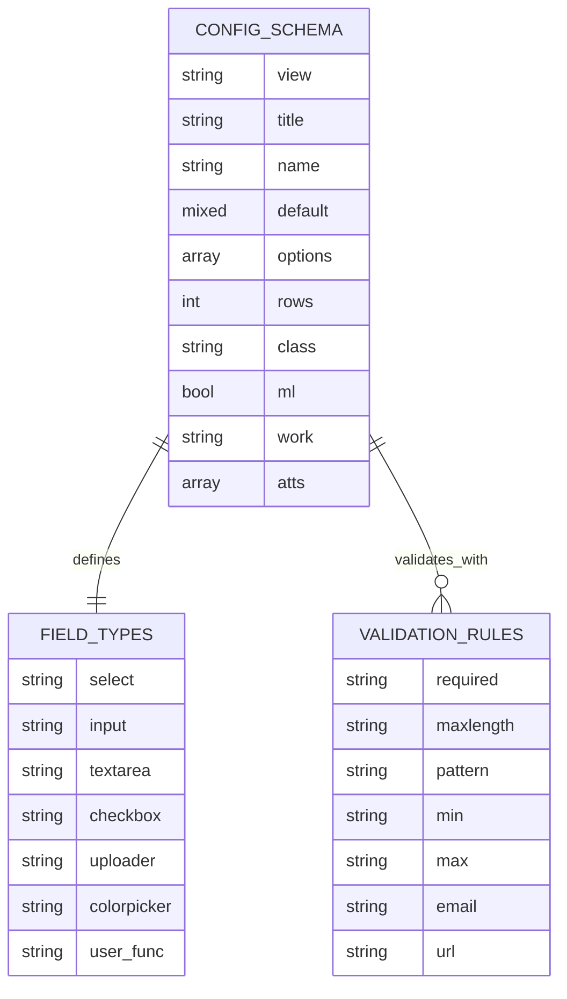

**Diagram sources**
- [wp-content/plugins/premiumbox/moduls/beautyemail/settings.php](file://wp-content/plugins/premiumbox/moduls/beautyemail/settings.php#L23-L118)
- [wp-content/plugins/premiumbox/default/admin/settings.php](file://wp-content/plugins/premiumbox/default/admin/settings.php#L34-L183)

### Field Definition Patterns

Common field definition patterns emerge across different modules:

```php
// Example field definition pattern
$options['field_name'] = array(
    'view' => 'select',           // Field type
    'title' => __('Field Title', 'pn'), // Display label
    'options' => array(           // Available choices
        'value1' => 'Option 1',
        'value2' => 'Option 2'
    ),
    'default' => $plugin->get_option('module', 'field_name'), // Default value
    'name' => 'field_name',       // HTML name attribute
    'work' => 'int',              // Data processing type
);
```

**Section sources**
- [wp-content/plugins/premiumbox/moduls/beautyemail/settings.php](file://wp-content/plugins/premiumbox/moduls/beautyemail/settings.php#L23-L118)
- [wp-content/plugins/premiumbox/default/admin/settings.php](file://wp-content/plugins/premiumbox/default/admin/settings.php#L34-L183)

## Validation Patterns

### Built-in Validation

The system implements comprehensive validation patterns for different data types:

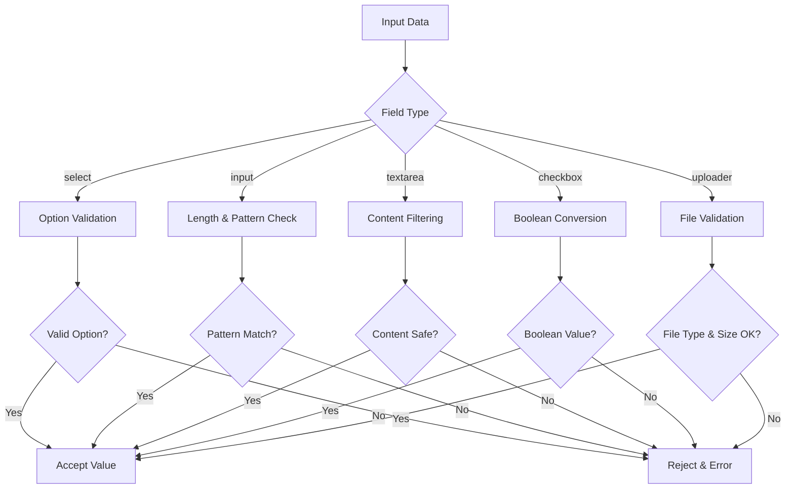

**Diagram sources**
- [wp-content/plugins/premiumbox/premium/includes/class-form.php](file://wp-content/plugins/premiumbox/premium/includes/class-form.php#L1105-L1150)

### Custom Validation Logic

Modules can implement custom validation through filter hooks and callback functions:

**Section sources**
- [wp-content/plugins/premiumbox/premium/includes/class-form.php](file://wp-content/plugins/premiumbox/premium/includes/class-form.php#L1105-L1150)

## Security Mechanisms

### Capability-Based Access Control

The system implements multi-layered security through capability checks:

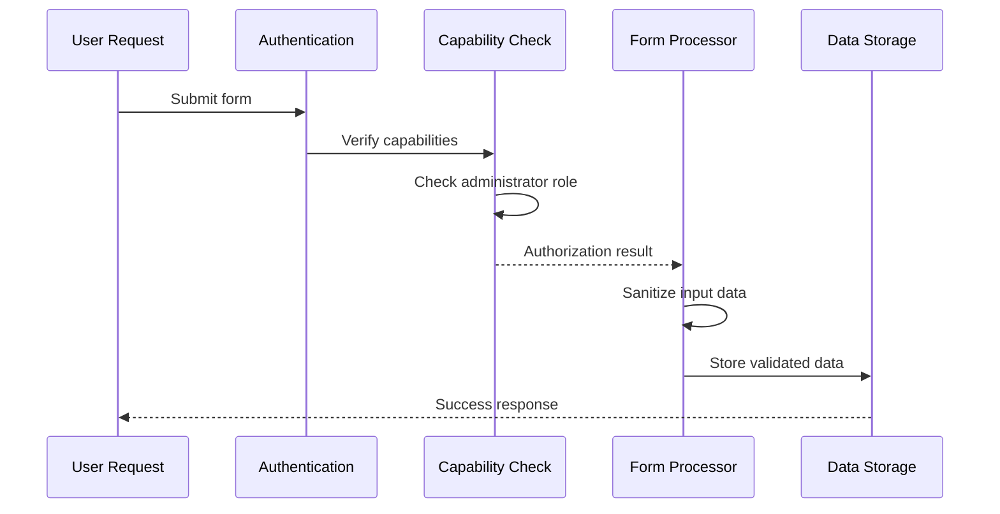

**Diagram sources**
- [wp-content/plugins/premiumbox/moduls/api/settings.php](file://wp-content/plugins/premiumbox/moduls/api/settings.php#L112-L113)

### Input Sanitization

Comprehensive input sanitization prevents security vulnerabilities:

| Security Layer | Protection | Implementation |
|----------------|------------|----------------|
| Nonce Verification | CSRF protection | `check_admin_referer()` |
| Capability Checks | Access control | `pn_only_caps()` function |
| Data Sanitization | XSS prevention | `wp_unslash()` and escaping |
| File Validation | Upload security | MIME type checking |
| SQL Injection | Database safety | Prepared statements |

**Section sources**
- [wp-content/plugins/premiumbox/moduls/api/settings.php](file://wp-content/plugins/premiumbox/moduls/api/settings.php#L112-L113)
- [wp-content/plugins/premiumbox/moduls/beautyemail/settings.php](file://wp-content/plugins/premiumbox/moduls/beautyemail/settings.php#L137-L138)

## Usage Examples

### Email Template Configuration

The beautyemail module demonstrates comprehensive email configuration:

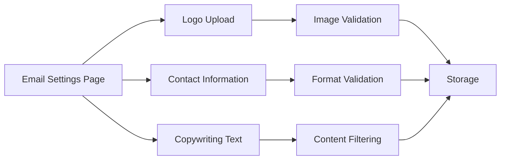

**Diagram sources**
- [wp-content/plugins/premiumbox/moduls/beautyemail/settings.php](file://wp-content/plugins/premiumbox/moduls/beautyemail/settings.php#L23-L118)

### API Access Control Configuration

The API module showcases advanced configuration patterns:

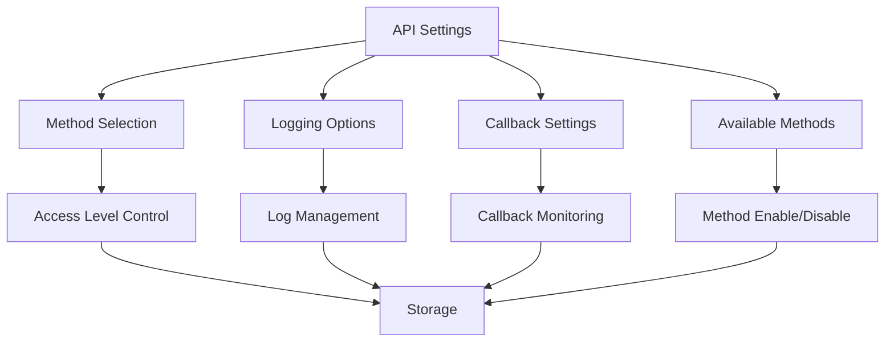

**Diagram sources**
- [wp-content/plugins/premiumbox/moduls/api/settings.php](file://wp-content/plugins/premiumbox/moduls/api/settings.php#L18-L60)

### BestChange Parser Configuration

The BestChange module illustrates complex configuration scenarios:

**Section sources**
- [wp-content/plugins/premiumbox/moduls/beautyemail/settings.php](file://wp-content/plugins/premiumbox/moduls/beautyemail/settings.php#L1-L166)
- [wp-content/plugins/premiumbox/moduls/api/settings.php](file://wp-content/plugins/premiumbox/moduls/api/settings.php#L1-L138)
- [wp-content/plugins/premiumbox/moduls/bestchange/settings.php](file://wp-content/plugins/premiumbox/moduls/bestchange/settings.php#L1-L330)

## Common Issues and Solutions

### Configuration Persistence Failures

**Problem**: Settings not saving to database
**Causes**: 
- Insufficient permissions
- Validation errors
- Database connectivity issues
- Memory limitations

**Solutions**:
1. Verify administrator capabilities using `pn_only_caps()`
2. Check validation rules and error messages
3. Monitor database query logs
4. Increase PHP memory limit if needed

### Validation Errors

**Problem**: Form submissions failing validation
**Common Causes**:
- Invalid field types
- Missing required fields
- Incorrect data formats
- Security restrictions

**Resolution Strategies**:
1. Implement comprehensive field validation
2. Provide clear error messaging
3. Use appropriate field types for data
4. Apply data sanitization consistently

### Security Vulnerabilities

**Problem**: Potential security risks in configuration
**Mitigation Approaches**:
1. Implement capability-based access control
2. Use nonce verification for all form submissions
3. Sanitize all user inputs
4. Validate file uploads thoroughly
5. Apply prepared statements for database operations

**Section sources**
- [wp-content/plugins/premiumbox/moduls/api/settings.php](file://wp-content/plugins/premiumbox/moduls/api/settings.php#L112-L113)
- [wp-content/plugins/premiumbox/moduls/beautyemail/settings.php](file://wp-content/plugins/premiumbox/moduls/beautyemail/settings.php#L137-L138)

## Performance Considerations

### Configuration Caching

Optimize performance through strategic caching mechanisms:

| Caching Strategy | Implementation | Benefits | Trade-offs |
|------------------|----------------|----------|------------|
| Object Caching | Persistent object cache | Reduced database queries | Memory usage |
| Transient Caching | WordPress transients | Temporary storage | Expiration handling |
| File Caching | Serialized files | Fast read operations | Disk I/O overhead |
| Database Indexing | Proper indexing | Faster lookups | Storage overhead |

### Database Query Optimization

Efficient database operations are crucial for configuration performance:

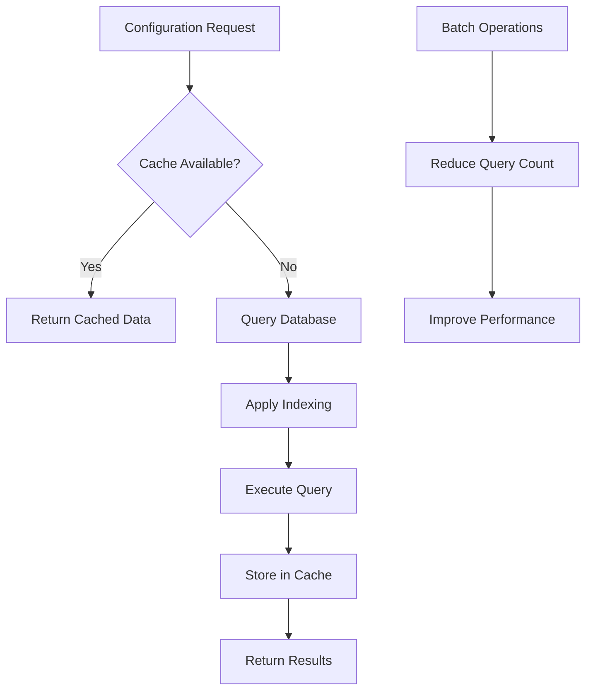

**Diagram sources**
- [wp-content/plugins/premiumbox/premium/includes/functions.php](file://wp-content/plugins/premiumbox/premium/includes/functions.php#L3812-L3842)

### Memory Management

Monitor memory usage during configuration operations:

1. **Large Dataset Handling**: Implement pagination for extensive configurations
2. **Serialization Efficiency**: Use efficient serialization formats
3. **Garbage Collection**: Clear unused variables promptly
4. **Resource Cleanup**: Close database connections appropriately

**Section sources**
- [wp-content/plugins/premiumbox/premium/includes/functions.php](file://wp-content/plugins/premiumbox/premium/includes/functions.php#L3812-L3842)

## Troubleshooting Guide

### Debugging Configuration Issues

Systematic approach to identifying and resolving configuration problems:

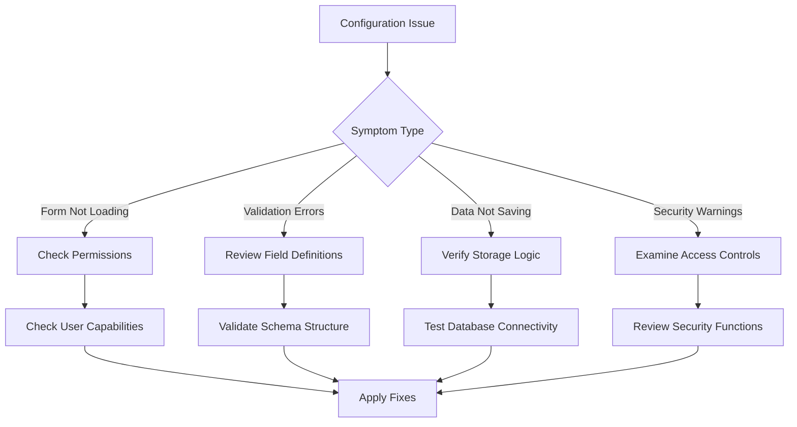

### Common Error Scenarios

| Error Type | Symptoms | Diagnosis | Resolution |
|------------|----------|-----------|------------|
| Permission Denied | Access denied messages | Check user capabilities | Verify `pn_only_caps()` usage |
| Form Validation Failure | Red error messages | Review field definitions | Fix validation rules |
| Database Connection | White screen or errors | Test database connectivity | Check database credentials |
| File Upload Issues | Upload failures | Verify file permissions | Check upload directory permissions |

### Monitoring and Logging

Implement comprehensive monitoring for configuration operations:

1. **Error Logging**: Capture and log all configuration errors
2. **Performance Metrics**: Track query execution times
3. **User Activity**: Monitor configuration changes
4. **Security Events**: Log unauthorized access attempts

**Section sources**
- [wp-content/plugins/premiumbox/moduls/api/settings.php](file://wp-content/plugins/premiumbox/moduls/api/settings.php#L112-L113)
- [wp-content/plugins/premiumbox/moduls/beautyemail/settings.php](file://wp-content/plugins/premiumbox/moduls/beautyemail/settings.php#L137-L138)