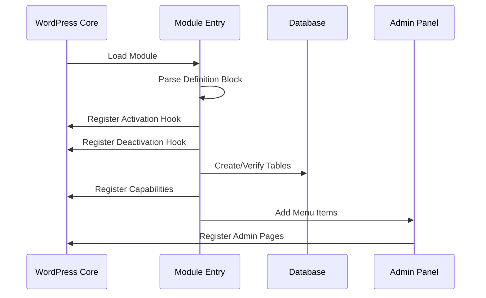
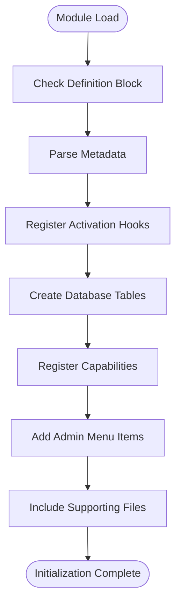
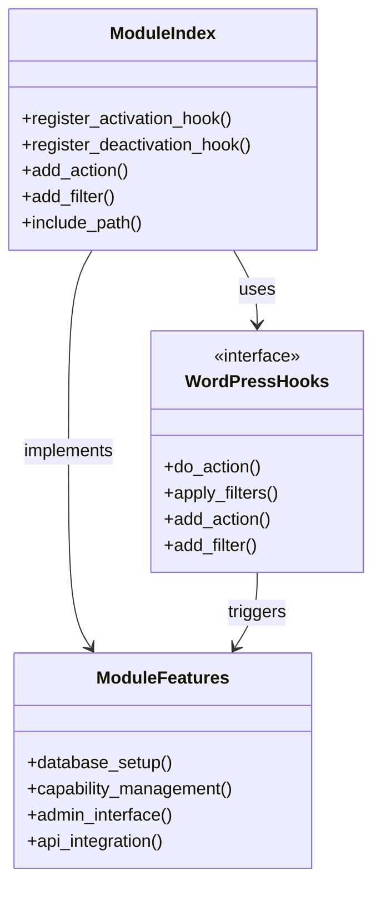
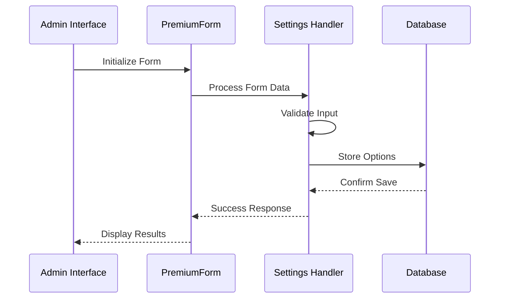
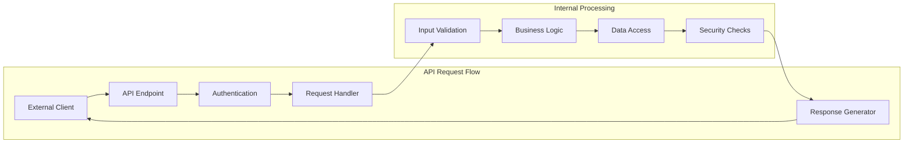
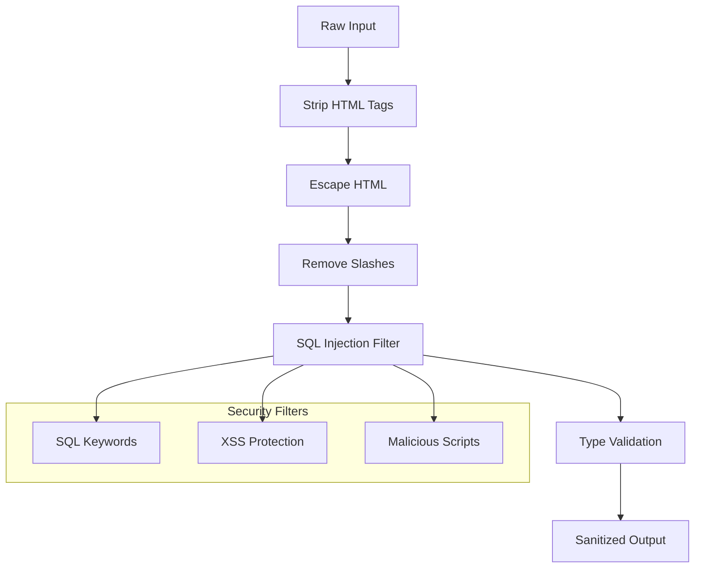
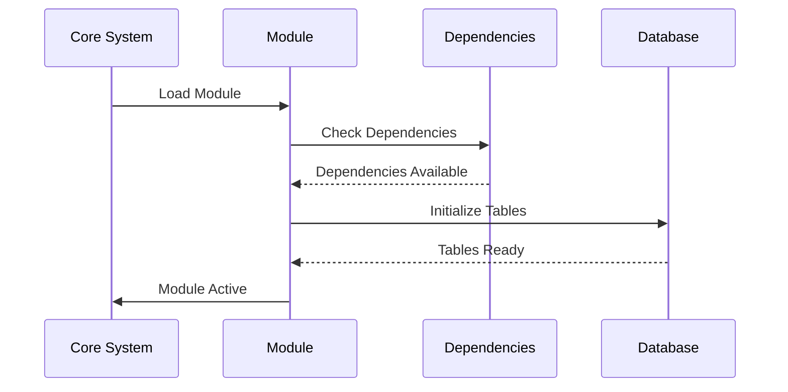
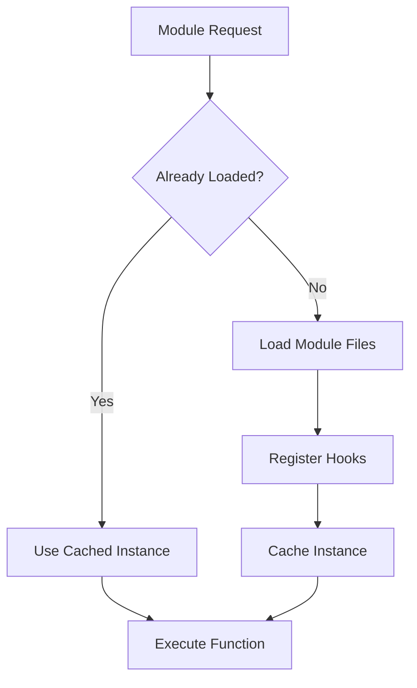

# Module Development

<cite>
**Referenced Files in This Document**
- [index.php](file://wp-content/plugins/premiumbox/moduls/bestchange/index.php)
- [settings.php](file://wp-content/plugins/premiumbox/moduls/bestchange/settings.php)
- [display.php](file://wp-content/plugins/premiumbox/moduls/bestchange/display.php)
- [index.php](file://wp-content/plugins/premiumbox/moduls/api/index.php)
- [methods.php](file://wp-content/plugins/premiumbox/moduls/api/methods.php)
- [add.php](file://wp-content/plugins/premiumbox/moduls/api/add.php)
- [settings.php](file://wp-content/plugins/premiumbox/moduls/api/settings.php)
- [api.php](file://wp-content/plugins/premiumbox/moduls/api/api.php)
- [plugin.php](file://wp-includes/plugin.php)
- [class-form.php](file://wp-content/plugins/premiumbox/premium/includes/class-form.php)
- [functions.php](file://wp-content/plugins/premiumbox/premium/includes/functions.php)
- [security.php](file://wp-content/plugins/premiumbox/premium/includes/security.php)
</cite>

## Table of Contents
1. [Introduction](#introduction)
2. [Module Architecture Overview](#module-architecture-overview)
3. [Module Development Lifecycle](#module-development-lifecycle)
4. [File Structure and Entry Points](#file-structure-and-entry-points)
5. [Hook System and Integration](#hook-system-and-integration)
6. [Configuration Management](#configuration-management)
7. [API Implementation Patterns](#api-implementation-patterns)
8. [Security and Validation](#security-and-validation)
9. [Common Issues and Debugging](#common-issues-and-debugging)
10. [Performance Considerations](#performance-considerations)
11. [Best Practices](#best-practices)
12. [Conclusion](#conclusion)

## Introduction

The premiumbox platform implements a sophisticated module development system that enables extensible functionality through a standardized architecture. This system provides developers with a comprehensive framework for creating custom modules that integrate seamlessly with the core platform while maintaining security, performance, and maintainability standards.

Modules serve as self-contained functional units that can be activated, configured, and managed independently. They follow established patterns for initialization, registration, and integration with the WordPress ecosystem, leveraging hooks, filters, and database abstraction layers.

## Module Architecture Overview

The module system follows a hierarchical structure where each module consists of multiple specialized files working together to provide complete functionality. The architecture emphasizes separation of concerns, allowing developers to organize code logically across different responsibilities.

```mermaid
graph TB
subgraph "Module Structure"
Index[index.php<br/>Entry Point & Registration]
Settings[settings.php<br/>Configuration Management]
Display[display.php<br/>Output Generation]
API[api.php<br/>External API]
Methods[methods.php<br/>API Methods]
Add[add.php<br/>Admin Forms]
Functions[functions.php<br/>Utility Functions]
end
subgraph "Core System"
Hooks[WordPress Hooks<br/>Filters & Actions]
DB[(Database)<br/>Storage Layer]
Security[Security<br/>Validation Layer]
end
Index --> Hooks
Settings --> DB
Display --> Security
API --> Hooks
Methods --> API
Add --> Security
Hooks --> DB
Security --> DB
```

**Diagram sources**
- [index.php](file://wp-content/plugins/premiumbox/moduls/bestchange/index.php#L1-L158)
- [index.php](file://wp-content/plugins/premiumbox/moduls/api/index.php#L1-L172)

**Section sources**
- [index.php](file://wp-content/plugins/premiumbox/moduls/bestchange/index.php#L1-L158)
- [index.php](file://wp-content/plugins/premiumbox/moduls/api/index.php#L1-L172)

## Module Development Lifecycle

### Initialization Phase

Module initialization occurs through the primary entry point file (index.php) which establishes the foundation for all subsequent functionality. The initialization process involves several critical steps:

1. **Definition Block**: Modules begin with a structured definition block that provides metadata
2. **Registration Hooks**: Essential hooks are registered for activation, deactivation, and integration
3. **Database Schema**: Initial database tables are created or verified
4. **Capability Management**: User permissions and capabilities are established
5. **Menu Integration**: Administrative interfaces are integrated into the WordPress admin panel

### Registration Process

The registration process ensures proper integration with the WordPress ecosystem:



**Diagram sources**
- [index.php](file://wp-content/plugins/premiumbox/moduls/bestchange/index.php#L15-L158)
- [index.php](file://wp-content/plugins/premiumbox/moduls/api/index.php#L15-L172)

### Integration with Core System

Modules integrate with the core system through multiple channels:

- **Action Hooks**: Triggered events that modules can respond to
- **Filter Hooks**: Modify data flow through the system
- **Capability System**: User permission management
- **Admin Menu Integration**: Seamless administrative interface

**Section sources**
- [index.php](file://wp-content/plugins/premiumbox/moduls/bestchange/index.php#L15-L158)
- [index.php](file://wp-content/plugins/premiumbox/moduls/api/index.php#L15-L172)

## File Structure and Entry Points

### Primary Entry Point (index.php)

Every module must contain an index.php file that serves as the main entry point. This file establishes the module's identity and registers essential hooks:



**Diagram sources**
- [index.php](file://wp-content/plugins/premiumbox/moduls/bestchange/index.php#L4-L158)

### Supporting File Organization

Modules utilize a modular file structure where each file serves a specific purpose:

| File | Purpose | Responsibilities |
|------|---------|------------------|
| index.php | Entry point and registration | Module definition, hook registration, capability setup |
| settings.php | Configuration management | Admin settings forms, option storage |
| display.php | Output generation | Frontend display logic, template rendering |
| api.php | External API | API endpoint handling, request processing |
| methods.php | API methods | Individual API method implementations |
| add.php | Admin forms | Administrative interface creation |
| functions.php | Utility functions | Shared functions and helpers |

### Entry Point Pattern

The entry point follows a consistent pattern across all modules:

```php
// Module identification and initialization
$path = get_extension_file(__FILE__);
$name = get_extension_name($path);

// Activation hooks
add_action('all_moduls_active_' . $name, 'module_activation_function');
add_action('pn_plugin_activate', 'module_activation_function');

// Capability registration
add_filter('pn_caps', 'module_capabilities');

// Admin menu integration
add_action('admin_menu', 'module_admin_menu');
```

**Section sources**
- [index.php](file://wp-content/plugins/premiumbox/moduls/bestchange/index.php#L12-L158)
- [index.php](file://wp-content/plugins/premiumbox/moduls/api/index.php#L12-L172)

## Hook System and Integration

### WordPress Hook Integration

The module system leverages WordPress's powerful hook system for seamless integration:



**Diagram sources**
- [index.php](file://wp-content/plugins/premiumbox/moduls/bestchange/index.php#L15-L158)
- [plugin.php](file://wp-includes/plugin.php#L851-L895)

### Essential Hook Patterns

#### Activation and Deactivation Hooks

Modules register activation and deactivation hooks for proper lifecycle management:

```php
// Activation hook for module-specific setup
add_action('pn_plugin_activate', 'module_activation_function');
add_action('all_moduls_active_' . $module_name, 'module_activation_function');

// Deactivation hook for cleanup
add_action('deactivate_' . plugin_basename(__FILE__), 'module_deactivation_function');
```

#### Capability Management

User capabilities are managed through filter hooks:

```php
add_filter('pn_caps', 'module_capabilities');
function module_capabilities($caps) {
    $caps['pn_module_cap'] = __('Module Capability', 'textdomain');
    return $caps;
}
```

#### Admin Menu Integration

Administrative interfaces are integrated using WordPress admin hooks:

```php
add_action('admin_menu', 'module_admin_menu');
function module_admin_menu() {
    add_menu_page(
        __('Module Title', 'textdomain'),
        __('Module Menu', 'textdomain'),
        'read',
        'module_slug',
        array($this, 'admin_temp'),
        $icon_url
    );
}
```

**Section sources**
- [index.php](file://wp-content/plugins/premiumbox/moduls/bestchange/index.php#L100-L158)
- [index.php](file://wp-content/plugins/premiumbox/moduls/api/index.php#L104-L172)

## Configuration Management

### Settings File Structure

Configuration management follows a standardized approach using settings.php files that handle administrative interface creation and option storage:



**Diagram sources**
- [settings.php](file://wp-content/plugins/premiumbox/moduls/bestchange/settings.php#L12-L330)
- [settings.php](file://wp-content/plugins/premiumbox/moduls/api/settings.php#L12-L138)

### Form Creation and Validation

The PremiumForm class provides a comprehensive framework for creating secure administrative forms:

#### Form Initialization

```php
$form = new PremiumForm();
$options = array();
$options['setting_name'] = array(
    'view' => 'input_type',
    'title' => __('Setting Title', 'textdomain'),
    'default' => $premiumbox->get_option('module', 'setting_name'),
    'name' => 'setting_name',
    'work' => 'validation_type'
);
```

#### Validation Types

| Validation Type | Purpose | Example |
|----------------|---------|---------|
| `none` | No validation | Raw input storage |
| `input` | Basic sanitization | Text input fields |
| `sum` | Numeric validation | Currency amounts |
| `int` | Integer validation | Counters and IDs |
| `percent` | Percentage validation | Discount rates |

### Option Storage Patterns

Configuration options are stored using the premiumbox option system:

```php
// Retrieve setting
$setting_value = $premiumbox->get_option('module', 'setting_name');

// Update setting
$premiumbox->update_option('module', 'setting_name', $new_value);
```

**Section sources**
- [settings.php](file://wp-content/plugins/premiumbox/moduls/bestchange/settings.php#L12-L330)
- [settings.php](file://wp-content/plugins/premiumbox/moduls/api/settings.php#L12-L138)

## API Implementation Patterns

### External API Architecture

The platform implements a comprehensive API system that allows external integration through standardized endpoints:



**Diagram sources**
- [api.php](file://wp-content/plugins/premiumbox/moduls/api/api.php#L4-L95)
- [methods.php](file://wp-content/plugins/premiumbox/moduls/api/methods.php#L1-L800)

### API Method Registration

API methods are registered using filter hooks that allow dynamic method discovery:

```php
add_filter('api_all_methods', 'register_api_methods');
function register_api_methods($methods) {
    $methods['method_name'] = 'Method Description';
    return $methods;
}
```

### Request Processing Pipeline

API requests follow a standardized processing pipeline:

1. **Endpoint Detection**: Identify the requested API endpoint
2. **Authentication**: Verify API credentials and permissions
3. **Authorization**: Check user permissions and IP restrictions
4. **Input Validation**: Sanitize and validate request parameters
5. **Business Logic Execution**: Process the requested operation
6. **Response Generation**: Format and return the response

### API Security Implementation

The API system implements multiple layers of security:

```php
// Authentication verification
$api_login = is_api_key(is_isset($headers, 'api-login'));
$api_key = is_api_key(is_isset($headers, 'api-key'));

// IP restriction checking
if ($enable_ip && !pn_has_ip($enable_ip)) {
    $json = array('error' => 2, 'error_text' => 'IP blocked');
    echo pn_json_encode($json);
    exit;
}
```

**Section sources**
- [api.php](file://wp-content/plugins/premiumbox/moduls/api/api.php#L4-L95)
- [methods.php](file://wp-content/plugins/premiumbox/moduls/api/methods.php#L1-L800)

## Security and Validation

### Input Sanitization

The platform implements comprehensive input sanitization using the `pn_strip_input` function and related utilities:



**Diagram sources**
- [functions.php](file://wp-content/plugins/premiumbox/premium/includes/functions.php#L248-L287)

### Form Security

PremiumForm class provides built-in security features:

#### CSRF Protection
Forms automatically include CSRF protection through AJAX submission mechanisms.

#### Input Validation
Multiple validation types ensure data integrity:

```php
// String validation
function pn_string($arg) {
    if (is_string($arg) || is_int($arg) || is_float($arg)) {
        return trim($arg);
    }
    return '';
}

// Sum validation for currency amounts
function is_sum($value, $decimal = 8) {
    // Implementation for numeric validation
}
```

### Capability-Based Access Control

User capabilities are enforced at multiple levels:

```php
// Capability check for administrative access
pn_only_caps(array('administrator', 'pn_module_cap'));

// Role-based access control
if (current_user_can('administrator') || current_user_can('pn_module_cap')) {
    // Allow access
}
```

**Section sources**
- [functions.php](file://wp-content/plugins/premiumbox/premium/includes/functions.php#L200-L413)
- [class-form.php](file://wp-content/plugins/premiumbox/premium/includes/class-form.php#L1254-L1303)

## Common Issues and Debugging

### Namespace Collisions

Namespace collisions are prevented through several mechanisms:

1. **Unique Prefixes**: All functions use the `pn_` prefix
2. **Class Namespacing**: PremiumForm and other classes are properly namespaced
3. **Function Existence Checks**: Functions are checked before declaration

```php
if (!function_exists('pn_strip_input')) {
    function pn_strip_input($item) {
        // Implementation
    }
}
```

### Dependency Loading Order

Proper dependency management ensures modules load in the correct order:



**Diagram sources**
- [index.php](file://wp-content/plugins/premiumbox/moduls/bestchange/index.php#L15-L158)

### Debugging Module Initialization Failures

Common debugging approaches for module initialization failures:

#### Error Logging
```php
// Enable debug logging
if (WP_DEBUG) {
    error_log('Module initialization failed: ' . $error_message);
}
```

#### Database Error Handling
```php
// Check database operations
$res_errors = _debug_table_from_db($result, 'module_table', $data);
_display_db_table_error($form, $res_errors);
```

#### Hook Registration Verification
```php
// Verify hook registration
if (!has_action('pn_plugin_activate', 'module_activation_function')) {
    error_log('Activation hook not registered');
}
```

### Performance Monitoring

Module performance can be monitored through various mechanisms:

- **Execution Time Tracking**: Monitor function execution times
- **Memory Usage**: Track memory consumption
- **Database Query Analysis**: Log database operations
- **API Response Times**: Measure external API interactions

**Section sources**
- [add.php](file://wp-content/plugins/premiumbox/moduls/api/add.php#L200-L225)
- [security.php](file://wp-content/plugins/premiumbox/premium/includes/security.php#L200-L230)

## Performance Considerations

### Autoloading Mechanisms

The platform implements efficient autoloading for module components:



### Database Optimization

Database operations are optimized through several strategies:

#### Table Indexing
Critical tables are properly indexed for performance:

```sql
CREATE TABLE IF NOT EXISTS {$table_name} (
    `id` bigint(20) unsigned NOT NULL AUTO_INCREMENT,
    PRIMARY KEY (`id`),
    INDEX (`api_login`),
    INDEX (`api_key`),
    INDEX (`user_id`)
) ENGINE=InnoDB DEFAULT CHARSET={$wpdb->charset};
```

#### Query Optimization
Efficient queries minimize database load:

```php
// Optimized query with proper indexing
$wpdb->get_row("SELECT * FROM {$wpdb->prefix}api WHERE api_key = '$api_key' AND api_login = '$api_login'");
```

### Memory Management

Memory usage is managed through careful resource allocation:

- **Lazy Loading**: Load resources only when needed
- **Resource Cleanup**: Proper cleanup of unused resources
- **Caching Strategies**: Intelligent caching of frequently accessed data

**Section sources**
- [index.php](file://wp-content/plugins/premiumbox/moduls/bestchange/index.php#L15-L158)
- [index.php](file://wp-content/plugins/premiumbox/moduls/api/index.php#L15-L172)

## Best Practices

### Module Design Principles

1. **Single Responsibility**: Each module should have a clear, focused purpose
2. **Separation of Concerns**: Separate presentation, business logic, and data access
3. **Security First**: Implement security measures at every level
4. **Performance Awareness**: Optimize for performance from the start
5. **Maintainability**: Write clean, well-documented code

### Code Organization

#### File Structure Guidelines
```
/module-name/
    index.php              # Entry point and registration
    settings.php           # Configuration management
    display.php            # Output generation
    api.php                # External API
    methods.php            # API method implementations
    add.php                # Admin forms
    functions.php          # Utility functions
    /includes/             # Additional components
    /templates/            # Template files
    /assets/               # CSS, JS, images
```

#### Naming Conventions
- **Functions**: Use `pn_` prefix for platform functions
- **Classes**: Use descriptive class names
- **Variables**: Use camelCase for local variables
- **Constants**: Use uppercase with underscores

### Security Implementation

#### Input Validation
Always validate and sanitize user input:

```php
// Proper input validation
$user_input = pn_strip_input(is_param_post('user_input'));
$numeric_value = intval(is_param_post('numeric_value'));
```

#### Capability Checks
Verify user permissions before performing sensitive operations:

```php
// Check capabilities
pn_only_caps(array('administrator', 'pn_module_cap'));
```

#### SQL Injection Prevention
Use prepared statements and parameterized queries:

```php
// Safe database query
$wpdb->prepare("SELECT * FROM {$wpdb->prefix}table WHERE id = %d", $id);
```

### Testing and Quality Assurance

#### Unit Testing
Implement unit tests for critical functionality:

```php
// Example test structure
class ModuleTest extends WP_UnitTestCase {
    public function test_module_activation() {
        // Test activation functionality
    }
}
```

#### Integration Testing
Test module integration with the core system:

```php
// Test API endpoint functionality
public function test_api_endpoint() {
    // Test external API integration
}
```

### Documentation Standards

#### Code Comments
Document complex logic and algorithms:

```php
/**
 * Calculate exchange rates with security validation
 * 
 * @param array $rates Exchange rate data
 * @param string $float Float calculation method
 * @return array Processed rates
 */
function calculate_rates($rates, $float) {
    // Implementation
}
```

#### API Documentation
Document API endpoints and methods:

```php
/**
 * Get available exchange directions
 * 
 * @api GET /api/v1/get_directions
 * @param int $currency_id_give Source currency ID
 * @param int $currency_id_get Target currency ID
 * @return array Direction data
 */
function get_directions() {
    // Implementation
}
```

## Conclusion

The premiumbox module development system provides a robust, secure, and scalable framework for extending platform functionality. Through its standardized architecture, comprehensive hook system, and emphasis on security and performance, developers can create powerful modules that integrate seamlessly with the core platform.

Key takeaways for successful module development:

- **Follow established patterns**: Use the proven module structure and naming conventions
- **Prioritize security**: Implement validation, sanitization, and access control at every level
- **Optimize performance**: Use efficient database queries and appropriate caching strategies
- **Maintain compatibility**: Ensure modules work across different WordPress versions and configurations
- **Document thoroughly**: Provide clear documentation for both developers and end users

The system's flexibility allows for complex functionality while maintaining simplicity in implementation, making it an excellent choice for building extensible web applications with WordPress as the foundation.