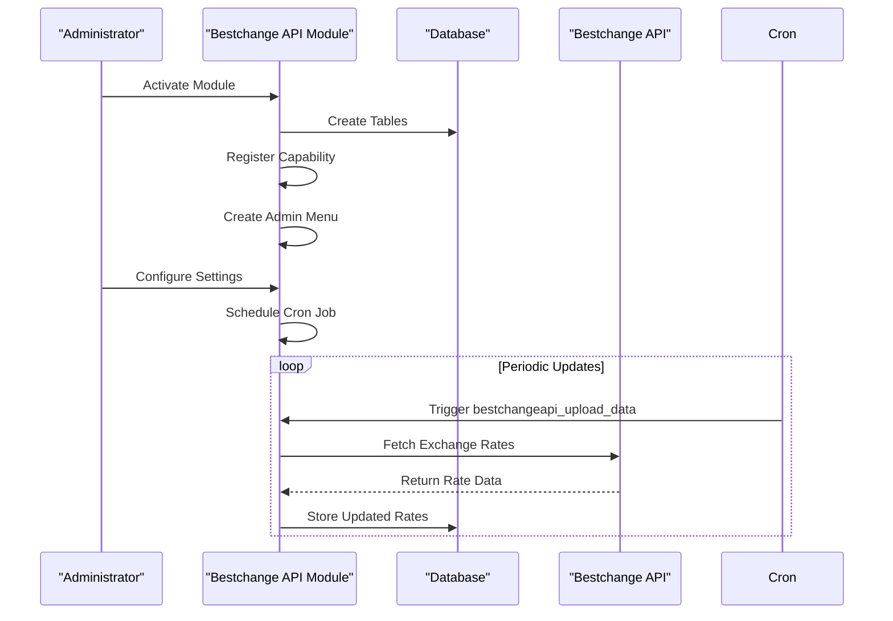
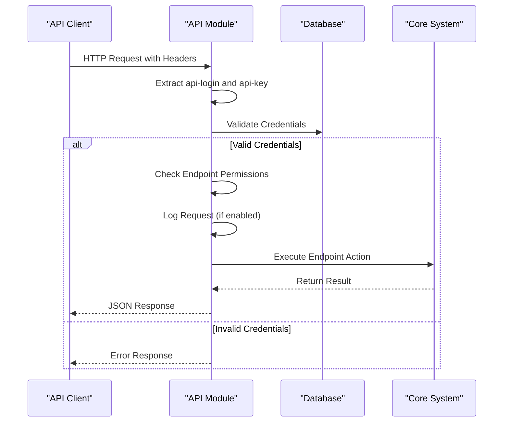
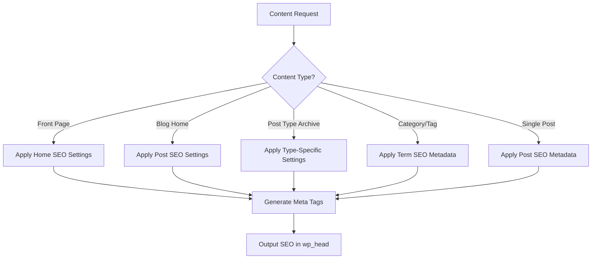
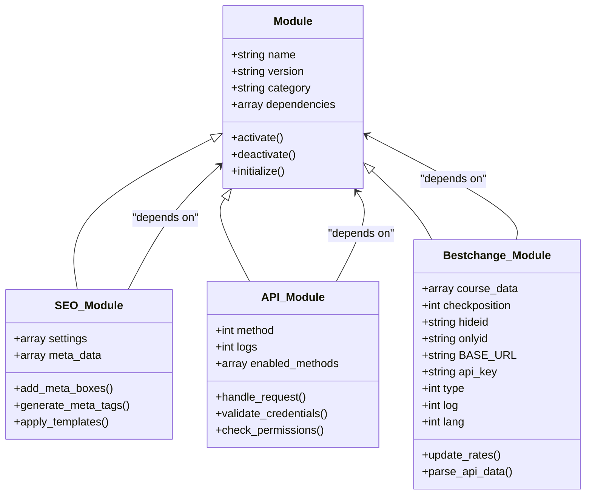
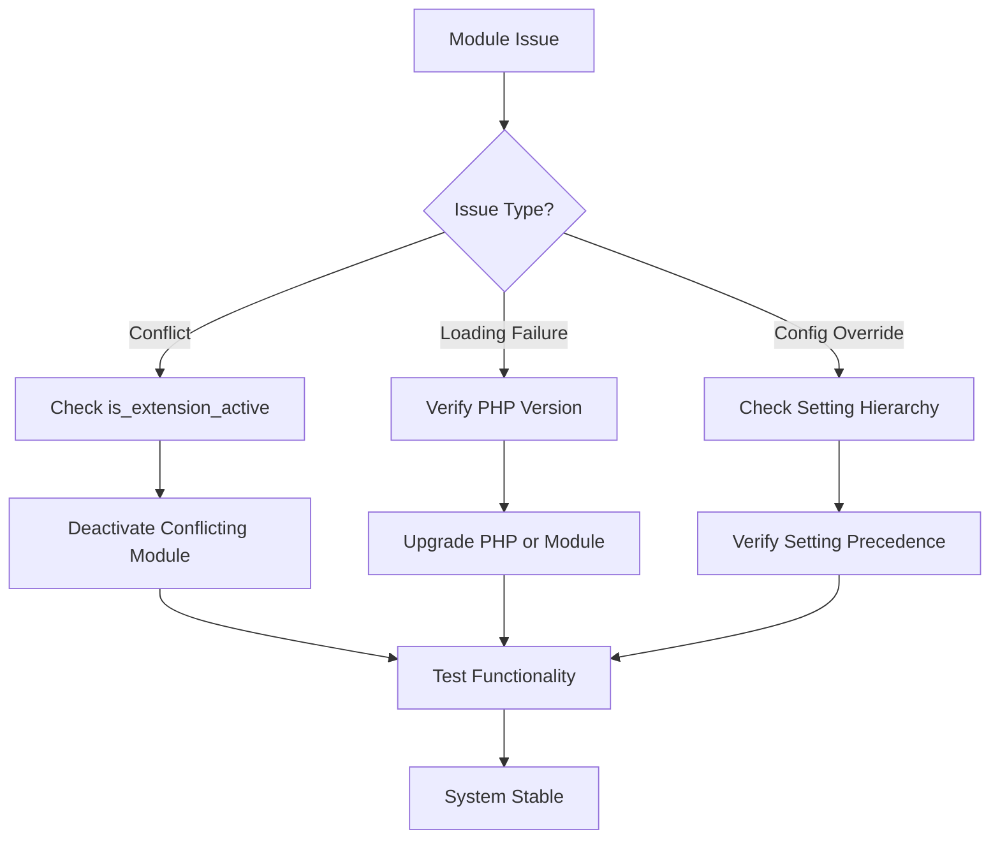
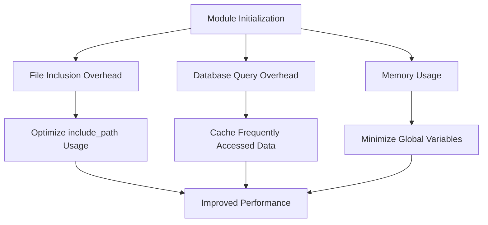

# Module Integration

<cite>
**Referenced Files in This Document**   
- [index.php](file://wp-content/plugins/premiumbox/moduls/bestchangeapi/index.php)
- [api.php](file://wp-content/plugins/premiumbox/moduls/bestchangeapi/api.php)
- [settings.php](file://wp-content/plugins/premiumbox/moduls/bestchangeapi/settings.php)
- [filters.php](file://wp-content/plugins/premiumbox/moduls/bestchangeapi/filters.php)
- [meta.php](file://wp-content/plugins/premiumbox/moduls/seo/meta.php)
- [seo.php](file://wp-content/plugins/premiumbox/plugin/directions/seo.php)
- [settings.php](file://wp-content/plugins/premiumbox/moduls/seo/settings.php)
- [api.php](file://wp-content/plugins/premiumbox/moduls/api/api.php)
- [moduls.php](file://wp-content/plugins/premiumbox/default/moduls.php)
- [functions.php](file://wp-content/plugins/premiumbox/premium/includes/functions.php)
</cite>

## Table of Contents
1. [Introduction](#introduction)
2. [Module Loading Mechanism](#module-loading-mechanism)
3. [Bestchange API Module Integration](#bestchange-api-module-integration)
4. [API Module REST-like Endpoints](#api-module-rest-like-endpoints)
5. [SEO Module Frontend Integration](#seo-module-frontend-integration)
6. [Module Dependencies and Configuration Inheritance](#module-dependencies-and-configuration-inheritance)
7. [Common Module Issues and Troubleshooting](#common-module-issues-and-troubleshooting)
8. [Performance Considerations](#performance-considerations)

## Introduction
This document provides comprehensive documentation on the module integration system within the exchange platform. The platform supports third-party and existing modules through a structured module loading mechanism that discovers and initializes modules from the moduls directory. This system enables extensibility through various integration patterns, with the bestchange module serving as a primary example of API integration. The document details the implementation of module loading, invocation relationships between core components and module entry points, and specific examples of how the api module provides REST-like endpoints and how the seo module enhances frontend output.

## Module Loading Mechanism

The exchange platform implements a sophisticated module loading mechanism that discovers and initializes modules from the moduls directory. The system uses WordPress action hooks and custom functions to manage module lifecycle events. When a module is activated, the system triggers the `all_moduls_active_[module_name]` action, which executes initialization routines specific to each module.

The module loading process begins with the `def_premium_action_pn_moduls` function in the moduls.php file, which handles module activation and deactivation. When a module is activated, it is added to the `pn_extended` option array and the `include_extanded` function loads the module's components. The system then triggers the `all_moduls_active_[module_name]` action, allowing the module to execute its initialization code.

Each module follows a consistent structure with an index.php file that contains metadata and initialization code. The metadata includes the module title, description, version, category, and other identifying information. The initialization code typically includes database table creation, capability registration, menu creation, and inclusion of additional module files.

```mermaid
flowchart TD
A[Module Activation] --> B[Add to pn_extended option]
B --> C[Trigger all_moduls_active_[module_name]]
C --> D[Execute Module Initialization]
D --> E[Include Module Components]
E --> F[Register Capabilities]
F --> G[Create Admin Menu]
G --> H[Initialize Module Functionality]
```

**Diagram sources**
- [moduls.php](file://wp-content/plugins/premiumbox/default/moduls.php#L1-L149)
- [index.php](file://wp-content/plugins/premiumbox/moduls/bestchangeapi/index.php#L1-L158)

**Section sources**
- [moduls.php](file://wp-content/plugins/premiumbox/default/moduls.php#L1-L149)
- [functions.php](file://wp-content/plugins/premiumbox/premium/includes/functions.php#L968-L1005)

## Bestchange API Module Integration

The bestchange API module serves as a primary example of API integration within the exchange platform. This module provides functionality for parsing exchange rates from the Bestchange service and integrating them into the platform's exchange system.

The module initialization process begins in the index.php file, where it creates necessary database tables for storing currency codes, cities, directions, and logs. It also registers a custom capability `pn_bestchangeapi` that controls access to the module's administrative functions. The module creates an admin menu with several submenu pages for settings, logs, and adjustments.



**Diagram sources**
- [index.php](file://wp-content/plugins/premiumbox/moduls/bestchangeapi/index.php#L1-L158)
- [api.php](file://wp-content/plugins/premiumbox/moduls/bestchangeapi/api.php#L1-L32)

The module provides a cron-based update mechanism through the `bestchangeapi_upload_data` function, which is triggered by a scheduled event. This function calls `set_directions_bestchangeapi` to update exchange rates from the Bestchange API. The module also implements filters like `get_calc_data_bestchangeapi` that integrate the parsed rates into the platform's calculation system, ensuring that exchange rates are automatically updated based on external data sources.

**Section sources**
- [index.php](file://wp-content/plugins/premiumbox/moduls/bestchangeapi/index.php#L1-L158)
- [api.php](file://wp-content/plugins/premiumbox/moduls/bestchangeapi/api.php#L1-L32)
- [filters.php](file://wp-content/plugins/premiumbox/moduls/bestchangeapi/filters.php#L363-L399)

## API Module REST-like Endpoints

The API module provides REST-like endpoints through the api.php file, enabling external systems to interact with the exchange platform programmatically. The module implements a request handling system that processes API calls through the `modul_api_page` function, which serves as the entry point for all API requests.

The API system uses HTTP headers for authentication, specifically `api-login` and `api-key` headers to identify and authenticate API clients. The module supports versioning with the current implementation focusing on version 1 (`v1`) of the user API. When an API request is received, the system validates the credentials, logs the request if logging is enabled, and checks whether the requested endpoint is permitted for the authenticated user.



**Diagram sources**
- [api.php](file://wp-content/plugins/premiumbox/moduls/api/api.php#L1-L95)

The module implements a flexible permission system that allows administrators to control which API methods are available to each API user. This is achieved through the `api_actions` field in the database, which stores a JSON-encoded array of permitted endpoints for each API key. The system also supports IP-based restrictions through the `enable_ip` field, allowing administrators to limit API access to specific IP addresses or ranges.

**Section sources**
- [api.php](file://wp-content/plugins/premiumbox/moduls/api/api.php#L1-L95)

## SEO Module Frontend Integration

The SEO module enhances frontend output by providing comprehensive search engine optimization capabilities for various content types within the exchange platform. The module implements a multi-faceted approach to SEO, addressing meta tags, Open Graph protocol, canonical URLs, and structured data.

The module integrates with WordPress content types through multiple mechanisms. For posts and pages, it adds a meta box that allows administrators to specify custom SEO titles, keywords, descriptions, and Open Graph metadata. For taxonomies (categories and tags), it adds custom fields to the term edit screens, enabling SEO optimization at the category level. The module also provides global settings for different content types, allowing administrators to define default SEO templates.



**Diagram sources**
- [meta.php](file://wp-content/plugins/premiumbox/moduls/seo/meta.php#L1-L583)
- [seo.php](file://wp-content/plugins/premiumbox/plugin/directions/seo.php#L140-L430)

The module implements several WordPress hooks to inject SEO metadata into the page output. The `wp_head_seo` function generates meta tags for keywords, description, and Open Graph protocol, while the `wp_title_seo` function modifies the page title. The module also implements structured data through the `seo_seodata_post` function, which adds schema.org markup for articles and organizations.

**Section sources**
- [meta.php](file://wp-content/plugins/premiumbox/moduls/seo/meta.php#L1-L583)
- [seo.php](file://wp-content/plugins/premiumbox/plugin/directions/seo.php#L140-L430)
- [settings.php](file://wp-content/plugins/premiumbox/moduls/seo/settings.php#L1-L226)

## Module Dependencies and Configuration Inheritance

The exchange platform implements a sophisticated system for module dependencies and configuration inheritance. Modules can depend on other modules, and the system manages these dependencies through the `pn_extended` option, which tracks active modules and their relationships.

Configuration inheritance is implemented through a hierarchical system where settings can be defined at multiple levels, with more specific settings overriding more general ones. For example, the SEO module allows settings at the global level, content type level, and individual content level. When generating SEO metadata, the system checks for settings at the most specific level first, falling back to more general settings if no specific setting is found.

The dependency system is managed through functions like `is_extension_active` which checks whether a required module is active before allowing functionality that depends on it. This prevents errors when dependent modules are not available. The system also implements capability-based access control, where modules can register custom capabilities that control access to their features.



**Diagram sources**
- [functions.php](file://wp-content/plugins/premiumbox/premium/includes/functions.php#L968-L1050)
- [moduls.php](file://wp-content/plugins/premiumbox/default/moduls.php#L1-L149)

The configuration system uses a nested array structure stored in the WordPress options table, with each module having its own configuration namespace. This prevents naming conflicts and allows for organized storage of module settings. The system also supports multi-language configurations through functions like `ctv_ml` which retrieve language-specific values.

**Section sources**
- [functions.php](file://wp-content/plugins/premiumbox/premium/includes/functions.php#L968-L1050)
- [moduls.php](file://wp-content/plugins/premiumbox/default/moduls.php#L1-L149)
- [settings.php](file://wp-content/plugins/premiumbox/moduls/bestchangeapi/settings.php#L230-L263)

## Common Module Issues and Troubleshooting

The exchange platform may encounter several common issues related to module integration, including module conflicts, loading failures, and configuration problems. Understanding these issues and their solutions is critical for maintaining a stable system.

Module conflicts can occur when multiple modules attempt to modify the same functionality, such as multiple SEO tools trying to control meta tags. The platform mitigates this through conditional checks like `is_extension_active` which ensure that module functionality is only applied when the module is active. For example, the SEO module only applies its exchange form metadata when the SEO module is active.

Loading failures due to PHP version incompatibilities can occur when modules use PHP features not available in the server's PHP version. The platform does not implement explicit PHP version checking in the module loading system, so administrators must ensure that the server environment meets the requirements of all active modules. Modules should be tested thoroughly in the target environment before deployment.

Configuration override problems can occur when the inheritance system does not behave as expected. This can happen when settings are not properly scoped or when the fallback chain is not correctly implemented. The platform uses a consistent pattern of checking specific settings first and falling back to general settings, but administrators should verify that settings are being applied correctly through testing.



**Diagram sources**
- [seo.php](file://wp-content/plugins/premiumbox/plugin/directions/seo.php#L140-L430)
- [moduls.php](file://wp-content/plugins/premiumbox/default/moduls.php#L1-L149)

Troubleshooting these issues typically involves checking module activation status, verifying configuration settings, and reviewing error logs. The platform provides administrative interfaces for managing modules and viewing logs, which are essential tools for diagnosing and resolving module-related issues.

**Section sources**
- [seo.php](file://wp-content/plugins/premiumbox/plugin/directions/seo.php#L140-L430)
- [moduls.php](file://wp-content/plugins/premiumbox/default/moduls.php#L1-L149)
- [api.php](file://wp-content/plugins/premiumbox/moduls/api/api.php#L1-L95)

## Performance Considerations

Module initialization and operation have significant performance implications for the exchange platform. The system must balance functionality with performance, particularly in areas such as module loading overhead and metadata caching.

Module initialization overhead occurs when modules are loaded and their components are included. The platform uses the `include_path` method to load module components, which can result in multiple file operations during initialization. To minimize this overhead, modules should only include necessary files and avoid expensive operations during initialization.

Caching strategies for module metadata are critical for maintaining performance. The platform does not implement explicit caching for module metadata, relying instead on WordPress's built-in object cache. However, modules can implement their own caching mechanisms for frequently accessed data. For example, the bestchange API module could cache exchange rate data to reduce API calls and database queries.



**Diagram sources**
- [index.php](file://wp-content/plugins/premiumbox/moduls/bestchangeapi/index.php#L1-L158)
- [functions.php](file://wp-content/plugins/premiumbox/premium/includes/functions.php#L1000-L1050)

Performance monitoring should focus on the impact of active modules on page load times, database query counts, and memory usage. Administrators should regularly review which modules are active and disable any that are not essential to reduce overhead. The platform's modular architecture allows for fine-grained control over functionality, enabling administrators to optimize performance by carefully selecting which modules to activate.

**Section sources**
- [index.php](file://wp-content/plugins/premiumbox/moduls/bestchangeapi/index.php#L1-L158)
- [functions.php](file://wp-content/plugins/premiumbox/premium/includes/functions.php#L1000-L1050)
- [meta.php](file://wp-content/plugins/premiumbox/moduls/seo/meta.php#L1-L583)