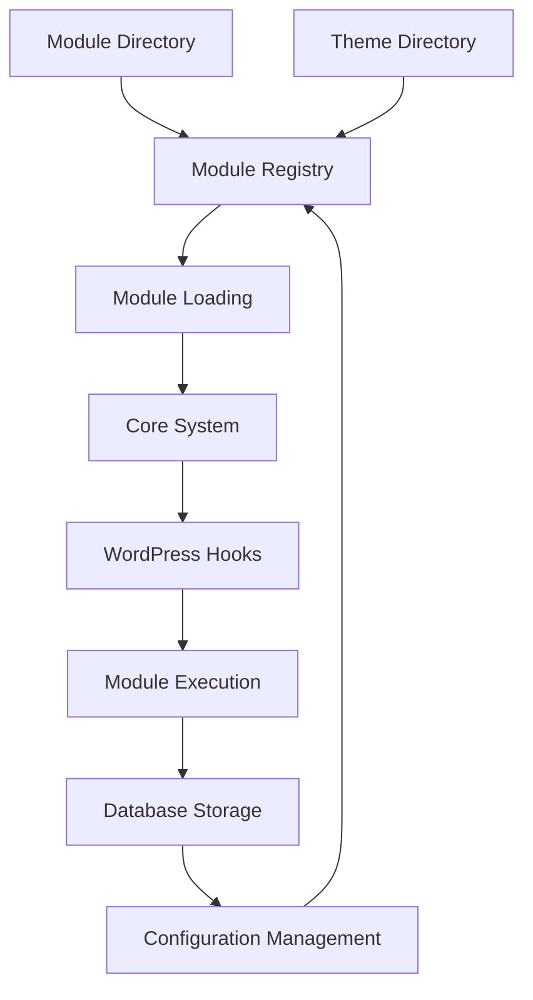
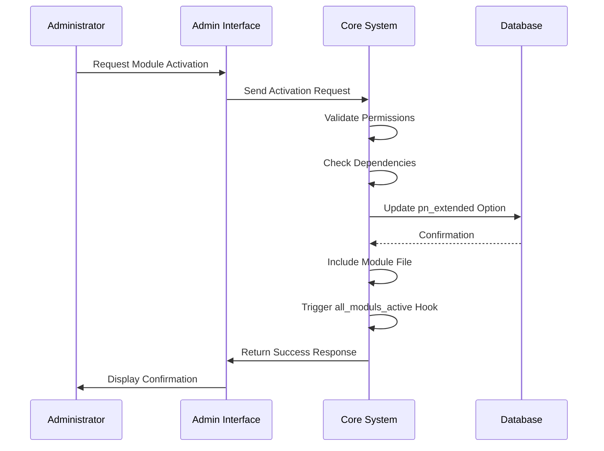
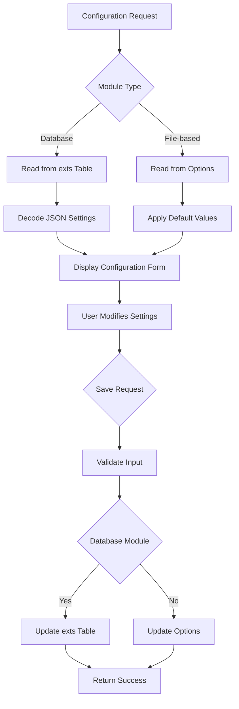
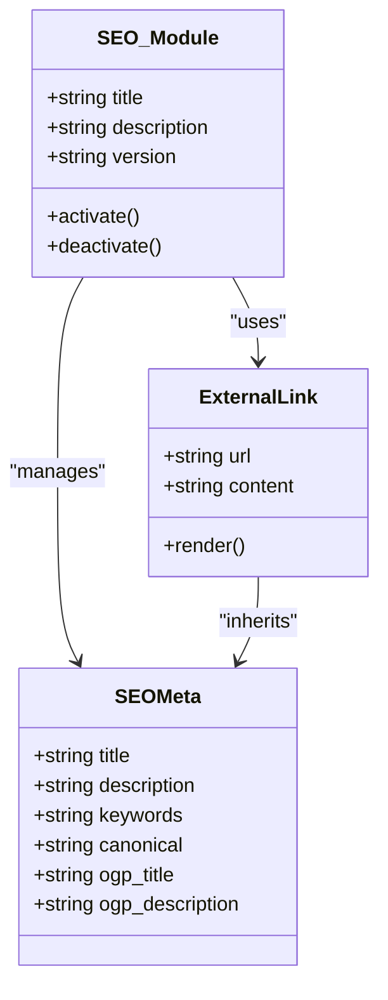

# Module System

<cite>
**Referenced Files in This Document**   
- [functions.php](file://wp-content/plugins/premiumbox/premium/includes/functions.php)
- [moduls.php](file://wp-content/plugins/premiumbox/default/moduls.php)
- [index.php](file://wp-content/plugins/premiumbox/plugin/update/index.php)
- [api.php](file://wp-content/plugins/premiumbox/moduls/api/api.php)
- [extlinks.php](file://wp-content/plugins/premiumbox/moduls/seo/extlinks.php)
- [add.php](file://wp-content/plugins/premiumbox/moduls/wchecks/add.php)
- [settings.php](file://wp-content/plugins/premiumbox/moduls/seo/settings.php)
- [seo.php](file://wp-content/plugins/premiumbox/plugin/directions/seo.php)
- [pp/index.php](file://wp-content/plugins/premiumbox/moduls/pp/index.php)
</cite>

## Table of Contents
1. [Introduction](#introduction)
2. [Architecture Overview](#architecture-overview)
3. [Module Lifecycle](#module-lifecycle)
4. [Implementation Details](#implementation-details)
5. [Public Interfaces for Module Developers](#public-interfaces-for-module-developers)
6. [Configuration Management](#configuration-management)
7. [Dependency Management](#dependency-management)
8. [Practical Examples](#practical-examples)
9. [Common Issues and Solutions](#common-issues-and-solutions)
10. [Performance Considerations](#performance-considerations)
11. [Security Implications](#security-implications)

## Introduction
The module system in the Premium Exchanger platform provides a flexible framework for extending functionality without modifying the core codebase. This extensible architecture allows for independent development, deployment, and management of specialized features through a plugin-like structure. The system supports both plugin-based and theme-based modules, enabling developers to create custom functionality that integrates seamlessly with the exchange platform. Modules can be activated, deactivated, and configured through an administrative interface, with the system maintaining state and configuration data in the WordPress options table.

**Section sources**
- [functions.php](file://wp-content/plugins/premiumbox/premium/includes/functions.php#L672-L711)
- [moduls.php](file://wp-content/plugins/premiumbox/default/moduls.php#L1-L49)

## Architecture Overview
The module system follows a modular design pattern where functionality is encapsulated in independent components that can be dynamically loaded and executed. The architecture consists of three main layers: the module registry, the loading mechanism, and the execution environment. Modules are stored in designated directories (`moduls`, `wchecks`, etc.) either within the plugin directory or the active theme directory, allowing for flexible deployment options.

The system uses WordPress hooks and filters extensively to enable module integration with the core platform. Each module is implemented as a PHP file with a specific structure, including metadata in comments that describes the module's properties. The module registry maintains a list of available modules and their activation status in the WordPress options table (`pn_extended`), while configuration data is stored separately.



**Diagram sources **
- [functions.php](file://wp-content/plugins/premiumbox/premium/includes/functions.php#L804-L863)
- [moduls.php](file://wp-content/plugins/premiumbox/default/moduls.php#L150-L394)

## Module Lifecycle
The module lifecycle consists of discovery, loading, activation, execution, and deactivation phases. During discovery, the system scans designated directories for module files and extracts metadata from comment blocks. The loading process includes dependency resolution and file inclusion, while activation establishes the module's presence in the system through WordPress hooks.

When a module is activated, the system updates the `pn_extended` option to record the activation and triggers specific action hooks (`all_moduls_active_[module]` and `all_moduls_active`). Similarly, deactivation removes the module from the active list and triggers deactivation hooks. The system also maintains a timestamp of module activity in the `pn_extended_last` option, which is used to track recently active modules and clean up stale entries.



**Diagram sources **
- [moduls.php](file://wp-content/plugins/premiumbox/default/moduls.php#L19-L148)
- [functions.php](file://wp-content/plugins/premiumbox/premium/includes/functions.php#L744-L787)

## Implementation Details
The module loading mechanism is implemented through several key functions in the `functions.php` file. The `load_extended()` function is responsible for loading all active modules during system initialization. It retrieves the list of active modules from the `pn_extended` option and includes their main PHP files using `include_once()`. The function also performs cleanup of inactive modules and updates the activity timestamps in `pn_extended_last`.

Module discovery is handled by the `pn_list_extended()` function, which scans both the plugin's module directory and the active theme's module directory for subdirectories containing an `index.php` file. For each discovered module, it extracts metadata from the file comments using the `accept_extended_data()` function, which parses comment blocks for key-value pairs like title, version, description, category, and dependencies.

The system supports two types of module storage: database-backed modules stored in the `exts` table, and file-based modules. Database-backed modules have additional configuration options stored in the `ext_options` field as JSON, while file-based modules rely solely on their PHP implementation.

**Section sources**
- [functions.php](file://wp-content/plugins/premiumbox/premium/includes/functions.php#L695-L748)
- [functions.php](file://wp-content/plugins/premiumbox/premium/includes/functions.php#L804-L863)

## Public Interfaces for Module Developers
Module developers interact with the system through several public interfaces and hooks. The primary entry point is the module's `index.php` file, which should contain metadata in a comment block at the beginning of the file. This metadata includes required fields such as title, version, and category, as well as optional fields like description, dependencies, and old names for backward compatibility.

Modules can register their functionality using standard WordPress hooks (`add_action`, `add_filter`) or the platform's custom hook system. When a module is activated, it can hook into the `all_moduls_active_[module]` action to perform initialization tasks, such as creating database tables or registering custom post types. Similarly, the `all_moduls_deactive_[module]` action can be used for cleanup operations.

The system provides several utility functions for module developers:
- `get_extension_name()`: Extracts the module name from a file path
- `get_extension_file()`: Returns the directory path of a module
- `is_extension_active()`: Checks if a module is currently active
- `has_extanded_script()`: Verifies if a module file exists
- `include_extanded()`: Safely includes a module file

**Section sources**
- [functions.php](file://wp-content/plugins/premiumbox/premium/includes/functions.php#L664-L673)
- [functions.php](file://wp-content/plugins/premiumbox/premium/includes/functions.php#L868-L904)

## Configuration Management
The module system provides robust configuration management through multiple mechanisms. For database-backed modules (like those in the `wchecks` directory), configuration is stored in the `exts` table with the `ext_options` field containing JSON-encoded settings. These settings can be managed through administrative interfaces that generate forms based on configuration definitions.

File-based modules can use the platform's option system through the `$premiumbox->get_option()` method to store and retrieve configuration values. The system supports multi-language configuration through the `ctv_ml()` function, which retrieves language-specific values from translation arrays.

Configuration interfaces are typically implemented using the `PremiumForm` class, which provides a consistent way to generate form elements, validate input, and save settings. The form system supports various field types including text inputs, selects, checkboxes, and hidden fields, with options for multi-language support and conditional display.



**Diagram sources **
- [add.php](file://wp-content/plugins/premiumbox/moduls/wchecks/add.php#L54-L176)
- [settings.php](file://wp-content/plugins/premiumbox/moduls/seo/settings.php#L53-L97)

## Dependency Management
The module system implements a simple but effective dependency management system. Module dependencies are declared in the metadata comment block using the `dependent` field, which contains a comma-separated list of required module names. When a module is activated, the system checks its dependencies and ensures that all required modules are also active.

The dependency resolution occurs during the module activation process in the `def_premium_action_pn_moduls` function. If a module has dependencies that are not satisfied, the activation process will fail and return an error. This prevents modules from being activated in an inconsistent state where required functionality is missing.

For more complex dependency scenarios, modules can use conditional logic in their initialization code to check for the presence of other modules using the `is_extension_active()` function. This allows for optional dependencies or graceful degradation when dependent modules are not available.

**Section sources**
- [functions.php](file://wp-content/plugins/premiumbox/premium/includes/functions.php#L799-L800)
- [moduls.php](file://wp-content/plugins/premiumbox/default/moduls.php#L20-L88)

## Practical Examples
### BestChange Integration Module
The BestChange integration is implemented as a module that provides exchange rate data from the BestChange service. This module would be structured as a directory in the `moduls` folder containing an `index.php` file with the following metadata:

```
/*
title: BestChange Integration
description: Integrates exchange rates from BestChange service
version: 1.0
category: Exchange
cat: exchange
*/
```

The module would hook into the exchange rate update process using actions like `pn_cron_init` and implement functions to fetch and parse BestChange data. It would store configuration options such as API keys and update intervals in the database or as platform options.

### SEO Tools Module
The SEO module (located in `moduls/seo`) demonstrates several key patterns in module development. It provides functionality for managing meta tags, canonical URLs, and OpenGraph data. The module uses shortcodes like `[extlink]` to create trackable external links and integrates with the platform's form system to provide configuration interfaces.

The SEO module also demonstrates integration with other system components through filters like `exchange_step_meta` and `page_seo_data`, which allow it to modify SEO metadata for specific pages and exchange directions. It uses the `init` action to register its shortcode and set up URL routing for the external link redirector.



**Diagram sources **
- [extlinks.php](file://wp-content/plugins/premiumbox/moduls/seo/extlinks.php#L1-L86)
- [seo.php](file://wp-content/plugins/premiumbox/plugin/directions/seo.php#L140-L430)

## Common Issues and Solutions
### Module Conflicts
Module conflicts typically occur when multiple modules attempt to modify the same functionality or use conflicting hook priorities. The primary solution is to use unique hook names and carefully manage execution order through priority settings. Developers should also check for the presence of competing modules using `is_extension_active()` and implement graceful fallbacks.

### Loading Failures
Loading failures can result from missing files, syntax errors, or dependency issues. The system mitigates these through the `has_extanded_script()` function, which verifies file existence before inclusion, and by wrapping module loading in error handling. For debugging, developers should ensure their modules are in the correct directory structure and that all dependencies are satisfied.

### Configuration Errors
Configuration errors often stem from incorrect data types or missing required fields. The form validation system in `PremiumForm` helps prevent these by validating input before saving. Developers should provide clear error messages and default values for all configuration options. The use of JSON encoding for complex settings also helps prevent data corruption.

**Section sources**
- [functions.php](file://wp-content/plugins/premiumbox/premium/includes/functions.php#L886-L904)
- [add.php](file://wp-content/plugins/premiumbox/moduls/wchecks/add.php#L180-L242)

## Performance Considerations
The module initialization process has performance implications that should be considered in system design. Each active module requires file system access to locate and include its main file, which can impact page load times, especially with a large number of modules. The system mitigates this through caching of module metadata in the `pn_extended` option and by only loading modules once per request.

Database queries for module configuration should be minimized by retrieving all necessary data in a single query when possible. The use of transients or object caching can further improve performance for frequently accessed module data. Modules that perform external API calls should implement their own caching mechanisms to avoid repeated requests.

The system's three-day cleanup cycle for the `pn_extended_last` option helps maintain performance by removing stale entries, but administrators should monitor the size of these options as they grow with the number of modules.

**Section sources**
- [functions.php](file://wp-content/plugins/premiumbox/premium/includes/functions.php#L695-L748)
- [functions.php](file://wp-content/plugins/premiumbox/premium/includes/functions.php#L744-L787)

## Security Implications
Third-party module execution presents several security considerations. The system addresses these through multiple layers of protection:

1. **File inclusion security**: The `include_extanded()` function validates module names using `is_extension_name()` to prevent directory traversal attacks.
2. **Input sanitization**: All user input is sanitized through functions like `pn_strip_input()` and `pn_strip_text()` which remove potentially malicious content.
3. **Capability checks**: Module administration is protected by capability checks using `pn_only_caps()` which verifies user permissions before allowing module management operations.
4. **Nonce verification**: Form submissions include nonce verification to prevent cross-site request forgery attacks.
5. **Database security**: All database queries use prepared statements or properly escaped values to prevent SQL injection.

Module developers should follow secure coding practices, including validating and sanitizing all inputs, escaping outputs, and avoiding direct execution of user-provided data. The use of security passwords for sensitive operations (as seen in the wchecks module) provides an additional layer of protection for critical functionality.

**Section sources**
- [functions.php](file://wp-content/plugins/premiumbox/premium/includes/functions.php#L241-L283)
- [add.php](file://wp-content/plugins/premiumbox/moduls/wchecks/add.php#L130-L145)