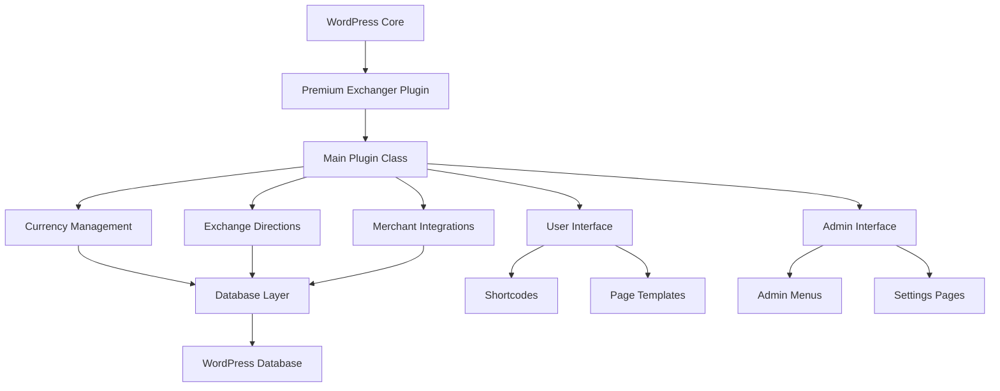
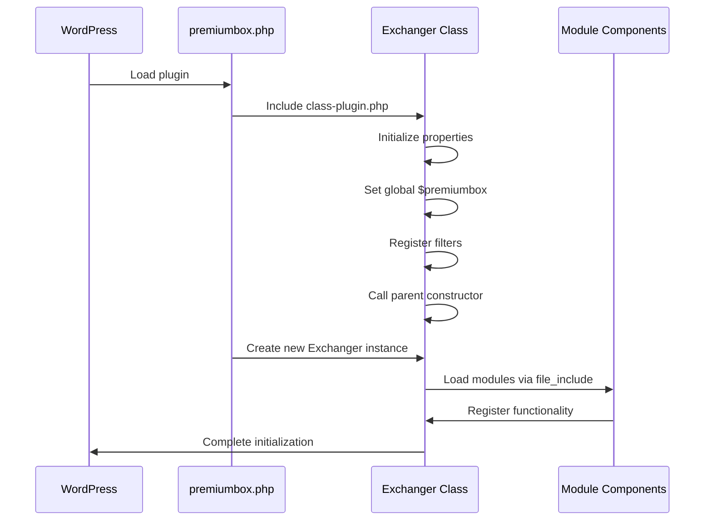
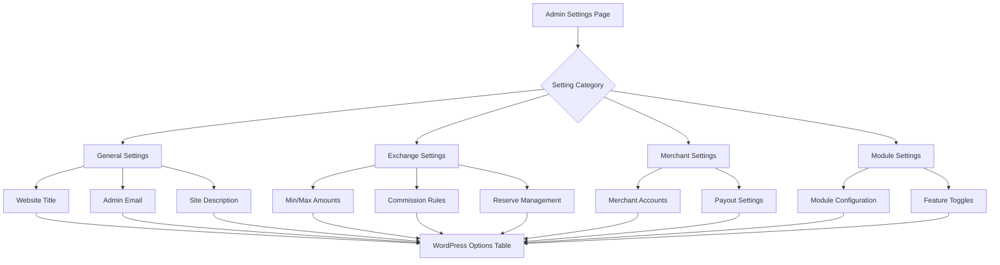
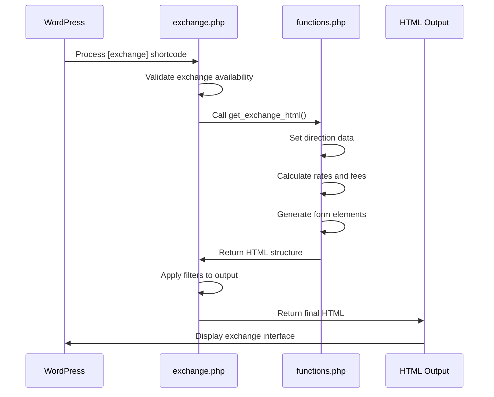
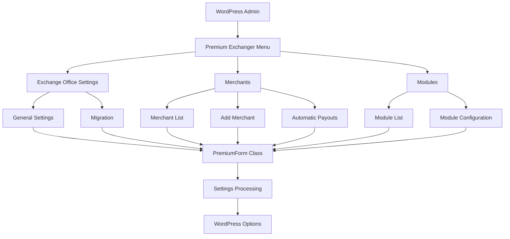
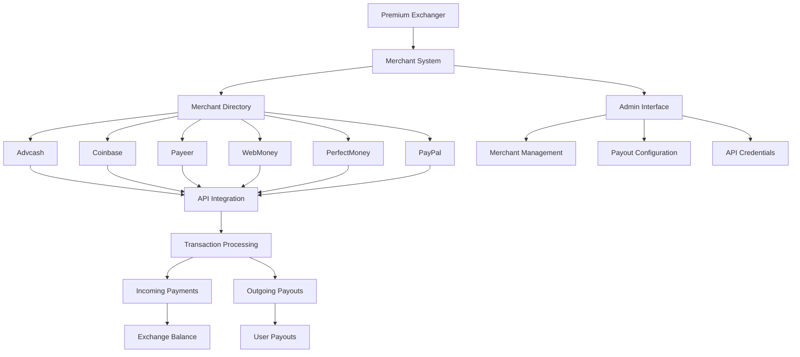
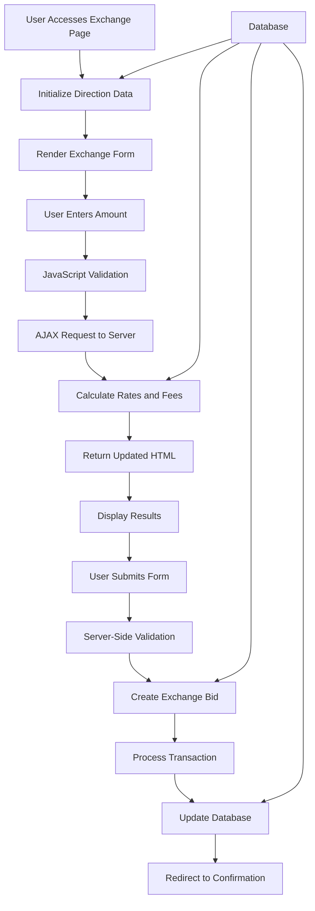

# Project Overview

<cite>
**Referenced Files in This Document**   
- [premiumbox.php](file://wp-content/plugins/premiumbox/premiumbox.php)
- [class-plugin.php](file://wp-content/plugins/premiumbox/includes/class-plugin.php)
- [exchange.php](file://wp-content/plugins/premiumbox/shortcode/exchange.php)
- [functions.php](file://wp-content/plugins/premiumbox/plugin/directions/functions.php)
- [index.php](file://wp-content/plugins/premiumbox/plugin/merchants/index.php)
- [settings.php](file://wp-content/plugins/premiumbox/default/settings.php)
- [pn-pluginpage.php](file://wp-content/themes/exchanger/pn-pluginpage.php)
</cite>

## Table of Contents
1. [Introduction](#introduction)
2. [Architecture Overview](#architecture-overview)
3. [Core Components](#core-components)
4. [Plugin Initialization and Main Class](#plugin-initialization-and-main-class)
5. [Configuration and Settings](#configuration-and-settings)
6. [Shortcode Implementation](#shortcode-implementation)
7. [Admin Interface Integration](#admin-interface-integration)
8. [Theme Integration](#theme-integration)
9. [Merchant Integration](#merchant-integration)
10. [Data Flow and Processing](#data-flow-and-processing)
11. [Conclusion](#conclusion)

## Introduction

The Premium Exchanger platform is a WordPress plugin designed to transform standard WordPress installations into professional cryptocurrency and e-currency exchange services. The plugin provides a comprehensive solution for creating exchange functionality within WordPress, leveraging the platform's extensibility and user management capabilities. As a modular WordPress plugin, Premium Exchanger implements MVC-like patterns through a structured organization of components that separate concerns between data management, business logic, and presentation layers.

The plugin integrates deeply with WordPress core functionality through hooks, filters, and shortcode systems, allowing administrators to embed exchange interfaces anywhere within their WordPress sites. It provides both front-end user interfaces for exchange operations and back-end administrative controls for managing exchange rates, currencies, and merchant integrations. The architecture is designed to be extensible, supporting various payment processors and exchange methods through a merchant system that can be expanded with additional modules.

**Section sources**
- [premiumbox.php](file://wp-content/plugins/premiumbox/premiumbox.php#L1-L51)
- [class-plugin.php](file://wp-content/plugins/premiumbox/includes/class-plugin.php#L1-L181)

## Architecture Overview

The Premium Exchanger platform follows a modular architecture with MVC-like patterns, structured around WordPress plugin development best practices. The system is organized into distinct components that handle specific aspects of the exchange functionality, including currency management, exchange direction configuration, user interface rendering, and merchant integrations. The architecture leverages WordPress hooks and filters extensively to integrate with the core system while maintaining separation between the plugin's internal components.

The plugin's architecture can be visualized as a layered system with the main plugin class at its core, surrounded by specialized modules that handle specific functionality. These modules communicate through a well-defined interface provided by the main class, which acts as a controller coordinating interactions between components. The presentation layer is implemented through shortcodes and custom page templates, allowing the exchange interface to be embedded in WordPress pages and posts.



**Diagram sources **
- [premiumbox.php](file://wp-content/plugins/premiumbox/premiumbox.php#L1-L51)
- [class-plugin.php](file://wp-content/plugins/premiumbox/includes/class-plugin.php#L1-L181)

**Section sources**
- [premiumbox.php](file://wp-content/plugins/premiumbox/premiumbox.php#L1-L51)
- [class-plugin.php](file://wp-content/plugins/premiumbox/includes/class-plugin.php#L1-L181)

## Core Components

The Premium Exchanger platform consists of several core components that work together to provide a complete exchange service. The main plugin class serves as the central controller, initializing the system and coordinating between various modules. Currency management handles the definition and properties of different cryptocurrencies and e-currencies that can be exchanged. Exchange directions define the specific pairs of currencies that can be traded, including their rates, reserves, and processing rules.

Merchant integrations provide the connection to external payment processors, enabling the actual transfer of funds between different currency systems. The user interface components render the exchange forms and calculators that users interact with, while the admin interface provides tools for administrators to configure and manage the exchange service. Each component is implemented as a separate module within the plugin directory structure, allowing for independent development and maintenance.

The plugin also includes a shortcode system that enables administrators to embed exchange interfaces in any WordPress page or post. This system processes shortcode attributes and generates the appropriate HTML output based on the current exchange configuration. The architecture supports extensibility through additional modules that can be added to enhance functionality, such as analytics, user referral programs, or additional security features.

**Section sources**
- [premiumbox.php](file://wp-content/plugins/premiumbox/premiumbox.php#L1-L51)
- [class-plugin.php](file://wp-content/plugins/premiumbox/includes/class-plugin.php#L1-L181)
- [exchange.php](file://wp-content/plugins/premiumbox/shortcode/exchange.php#L1-L469)

## Plugin Initialization and Main Class

The Premium Exchanger plugin is initialized through the main plugin file (premiumbox.php), which loads the core class and instantiates the main plugin object. The initialization process begins with including the class-plugin.php file, which defines the Exchanger class that extends the base Premium class. When the plugin is loaded, it creates a new instance of the Exchanger class, passing the plugin file path as a parameter.

The Exchanger class constructor sets up essential plugin properties such as version, prefix, name, and theme information. It also initializes the global $premiumbox variable that provides access to the plugin instance throughout the system. The constructor calls the parent constructor and registers WordPress filters for query variables and rewrite rules, enabling custom URL structures for exchange operations.

After instantiation, the main plugin object loads various modules and components through the file_include method, which sequentially loads configuration files, admin interfaces, and functional modules. This modular loading approach allows the plugin to maintain a clean separation of concerns while ensuring that all components are properly initialized in the correct order. The main class serves as the central hub for the plugin, providing methods that other components can use to interact with the system.



**Diagram sources **
- [premiumbox.php](file://wp-content/plugins/premiumbox/premiumbox.php#L1-L51)
- [class-plugin.php](file://wp-content/plugins/premiumbox/includes/class-plugin.php#L1-L181)

**Section sources**
- [premiumbox.php](file://wp-content/plugins/premiumbox/premiumbox.php#L1-L51)
- [class-plugin.php](file://wp-content/plugins/premiumbox/includes/class-plugin.php#L1-L181)

## Configuration and Settings

The Premium Exchanger plugin provides a comprehensive configuration system that allows administrators to customize various aspects of the exchange service. Configuration options are organized into logical groups and exposed through WordPress admin settings pages. The plugin extends the WordPress settings API to create custom settings pages that integrate seamlessly with the WordPress admin interface.

Configuration options include general settings such as website title and administrator email, exchange-specific settings like minimum and maximum transaction amounts, commission structures, and reserve management. The settings system uses a filter-based approach where configuration options are defined in arrays and processed through WordPress filters, allowing for easy extension and modification by other components or child plugins.

The plugin creates dedicated admin menu items for different configuration areas, including general settings, exchange configuration, merchant management, and module settings. Each settings page is implemented as a separate component that registers its options and rendering functions with the main plugin system. The configuration data is stored in the WordPress options table, with options prefixed to avoid conflicts with other plugins.



**Diagram sources **
- [settings.php](file://wp-content/plugins/premiumbox/default/settings.php#L1-L141)
- [class-plugin.php](file://wp-content/plugins/premiumbox/includes/class-plugin.php#L1-L181)

**Section sources**
- [settings.php](file://wp-content/plugins/premiumbox/default/settings.php#L1-L141)
- [config.php](file://wp-content/plugins/premiumbox/plugin/config.php#L209-L242)

## Shortcode Implementation

The Premium Exchanger plugin implements a shortcode system that allows administrators to embed exchange interfaces anywhere within their WordPress content. The primary shortcode [exchange] renders the main exchange form, which includes currency selection dropdowns, amount input fields, and transaction processing controls. The shortcode system is implemented in the exchange.php file within the shortcode directory, where it registers the shortcode handler with WordPress.

The shortcode implementation follows a structured approach where the exchange_page_shortcode function processes the shortcode attributes and generates the appropriate HTML output. This function first checks if the exchange functionality is available and then renders the exchange interface using the get_exchange_html function. The output includes form elements, currency information, exchange rates, and interactive components that allow users to configure their transactions.

The shortcode system supports parameters that can customize the behavior of the exchange interface, such as pre-selecting specific exchange directions or setting default amounts. The implementation uses WordPress hooks to inject JavaScript functionality that enhances the user experience, including dynamic rate calculations and form validation. The shortcode output is designed to be responsive and accessible, ensuring compatibility with various themes and device types.



**Diagram sources **
- [exchange.php](file://wp-content/plugins/premiumbox/shortcode/exchange.php#L1-L469)
- [functions.php](file://wp-content/plugins/premiumbox/plugin/directions/functions.php#L1-L800)

**Section sources**
- [exchange.php](file://wp-content/plugins/premiumbox/shortcode/exchange.php#L1-L469)
- [functions.php](file://wp-content/plugins/premiumbox/plugin/directions/functions.php#L1-L800)

## Admin Interface Integration

The Premium Exchanger plugin integrates with the WordPress admin interface by adding custom menu items and settings pages that allow administrators to manage the exchange service. The admin menu integration is implemented through the admin_menu method in the Exchanger class, which uses WordPress functions like add_menu_page and add_submenu_page to create dedicated administration areas.

The plugin creates several top-level menu items in the WordPress admin sidebar, including "Exchange office settings," "Merchants," and "Modules." Each of these menu items has associated submenu pages that provide access to specific configuration and management functions. For example, the exchange settings menu includes pages for general configuration, migration tools, and currency management.

The admin interface uses a consistent design pattern where each settings page is rendered by the admin_temp method, which serves as a template for displaying configuration forms. Form elements are generated using a custom PremiumForm class that handles input validation, sanitization, and output. The settings pages use WordPress nonces for security and provide appropriate capability checks to ensure that only authorized users can access sensitive configuration options.



**Diagram sources **
- [class-plugin.php](file://wp-content/plugins/premiumbox/includes/class-plugin.php#L64-L83)
- [index.php](file://wp-content/plugins/premiumbox/plugin/merchants/index.php#L12-L40)

**Section sources**
- [class-plugin.php](file://wp-content/plugins/premiumbox/includes/class-plugin.php#L64-L83)
- [index.php](file://wp-content/plugins/premiumbox/plugin/merchants/index.php#L12-L40)

## Theme Integration

The Premium Exchanger plugin integrates with WordPress themes through custom page templates and action hooks that allow the exchange interface to be displayed consistently across different themes. The plugin provides a dedicated page template (pn-pluginpage.php) that is used for exchange-related pages such as the main exchange interface, user account pages, and transaction history.

The theme integration is implemented by setting specific post templates for technical pages like "exchange," "account," and "security" through the list_tech_pages method in the Exchanger class. When these pages are displayed, WordPress automatically uses the specified template file, which includes the necessary hooks and structure to render the exchange interface properly.

The plugin also uses WordPress action hooks like premium_after_content to inject additional functionality into theme templates without modifying the theme files directly. This approach ensures compatibility with a wide range of themes while maintaining control over the presentation of exchange components. The CSS styling is handled through the plugin's own stylesheet (style.css), which provides consistent visual design across different themes.

```mermaid
graph TD
A[WordPress Theme] --> B[Premium Exchanger Template]
B --> C[pn-pluginpage.php]
C --> D[get_header()]
C --> E[the_content()]
C --> F[premium_after_content]
C --> G[get_footer()]
D --> H[Theme Header]
E --> I[Exchange Shortcode]
F --> J[Plugin JavaScript]
G --> K[Theme Footer]
I --> L[get_exchange_html]
L --> M[Dynamic Form]
M --> N[Currency Selection]
M --> O[Amount Input]
M --> P[Submit Button]
```

**Diagram sources **
- [pn-pluginpage.php](file://wp-content/themes/exchanger/pn-pluginpage.php#L1-L28)
- [class-plugin.php](file://wp-content/plugins/premiumbox/includes/class-plugin.php#L85-L149)

**Section sources**
- [pn-pluginpage.php](file://wp-content/themes/exchanger/pn-pluginpage.php#L1-L28)
- [class-plugin.php](file://wp-content/plugins/premiumbox/includes/class-plugin.php#L85-L149)

## Merchant Integration

The Premium Exchanger plugin includes a comprehensive merchant integration system that allows it to connect with various payment processors and external services. The merchant system is organized in the merchants directory, which contains subdirectories for each supported merchant service, such as AdvCash, Coinbase, Payeer, and WebMoney.

Each merchant integration is implemented as a separate module that handles the specific API requirements and transaction processing logic for that service. The merchant system provides a consistent interface that abstracts the differences between various payment processors, allowing the core exchange functionality to work with any supported merchant without requiring changes to the main codebase.

The merchant integration includes both incoming payment processing and outgoing payout functionality, with support for automatic payouts to reduce manual intervention. Administrators can configure merchant accounts, API credentials, and processing rules through the admin interface. The system also includes timeout management for merchant operations and automatic payout processes to ensure reliable transaction processing.



**Diagram sources **
- [index.php](file://wp-content/plugins/premiumbox/plugin/merchants/index.php#L1-L40)
- [class-plugin.php](file://wp-content/plugins/premiumbox/includes/class-plugin.php#L77-L79)

**Section sources**
- [index.php](file://wp-content/plugins/premiumbox/plugin/merchants/index.php#L1-L40)
- [class-plugin.php](file://wp-content/plugins/premiumbox/includes/class-plugin.php#L77-L79)

## Data Flow and Processing

The Premium Exchanger plugin implements a structured data flow for processing exchange transactions, beginning with user input and ending with completed transactions. When a user accesses an exchange page, the system initializes by determining the exchange direction based on URL parameters or user selection. The direction_initialization function sets up the $direction_data global variable with information about the selected currency pair, exchange rates, and processing rules.

When a user submits an exchange request, the system processes the transaction through a series of validation and calculation steps. The get_calc_data function computes the final amounts, commissions, and fees based on the user's input, exchange rates, and configured rules. This processing takes into account user-specific factors such as discounts, minimum and maximum limits, and reserve availability.

The data flow includes client-side JavaScript that provides real-time feedback on exchange rates and amounts as users adjust their inputs. This interactive functionality is implemented through AJAX calls to the premium_siteaction_exchange_stepselect action, which returns updated HTML and metadata for the exchange interface. The system also handles form submission and transaction creation through dedicated action handlers that validate input and create exchange bid records in the database.



**Diagram sources **
- [exchange.php](file://wp-content/plugins/premiumbox/shortcode/exchange.php#L14-L269)
- [functions.php](file://wp-content/plugins/premiumbox/plugin/directions/functions.php#L119-L251)

**Section sources**
- [exchange.php](file://wp-content/plugins/premiumbox/shortcode/exchange.php#L14-L269)
- [functions.php](file://wp-content/plugins/premiumbox/plugin/directions/functions.php#L119-L251)

## Conclusion

The Premium Exchanger platform is a sophisticated WordPress plugin that transforms standard WordPress installations into fully functional cryptocurrency and e-currency exchange services. By leveraging WordPress hooks, shortcodes, and the plugin architecture, it provides a comprehensive solution for creating professional exchange platforms with minimal technical overhead. The modular design with MVC-like patterns ensures maintainability and extensibility, allowing administrators to customize and extend functionality as needed.

The plugin's architecture demonstrates effective integration with WordPress core systems while maintaining a clean separation of concerns between components. The use of shortcodes enables flexible placement of exchange interfaces throughout the site, while the admin interface provides comprehensive tools for managing all aspects of the exchange service. The merchant integration system supports multiple payment processors, making the platform suitable for a wide range of use cases and business models.

Overall, the Premium Exchanger platform represents a robust implementation of a specialized service within the WordPress ecosystem, demonstrating how complex functionality can be delivered through the WordPress plugin framework while maintaining compatibility with themes and other plugins.