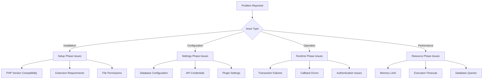

# Troubleshooting Guide

<cite>
**Referenced Files in This Document**
- [premiumbox.php](file://wp-content/plugins/premiumbox/premiumbox.php)
- [hashed_functions.php](file://wp-content/plugins/premiumbox/includes/hashed_functions.php)
- [hashed_bd_functions.php](file://wp-content/plugins/premiumbox/includes/hashed_bd_functions.php)
- [functions.php](file://wp-content/plugins/premiumbox/includes/functions.php)
- [cron.php](file://wp-content/plugins/premiumbox/default/cron.php)
- [init_cron.php](file://wp-content/plugins/premiumbox/premium/includes/init_cron.php)
- [logs_settings/index.php](file://wp-content/plugins/premiumbox/default/logs_settings/index.php)
- [class-wp-fatal-error-handler.php](file://wp-includes/class-wp-fatal-error-handler.php)
- [class-wpdb.php](file://wp-includes/class-wpdb.php)
- [install.php](file://wp-admin/install.php)
- [setup-config.php](file://wp-admin/setup-config.php)
- [network.php](file://wp-admin/includes/network.php)
- [site-health.php](file://wp-admin/site-health.php)
- [class-wp-site-health.php](file://wp-admin/includes/class-wp-site-health.php)
- [error-protection.php](file://wp-includes/error-protection.php)
- [functions.php](file://wp-includes/functions.php)
- [user.php](file://wp-includes/user.php)
- [class-wp-session-tokens.php](file://wp-includes/class-wp-session-tokens.php)
- [enableip.php](file://wp-content/plugins/premiumbox/default/users/enableip.php)
- [index.php](file://wp-content/plugins/premiumbox/merchants/paycrown/index.php)
- [index.php](file://wp-content/plugins/premiumbox/merchants/bankoro/index.php)
- [index.php](file://wp-content/plugins/premiumbox/merchants/pandapay/index.php)
- [index.php](file://wp-content/plugins/premiumbox/merchants/trustixpay/index.php)
- [index.php](file://wp-content/plugins/premiumbox/merchants/paypal/index.php)
- [index.php](file://wp-content/plugins/premiumbox/merchants/optimoney/index.php)
- [index.php](file://wp-content/plugins/premiumbox/merchants/perfectmoney/index.php)
- [index.php](file://wp-content/plugins/premiumbox/merchants/nicepay/index.php)
- [index.php](file://wp-content/plugins/premiumbox/paymerchants/webmoney/index.php)
- [index.php](file://wp-content/plugins/premiumbox/paymerchants/exnode/index.php)
- [index.php](file://wp-content/plugins/premiumbox/merchants/evo/index.php)
- [index.php](file://wp-content/plugins/premiumbox/paymerchants/payscrow/index.php)
</cite>

## Table of Contents
1. [Introduction](#introduction)
2. [Systematic Problem Identification](#systematic-problem-identification)
3. [Common Issue Categories](#common-issue-categories)
4. [Installation Issues](#installation-issues)
5. [Configuration Problems](#configuration-problems)
6. [Transaction Failures](#transaction-failures)
7. [Performance Bottlenecks](#performance-bottlenecks)
8. [Authentication and Security Issues](#authentication-and-security-issues)
9. [Diagnostic Tools and Techniques](#diagnostic-tools-and-techniques)
10. [Environmental Factors](#environmental-factors)
11. [Escalation Procedures](#escalation-procedures)
12. [Best Practices](#best-practices)

## Introduction

The Premium Exchanger platform is a sophisticated e-currency exchange system built on WordPress. This troubleshooting guide provides comprehensive solutions for common issues encountered during installation, configuration, operation, and maintenance. The platform consists of multiple interconnected components including payment processors, exchange engines, merchant integrations, and administrative interfaces.

Understanding the platform's architecture is crucial for effective troubleshooting. The system operates through several key layers:
- **WordPress Core**: Provides the foundation CMS functionality
- **Premium Exchanger Plugin**: Main business logic and exchange functionality
- **Merchant Integrations**: Payment processor connections
- **Administrative Interfaces**: Control panels for management
- **Database Layer**: Persistent storage and data management

## Systematic Problem Identification

### Problem Classification Framework

Effective troubleshooting begins with systematic problem classification. Issues can be categorized into several domains:



### Diagnostic Approach

1. **Information Gathering**: Collect system details, error messages, and reproduction steps
2. **Environment Analysis**: Verify server configuration and dependencies
3. **Component Isolation**: Test individual system components
4. **Pattern Recognition**: Identify recurring issues and common causes
5. **Solution Implementation**: Apply targeted fixes based on analysis

## Common Issue Categories

### Installation Issues

Installation problems typically occur during initial setup or plugin activation. These issues often stem from server configuration mismatches or missing dependencies.

### Configuration Problems

Configuration errors arise from incorrect settings in WordPress, plugin options, or external service integrations. These issues can prevent the system from functioning properly.

### Transaction Failures

Transaction processing issues involve payment processing, exchange operations, and callback handling. These problems can disrupt user experiences and financial operations.

### Performance Bottlenecks

Performance issues manifest as slow response times, high resource usage, or system timeouts. These problems can degrade user experience and system reliability.

## Installation Issues

### PHP Version Compatibility

**Symptoms:**
- Plugin activation failures
- Fatal errors during initialization
- Missing function warnings

**Root Cause Analysis:**
The platform requires specific PHP versions and extensions. Current requirements include PHP 8.3+ with ionCube Loader v14.

**Diagnostic Procedures:**
1. Check PHP version: `php -v`
2. Verify ionCube Loader: `php --ri ioncube_loader`
3. Review server configuration

**Resolution Steps:**
1. Update PHP to version 8.3 or higher
2. Install compatible ionCube Loader v14
3. Configure PHP extensions in `php.ini`

**Section sources**
- [hashed_functions.php](file://wp-content/plugins/premiumbox/includes/hashed_functions.php#L1-L11)
- [hashed_bd_functions.php](file://wp-content/plugins/premiumbox/includes/hashed_bd_functions.php#L1-L11)

### Extension Requirements

**Symptoms:**
- "ionCube Loader not found" errors
- Missing database connectivity
- File upload failures

**Root Cause Analysis:**
The platform depends on specific PHP extensions including:
- ionCube Loader for encrypted files
- mysqli for database connectivity
- curl for external API calls
- gd or imagick for image processing

**Diagnostic Procedures:**
```bash
# Check loaded extensions
php -m | grep -E "(ioncube|mysqli|curl|gd)"

# Verify specific extension versions
php --ri ioncube_loader
php --ri mysqli
```

**Resolution Steps:**
1. Install required extensions via package manager
2. Enable extensions in `php.ini`
3. Restart web server
4. Verify functionality through diagnostic scripts

### File Permissions

**Symptoms:**
- Cannot write to uploads directory
- Plugin activation failures
- Cache generation errors

**Root Cause Analysis:**
WordPress and plugins require specific file and directory permissions for proper operation.

**Diagnostic Procedures:**
```bash
# Check current permissions
ls -la wp-content/uploads/
ls -la wp-content/plugins/premiumbox/

# Verify ownership
ls -la wp-content/
```

**Resolution Steps:**
1. Set appropriate directory permissions (755 for directories, 644 for files)
2. Ensure web server user has write access to necessary directories
3. Fix ownership issues if necessary

**Section sources**
- [install.php](file://wp-admin/install.php#L1-L49)
- [setup-config.php](file://wp-admin/setup-config.php#L1-L56)

## Configuration Problems

### Database Connection Issues

**Symptoms:**
- "Error establishing a database connection" messages
- White screen of death during initialization
- Database query failures

**Root Cause Analysis:**
Database connectivity problems typically stem from incorrect credentials, network issues, or server configuration.

**Diagnostic Procedures:**
1. Verify database credentials in `wp-config.php`
2. Test database connectivity using PHP script
3. Check database server status and accessibility

**Resolution Steps:**
1. Confirm database server is running
2. Verify user permissions and privileges
3. Check firewall and network connectivity
4. Update database credentials if necessary

**Section sources**
- [class-wpdb.php](file://wp-includes/class-wpdb.php#L1914-L2038)

### API Integration Failures

**Symptoms:**
- Merchant callback errors
- Exchange rate sync failures
- Payment processor timeouts

**Root Cause Analysis:**
API integration issues often result from:
- Incorrect API credentials
- Network connectivity problems
- Rate limiting or quota exceeded
- Protocol mismatches

**Diagnostic Procedures:**
1. Test API endpoints manually
2. Check API logs for error messages
3. Verify network connectivity
4. Monitor API usage statistics

**Resolution Steps:**
1. Validate API credentials and keys
2. Configure proper timeout settings
3. Implement retry mechanisms
4. Monitor API usage and quotas

### Plugin Settings Conflicts

**Symptoms:**
- Unexpected behavior changes
- Feature malfunctions
- Inconsistent configurations

**Root Cause Analysis:**
Setting conflicts can occur when:
- Multiple plugins modify the same options
- Incompatible plugin combinations
- Corrupted option values
- Missing required settings

**Diagnostic Procedures:**
1. Compare current settings with known good configurations
2. Check for conflicting plugin settings
3. Export and compare settings databases
4. Test with minimal plugin set

**Resolution Steps:**
1. Reset problematic settings to defaults
2. Disable conflicting plugins
3. Reconfigure settings systematically
4. Validate all required fields are populated

## Transaction Failures

### Callback Processing Errors

**Symptoms:**
- Payments not processed automatically
- Order status inconsistencies
- Missing transaction records

**Root Cause Analysis:**
Callback failures typically occur due to:
- Incorrect webhook URLs
- Authentication failures
- Validation errors
- Processing timeouts

**Diagnostic Procedures:**
1. Verify webhook endpoint accessibility
2. Check callback logs for error messages
3. Test callback authentication mechanisms
4. Monitor transaction processing queues

**Resolution Steps:**
1. Update webhook URLs in merchant accounts
2. Verify callback authentication signatures
3. Increase timeout settings for processing
4. Implement callback retry mechanisms

**Section sources**
- [index.php](file://wp-content/plugins/premiumbox/merchants/paycrown/index.php#L278-L315)
- [index.php](file://wp-content/plugins/premiumbox/merchants/bankoro/index.php#L253-L289)
- [index.php](file://wp-content/plugins/premiumbox/merchants/pandapay/index.php#L275-L312)
- [index.php](file://wp-content/plugins/premiumbox/merchants/trustixpay/index.php#L187-L227)
- [index.php](file://wp-content/plugins/premiumbox/merchants/paypal/index.php#L103-L141)
- [index.php](file://wp-content/plugins/premiumbox/merchants/optimoney/index.php#L222-L257)
- [index.php](file://wp-content/plugins/premiumbox/merchants/perfectmoney/index.php#L200-L232)
- [index.php](file://wp-content/plugins/premiumbox/merchants/nicepay/index.php#L290-L329)
- [index.php](file://wp-content/plugins/premiumbox/paymerchants/webmoney/index.php#L183-L201)
- [index.php](file://wp-content/plugins/premiumbox/paymerchants/exnode/index.php#L183-L201)
- [index.php](file://wp-content/plugins/premiumbox/merchants/evo/index.php#L259-L293)
- [index.php](file://wp-content/plugins/premiumbox/paymerchants/payscrow/index.php#L235-L268)

### Exchange Rate Synchronization

**Symptoms:**
- Stale exchange rates
- Price calculation errors
- Currency conversion failures

**Root Cause Analysis:**
Rate sync issues commonly result from:
- API endpoint downtime
- Rate limiting restrictions
- Parsing errors in response data
- Cache invalidation problems

**Diagnostic Procedures:**
1. Monitor rate API endpoints for availability
2. Check rate response parsing logic
3. Verify cache expiration settings
4. Test manual rate refresh functionality

**Resolution Steps:**
1. Implement robust error handling for API failures
2. Configure appropriate retry intervals
3. Add fallback rate sources
4. Optimize cache management

### Payment Processing Failures

**Symptoms:**
- Failed payment transactions
- Partial payment processing
- Duplicate transaction entries

**Root Cause Analysis:**
Payment failures often stem from:
- Insufficient funds
- Invalid payment details
- Network connectivity issues
- System overload conditions

**Diagnostic Procedures:**
1. Review payment logs for detailed error messages
2. Test payment processing with different scenarios
3. Monitor system resources during peak times
4. Validate payment gateway configurations

**Resolution Steps:**
1. Implement comprehensive error handling
2. Add payment validation checks
3. Configure appropriate retry mechanisms
4. Monitor payment gateway status

## Performance Bottlenecks

### Memory Limit Issues

**Symptoms:**
- PHP memory exhaustion errors
- Slow page loads
- System timeouts

**Root Cause Analysis:**
Memory problems typically occur when:
- Large datasets processed in memory
- Insufficient memory allocation
- Memory leaks in long-running processes
- Resource-intensive operations

**Diagnostic Procedures:**
1. Monitor PHP memory usage with profiling tools
2. Check current memory limit settings
3. Analyze memory usage patterns
4. Identify memory-intensive operations

**Resolution Steps:**
1. Increase PHP memory limit in `php.ini`
2. Optimize database queries and caching
3. Implement pagination for large datasets
4. Use streaming for large file processing

**Section sources**
- [functions.php](file://wp-includes/functions.php#L7809-L7929)

### Execution Timeouts

**Symptoms:**
- Script execution timeouts
- Partial page loads
- Incomplete batch processing

**Root Cause Analysis:**
Timeout issues commonly result from:
- Long-running database queries
- External API calls without timeouts
- Heavy computational operations
- Network latency problems

**Diagnostic Procedures:**
1. Monitor script execution times
2. Profile database query performance
3. Test external API response times
4. Analyze system resource utilization

**Resolution Steps:**
1. Increase PHP execution timeout in `php.ini`
2. Optimize database queries and indexing
3. Implement asynchronous processing
4. Configure appropriate timeout values

### Database Query Optimization

**Symptoms:**
- Slow database operations
- High CPU usage
- Lock contention issues

**Root Cause Analysis:**
Database performance problems often stem from:
- Unindexed queries
- Complex joins and subqueries
- Large result sets
- Inefficient query patterns

**Diagnostic Procedures:**
1. Enable WordPress database query logging
2. Analyze slow query logs
3. Review database indexes
4. Monitor database performance metrics

**Resolution Steps:**
1. Add appropriate database indexes
2. Optimize complex queries
3. Implement query caching
4. Partition large tables

**Section sources**
- [class-wpdb.php](file://wp-includes/class-wpdb.php#L2106-L2238)

## Authentication and Security Issues

### Session Management Problems

**Symptoms:**
- Users frequently logged out
- Session timeout errors
- Cross-site request forgery (CSRF) vulnerabilities

**Root Cause Analysis:**
Session issues typically occur due to:
- Inconsistent session configuration
- IP address validation failures
- Cookie security settings
- Session storage problems

**Diagnostic Procedures:**
1. Check session configuration settings
2. Verify cookie domain and path settings
3. Test IP address validation logic
4. Monitor session storage performance

**Resolution Steps:**
1. Standardize session configuration
2. Implement proper cookie security headers
3. Enhance IP address validation
4. Optimize session storage mechanisms

**Section sources**
- [class-wp-session-tokens.php](file://wp-includes/class-wp-session-tokens.php#L1-L60)
- [enableip.php](file://wp-content/plugins/premiumbox/default/users/enableip.php#L44-L71)
- [user.php](wp-includes/user.php#L3591-L3649)

### Login Authentication Failures

**Symptoms:**
- Unable to log in to admin panel
- Password reset failures
- Two-factor authentication issues

**Root Cause Analysis:**
Authentication problems often result from:
- Corrupted user data
- Security plugin conflicts
- Session management issues
- Database connectivity problems

**Diagnostic Procedures:**
1. Verify user account status and permissions
2. Check authentication logs for error patterns
3. Test database connectivity
4. Review security plugin configurations

**Resolution Steps:**
1. Reset user passwords through WordPress admin
2. Temporarily disable security plugins
3. Repair user database tables
4. Restore from backup if necessary

### CSRF Protection Issues

**Symptoms:**
- Form submission failures
- Security warnings
- Unauthorized actions

**Root Cause Analysis:**
CSRF protection problems typically occur when:
- Missing or invalid nonce values
- Session cookie issues
- Cross-domain request problems
- Browser compatibility issues

**Diagnostic Procedures:**
1. Check nonce generation and validation logic
2. Verify session cookie configuration
3. Test cross-domain request handling
4. Review browser compatibility

**Resolution Steps:**
1. Implement proper nonce generation
2. Enhance session cookie security
3. Add cross-domain request handling
4. Improve error messaging

## Diagnostic Tools and Techniques

### Built-in WordPress Tools

WordPress provides several built-in tools for diagnosing issues:

**Site Health Monitoring:**
The Site Health tool provides comprehensive system diagnostics including:
- PHP version and extension status
- Database connection testing
- Performance monitoring
- Security vulnerability scanning

**Section sources**
- [site-health.php](file://wp-admin/site-health.php#L75-L103)
- [class-wp-site-health.php](file://wp-admin/includes/class-wp-site-health.php#L2986-L3017)

### Plugin-Specific Diagnostics

The Premium Exchanger plugin includes specialized diagnostic tools:

**Cron Job Monitoring:**
The platform provides comprehensive cron job monitoring through:
- Scheduled task status tracking
- Execution time monitoring
- Error logging and reporting
- Manual task triggering

**Section sources**
- [cron.php](file://wp-content/plugins/premiumbox/default/cron.php#L1-L248)
- [init_cron.php](file://wp-content/plugins/premiumbox/premium/includes/init_cron.php#L239-L263)

**Logging Configuration:**
The platform offers flexible logging capabilities:
- Configurable log levels
- Separate logging for different components
- Log rotation and retention policies
- Centralized log aggregation

**Section sources**
- [logs_settings/index.php](file://wp-content/plugins/premiumbox/default/logs_settings/index.php#L1-L104)

### External Diagnostic Tools

**Network Connectivity Testing:**
```bash
# Test database connectivity
telnet database-host 3306

# Test API endpoint availability
curl -I https://api.merchant.com/status

# Check DNS resolution
nslookup api.merchant.com
```

**Performance Profiling:**
```bash
# PHP memory usage monitoring
php -d memory_limit=512M -r "echo memory_get_usage();"

# Database query performance
mysql -e "EXPLAIN SELECT * FROM wp_posts WHERE post_status='publish';"
```

### Debug Mode Configuration

Enable comprehensive debugging by configuring WordPress debug settings:

```php
// Enable debug mode
define('WP_DEBUG', true);
define('WP_DEBUG_LOG', true);
define('WP_DEBUG_DISPLAY', false);

// Additional debugging options
define('SCRIPT_DEBUG', true);
define('CONCATENATE_SCRIPTS', false);
```

**Section sources**
- [error-protection.php](file://wp-includes/error-protection.php#L58-L109)

## Environmental Factors

### Server Configuration

**Web Server Requirements:**
- Apache 2.4+ or Nginx 1.10+
- PHP 8.3+ with required extensions
- MySQL 5.7+ or MariaDB 10.2+
- SSL/TLS certificate for HTTPS

**Optimization Settings:**
1. Configure PHP memory limits appropriately
2. Set appropriate execution timeouts
3. Enable opcode caching (OPcache)
4. Configure database connection pooling

### PHP Version Compatibility

**Current Requirements:**
- PHP 8.3 minimum
- PHP 8.4 recommended
- ionCube Loader v14.x
- Required extensions: mysqli, curl, gd, zip, openssl

**Compatibility Matrix:**
| PHP Version | Recommended | Minimum | Notes |
|-------------|-------------|---------|-------|
| 8.3.x | ✓ | ✓ | Full compatibility |
| 8.4.x | ✓ | ✗ | Latest features |
| 8.2.x | ✗ | ✗ | Deprecated |
| 8.1.x | ✗ | ✗ | Not supported |

### WordPress Configuration

**Required Plugins:**
- Premium Exchanger Core
- Compatible payment gateways
- Security plugins (optional)
- Caching plugins (optional)

**Theme Compatibility:**
- WordPress 5.9+ themes
- Custom theme support
- Mobile-responsive design
- Accessibility compliance

### Network and Firewall Settings

**Required Ports:**
- HTTP/HTTPS: 80, 443
- Database: 3306
- External APIs: Variable

**Firewall Configuration:**
1. Allow outbound connections to payment APIs
2. Configure inbound rules for web traffic
3. Implement rate limiting for API endpoints
4. Monitor network traffic patterns

## Escalation Procedures

### Self-Service Resolution

Before escalating issues, attempt these self-service resolutions:

1. **Review Documentation:** Consult official documentation and knowledge base
2. **Search Forums:** Check community forums for similar issues
3. **Update Software:** Ensure all components are updated to latest versions
4. **Reset Configuration:** Reset problematic settings to defaults
5. **Test Environment:** Reproduce issues in staging environment

### Internal Escalation

**Level 1 Support (Basic Issues):**
- Plugin activation/deactivation
- Basic configuration changes
- Simple troubleshooting steps
- Documentation assistance

**Level 2 Support (Technical Issues):**
- Advanced configuration problems
- Database issues
- Performance optimization
- Custom development requests

**Level 3 Support (Complex Issues):**
- Architectural problems
- Integration challenges
- Security concerns
- Enterprise-level deployments

### External Support Channels

**Official Support:**
- Premium Exchanger support portal
- Ticket system for urgent issues
- Scheduled maintenance notifications
- Release announcements

**Community Resources:**
- GitHub issue tracker
- Community forums
- Knowledge base articles
- Third-party developer resources

## Best Practices

### Preventive Maintenance

**Regular Monitoring:**
1. Schedule weekly health checks
2. Monitor system performance metrics
3. Review error logs regularly
4. Test backup and restore procedures

**Security Updates:**
1. Keep WordPress core updated
2. Update plugins and themes regularly
3. Monitor security advisories
4. Implement security hardening measures

**Performance Optimization:**
1. Regular database optimization
2. Cache configuration tuning
3. Asset optimization
4. CDN implementation

### Development Guidelines

**Code Quality:**
1. Follow WordPress coding standards
2. Implement proper error handling
3. Add comprehensive logging
4. Write unit tests for critical functionality

**Deployment Practices:**
1. Use version control systems
2. Implement staging environments
3. Follow deployment checklists
4. Monitor post-deployment performance

### Operational Excellence

**Documentation:**
1. Maintain current system documentation
2. Document configuration changes
3. Create runbooks for common procedures
4. Share knowledge across teams

**Monitoring:**
1. Implement comprehensive monitoring
2. Set up alerting for critical issues
3. Track key performance indicators
4. Conduct regular system reviews

This troubleshooting guide provides a comprehensive framework for diagnosing and resolving issues with the Premium Exchanger platform. By following systematic approaches and utilizing the provided diagnostic tools, administrators can effectively identify, isolate, and resolve problems to maintain optimal system performance and reliability.