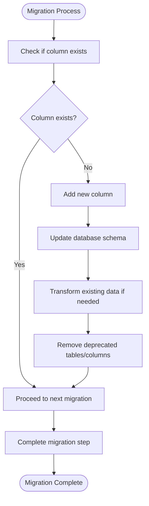
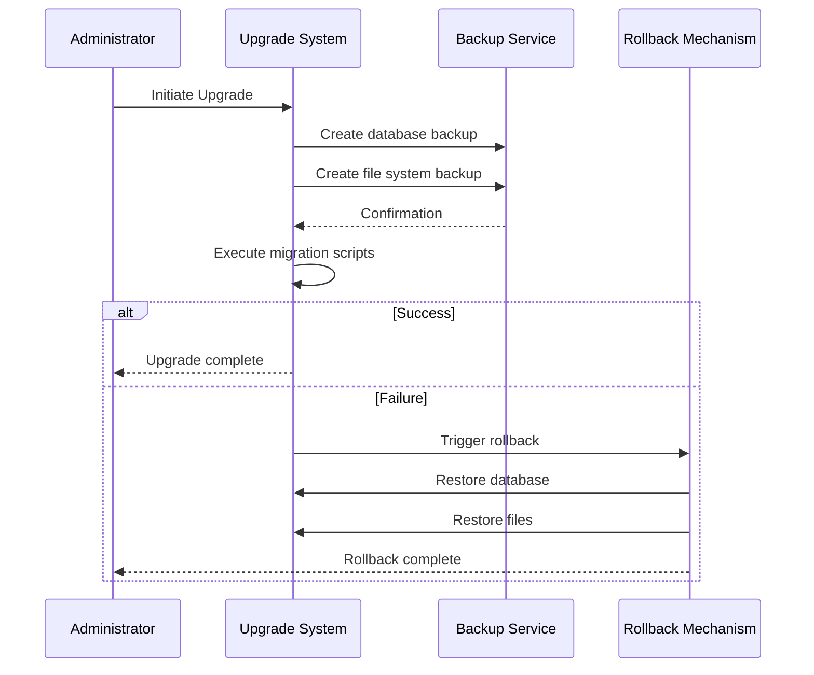

# Upgrade and Migration

<cite>
**Referenced Files in This Document**   
- [wp-config.php](file://wp-config.php)
- [premiumbox.php](file://wp-content/plugins/premiumbox/premiumbox.php)
- [migrate.php](file://wp-content/plugins/premiumbox/activation/migrate.php)
- [migrate.php](file://wp-content/plugins/premiumbox/plugin/migrate/migrate.php)
- [migrate-constants.php](file://wp-content/plugins/premiumbox/includes/migrate-constants.php)
- [update.php](file://wp-content/plugins/premiumbox/plugin/update/index.php)
- [class-core-upgrader.php](file://wp-admin/includes/class-core-upgrader.php)
- [upgrade.php](file://wp-admin/includes/upgrade.php)
- [update-core.php](file://wp-admin/includes/update-core.php)
</cite>

## Table of Contents
1. [Versioning Strategy and Release Cycle](#versioning-strategy-and-release-cycle)
2. [Upgrade Procedures](#upgrade-procedures)
3. [Data Migration Processes](#data-migration-processes)
4. [Safe Upgrade Practices and Testing](#safe-upgrade-practices-and-testing)
5. [PHP 8.2 to PHP 8.3 Migration](#php-82-to-php-83-migration)
6. [Common Upgrade Issues](#common-upgrade-issues)
7. [Performance and Security Considerations](#performance-and-security-considerations)

## Versioning Strategy and Release Cycle

The Premium Exchanger platform follows a structured versioning strategy with incremental updates that maintain backward compatibility while introducing new features and improvements. The current version of the plugin is 2.7, as indicated in the plugin header. The release cycle incorporates regular updates with specific version milestones that trigger database schema changes and data migrations.

The platform implements an automated update checking mechanism through a cron job that runs every three hours, as defined in the `premiumbox_update_list_cron_func` function. This ensures that administrators are promptly notified of available updates. The system maintains version information in the `pn_version` option, which stores update news and version-specific data.

**Section sources**
- [premiumbox.php](file://wp-content/plugins/premiumbox/premiumbox.php#L6)
- [update.php](file://wp-content/plugins/premiumbox/plugin/update/index.php#L151-L157)

## Upgrade Procedures

### Backup Requirements
Before initiating any upgrade, it is essential to create comprehensive backups of both the database and file system. The WordPress core provides built-in backup functionality through the `WP_Upgrader` class, which can create temporary backups of plugins and themes before updates. For the Premium Exchanger platform, administrators should specifically backup the following:

1. Database tables prefixed with `pr_` (as defined in wp-config.php)
2. The entire `wp-content/plugins/premiumbox` directory
3. Custom configuration files and merchant settings

### Compatibility Checks
Prior to upgrading, verify the following compatibility requirements:
- PHP version compatibility (specifically for the PHP 8.2 to 8.3 migration)
- WordPress core version requirements
- ionCube Loader compatibility (required for protected code execution)
- Database engine compatibility (InnoDB with UTF-8 charset)

The system performs automatic compatibility checks through the update process, but manual verification is recommended, especially when migrating between major PHP versions.

### Step-by-Step Upgrade Process
1. **Preparation Phase**: 
   - Backup all files and database
   - Verify server requirements
   - Disable caching mechanisms

2. **Update Execution**:
   - Use WordPress admin interface or WP-CLI to initiate the update
   - The system will automatically detect version differences and apply necessary migrations
   - Monitor the update process for any errors

3. **Post-Upgrade Verification**:
   - Verify plugin functionality in the admin panel
   - Test exchange operations and merchant integrations
   - Check error logs for any issues
   - Validate that all database tables have been properly updated

**Section sources**
- [class-core-upgrader.php](file://wp-admin/includes/class-core-upgrader.php#L45-L82)
- [upgrade.php](file://wp-admin/includes/upgrade.php#L740-L831)
- [update-core.php](file://wp-admin/includes/update-core.php#L1829-L1856)

## Data Migration Processes

### Automated Migration Scripts
The Premium Exchanger platform includes comprehensive migration scripts that handle database schema changes and data transformations. These scripts are located in multiple files within the plugin structure:

- `activation/migrate.php`: Handles initial activation and early version migrations
- `plugin/migrate/migrate.php`: Manages incremental migrations between versions
- `includes/migrate-constants.php`: Defines constants for migration compatibility

The migration process follows a step-by-step approach with specific version markers (e.g., '16_9', '20_1', '26_7') that correspond to different migration stages. Each migration step checks for the existence of specific database columns or tables before applying changes, preventing errors when upgrading from different version starting points.

**Diagram sources **
- [migrate.php](file://wp-content/plugins/premiumbox/activation/migrate.php#L9-L136)
- [migrate.php](file://wp-content/plugins/premiumbox/plugin/migrate/migrate.php#L192-L242)

### Schema Changes and Manual Interventions
The migration process includes numerous schema changes across various database tables. Key changes include:

- **psys table**: Addition of `t2_1` and `t2_2` columns for version 1.6 compatibility
- **currency table**: Addition of `cat_id` column for version 2.5 and `reserv_calc` field type changes
- **directions table**: Multiple additions including `dcom1`, `dcom2`, `mailtemp`, and `maildata` fields
- **exchange_bids table**: Addition of user-related fields like `user_login`, `user_telegram`, and transaction IDs

While most migrations are automated, certain scenarios may require manual intervention:
- When migrating from very old versions (pre-1.6) that lack intermediate migration steps
- If the ionCube Loader fails to decode protected files during migration
- When custom modifications to the database schema conflict with update requirements

**Section sources**
- [migrate.php](file://wp-content/plugins/premiumbox/activation/migrate.php#L9-L136)
- [migrate.php](file://wp-content/plugins/premiumbox/plugin/migrate/migrate.php#L2042-L2090)
- [migrate-constants.php](file://wp-content/plugins/premiumbox/includes/migrate-constants.php#L1-L18)

## Safe Upgrade Practices and Testing

### Staging Environment Testing
Before deploying upgrades to production, follow these testing guidelines in a staging environment:

1. **Replicate Production Environment**: Ensure the staging environment matches production in terms of:
   - PHP version and extensions
   - WordPress version
   - Server configuration
   - Database size and structure

2. **Test Critical Functionality**:
   - Exchange operations between different currency pairs
   - Merchant integrations and payment processing
   - User registration and profile management
   - Admin panel functionality and reporting

3. **Performance Testing**:
   - Monitor page load times before and after upgrade
   - Test under simulated load conditions
   - Verify cron job execution and timing

### Rollback Procedures
The Premium Exchanger platform includes rollback capabilities through several mechanisms:

1. **Database Rollback**: Maintain a recent database backup that can be restored if issues occur
2. **File System Rollback**: Keep a copy of the previous plugin version to revert if needed
3. **WordPress Core Rollback**: Utilize the built-in rollback functionality in WordPress for core updates

The system automatically creates temporary backups during plugin updates, which can be restored using the `restore_temp_backup` method in the `WP_Upgrader` class. This provides an additional safety net for plugin updates.

**Diagram sources **
- [class-wp-upgrader.php](file://wp-admin/includes/class-wp-upgrader.php#L1166-L1213)
- [class-wp-automatic-updater.php](file://wp-admin/includes/class-wp-automatic-updater.php#L557-L596)

**Section sources**
- [update.php](file://wp-content/plugins/premiumbox/plugin/update/index.php#L148-L158)
- [update-core.php](file://wp-admin/includes/update-core.php#L1016-L1036)

## PHP 8.2 to PHP 8.3 Migration

### Code Changes Required
Migrating from PHP 8.2 to PHP 8.3 requires attention to several compatibility issues:

1. **Deprecated Functions**: Review code for any use of functions deprecated in PHP 8.3
2. **Type Declarations**: Ensure strict type compatibility, especially with union types and nullable types
3. **Error Handling**: Update error handling to accommodate changes in error reporting
4. **Extension Compatibility**: Verify all required extensions are available and compatible

The Premium Exchanger platform uses ionCube Loader to protect its code, which adds an additional layer of complexity to the PHP version migration. The ionCube Loader version must be compatible with PHP 8.3, and the encoded files may need to be regenerated with a newer version of the encoder.

### Compatibility Considerations
Key compatibility considerations for the PHP 8.3 migration include:

- **ionCube Loader**: Ensure version 14 or later is installed, as specified in the repository name
- **WordPress Core**: Verify WordPress version compatibility with PHP 8.3
- **Database Extensions**: Confirm MySQLi or PDO MySQL extensions are properly configured
- **Memory Limits**: PHP 8.3 may have different memory usage patterns; adjust memory limits accordingly

The migration should be tested thoroughly in a staging environment, paying special attention to:
- Form processing and data validation
- API integrations with merchants
- Cron job execution and scheduling
- File upload and processing functionality

**Section sources**
- [wp-config.php](file://wp-config.php#L69-L70)
- [hashed_functions.php](file://wp-content/plugins/premiumbox/includes/hashed_functions.php#L1-L11)

## Common Upgrade Issues

### Broken Functionality After Upgrade
Common causes of broken functionality include:
- Incomplete migration scripts due to timeout or memory limits
- Missing or corrupted ionCube encoded files
- Cache issues preventing updated code from being loaded
- Permission changes on updated files

Resolution steps:
1. Clear all caches (WordPress, server, and browser)
2. Verify file permissions on the plugin directory
3. Check error logs for specific issues
4. Re-run migration scripts if necessary

### Data Corruption During Migration
Potential data corruption scenarios:
- Partial execution of migration scripts
- Character encoding issues during database updates
- Data type mismatches in schema changes

Prevention and recovery:
- Always backup before migration
- Monitor migration progress and logs
- Implement transactional database operations where possible
- Have a verified restore procedure in place

### Plugin Conflicts
The Premium Exchanger platform may conflict with other plugins after upgrades, particularly:
- Security plugins that restrict file operations
- Caching plugins that interfere with dynamic content
- Other e-commerce or payment processing plugins

Troubleshooting:
1. Disable other plugins temporarily to isolate conflicts
2. Check JavaScript console for frontend issues
3. Review server error logs for PHP warnings or notices
4. Test with default WordPress theme to rule out theme conflicts

**Section sources**
- [migrate.php](file://wp-content/plugins/premiumbox/plugin/migrate/migrate.php#L1474-L1505)
- [class-core-upgrader.php](file://wp-admin/includes/class-core-upgrader.php#L45-L82)

## Performance and Security Considerations

### Performance Impact
Upgrades can affect system availability and performance in several ways:

- **Database Migration Time**: Large databases may experience extended downtime during schema changes
- **Memory Usage**: Migration scripts may require significant memory, especially for data transformation
- **CPU Load**: Complex data processing during migration can increase CPU usage
- **Network Latency**: File downloads for updates can impact network performance

Mitigation strategies:
- Schedule upgrades during low-traffic periods
- Optimize database before migration (indexing, defragmentation)
- Increase PHP memory limit temporarily during upgrade
- Use database replication to minimize downtime

### Security Implications
The upgrade process introduces several security considerations:

1. **File Permissions**: Ensure proper file permissions are maintained after updates
2. **Temporary Files**: Clean up any temporary files created during the upgrade process
3. **Authentication**: Verify that authentication mechanisms remain secure
4. **Input Validation**: Confirm that data validation remains robust after schema changes

Security best practices:
- Use secure connections (HTTPS) for all update operations
- Verify file integrity after updates
- Implement multi-factor authentication for administrative access
- Regularly audit logs for suspicious activity during and after upgrades

The platform's use of ionCube Loader provides an additional security layer by protecting the source code, but administrators must ensure the loader itself is kept up to date and properly configured.

**Section sources**
- [wp-config.php](file://wp-config.php#L70)
- [class-wp-automatic-updater.php](file://wp-admin/includes/class-wp-automatic-updater.php#L557-L596)
- [update-core.php](file://wp-admin/includes/update-core.php#L1829-L1856)