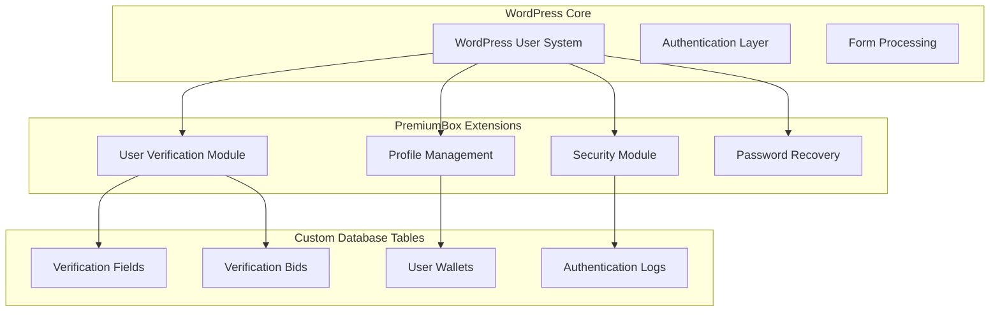
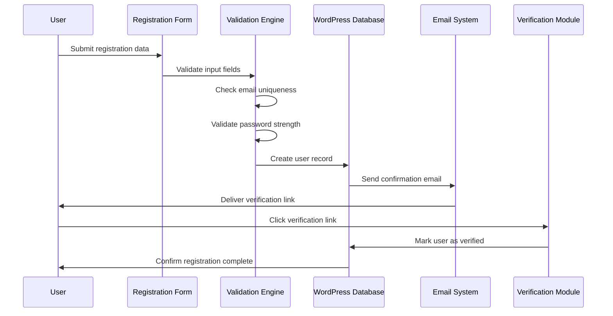
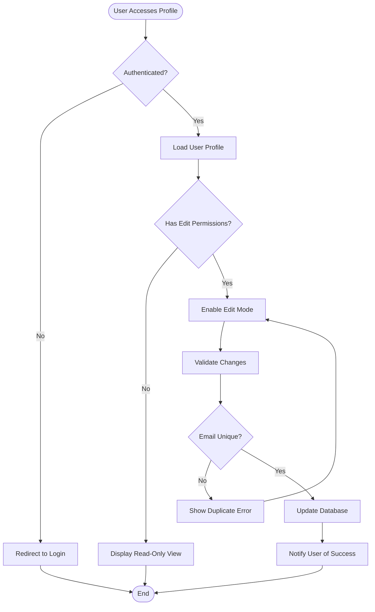
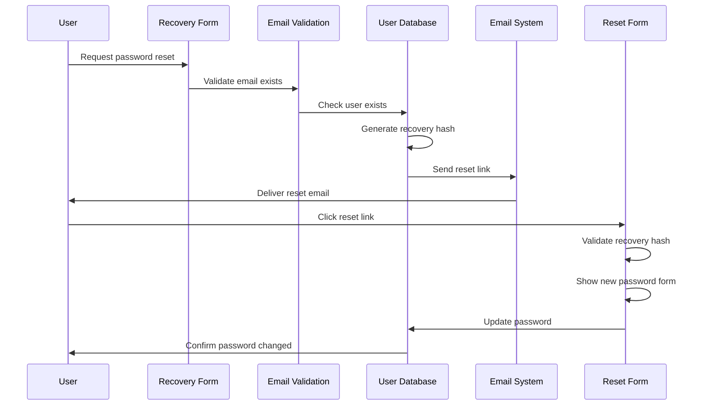
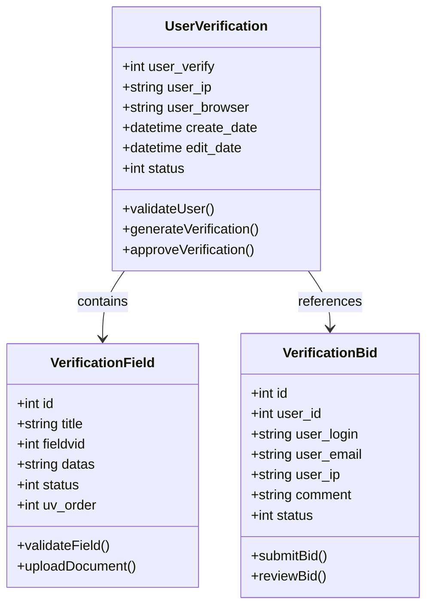
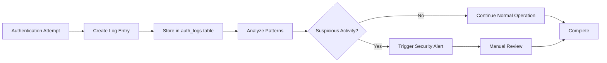

# Account Management

<cite>
**Referenced Files in This Document**
- [wp-includes/user.php](file://wp-includes/user.php)
- [wp-login.php](file://wp-login.php)
- [wp-signup.php](file://wp-signup.php)
- [wp-content/plugins/premiumbox/moduls/userverify/index.php](file://wp-content/plugins/premiumbox/moduls/userverify/index.php)
- [wp-content/plugins/premiumbox/moduls/userverify/filters.php](file://wp-content/plugins/premiumbox/moduls/userverify/filters.php)
- [wp-content/plugins/premiumbox/shortcode/lostpass.php](file://wp-content/plugins/premiumbox/shortcode/lostpass.php)
- [wp-content/plugins/premiumbox/default/users/uf_settings.php](file://wp-content/plugins/premiumbox/default/users/uf_settings.php)
- [wp-content/plugins/premiumbox/premium/includes/db.php](file://wp-content/plugins/premiumbox/premium/includes/db.php)
- [wp-content/plugins/premiumbox/default/users/edit_users.php](file://wp-content/plugins/premiumbox/default/users/edit_users.php)
- [wp-content/plugins/premiumbox/shortcode/security.php](file://wp-content/plugins/premiumbox/shortcode/security.php)
</cite>

## Table of Contents
1. [Introduction](#introduction)
2. [System Architecture](#system-architecture)
3. [User Registration Process](#user-registration-process)
4. [Profile Management](#profile-management)
5. [Password Recovery System](#password-recovery-system)
6. [Account Verification](#account-verification)
7. [Security Features](#security-features)
8. [Database Schema](#database-schema)
9. [Common Issues and Solutions](#common-issues-and-solutions)
10. [Best Practices](#best-practices)

## Introduction

The Account Management sub-feature provides comprehensive user account handling capabilities for the premium exchange platform. Built on WordPress's foundation with custom extensions, it offers robust user registration, profile editing, password recovery, and account verification processes. The system integrates seamlessly with WordPress's user management while adding specialized features for exchange platforms including custom user meta fields, security settings, and verification workflows.

## System Architecture

The Account Management system follows a modular architecture with clear separation of concerns:

**Diagram sources**
- [wp-includes/user.php](file://wp-includes/user.php#L1-L100)
- [wp-content/plugins/premiumbox/moduls/userverify/index.php](file://wp-content/plugins/premiumbox/moduls/userverify/index.php#L1-L50)

**Section sources**
- [wp-includes/user.php](file://wp-includes/user.php#L1-L200)
- [wp-content/plugins/premiumbox/moduls/userverify/index.php](file://wp-content/plugins/premiumbox/moduls/userverify/index.php#L1-L100)

## User Registration Process

### Registration Workflow

The registration process involves multiple stages with validation and customization:

**Diagram sources**
- [wp-signup.php](file://wp-signup.php#L600-L700)
- [wp-content/plugins/premiumbox/shortcode/lostpass.php](file://wp-content/plugins/premiumbox/shortcode/lostpass.php#L230-L320)

### Custom User Fields

The system extends WordPress user profiles with specialized fields:

| Field | Type | Purpose | Validation |
|-------|------|---------|------------|
| `last_name` | Text | User's surname | Optional |
| `first_name` | Text | User's given name | Optional |
| `second_name` | Text | User's middle name | Optional |
| `user_phone` | Phone | Mobile contact | Format validation |
| `user_skype` | Text | Skype identifier | Format validation |
| `user_telegram` | Text | Telegram username | Format validation |
| `user_website` | URL | Personal website | URL validation |
| `user_passport` | Text | Passport number | Optional |

**Section sources**
- [wp-content/plugins/premiumbox/default/users/uf_settings.php](file://wp-content/plugins/premiumbox/default/users/uf_settings.php#L6-L40)

### Registration Security Features

The registration process includes several security measures:

- **Email Uniqueness Validation**: Prevents duplicate accounts
- **Password Strength Requirements**: Enforces strong passwords
- **CAPTCHA Integration**: Prevents automated registrations
- **IP Tracking**: Monitors suspicious registration patterns
- **Rate Limiting**: Limits registration attempts per IP

**Section sources**
- [wp-content/plugins/premiumbox/premium/includes/db.php](file://wp-content/plugins/premiumbox/premium/includes/db.php#L180-L250)

## Profile Management

### Profile Editing Interface

The profile management system provides comprehensive editing capabilities:

**Diagram sources**
- [wp-content/plugins/premiumbox/default/users/edit_users.php](file://wp-content/plugins/premiumbox/default/users/edit_users.php#L80-L170)

### Security Settings Management

Users can configure various security preferences:

| Setting | Options | Purpose |
|---------|---------|---------|
| Password Recovery | Enable/Disable | Controls password reset functionality |
| Email Notifications | Enable/Disable | Controls authentication alerts |
| SMS Notifications | Enable/Disable | Controls SMS authentication alerts |
| Telegram Notifications | Enable/Disable | Controls Telegram authentication alerts |
| Multi-device Access | Manage Sessions | Allows logout from all devices |
| IP Restrictions | Configure Allowed IPs | Limits access to trusted IPs |

**Section sources**
- [wp-content/plugins/premiumbox/default/users/edit_users.php](file://wp-content/plugins/premiumbox/default/users/edit_users.php#L130-L170)

## Password Recovery System

### Recovery Process Flow

The password recovery system implements a secure two-stage process:

**Diagram sources**
- [wp-content/plugins/premiumbox/shortcode/lostpass.php](file://wp-content/plugins/premiumbox/shortcode/lostpass.php#L230-L410)

### Recovery Security Measures

The password recovery system includes multiple security layers:

- **Hash-Based Validation**: Uses MD5 hashes for recovery links
- **Single-use Links**: Recovery links expire after use
- **Email Verification**: Requires valid email address
- **Rate Limiting**: Limits recovery attempts
- **Secure Generation**: Uses WordPress password generator

**Section sources**
- [wp-content/plugins/premiumbox/shortcode/lostpass.php](file://wp-content/plugins/premiumbox/shortcode/lostpass.php#L270-L320)

## Account Verification

### Verification Module Architecture

The verification system provides comprehensive identity verification:

**Diagram sources**
- [wp-content/plugins/premiumbox/moduls/userverify/index.php](file://wp-content/plugins/premiumbox/moduls/userverify/index.php#L20-L100)
- [wp-content/plugins/premiumbox/moduls/userverify/filters.php](file://wp-content/plugins/premiumbox/moduls/userverify/filters.php#L158-L200)

### Verification Workflow

The verification process follows a structured workflow:

1. **Submission**: User submits verification request
2. **Review**: Administrators review submitted documents
3. **Approval**: Verified users receive status update
4. **Maintenance**: Ongoing verification monitoring

**Section sources**
- [wp-content/plugins/premiumbox/moduls/userverify/index.php](file://wp-content/plugins/premiumbox/moduls/userverify/index.php#L180-L220)

## Security Features

### Multi-factor Authentication

The system supports multiple authentication methods:

| Method | Implementation | Use Case |
|--------|----------------|----------|
| Email Login | Email/password combination | Standard authentication |
| SMS Login | SMS-based verification | Enhanced security |
| Telegram Login | Telegram bot integration | Mobile convenience |
| PIN Protection | Numeric PIN codes | Additional layer |
| IP Restrictions | Whitelist trusted IPs | Network-based security |

### Authentication Logging

All authentication attempts are logged for security monitoring:

**Diagram sources**
- [wp-content/plugins/premiumbox/premium/includes/db.php](file://wp-content/plugins/premiumbox/premium/includes/db.php#L87-L105)

**Section sources**
- [wp-content/plugins/premiumbox/premium/includes/db.php](file://wp-content/plugins/premiumbox/premium/includes/db.php#L180-L250)

## Database Schema

### Core User Table Extensions

The system extends the WordPress users table with additional fields:

| Column | Type | Purpose | Default |
|--------|------|---------|---------|
| `user_verify` | INT(1) | Verification status | 0 (unverified) |
| `sec_lostpass` | INT(1) | Password recovery enabled | 1 (enabled) |
| `alogs_email` | INT(1) | Email notifications | 0 (disabled) |
| `alogs_sms` | INT(1) | SMS notifications | 0 (disabled) |
| `alogs_telegram` | INT(1) | Telegram notifications | 0 (disabled) |
| `email_login` | INT(1) | Email login enabled | 0 (disabled) |
| `sms_login` | INT(1) | SMS login enabled | 0 (disabled) |
| `telegram_login` | INT(1) | Telegram login enabled | 0 (disabled) |
| `enable_ips` | LONGTEXT | Allowed IP addresses | Empty |
| `user_pin` | VARCHAR(250) | PIN code | Empty |
| `user_browser` | VARCHAR(250) | Browser fingerprint | Empty |
| `user_ip` | VARCHAR(250) | IP address | Empty |
| `user_bann` | INT(1) | Account banned | 0 (not banned) |
| `last_adminpanel` | VARCHAR(50) | Last admin access | Empty |

### Verification Tables

Additional tables support the verification system:

**uv_field**: Stores verification field configurations
**uv_field_user**: Links user data to verification fields
**verify_bids**: Tracks verification requests and reviews

**Section sources**
- [wp-content/plugins/premiumbox/premium/includes/db.php](file://wp-content/plugins/premiumbox/premium/includes/db.php#L180-L250)

## Common Issues and Solutions

### Email Delivery Problems

**Issue**: Users not receiving verification or password reset emails

**Solutions**:
1. **Check SMTP Configuration**: Verify email server settings
2. **Spam Folder**: Advise users to check spam/junk folders
3. **Email Blacklisting**: Check if IP/domain is blacklisted
4. **Plugin Conflicts**: Disable conflicting email plugins
5. **Server Restrictions**: Verify server email sending capabilities

### Account Lockout Scenarios

**Issue**: Users unable to log in due to security restrictions

**Solutions**:
1. **IP Whitelisting**: Add IP to allowed list
2. **Multi-device Logout**: Use session management to clear sessions
3. **PIN Reset**: Reset PIN protection
4. **Temporary Bypass**: Temporarily disable security features
5. **Manual Intervention**: Admin override for locked accounts

### Profile Update Failures

**Issue**: Profile changes not saving properly

**Solutions**:
1. **Field Validation**: Ensure data meets validation criteria
2. **Permission Checks**: Verify user has edit permissions
3. **Database Connectivity**: Check database connection
4. **Form Submission**: Verify AJAX/form submission works
5. **Conflicting Plugins**: Disable conflicting plugins

### Verification Status Issues

**Issue**: Verification status not updating correctly

**Solutions**:
1. **Field Synchronization**: Ensure user_verify field syncs properly
2. **Hook Execution**: Verify verification hooks fire correctly
3. **Database Updates**: Check for database update failures
4. **Cache Clearing**: Clear WordPress object cache
5. **Role Permissions**: Verify user has appropriate roles

## Best Practices

### Security Implementation

1. **Strong Password Policies**: Enforce complex password requirements
2. **Multi-factor Authentication**: Implement multiple authentication methods
3. **Regular Security Audits**: Monitor authentication logs regularly
4. **IP Whitelisting**: Restrict access to trusted networks
5. **Session Management**: Implement secure session handling

### User Experience Optimization

1. **Clear Error Messages**: Provide actionable error feedback
2. **Progress Indicators**: Show progress during lengthy operations
3. **Responsive Design**: Ensure mobile-friendly interfaces
4. **Accessibility Compliance**: Follow WCAG guidelines
5. **Internationalization**: Support multiple languages

### Performance Considerations

1. **Database Indexing**: Properly index frequently queried fields
2. **Caching Strategies**: Implement appropriate caching mechanisms
3. **Lazy Loading**: Load content progressively
4. **Minimize Queries**: Reduce database query overhead
5. **Optimize Images**: Compress and optimize profile images

### Maintenance and Monitoring

1. **Regular Backups**: Implement automated backup systems
2. **Log Monitoring**: Monitor authentication and error logs
3. **Performance Metrics**: Track system performance metrics
4. **Security Updates**: Keep WordPress and plugins updated
5. **User Support**: Provide clear support channels