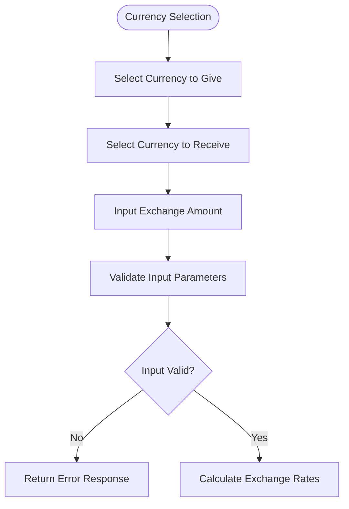
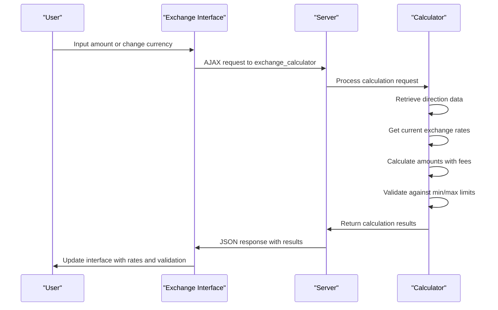
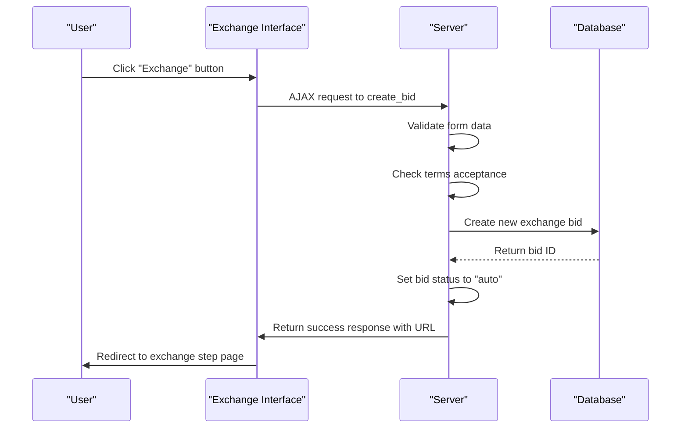
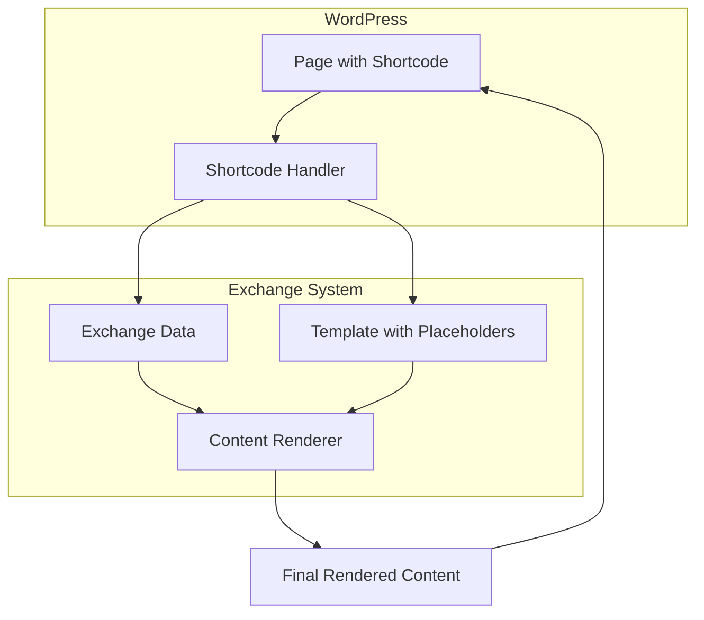
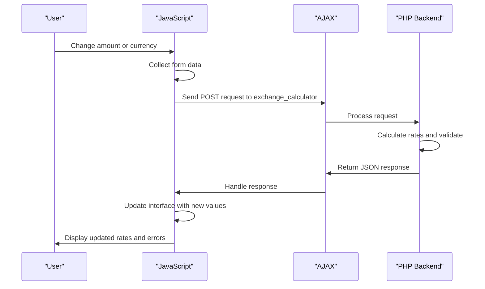
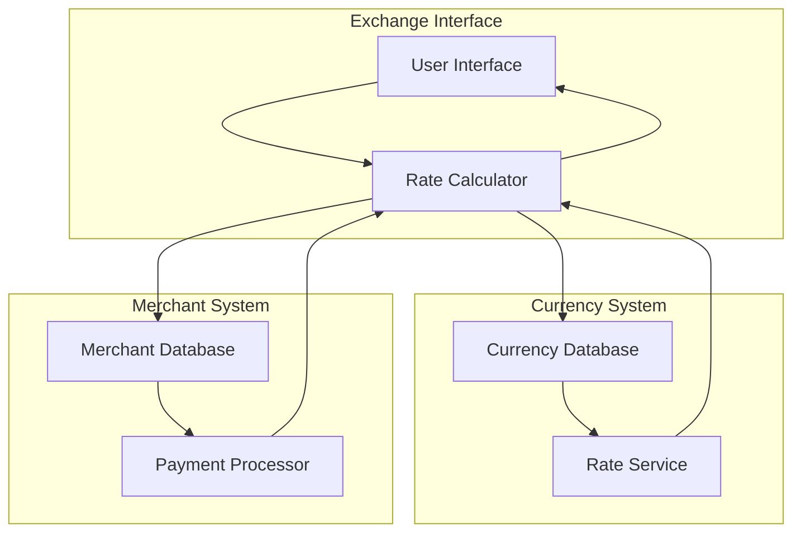
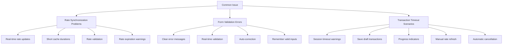

# Exchange Interface

<cite>
**Referenced Files in This Document**   
- [exchange.php](file://wp-content/plugins/premiumbox/shortcode/exchange.php)
- [exchangestep.php](file://wp-content/plugins/premiumbox/shortcode/exchangestep.php)
- [calculator.php](file://wp-content/plugins/premiumbox/plugin/exchange/calculator.php)
- [funcs.php](file://wp-content/plugins/premiumbox/plugin/exchange/funcs.php)
- [action.php](file://wp-content/plugins/premiumbox/plugin/exchange/action.php)
- [functions.php](file://wp-content/plugins/premiumbox/plugin/directions/functions.php)
- [config.php](file://wp-content/plugins/premiumbox/plugin/config.php)
</cite>

## Table of Contents
1. [Introduction](#introduction)
2. [Multi-Step Exchange Process](#multi-step-exchange-process)
3. [Currency Selection and Amount Input](#currency-selection-and-amount-input)
4. [Rate Calculation and Validation](#rate-calculation-and-validation)
5. [Order Confirmation and Submission](#order-confirmation-and-submission)
6. [Shortcode Architecture](#shortcode-architecture)
7. [JavaScript and AJAX Interactions](#javascript-and-ajax-interactions)
8. [Currency and Merchant Integration](#currency-and-merchant-integration)
9. [Common Issues and Solutions](#common-issues-and-solutions)
10. [Conclusion](#conclusion)

## Introduction
The Exchange Interface is a comprehensive system that enables users to exchange currencies through a multi-step process. This documentation provides a detailed explanation of the implementation, covering currency selection, amount input, rate calculation, order confirmation, and the shortcode-based architecture for embedding exchange forms in WordPress pages. The system integrates with currency and merchant modules to ensure accurate rate calculation and transaction processing.

## Multi-Step Exchange Process
The exchange process consists of several steps that guide users through selecting exchange directions, viewing real-time rates, and submitting exchange requests. The process begins with currency selection, followed by amount input, rate calculation, validation, and finally order confirmation.

The interface is designed to be user-friendly, providing clear instructions and real-time feedback at each step. Users can select the currency they want to give and receive, input the amount they wish to exchange, and view the calculated rates and fees before confirming their order.

**Section sources**
- [exchange.php](file://wp-content/plugins/premiumbox/shortcode/exchange.php#L1-L469)
- [exchangestep.php](file://wp-content/plugins/premiumbox/shortcode/exchangestep.php#L1-L800)

## Currency Selection and Amount Input
Users begin the exchange process by selecting the currencies they want to exchange. The interface provides dropdown menus for selecting the currency to give and the currency to receive. These selections are dynamically updated based on the available exchange directions in the system.

After selecting the currencies, users input the amount they wish to exchange. The interface supports multiple input fields for different amounts:
- Amount to give (sum1)
- Amount to receive (sum2)
- Amount to give with fees (sum1c)
- Amount to receive with fees (sum2c)

The system validates these inputs in real-time, ensuring they meet the minimum and maximum requirements for the selected exchange direction.

**Diagram sources **
- [exchange.php](file://wp-content/plugins/premiumbox/shortcode/exchange.php#L271-L293)
- [action.php](file://wp-content/plugins/premiumbox/plugin/exchange/action.php#L204-L257)

**Section sources**
- [exchange.php](file://wp-content/plugins/premiumbox/shortcode/exchange.php#L271-L293)
- [action.php](file://wp-content/plugins/premiumbox/plugin/exchange/action.php#L204-L257)

## Rate Calculation and Validation
The rate calculation process is a critical component of the exchange interface. When users input an amount or change their currency selection, the system calculates the exchange rates in real-time using AJAX calls to the server.

The calculation process involves several steps:
1. Retrieving the exchange direction data
2. Fetching the current exchange rates for the selected currencies
3. Calculating the amounts to give and receive
4. Applying commissions and fees
5. Validating against minimum and maximum limits

The system performs validation to ensure the exchange amounts are within acceptable limits. If an amount is below the minimum or above the maximum, the interface displays appropriate error messages. The validation also checks for sufficient reserve availability and proper account information.

**Diagram sources **
- [calculator.php](file://wp-content/plugins/premiumbox/plugin/exchange/calculator.php#L1-L159)
- [action.php](file://wp-content/plugins/premiumbox/plugin/exchange/action.php#L259-L290)

**Section sources**
- [calculator.php](file://wp-content/plugins/premiumbox/plugin/exchange/calculator.php#L1-L159)
- [action.php](file://wp-content/plugins/premiumbox/plugin/exchange/action.php#L259-L290)

## Order Confirmation and Submission
After the rates are calculated and validated, users proceed to the order confirmation step. This step requires users to review the exchange details and accept the terms and conditions before submitting their request.

The confirmation interface displays:
- Exchange direction (currency to give and receive)
- Amounts to give and receive (including fees)
- Exchange rates
- Reserve information
- Terms and conditions acceptance checkbox

When users submit their order, the system creates a new exchange bid in the database with a status of "auto". The bid contains all the necessary information for processing the exchange, including user data, currency information, and calculated amounts.

**Diagram sources **
- [funcs.php](file://wp-content/plugins/premiumbox/plugin/exchange/funcs.php#L4-L468)
- [action.php](file://wp-content/plugins/premiumbox/plugin/exchange/action.php#L410-L479)

**Section sources**
- [funcs.php](file://wp-content/plugins/premiumbox/plugin/exchange/funcs.php#L4-L468)
- [action.php](file://wp-content/plugins/premiumbox/plugin/exchange/action.php#L410-L479)

## Shortcode Architecture
The exchange interface uses a shortcode-based architecture that allows embedding exchange forms in WordPress pages. The primary shortcode is `[exchange]`, which renders the complete exchange form on any page where it is placed.

The shortcode architecture consists of several components:
- Main exchange shortcode handler
- Template rendering system
- Dynamic content replacement
- Filter system for customization

The shortcode system uses a template-based approach with placeholder tags that are replaced with actual content. These tags include:
- `[select_give]` - Currency to give selection
- `[select_get]` - Currency to receive selection
- `[input_give]` - Amount to give input
- `[input_get]` - Amount to receive input
- `[com_give]` - Commission for giving
- `[com_get]` - Commission for receiving
- `[submit]` - Submit button
- `[check_rule]` - Terms acceptance checkbox

This architecture allows for flexible customization of the exchange form appearance and behavior through filters and template modifications.

**Diagram sources **
- [exchange.php](file://wp-content/plugins/premiumbox/shortcode/exchange.php#L440-L469)
- [functions.php](file://wp-content/plugins/premiumbox/plugin/directions/functions.php#L234-L399)

**Section sources**
- [exchange.php](file://wp-content/plugins/premiumbox/shortcode/exchange.php#L440-L469)
- [functions.php](file://wp-content/plugins/premiumbox/plugin/directions/functions.php#L234-L399)

## JavaScript and AJAX Interactions
The exchange interface relies heavily on JavaScript and AJAX to provide a dynamic, responsive user experience. The system uses jQuery to handle user interactions and make asynchronous requests to the server for real-time calculations and validations.

Key JavaScript components include:
- Real-time calculation triggers
- Form validation handlers
- AJAX request management
- Dynamic content updates
- Error handling and user feedback

The JavaScript code listens for changes in input fields and automatically triggers calculation requests when users modify amounts or select different currencies. This creates a seamless experience where rates and fees are updated instantly without requiring page reloads.

The AJAX interactions follow a consistent pattern:
1. Collect form data including currency selections and amounts
2. Send POST request to the server with exchange parameters
3. Process the JSON response containing calculated rates and validation results
4. Update the interface with new values and error messages
5. Handle success and error cases appropriately

**Diagram sources **
- [action.php](file://wp-content/plugins/premiumbox/plugin/exchange/action.php#L1-L732)
- [exchange.php](file://wp-content/plugins/premiumbox/shortcode/exchange.php#L153-L217)

**Section sources**
- [action.php](file://wp-content/plugins/premiumbox/plugin/exchange/action.php#L1-L732)
- [exchange.php](file://wp-content/plugins/premiumbox/shortcode/exchange.php#L153-L217)

## Currency and Merchant Integration
The exchange interface integrates with currency and merchant modules to ensure accurate rate calculation and transaction processing. The currency module provides current exchange rates, reserve information, and currency-specific settings, while the merchant module handles the actual transaction processing.

The integration process involves several key components:
- Currency data retrieval
- Rate synchronization
- Reserve calculation
- Commission application
- Transaction processing

The system retrieves currency data from the database, including exchange rates, decimal places, and status information. It then calculates the appropriate rates for the exchange, taking into account any commissions or fees specified in the merchant settings.

The merchant integration ensures that transactions are processed according to the specific requirements of each payment system. This includes applying the correct commission structures, validating account information, and handling transaction status updates.

**Diagram sources **
- [calculator.php](file://wp-content/plugins/premiumbox/plugin/exchange/calculator.php#L19-L56)
- [funcs.php](file://wp-content/plugins/premiumbox/plugin/exchange/funcs.php#L4-L468)

**Section sources**
- [calculator.php](file://wp-content/plugins/premiumbox/plugin/exchange/calculator.php#L19-L56)
- [funcs.php](file://wp-content/plugins/premiumbox/plugin/exchange/funcs.php#L4-L468)

## Common Issues and Solutions
The exchange interface may encounter several common issues that affect user experience and transaction processing. Understanding these issues and their solutions is crucial for maintaining a reliable system.

### Rate Synchronization Problems
Rate synchronization issues occur when the displayed rates do not match the actual rates at the time of transaction processing. This can happen due to:
- Cache expiration
- Network latency
- Database synchronization delays

**Solutions:**
- Implement real-time rate updates using AJAX
- Use short cache durations for rate data
- Add rate validation before transaction processing
- Display rate expiration warnings to users

### Form Validation Errors
Form validation errors occur when user input does not meet the required criteria. Common validation issues include:
- Amounts below minimum or above maximum limits
- Invalid account numbers
- Missing required fields
- Incorrect data formats

**Solutions:**
- Provide clear error messages with specific guidance
- Implement real-time validation as users type
- Auto-correct common formatting issues
- Remember valid input values between sessions

### Transaction Timeout Scenarios
Transaction timeout scenarios occur when the exchange process takes longer than expected, potentially leading to:
- Stale rate information
- Reserve depletion
- User frustration
- Abandoned transactions

**Solutions:**
- Implement session timeouts with clear warnings
- Save draft transactions that can be resumed
- Provide progress indicators for long processes
- Allow users to refresh rates manually
- Implement automatic transaction cancellation after timeout

**Diagram sources **
- [config.php](file://wp-content/plugins/premiumbox/plugin/config.php#L111-L177)
- [action.php](file://wp-content/plugins/premiumbox/plugin/exchange/action.php#L410-L479)

**Section sources**
- [config.php](file://wp-content/plugins/premiumbox/plugin/config.php#L111-L177)
- [action.php](file://wp-content/plugins/premiumbox/plugin/exchange/action.php#L410-L479)

## Conclusion
The Exchange Interface provides a comprehensive solution for currency exchange with a multi-step process that guides users through selection, calculation, and confirmation. The shortcode-based architecture allows for easy integration into WordPress pages, while JavaScript and AJAX interactions create a dynamic, responsive user experience.

The system's integration with currency and merchant modules ensures accurate rate calculation and reliable transaction processing. By addressing common issues such as rate synchronization problems, form validation errors, and transaction timeout scenarios, the interface maintains a high level of reliability and user satisfaction.

For developers, the modular design and extensive filter system provide opportunities for customization and extension. The clear separation of concerns between the interface, calculation, and processing components makes the system maintainable and scalable for future enhancements.