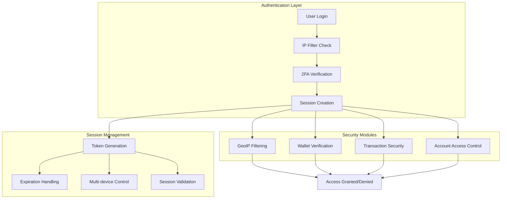
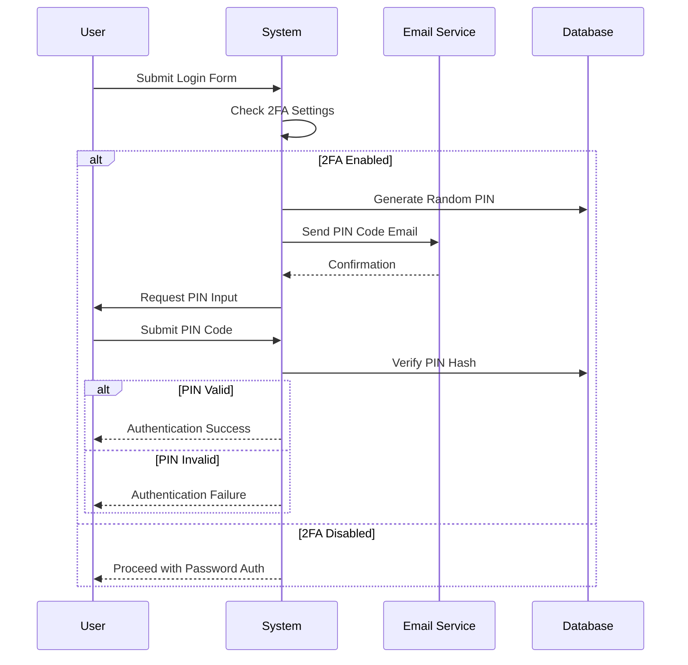
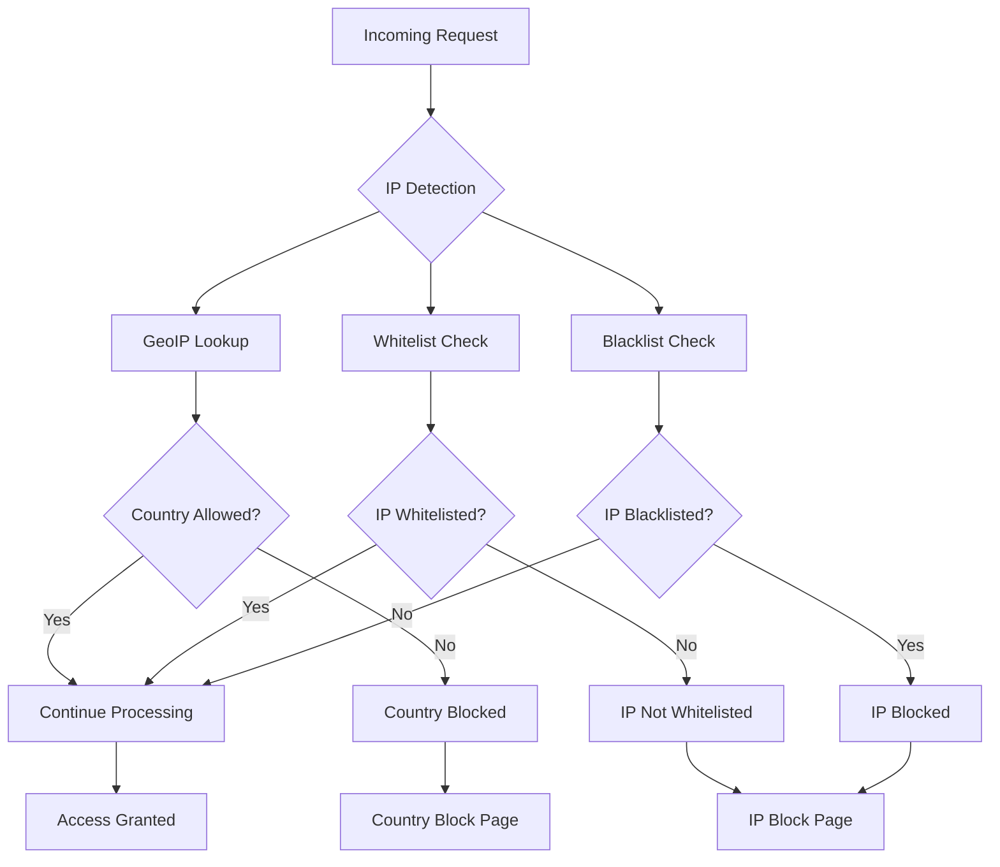
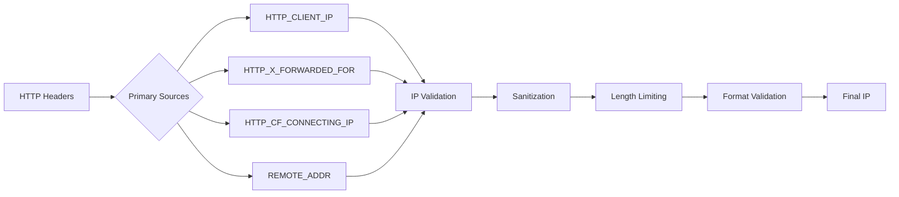
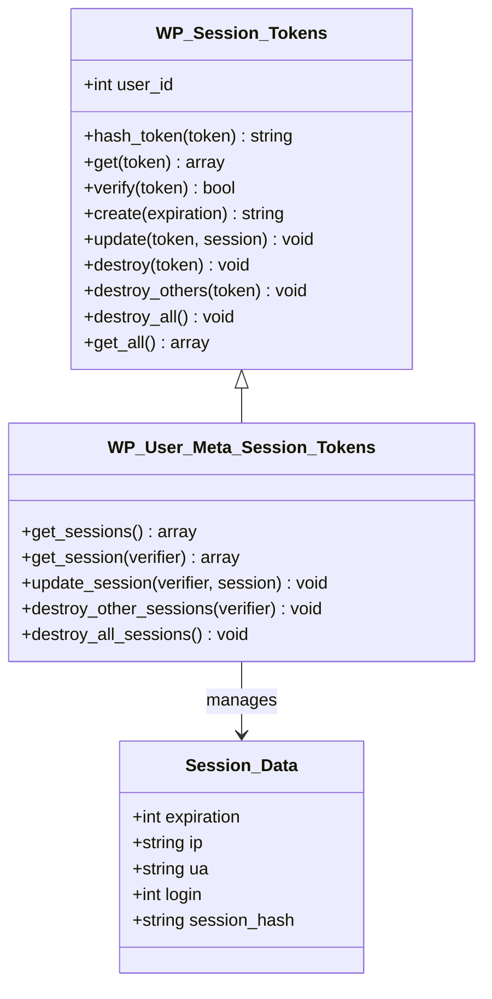
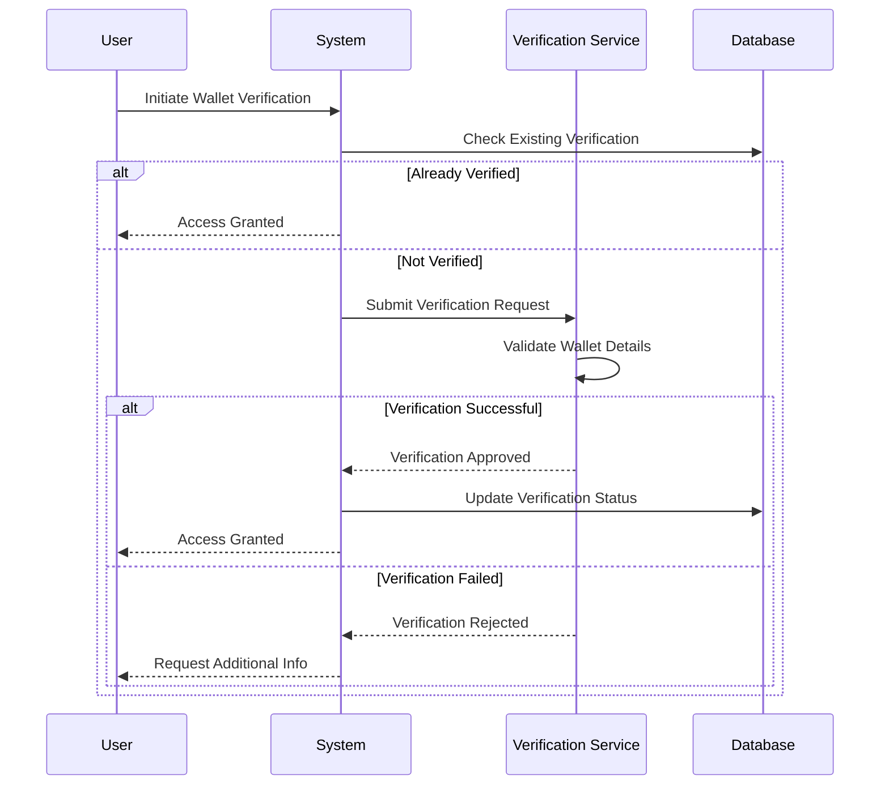
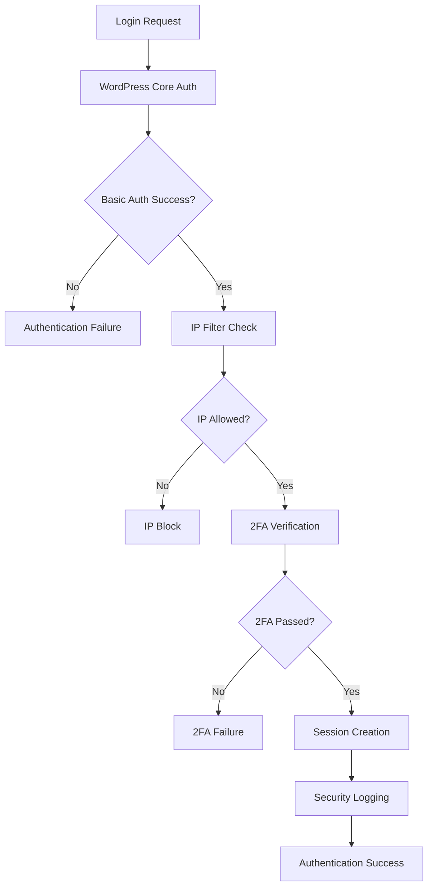
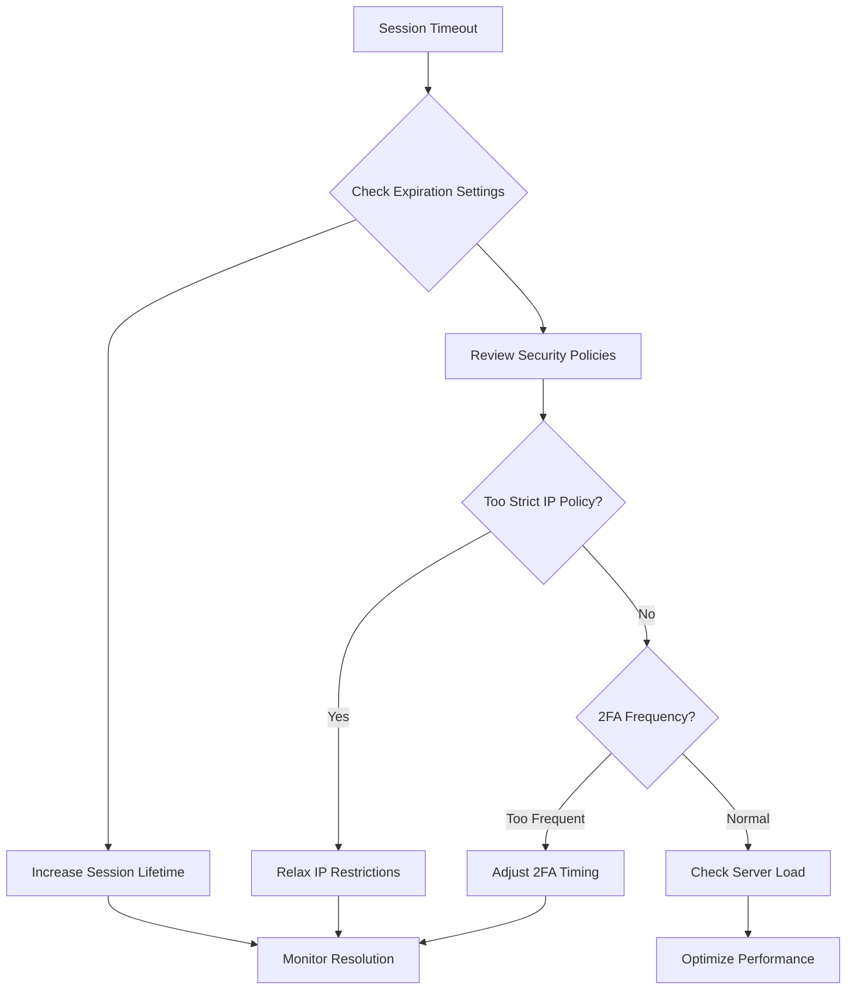

# Security Features

<cite>
**Referenced Files in This Document**
- [twofactorauth.php](file://wp-content/plugins/premiumbox/default/users/twofactorauth.php)
- [filters.php](file://wp-content/plugins/premiumbox/default/users/filters.php)
- [enableip.php](file://wp-content/plugins/premiumbox/default/users/enableip.php)
- [index.php](file://wp-content/plugins/premiumbox/moduls/walletsverify/index.php)
- [index.php](file://wp-content/plugins/premiumbox/moduls/geoip/index.php)
- [filters.php](file://wp-content/plugins/premiumbox/moduls/geoip/filters.php)
- [functions.php](file://wp-content/plugins/premiumbox/premium/includes/functions.php)
- [class-wp-session-tokens.php](file://wp-includes/class-wp-session-tokens.php)
- [class-wp-user-meta-session-tokens.php](file://wp-includes/class-wp-user-meta-session-tokens.php)
- [user.php](file://wp-includes/user.php)
- [pluggable.php](file://wp-includes/pluggable.php)
</cite>

## Table of Contents
1. [Introduction](#introduction)
2. [Security Architecture Overview](#security-architecture-overview)
3. [Two-Factor Authentication (2FA)](#two-factor-authentication-2fa)
4. [IP Filtering System](#ip-filtering-system)
5. [Session Management](#session-management)
6. [Wallet Security Measures](#wallet-security-measures)
7. [Authentication Integration](#authentication-integration)
8. [Common Issues and Solutions](#common-issues-and-solutions)
9. [Technical Implementation Details](#technical-implementation-details)
10. [Best Practices](#best-practices)

## Introduction

The PremiumBox plugin implements a comprehensive security framework designed to protect user accounts, transactions, and sensitive data. The security system employs multiple layers of protection including two-factor authentication, IP filtering, advanced session management, and wallet verification mechanisms. This modular architecture allows administrators to selectively enable and configure security features according to their specific requirements.

The security features are built upon WordPress's core authentication system while extending it with additional protective measures. The implementation follows industry best practices for cryptographic hashing, secure session handling, and user verification processes.

## Security Architecture Overview

The security system operates through a layered architecture that integrates seamlessly with WordPress's authentication pipeline. Each security module operates independently while contributing to an overall defense-in-depth strategy.



**Diagram sources**
- [filters.php](file://wp-content/plugins/premiumbox/default/users/filters.php#L83-L133)
- [twofactorauth.php](file://wp-content/plugins/premiumbox/default/users/twofactorauth.php#L102-L170)
- [enableip.php](file://wp-content/plugins/premiumbox/default/users/enableip.php#L5-L41)

**Section sources**
- [filters.php](file://wp-content/plugins/premiumbox/default/users/filters.php#L1-L366)
- [twofactorauth.php](file://wp-content/plugins/premiumbox/default/users/twofactorauth.php#L1-L205)

## Two-Factor Authentication (2FA)

The two-factor authentication system provides an additional layer of security by requiring users to present a second form of identification beyond their password. The implementation supports multiple 2FA methods including PIN codes, email verification, SMS delivery, and Telegram notifications.

### PIN Code Authentication

The PIN code system generates temporary authentication codes sent to users' registered email addresses. This method provides a balance between security and user convenience.



**Diagram sources**
- [twofactorauth.php](file://wp-content/plugins/premiumbox/default/users/twofactorauth.php#L102-L170)

### 2FA Configuration Options

The system supports flexible configuration through administrative controls:

| Feature | Description | Configuration Method |
|---------|-------------|---------------------|
| Email 2FA | PIN code sent via email | Enable/disable toggle in user security settings |
| SMS 2FA | PIN code delivered via SMS | Requires SMS gateway integration |
| Telegram 2FA | PIN code sent through Telegram bot | Bot configuration required |
| Personal PIN | User-defined permanent PIN | Set during user profile editing |

### 2FA Implementation Details

The 2FA system integrates with WordPress's authentication pipeline through filter hooks:

- **Authentication Hook**: [`authenticate`](file://wp-content/plugins/premiumbox/default/users/twofactorauth.php#L173-L204) filter for both admin and frontend login
- **PIN Generation**: Uses MD5 hashing for PIN storage with [`md5($pin)`](file://wp-content/plugins/premiumbox/default/users/twofactorauth.php#L123)
- **Email Notifications**: Configurable templates for PIN delivery
- **Error Handling**: Comprehensive error reporting with [`WP_Error`](file://wp-content/plugins/premiumbox/default/users/twofactorauth.php#L147-L162) objects

**Section sources**
- [twofactorauth.php](file://wp-content/plugins/premiumbox/default/users/twofactorauth.php#L1-L205)

## IP Filtering System

The IP filtering system provides geographic and network-based access control through blacklists, whitelists, and country restrictions. This system operates at multiple levels to provide comprehensive IP-based security.

### IP Filtering Architecture



**Diagram sources**
- [filters.php](file://wp-content/plugins/premiumbox/moduls/geoip/filters.php#L400-L503)
- [enableip.php](file://wp-content/plugins/premiumbox/default/users/enableip.php#L5-L41)

### IP Filtering Components

#### Geographic IP Blocking
The GeoIP module provides country-based access control:

- **Country Blacklisting**: Blocks specific countries from accessing the site
- **Country Whitelisting**: Restricts access to approved countries only
- **Dynamic Country Detection**: Real-time IP geolocation using multiple APIs
- **Memory Caching**: Optimized country lookup caching system

#### Network Access Control
The system supports traditional IP-based filtering:

- **IP Address Matching**: Supports CIDR notation and wildcard patterns
- **Real-time Validation**: IP checking during authentication and access attempts
- **Flexible Configuration**: Multiple IP formats supported (IPv4, IPv6, ranges)

### IP Detection and Validation

The IP detection system implements robust methods for identifying client IP addresses:



**Diagram sources**
- [functions.php](file://wp-content/plugins/premiumbox/premium/includes/functions.php#L1407-L1443)

**Section sources**
- [index.php](file://wp-content/plugins/premiumbox/moduls/geoip/index.php#L1-L93)
- [filters.php](file://wp-content/plugins/premiumbox/moduls/geoip/filters.php#L1-L624)
- [functions.php](file://wp-content/plugins/premiumbox/premium/includes/functions.php#L1407-L1468)

## Session Management

The session management system provides secure, persistent user sessions with advanced features for session control and security monitoring.

### Session Token Architecture

WordPress's native session management is extended with additional security features:



**Diagram sources**
- [class-wp-session-tokens.php](file://wp-includes/class-wp-session-tokens.php#L15-L291)
- [class-wp-user-meta-session-tokens.php](file://wp-includes/class-wp-user-meta-session-tokens.php#L17-L134)

### Session Security Features

#### Multi-device Session Control
- **Token Isolation**: Each device/session gets unique tokens
- **Session Termination**: Ability to terminate specific sessions
- **Concurrent Session Limits**: Configurable limits on simultaneous sessions

#### Enhanced Session Validation
- **Browser Fingerprinting**: Session hash based on user agent and language
- **IP Monitoring**: Tracking of IP address changes during sessions
- **Session Expiration**: Automatic cleanup of expired sessions

### Session Storage and Retrieval

Sessions are stored securely in the WordPress user meta table:

| Field | Purpose | Security Level |
|-------|---------|----------------|
| `session_tokens` | Encrypted session data | Meta table encryption |
| `expiration` | Session timeout timestamp | Integer validation |
| `ip` | Client IP address | String sanitization |
| `ua` | User agent string | String sanitization |
| `login` | Session creation time | Unix timestamp |
| `session_hash` | Browser fingerprint | SHA256 hash |

**Section sources**
- [class-wp-session-tokens.php](file://wp-includes/class-wp-session-tokens.php#L1-L291)
- [class-wp-user-meta-session-tokens.php](file://wp-includes/class-wp-user-meta-session-tokens.php#L1-L134)
- [enableip.php](file://wp-content/plugins/premiumbox/default/users/enableip.php#L59-L71)

## Wallet Security Measures

The wallet verification system provides comprehensive security for cryptocurrency transactions and account management.

### Wallet Verification Workflow



**Diagram sources**
- [index.php](file://wp-content/plugins/premiumbox/moduls/walletsverify/index.php#L107-L143)

### Verification Requirements

The wallet security system enforces verification based on currency settings:

| Currency Property | Verification Impact | Security Level |
|-------------------|-------------------|----------------|
| `has_verify` | Required for transactions | Mandatory |
| `auto_status` | Automatic approval flag | Conditional |
| `user_wallets` | Wallet management enabled | Permitted |

### Transaction Security Controls

- **Account Verification**: Mandatory verification for transaction-enabled wallets
- **Duplicate Prevention**: Protection against multiple verifications for same accounts
- **Status Tracking**: Comprehensive verification status monitoring
- **Audit Logging**: Complete audit trail for verification activities

**Section sources**
- [index.php](file://wp-content/plugins/premiumbox/moduls/walletsverify/index.php#L1-L143)

## Authentication Integration

The security system integrates seamlessly with WordPress's core authentication mechanisms while extending them with additional protective layers.

### Authentication Pipeline Integration



**Diagram sources**
- [filters.php](file://wp-content/plugins/premiumbox/default/users/filters.php#L83-L133)
- [twofactorauth.php](file://wp-content/plugins/premiumbox/default/users/twofactorauth.php#L173-L204)

### Security Filter Integration

The system hooks into WordPress's authentication pipeline through strategic filter placements:

#### Authentication Filters
- [`authenticate`](file://wp-content/plugins/premiumbox/default/users/filters.php#L83-L133): Primary authentication hook
- [`authenticate`](file://wp-content/plugins/premiumbox/default/users/twofactorauth.php#L173-L204): 2FA authentication
- [`authenticate`](file://wp-content/plugins/premiumbox/default/users/enableip.php#L6-L24): IP-based authentication

#### Session Management Hooks
- [`set_logged_in_cookie`](file://wp-content/plugins/premiumbox/default/users/filters.php#L137-L183): Session cookie handling
- [`init`](file://wp-content/plugins/premiumbox/default/users/enableip.php#L29-L55): Runtime session validation

### Verification Status Storage

Authentication verification statuses are stored and managed through:

- **User Meta Fields**: Secure storage in WordPress user meta table
- **Session Data**: Temporary verification status in session context
- **Log Entries**: Persistent audit trails in authentication logs
- **Cache Integration**: Optimized retrieval through WordPress object cache

**Section sources**
- [filters.php](file://wp-content/plugins/premiumbox/default/users/filters.php#L1-L366)
- [enableip.php](file://wp-content/plugins/premiumbox/default/users/enableip.php#L1-L72)

## Common Issues and Solutions

### Legitimate Users Blocked by Security Filters

**Problem**: Authorized users unable to access the system due to security restrictions.

**Causes and Solutions**:

| Issue | Cause | Solution |
|-------|-------|----------|
| IP Address Changes | Dynamic IP assignment | Configure whitelist for known IPs |
| Geographic Restrictions | VPN/proxy usage | Add country exceptions |
| Session Conflicts | Multiple devices | Review concurrent session limits |
| 2FA Delays | Email/SMS delivery issues | Implement backup 2FA methods |

### 2FA Setup Problems

**Problem**: Users experiencing difficulties with two-factor authentication setup.

**Common Scenarios**:

1. **Email Delivery Issues**
   - **Symptom**: PIN codes not received
   - **Solution**: Verify email server configuration and spam filters
   - **Prevention**: Implement email delivery monitoring

2. **PIN Code Expiration**
   - **Symptom**: PIN codes rejected after short time
   - **Solution**: Adjust PIN expiration settings
   - **Prevention**: Clear user confusion about PIN lifespan

3. **Multiple Device Conflicts**
   - **Symptom**: 2FA works on one device but not others
   - **Solution**: Synchronize 2FA settings across devices
   - **Prevention**: Clear device-specific 2FA configurations

### Session Expiration Issues

**Problem**: Users frequently experiencing session timeouts.

**Diagnostic Steps**:



**Resolution Strategies**:
- **Session Lifetime Adjustment**: Extend session expiration periods
- **Graceful Timeout Handling**: Implement automatic re-authentication
- **Device Trust Management**: Allow trusted device bypasses
- **Network Stability**: Optimize server response times

### IP Filtering Conflicts

**Problem**: Legitimate traffic blocked by IP filters.

**Resolution Approach**:
1. **Whitelist Management**: Add known good IPs to whitelist
2. **Geographic Exceptions**: Configure country exceptions for specific regions
3. **Dynamic IP Handling**: Implement dynamic IP updating mechanisms
4. **Monitoring and Alerting**: Set up alerts for blocked legitimate traffic

**Section sources**
- [filters.php](file://wp-content/plugins/premiumbox/default/users/filters.php#L75-L119)
- [enableip.php](file://wp-content/plugins/premiumbox/default/users/enableip.php#L5-L41)

## Technical Implementation Details

### Cryptographic Security

The system implements industry-standard cryptographic practices:

#### Hashing Algorithms
- **Session Tokens**: SHA256 hashing for token verification
- **PIN Codes**: MD5 hashing for temporary PIN storage
- **Browser Fingerprints**: WordPress hash function for session integrity

#### Token Generation
- **Randomness Source**: WordPress [`wp_generate_password`](file://wp-includes/class-wp-session-tokens.php#L145) function
- **Token Length**: 43-character random strings
- **Character Set**: Alphanumeric with special characters

### Database Schema Security

#### Authentication Logs
```sql
CREATE TABLE IF NOT EXISTS `auth_logs` (
    `id` bigint(20) unsigned NOT NULL AUTO_INCREMENT,
    `auth_date` datetime NOT NULL,
    `user_id` bigint(20) NOT NULL,
    `user_login` varchar(250) NOT NULL,
    `now_user_ip` varchar(250) NOT NULL,
    `now_user_browser` varchar(500) NOT NULL,
    `old_user_ip` varchar(250) NOT NULL,
    `old_user_browser` varchar(500) NOT NULL,
    `auth_status` int(1) NOT NULL,
    `auth_status_text` longtext NOT NULL,
    PRIMARY KEY (`id`),
    INDEX (`auth_date`),
    INDEX (`user_id`)
) ENGINE=InnoDB DEFAULT CHARSET=utf8mb4
```

#### Session Storage
Session data is stored in the WordPress user meta table with appropriate indexing for performance.

### Performance Optimization

#### Caching Strategies
- **GeoIP Memory Cache**: In-memory country lookup caching
- **Session Token Caching**: Redis/Memcached integration support
- **Authentication Result Caching**: Reduced database queries for repeated authentications

#### Database Indexing
- **User ID Indexing**: Fast user-specific session retrieval
- **Token Hash Indexing**: Efficient token verification
- **Timestamp Indexing**: Optimized log cleanup operations

**Section sources**
- [class-wp-session-tokens.php](file://wp-includes/class-wp-session-tokens.php#L62-L100)
- [functions.php](file://wp-content/plugins/premiumbox/premium/includes/functions.php#L1407-L1443)

## Best Practices

### Security Configuration Guidelines

#### Two-Factor Authentication
1. **Enable 2FA for Sensitive Roles**: Mandatory for administrators and financial roles
2. **Provide Multiple Channels**: Support email, SMS, and Telegram 2FA methods
3. **Implement Backup Codes**: Offer recovery mechanisms for 2FA failures
4. **Regular 2FA Testing**: Periodically test 2FA functionality

#### IP Filtering
1. **Start with Whitelist**: Begin with allowlist approach for critical systems
2. **Monitor Traffic Patterns**: Track legitimate IP changes and patterns
3. **Implement Grace Periods**: Allow temporary access for legitimate IP changes
4. **Regular Whitelist Maintenance**: Periodic review and update of allowed IPs

#### Session Management
1. **Secure Session Storage**: Ensure proper database encryption
2. **Regular Session Cleanup**: Automated cleanup of expired sessions
3. **Monitor Session Activity**: Track unusual session patterns
4. **Implement Session Rotation**: Regular token rotation for enhanced security

### Monitoring and Maintenance

#### Security Monitoring
- **Authentication Log Analysis**: Regular review of failed login attempts
- **IP Pattern Monitoring**: Detection of suspicious IP activity
- **Session Anomaly Detection**: Identification of unusual session behavior
- **2FA Effectiveness Tracking**: Monitor 2FA adoption and success rates

#### System Maintenance
- **Regular Security Audits**: Periodic security assessments
- **Software Updates**: Keep all components updated with latest security patches
- **Backup Verification**: Ensure security configurations are backed up
- **Incident Response**: Establish procedures for security incidents

### User Experience Considerations

#### Balancing Security and Usability
- **Progressive Security**: Implement security measures progressively
- **Clear Communication**: Provide clear instructions for security processes
- **Mobile Optimization**: Ensure security features work well on mobile devices
- **Accessibility**: Make security features accessible to all users

#### Education and Support
- **User Training**: Educate users about security features
- **Support Resources**: Provide clear support channels for security issues
- **Documentation**: Maintain comprehensive security documentation
- **Feedback Mechanisms**: Collect user feedback on security experiences