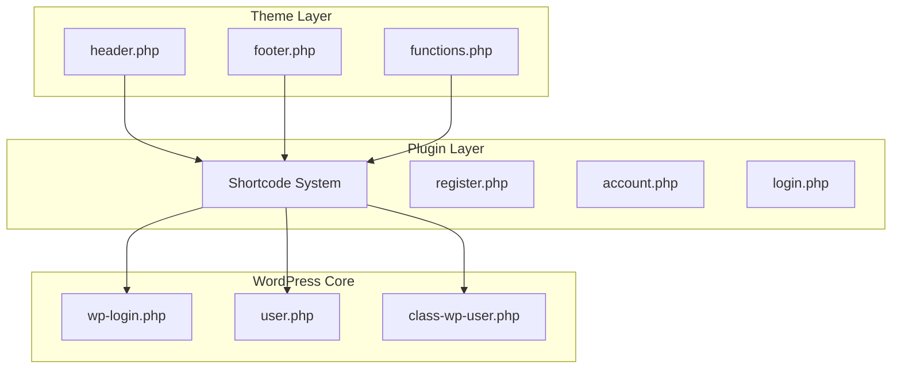
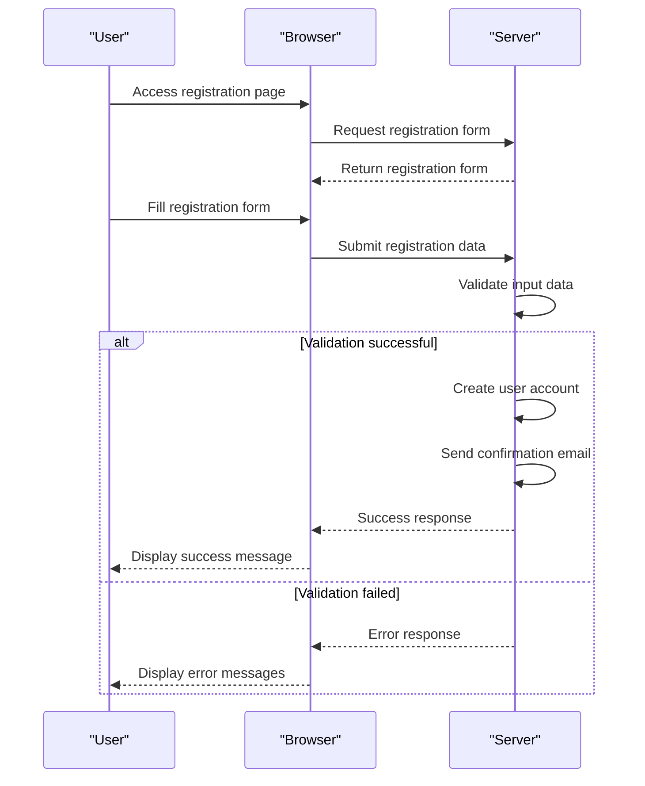
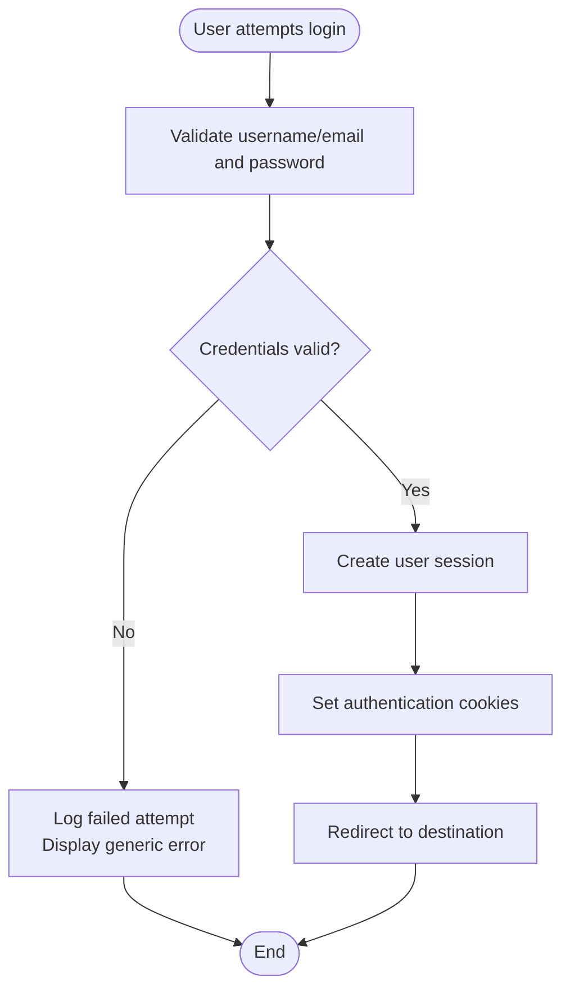
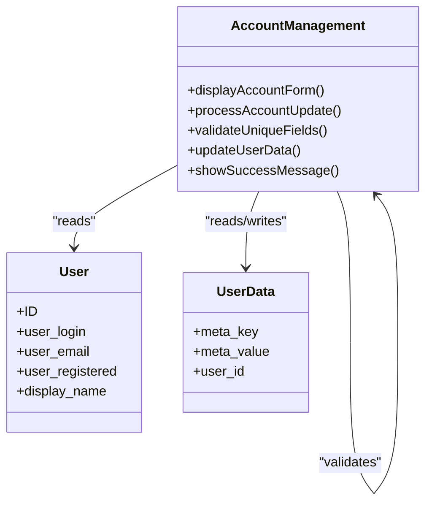
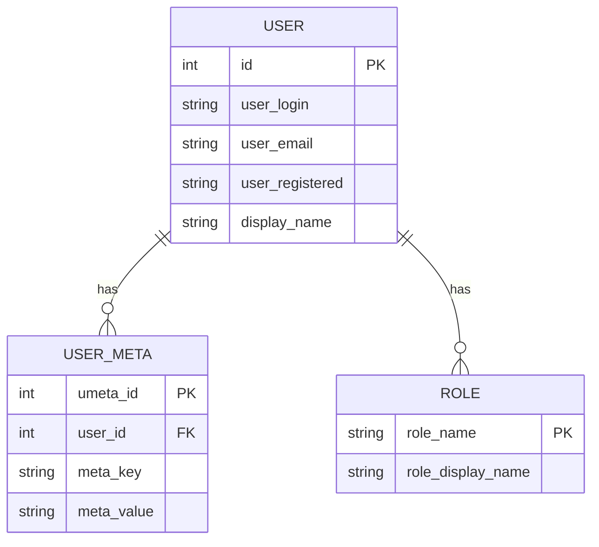

# User Experience

<cite>
**Referenced Files in This Document**   
- [register.php](file://wp-content/plugins/premiumbox/shortcode/register.php)
- [account.php](file://wp-content/plugins/premiumbox/shortcode/account.php)
- [login.php](file://wp-content/plugins/premiumbox/widget/login.php)
- [header.php](file://wp-content/themes/newexchanger2.0/header.php)
- [wp-login.php](file://wp-login.php)
- [user.php](file://wp-includes/user.php)
- [class-wp-user.php](file://wp-includes/class-wp-user.php)
</cite>

## Table of Contents
1. [Introduction](#introduction)
2. [User Interface Architecture](#user-interface-architecture)
3. [Registration Process](#registration-process)
4. [Authentication and Login](#authentication-and-login)
5. [Account Management](#account-management)
6. [Exchange Transaction Workflow](#exchange-transaction-workflow)
7. [Role-Based Access Control](#role-based-access-control)
8. [Common Issues and Solutions](#common-issues-and-solutions)
9. [Performance and Security Considerations](#performance-and-security-considerations)

## Introduction
The user experience for this exchange platform is built on a WordPress foundation with custom themes and shortcode systems that provide a seamless interface for users to interact with the exchange services. The platform enables users to register, log in, manage their accounts, and execute exchange transactions through a user-friendly interface. The architecture leverages WordPress themes for visual presentation and shortcode systems for dynamic content generation, creating a cohesive experience across different user interactions. This documentation details the implementation of user-facing components, authentication flows, account management interfaces, and transaction workflows that form the core of the user experience.

## User Interface Architecture
The user interface is built on the WordPress theme system with the "newexchanger2.0" theme serving as the primary visual layer. The architecture follows a component-based approach where user interface elements are constructed using shortcodes that generate dynamic forms and interactive components. The header.php file contains the main navigation structure with conditional rendering based on user authentication status, displaying appropriate links for registration, login, account access, or logout.

The interface utilizes a shortcode system implemented in the premiumbox plugin, with dedicated PHP files for different user interface components. The architecture separates concerns between presentation (theme files) and functionality (plugin shortcodes), allowing for flexible customization while maintaining consistent user experience patterns. User interface elements are responsive and adapt to different device sizes through CSS media queries and flexible grid layouts.

**Diagram sources**
- [header.php](file://wp-content/themes/newexchanger2.0/header.php)
- [register.php](file://wp-content/plugins/premiumbox/shortcode/register.php)
- [account.php](file://wp-content/plugins/premiumbox/shortcode/account.php)
- [login.php](file://wp-content/plugins/premiumbox/widget/login.php)
- [wp-login.php](file://wp-login.php)
- [user.php](file://wp-includes/user.php)

**Section sources**
- [header.php](file://wp-content/themes/newexchanger2.0/header.php)
- [functions.php](file://wp-content/themes/newexchanger2.0/functions.php)

## Registration Process
The registration process is implemented through the register.php shortcode file, which provides a comprehensive user registration system. The process begins with a registration form that collects essential user information including login, email, and password. The form implementation includes client-side validation and server-side processing to ensure data integrity and security.

The registration workflow follows these steps:
1. User accesses the registration page or clicks a registration link
2. The system displays the registration form with fields for login, email, and password confirmation
3. User submits the form with required information
4. Server validates the input data for format and uniqueness
5. If validation passes, the system creates a new user account
6. The user receives a confirmation message and is automatically logged in or prompted to log in

The registration system includes several security features such as password strength validation, email format verification, and checks for duplicate usernames or email addresses. The process also supports integration with terms of service, requiring users to agree to platform rules before completing registration.

**Diagram sources**
- [register.php](file://wp-content/plugins/premiumbox/shortcode/register.php)

**Section sources**
- [register.php](file://wp-content/plugins/premiumbox/shortcode/register.php)

## Authentication and Login
The authentication and login system combines WordPress core functionality with custom implementations to provide secure user access. The login process is implemented through both the standard WordPress login system (wp-login.php) and custom shortcode-based login forms. The system supports multiple authentication methods and includes security features to protect user accounts.

The login workflow includes:
- Username/email and password verification
- Session management
- Remember me functionality
- Security measures against brute force attacks
- Integration with two-factor authentication options

The wp-login.php file handles the core authentication process, validating user credentials against the WordPress user database. Upon successful authentication, the system creates a user session and redirects the user to their account page or a specified destination. The system also implements security measures such as limiting login attempts and providing feedback on authentication failures without revealing specific details that could aid attackers.

**Diagram sources**
- [wp-login.php](file://wp-login.php)
- [user.php](file://wp-includes/user.php)

**Section sources**
- [wp-login.php](file://wp-login.php)
- [user.php](file://wp-includes/user.php)

## Account Management
Account management is implemented through the account.php shortcode file, providing users with an interface to view and update their personal information. The system allows users to modify their account details while protecting sensitive information from unauthorized changes. The account management interface displays user information in a form format, with certain fields disabled to prevent modification.

The account management system includes the following features:
- Display of current user information
- Form for updating user details
- Validation of unique fields to prevent conflicts
- Success feedback upon successful updates
- Protection of immutable fields

The implementation uses WordPress user meta data to store custom user fields beyond the standard WordPress user properties. When a user updates their information, the system validates that any unique fields (such as phone numbers or alternative emails) are not already in use by other accounts. The interface provides clear feedback on the success or failure of update operations, enhancing the user experience.

**Diagram sources**
- [account.php](file://wp-content/plugins/premiumbox/shortcode/account.php)
- [class-wp-user.php](file://wp-includes/class-wp-user.php)

**Section sources**
- [account.php](file://wp-content/plugins/premiumbox/shortcode/account.php)

## Exchange Transaction Workflow
The exchange transaction workflow is integrated into the user experience through shortcode-based forms and interactive components. While specific implementation details for the exchange process are not fully visible in the analyzed files, the architecture suggests a multi-step process that guides users through currency selection, amount specification, and transaction confirmation.

The workflow likely includes:
1. Selection of currencies to exchange (give and receive)
2. Input of exchange amounts with real-time rate calculation
3. Review of transaction details including fees
4. Confirmation of exchange terms and conditions
5. Submission of exchange request
6. Processing and completion of the transaction

The system appears to support both immediate exchanges and multi-step processes where users confirm their details before finalizing transactions. The interface likely provides real-time feedback on exchange rates, fees, and expected amounts to enhance transparency and user confidence in the transaction process.

## Role-Based Access Control
The platform implements role-based access control through the WordPress user role system, with additional customizations for exchange-specific permissions. The system uses WordPress core capabilities and roles, extending them with custom meta fields to manage user privileges within the exchange context.

Key aspects of the role-based access control include:
- Standard WordPress roles (administrator, editor, subscriber, etc.)
- Custom capabilities for exchange-specific actions
- User meta fields to store additional permission data
- Conditional interface elements based on user roles
- Administrative controls for managing user roles and permissions

The implementation leverages WordPress functions like add_role(), remove_role(), and user capabilities to manage access levels. Administrators can assign roles to users, with safeguards to ensure at least one administrator account remains active. The system also supports custom user meta fields that can store role-specific settings and permissions beyond the standard WordPress role capabilities.

**Diagram sources**
- [class-wp-user.php](file://wp-includes/class-wp-user.php)
- [class-wp-roles.php](file://wp-includes/class-wp-roles.php)

**Section sources**
- [class-wp-user.php](file://wp-includes/class-wp-user.php)
- [class-wp-roles.php](file://wp-includes/class-wp-roles.php)

## Common Issues and Solutions
The platform addresses several common user experience issues through implemented solutions:

**Login Failures**: The system provides generic error messages to prevent information disclosure while logging authentication attempts for administrative review. Solutions include:
- Clear password reset options
- Account recovery procedures
- Support for alternative login methods
- Two-factor authentication options

**Account Verification Problems**: The registration system includes email verification to confirm user identities. Solutions include:
- Automated email confirmation messages
- Resend verification option
- Clear instructions for completing verification
- Time-limited verification links for security

**Transaction Submission Errors**: The exchange interface likely includes validation and error handling for transaction submissions. Potential solutions include:
- Real-time validation of input fields
- Clear error messages explaining submission issues
- Preservation of entered data when errors occur
- Step-by-step guidance through complex transactions

The system also implements logging mechanisms to track authentication attempts and user actions, aiding in troubleshooting and security monitoring.

## Performance and Security Considerations
The platform incorporates several performance and security considerations to protect user accounts and ensure a responsive user experience:

**Security Requirements**:
- Password hashing using WordPress security standards
- Protection against brute force attacks through login attempt monitoring
- Secure session management with appropriate cookie settings
- Input validation and sanitization to prevent injection attacks
- Role-based access control to limit user privileges
- Two-factor authentication options for enhanced security
- Email verification for new accounts
- Logging of authentication attempts for security monitoring

**Performance Considerations**:
- Responsive design that adapts to various device sizes
- Optimized asset loading through WordPress enqueue system
- Caching mechanisms for improved page load times
- Efficient database queries for user data retrieval
- Asynchronous form processing to reduce perceived latency
- Minimized HTTP requests through asset concatenation
- Image optimization for faster loading on mobile connections

The implementation follows WordPress security best practices while adding exchange-specific security measures to protect financial transactions and user data.